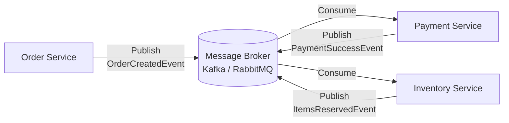
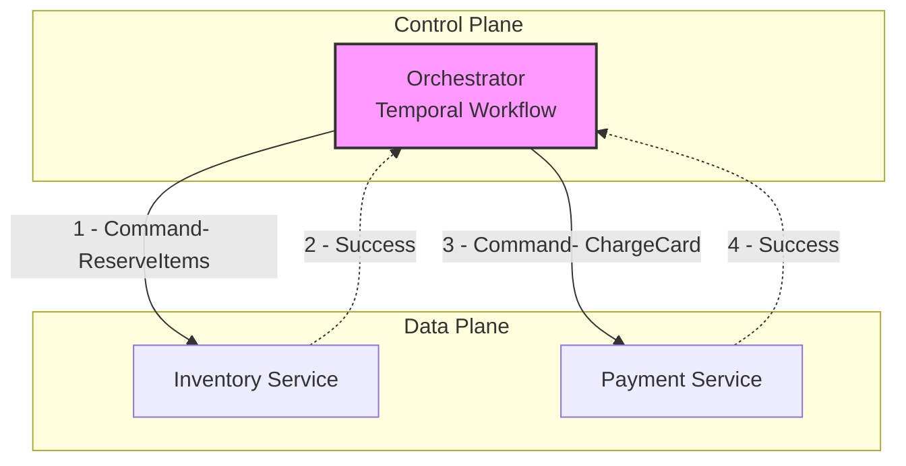

В предыдущих статьях мы погрузились во внутреннее устройство Temporal ([[2. Temporal. Архитектура и концепции]]) и разобрали магию Event Sourcing в основе его работы ([[3. Durable execution]]). Однако внедрение такого сложного инструмента — это серьезный архитектурный шаг. 

В распределенных системах для управления сложными бизнес-транзакциями (например, паттерн Saga) исторически сложилось два фундаментально разных подхода: **Хореография (Choreography)** и **Оркестрация (Orchestration)**. 

В этой статье мы столкнем их лбами, разберем под капотом, как они утилизируют сеть и железо, и определим, когда какой подход выбирать.

---

## 1. Хореография (Choreography): Танец без дирижера

Хореография — это классическая **Event-Driven Architecture** (EDA). В этом подходе нет единого центра управления. Каждый микросервис работает автономно: он слушает события (Events) из брокера сообщений (RabbitMQ, Kafka), выполняет свою часть бизнес-логики и публикует новое событие о том, что он закончил.

> Фокус хореографии — **События (Events)**. Сервис А не говорит Сервису Б, что делать. Он просто кричит в пустоту: *"Я создал заказ!"*. А Сервис Б сам решает, реагировать на это или нет.

### Преимущества (Pros)
1. **Слабая связность (Decoupling):** Сервис заказов ничего не знает о существовании сервиса оплат или склада. Вы можете добавить новый сервис (например, сервис начисления бонусных баллов), который просто подпишется на `OrderCreatedEvent`, не меняя ни строчки кода в самом сервисе заказов.
2. **Отсутствие единой точки отказа (SPOF):** Нет "супер-сервиса", падение которого остановит вообще всё. Если упадет сервис склада, оплата все равно пройдет (а склад обработает очередь позже).
3. **Производительность (Mechanical Sympathy):** Взаимодействие происходит максимально быстро. Publish в RabbitMQ — это один системный вызов (запись в TCP-сокет), после чего горутина освобождается.

### Недостатки: Pinball Architecture (Архитектура Пинбола)
Когда бизнес-процесс состоит из 2-3 шагов, хореография прекрасна. Но когда шагов 10, и они включают ветвления и компенсации (откаты транзакций), система превращается в **автомат для пинбола**. 

> [!warning] Ловушка / Gotcha: Потеря контроля
> Представьте, что клиент звонит в поддержку и спрашивает: *"Где мой заказ?"*.
> В архитектуре хореографии **никто не знает ответа**. Состояние заказа размазано по базам данных пяти разных микросервисов. Чтобы собрать статус, вам нужна сложнейшая инфраструктура распределенной трассировки и агрегации логов (о чем мы упоминали в [[10. Distributed tracing в async системах]]).
> Более того, если на 7-м шаге произошла ошибка, вам нужно сгенерировать `CompensationEvent`, который должны отловить предыдущие 6 сервисов и откатить свои локальные транзакции. Написать и протестировать это на горутинах и RabbitMQ — адская задача.

---

## 2. Оркестрация (Orchestration): Симфония с дирижером

Оркестрация решает проблему "пинбола" путем введения единого контроллера (Оркестратора). Этот контроллер содержит четкий алгоритм выполнения бизнес-процесса от начала до конца.

> Фокус оркестрации — **Команды (Commands)**. Оркестратор явно говорит: *"Сервис оплат, спиши деньги. Сервис склада, зарезервируй товар"*.

В контексте Go мы говорим о движках вроде Temporal или Zeebe. Оркестратор вызывает Activity (функции в микросервисах) по очереди или параллельно, собирает результаты и двигает стейт-машину вперед.

### Преимущества (Pros)
1. **Единый источник истины (Single Source of Truth):** Бизнес-логика всего процесса описана в одном месте (в коде Workflow). Вы открываете файл в IDE и читаете процесс бронирования сверху вниз, с обычными `if` и `for`.
2. **Прозрачность стейта:** Вы всегда можете спросить оркестратор: *"В каком состоянии процесс №123?"*, и он точно ответит: *"Ждем ответа от платежного шлюза, уже было 3 ретрая"*.
3. **Бесплатная отказоустойчивость:** Если сервис склада лежит, оркестратор не падает. Он "замораживает" состояние (Durable Execution) и будет повторять вызов (Retry) по экспоненте, пока склад не поднимется.

### Недостатки (Cons)
1. **Тесная связность (Coupling):** Сервисы становятся "тупыми" исполнителями (Activity Workers). Оркестратор должен знать о существовании каждого сервиса и его API (сигнатурах Activity).
2. **"Божественный сервис" (God Service):** Если разработчики недисциплинированны, они начинают тянуть доменную логику внутрь Workflow (например, вычислять скидки прямо в оркестраторе), превращая систему в распределенный монолит. *Workflow должен заниматься только маршрутизацией и потоком управления, вся бизнес-логика должна быть внутри Activity.*
3. **Накладные расходы (Overhead):** Оркестрация требует гораздо больше ресурсов под капотом.

> [!info] Под капотом: Налог на инфраструктуру
> Сравним отправку сообщения в RabbitMQ и вызов Activity в Temporal.
> В RabbitMQ: `Go -> TCP -> Erlang Process -> TCP -> Go`. State хранится в оперативной памяти брокера (или в WAL на диске, если Quorum Queue).
> В Temporal: `Go -> gRPC -> Frontend -> gRPC -> History Service -> DB Write (Postgres/Cassandra) -> gRPC -> Matching Service -> gRPC -> Go`. 
> На каждый шаг оркестратора происходит синхронная транзакция в центральной БД (сохранение событий `ActivityTaskScheduled` и `ActivityTaskStarted`). Это сильно увеличивает **Latency** (задержку) и снижает максимальный **Throughput** (пропускную способность) по сравнению с асинхронными брокерами.

---

## 3. Сводное сравнение (Cheat Sheet)

| Характеристика | Хореография (RabbitMQ / Kafka) | Оркестрация (Temporal / Zeebe) |
| :--- | :--- | :--- |
| **Парадигма** | Event-Driven (Реакция на события) | Command-Driven (Явные приказы) |
| **Связанность** | Низкая (Сервисы не знают друг о друге) | Высокая (Оркестратор знает обо всех) |
| **Контроль процесса** | Децентрализованный | Централизованный |
| **Отладка и мониторинг** | Очень сложно (нужен сложный Distributed Tracing) | Легко (состояние процесса лежит в БД оркестратора) |
| **Производительность** | Экстремально высокая, низкий Latency | Средняя, высокий overhead на БД и gRPC |
| **Идеально для...** | Рассылка нотификаций, логи, инвалидация кэшей, потоки данных | Оформление заказов, финансовые транзакции, onboarding пользователей |

---

## Прагматичный подход: Гибридная архитектура

В суровой реальности Senior-разработчики редко выбирают что-то одно на уровне всей компании. Лучшие системы используют **гибридный подход**.

**Правило большого пальца:**
1. **Используйте Оркестрацию ВНУТРИ ограниченного контекста (Bounded Context) бизнес-процесса.** Например, весь процесс `Checkout` (резерв на складе, списание денег, формирование чека) должен контролироваться Temporal. Нам критически важно знать, где деньги клиента.
2. **Используйте Хореографию МЕЖДУ доменами (Cross-Domain).** Когда Temporal Workflow завершает процесс `Checkout`, его последняя Activity делает `rabbit.Publish("OrderCompleted")`. А дальше сервисы нотификаций (email), аналитики и BI-системы слушают этот Event через RabbitMQ/Kafka, не утяжеляя основной бизнес-процесс.

## Итог

1. **Хореография** быстра, слабо связана, но быстро превращается в неуправляемый хаос (Pinball) при росте сложности бизнес-транзакций.
2. **Оркестрация** дает абсолютный контроль, надежность и наблюдаемость, но требует дополнительной инфраструктуры (Control Plane) и накладывает пенальти на сетевые задержки и дисковый ввод-вывод.
3. Проектируйте так, чтобы Оркестратор дирижировал критичными деньгами/данными, а брокеры сообщений раскидывали результаты (события) всем заинтересованным наблюдателям.

Одной из главных причин выбора Оркестратора является элегантное решение проблемы частичных сбоев. Что делать, если на середине транзакции внешний сервис ответил ошибкой `500` или навсегда отказал в операции? Как правильно откатить предыдущие шаги в распределенной системе? Разберем это в следующей статье: [[5. Retry и compensation logic]].