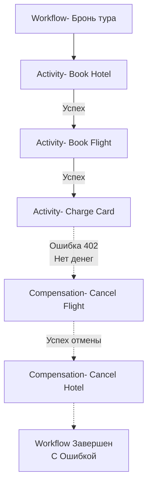

В прошлой статье [[4. Оркестрация vs хореография]] мы выяснили, что оркестрация дает нам абсолютный контроль над распределенными бизнес-транзакциями. Но этот контроль ничего не стоит, если мы не умеем правильно обрабатывать ошибки.

В микросервисной среде ошибки — это норма. Сеть может "моргнуть", база данных может временно заблокировать запись (deadlock), а сторонний API может вернуть `503 Service Unavailable`. В традиционном монолите мы бы просто сделали `tx.Rollback()`. В микросервисах у нас нет единой транзакции базы данных. 

Здесь на сцену выходят два важнейших механизма оркестраторов (таких как Temporal): **Автоматические повторные попытки (Retries)** для временных сбоев и **Компенсации (Compensations)** для постоянных сбоев бизнес-логики.

## 1. Retry Logic (Стратегии повторных попыток)

Temporal (и подобные системы) проектируются с парадигмой: **Activity должна падать, это нормально**. Если Activity завершается с ошибкой, оркестратор не "роняет" весь Workflow. Он планирует повторное выполнение этой Activity.

### Настройка RetryPolicy в Go

Политика повторных попыток задается при конфигурации `ActivityOptions` перед вызовом самой активности.

```go
package app

import (
	"time"

	"go.temporal.io/sdk/temporal"
	"go.temporal.io/sdk/workflow"
)

func PaymentWorkflow(ctx workflow.Context, orderID string) error {
	retryPolicy := &temporal.RetryPolicy{
		InitialInterval:    time.Second,       // Первая пауза перед ретраем (1 сек)
		BackoffCoefficient: 2.0,               // Множитель (1s, 2s, 4s, 8s...)
		MaximumInterval:    100 * time.Second, // Потолок паузы
		MaximumAttempts:    0,                 // 0 = бесконечные попытки
		NonRetryableErrorTypes: []string{
			"InsufficientFundsError", // Имя ошибки, при которой ретрай не нужен
		},
	}

	ao := workflow.ActivityOptions{
		StartToCloseTimeout: 10 * time.Second, // Таймаут на ОДНУ попытку
		RetryPolicy:         retryPolicy,
	}
	ctx = workflow.WithActivityOptions(ctx, ao)

	// Temporal будет бесконечно ретраить эту функцию при сетевых сбоях,
	// пока не получит успех или NonRetryableError
	return workflow.ExecuteActivity(ctx, ChargeClientActivity, orderID).Get(ctx, nil)
}
```

### Mechanical Sympathy: Как ретраи работают под капотом?

Вспомним наши страдания из статьи [[8. Retry patterns в RabbitMQ]]. Там нам приходилось городить сложные топологии из очередей ожидания (Wait Queues) и плагинов с дисковой БД Mnesia, чтобы просто отложить сообщение на 5 секунд.

В Temporal механика ретраев **встроена на уровне ядра кластера (History Service)**:
1. Activity падает и возвращает ошибку по gRPC в кластер.
2. Кластер смотрит на `RetryPolicy`.
3. Если нужен ретрай через 8 секунд, History Service просто создает **внутренний Timer** в своей базе данных (Cassandra/Postgres) и "забывает" про задачу.
4. Go-воркер в этот момент **полностью свободен**. Никаких блокировок, никаких `time.Sleep` в памяти.
5. Через 8 секунд база данных "выстреливает" таймер, задача снова ставится в Task Queue, и свободный воркер забирает её на вторую попытку.

> [!warning] Ловушка / Gotcha: NonRetryableErrors и бизнес-логика
> Если ваш платежный шлюз вернул ошибку "Недостаточно средств", делать `Retry` бессмысленно — денег на карте от этого не прибавится (это детерминированная ошибка бизнес-логики). 
> Вы **обязаны** возвращать из Activity ошибку, тип которой указан в `NonRetryableErrorTypes`. Temporal Go SDK позволяет сделать это элегантно через `temporal.NewNonRetryableApplicationError("Insufficient funds", "InsufficientFundsError", err, nil)`. Если этого не сделать, оркестратор будет долбить внешний API по экспоненте, сжигая ресурсы.

## 2. Compensation Logic (Паттерн Saga)

Что делать, если мы исчерпали попытки ретраев (или получили `NonRetryableError`), но до этого момента Workflow уже успел успешно выполнить несколько других Activity?

Например, мы бронируем тур:
1. Забронировали отель (Успех).
2. Забронировали авиабилет (Успех).
3. Пытаемся списать деньги... Ошибка (Недостаточно средств).

У нас в системе "повисли" забронированные билеты и отели. Мы должны выполнить **Компенсирующие транзакции** — вызвать обратные операции (`CancelFlight`, `CancelHotel`), чтобы откатить распределенное состояние. Этот паттерн называется **Saga**.

### Идиоматичная Saga в Temporal (Go)

В Go нет встроенных механизмов для отката распределенных процессов, но мы можем использовать мощь замыканий (closures) и паттерн, похожий на `defer`, для накопления компенсирующих действий.

```go
package app

import (
	"go.temporal.io/sdk/workflow"
)

func TourBookingWorkflow(ctx workflow.Context, req BookingRequest) error {
	// Стек для хранения функций-компенсаций
	var compensations []func(ctx workflow.Context) error

	// Defer-блок, который выполнится при выходе из Workflow (в т.ч. при ошибке)
	defer func() {
		if err != nil {
			// Отключаем отмену контекста для компенсаций!
			// Если оригинальный контекст был отменен (Cancel/Timeout),
			// компенсации всё равно ДОЛЖНЫ выполниться.
			disconnectedCtx, _ := workflow.NewDisconnectedContext(ctx)
			
			// Выполняем компенсации в обратном порядке (LIFO)
			for i := len(compensations) - 1; i >= 0; i-- {
				errComp := compensations[i](disconnectedCtx)
				if errComp != nil {
					// В реальности здесь нужно писать в лог или алертить,
					// так как падение компенсации - это критический инцидент.
					workflow.GetLogger(ctx).Error("Compensation failed", "Error", errComp)
				}
			}
		}
	}()

	// --- ШАГ 1: Бронируем отель ---
	err = workflow.ExecuteActivity(ctx, BookHotelActivity, req).Get(ctx, nil)
	if err != nil {
		return err // Уходим, компенсаций еще нет
	}
	// Добавляем компенсацию (отмену отеля) в стек
	compensations = append(compensations, func(c workflow.Context) error {
		return workflow.ExecuteActivity(c, CancelHotelActivity, req).Get(c, nil)
	})

	// --- ШАГ 2: Бронируем перелет ---
	err = workflow.ExecuteActivity(ctx, BookFlightActivity, req).Get(ctx, nil)
	if err != nil {
		return err // Уходим, сработает компенсация отеля
	}
	compensations = append(compensations, func(c workflow.Context) error {
		return workflow.ExecuteActivity(c, CancelFlightActivity, req).Get(c, nil)
	})

	// --- ШАГ 3: Оплата (падает) ---
	err = workflow.ExecuteActivity(ctx, ChargeCardActivity, req).Get(ctx, nil)
	if err != nil {
		return err // Уходим, сработают компенсации перелета, затем отеля
	}

	return nil
}
```



> [!info] Под капотом: DisconnectedContext
> Обратите внимание на `workflow.NewDisconnectedContext(ctx)`. Когда Workflow завершается с ошибкой или прерывается пользователем (Cancellation), его текущий `ctx` становится отмененным. Если вы передадите этот отмененный контекст в Activity `CancelHotelActivity`, она даже не попытается запуститься.
> Создание "отсоединенного" контекста гарантирует, что фаза очистки/компенсации отработает до конца, несмотря на отмену родительского процесса.

## Фундамент надежности: Идемпотентность

Ретраи и компенсации имеют темную сторону. Что если `ChargeCardActivity` успешно списала деньги в банке, но ответный HTTP-пакет потерялся из-за обрыва сети? 

Temporal посчитает, что Activity упала по таймауту, и **запустит её снова**. Если ваша логика не идемпотентна, вы спишете деньги у клиента дважды. Аналогично, компенсация `CancelFlight` может быть вызвана несколько раз, если падает сама функция отмены.

**Любая Activity в оркестраторе ОБЯЗАНА быть идемпотентной.** Подробнее про генерацию уникальных ключей и защиту от дублей на уровне БД читайте в статье [[10. Idempotency в message processing]]. Оркестратор предоставляет вам `workflow.GetInfo(ctx).WorkflowExecution.ID` (уникальный ID бизнес-процесса) и ID конкретной Activity, которые идеально подходят в качестве `Idempotency-Key` для внешних API.

> [!tip] Собеседование
> **Вопрос:** Мы запустили компенсацию `CancelHotel`, но внешний API отеля лежит "намертво" и не отвечает уже два дня. Что произойдет с нашим Workflow?
> **Ответ:** Это называется *Сбой компенсации*. В Temporal компенсация — это обычная Activity, у которой тоже есть свой `RetryPolicy`. Она будет ретраиться по экспоненте (например, раз в час). Все это время Workflow будет висеть в состоянии "Выполняется" (Running). Если вы ограничили количество попыток (MaximumAttempts) и они исчерпаны, Workflow завершится с ошибкой, а в системе останется неконсистентность (отель забронирован, хотя тур отменен). 
> **Решение:** Для компенсаций обычно ставят "бесконечные" ретраи (MaximumAttempts=0), чтобы система в конечном итоге сама пришла в консистентное состояние, или шлют алерт в DevOps для ручного вмешательства (Forward Recovery).

## Итог

1. **Retries:** Временные ошибки (Transient) решаются автоматическими повторами. В Temporal это "дешевая" операция, не блокирующая Go-воркеры.
2. **Non-Retryable:** Ошибки бизнес-логики (нет денег, юзер не найден) нельзя ретраить. Их нужно явно помечать в коде SDK.
3. **Compensations:** При необратимом падении на N-ном шаге, мы обязаны откатить предыдущие N-1 шагов. В Go это реализуется через стек функций в `defer`.
4. **Идемпотентность:** Без идемпотентности ретраи превратят вашу систему в генератор дубликатов.

Мы разобрали, как Temporal решает самые сложные проблемы распределенных транзакций. Однако Temporal не единственный игрок на рынке. У него есть "младший брат" Cadence и мощные конкуренты из мира BPMN. В следующей статье мы проведем исторический и архитектурный анализ рынка оркестраторов: [[6. Temporal vs Cadence]].