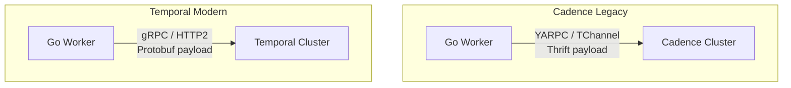

В статьях [[2. Temporal. Архитектура и концепции]] и [[3. Durable execution]] мы детально разобрали устройство оркестратора Temporal. Однако в enterprise-среде (особенно при чтении статей или прохождении собеседований в крупные компании) вы неизбежно столкнетесь с другим названием — **Cadence**.

Часто возникает путаница: что из них выбрать? Это конкуренты? В чем архитектурная разница? Чтобы сделать правильный выбор при проектировании системы, бэкенд-инженер должен понимать исторический и технический контекст этих двух систем.

## Исторический контекст: Расщепление ядра

**Cadence** был разработан внутри компании Uber в 2017 году. Главными архитекторами системы были Максим Фатеев и Самар Аббас. Uber нуждался в надежном движке для управления миллионами длительных транзакций (поездки, доставка еды, выплаты водителям), и классические брокеры сообщений или микросервисная хореография с этой задачей уже не справлялись. 

Cadence стал невероятно успешным open-source проектом. Его начали использовать сотни компаний (Instacart, DoorDash, Coinbase). 

Однако в 2019 году Максим и Самар покинули Uber и основали собственный стартап — **Temporal**. Они форкнули (скопировали) исходный код Cadence и начали развивать его независимо, переписав множество фундаментальных подсистем, которые в рамках Uber изменить было невозможно из-за огромного количества legacy-кода.

> [!info] Под капотом: Чей сейчас Cadence?
> Сегодня Cadence продолжает поддерживаться инженерами Uber (в основном для своих внутренних нужд) и имеет статус open-source проекта. Однако темпы его развития, размер комьюнити и качество документации несопоставимы с Temporal, за которым стоит огромная венчурная компания, развивающая Temporal Cloud и экосистему вокруг него.

## Фундаментальные архитектурные отличия

Несмотря на общую ДНК и концепцию (Workflow, Activity, Event Sourcing, History Service), под капотом Temporal и Cadence — это разные системы. Главный водораздел прошел по транспортному уровню и формату сериализации.

### 1. Транспортный уровень (RPC)

**Cadence:**
В Uber исторически сложился свой зоопарк внутренних протоколов. Cadence использует фреймворк **YARPC** (Yet Another RPC) и транспорт **TChannel** (внутренняя разработка Uber) в связке с сериализацией **Apache Thrift**. 
Это делает интеграцию Cadence в современные микросервисные экосистемы (где стандартом является gRPC) настоящей болью. Настройка балансировщиков нагрузки (например, Envoy или Nginx) для TChannel — нетривиальная задача.

**Temporal:**
При создании форка первое, что сделали авторы — безжалостно вырезали YARPC/TChannel/Thrift. Temporal полностью переведен на **gRPC** и **Protocol Buffers (Protobuf)**. 

* **Mechanical Sympathy:** Переход на gRPC дал Temporal огромный буст. gRPC работает поверх HTTP/2, что обеспечивает мультиплексирование потоков, эффективное сжатие заголовков (HPACK) и нативную поддержку любыми современными service mesh системами (Istio, Linkerd) и балансировщиками (Envoy).

### 2. Поддержка баз данных (Persistence Layer)

**Cadence:**
Изначально жестко проектировался под **Apache Cassandra** (NoSQL базу данных, оптимизированную для записи, что идеально для append-only Event Sourcing логов). Позже была добавлена экспериментальная поддержка MySQL/PostgreSQL, но она всегда считалась второсортной (second-class citizen).

**Temporal:**
Абстракция над хранилищем была полностью переписана. Temporal нативно и с высокой производительностью поддерживает:
* **Cassandra** (для гигантских highload кластеров).
* **PostgreSQL / MySQL** (для 95% компаний, которым проще администрировать реляционные БД).
* **SQLite** (шикарная фича для локальной разработки и unit-тестирования: вы можете поднять in-memory кластер Temporal прямо в тестах Go).

### 3. Безопасность и mTLS

**Cadence:**
Безопасность прикручивалась "сбоку". Реализовать строгую аутентификацию между воркерами и кластером с использованием кастомных сертификатов было крайне сложно.

**Temporal:**
Имеет встроенную, enterprise-ready поддержку **mTLS** (Mutual TLS). Вы можете легко настроить кластер так, что он будет принимать gRPC-соединения только от Go-воркеров, предъявивших валидный клиентский сертификат, выданный вашим внутренним CA (Certificate Authority). Для финансовых и финтех-компаний это критический фактор (compliance).

---

## Developer Experience (Go SDK)

Разработчики Temporal полностью переосмыслили SDK. Код Workflow, написанный для Cadence, **не скомпилируется** под Temporal.

Основные отличия в написании кода на Go:

1. **Context:** В Cadence воркеры часто оперировали странными обертками. В Temporal всё максимально приведено к стандартам Go — используется `context.Context` для Activity и строго типизированный `workflow.Context` для детерминированного кода оркестратора.
2. **Сериализация (Data Converter):** В Temporal Data Converter (компонент, который превращает ваши Go-структуры в байты для отправки в кластер) стал полностью pluggable. Вы можете легко написать свой конвертер, который будет прозрачно шифровать данные (AES-256) перед отправкой в кластер Temporal, чтобы сам оркестратор никогда не видел PII (Personal Identifiable Information) ваших пользователей в открытом виде.
3. **Observability:** Temporal SDK "из коробки" интегрируется с OpenTelemetry (как мы обсуждали в статье про мониторинг), позволяя склеивать трейсы HTTP-запросов и выполнения Workflow.

> [!warning] Ловушка / Gotcha: Миграция с Cadence на Temporal
> Прямой миграции (in-place upgrade) с кластера Cadence на кластер Temporal **не существует**. Базы данных несовместимы, протоколы несовместимы. 
> Если вы получили в наследство легаси-систему на Cadence, миграция обычно выглядит так: вы поднимаете новый кластер Temporal рядом, переписываете код воркеров под новый SDK, новые процессы запускаете в Temporal, а Cadence оставляете доживать (drain), пока старые длительные Workflow не завершатся естественным путем.

## Что выбрать в 202X году?

Здесь нет места долгим размышлениям.

> [!tip] Собеседование
> **Вопрос:** Мы начинаем писать новый сервис. Архитектор предлагает использовать Cadence, так как он open-source и проверен Uber. Согласны ли вы?
> **Ответ:** Категорически нет. Cadence — это legacy. В 100% случаев для новых проектов необходимо выбирать Temporal. У Temporal значительно лучше SDK, активнее community, современный протокол gRPC, нативная интеграция с SQL-базами и прозрачная документация. Выбор Cadence сегодня оправдан только в одном случае: если в вашей компании уже развернута инфраструктура Cadence, которую поддерживает выделенная команда платформы.

## Итог

1. **Cadence** — прародитель от Uber, использующий устаревший стек протоколов (TChannel, Thrift).
2. **Temporal** — современный форк и индустриальный стандарт оркестрации, построенный на **gRPC**, **Protobuf** и отлично работающий с PostgreSQL.
3. Код (Go SDK) и хранилища (БД) этих двух систем несовместимы.
4. В разработке бэкенда Temporal полностью победил. Cadence перешел в стадию поддержки исторических систем.

Temporal — это невероятно мощный инструмент (Heavyweight), требующий развертывания сложной инфраструктуры и обучения команды концепциям детерминированного кода. Но что, если наш процесс не такой сложный? Что если мы хотим оркестрировать систему визуально, или нам нужен более легковесный подход? В следующей статье мы разберем конкурентов из других экосистем: [[7. Альтернативы. Zeebe, Airflow]].