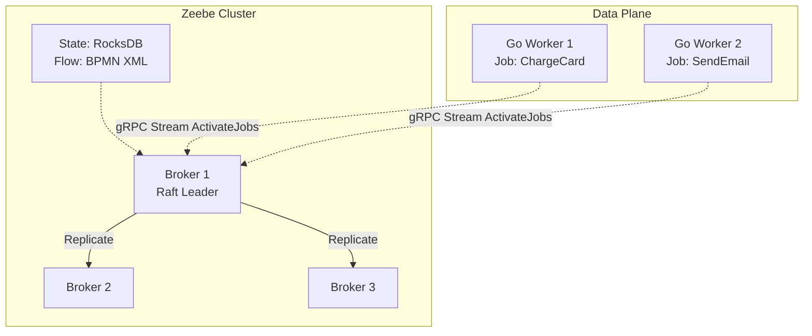

В прошлых статьях (особенно в [[6. Temporal vs Cadence]]) мы закрепили, что Temporal — это мощнейший инструмент (Code-first оркестратор) для управления распределенными транзакциями в микросервисах. 

Однако в enterprise-мире архитектура не ограничивается подходом "оркестрация через код". Бизнес часто хочет *видеть* процессы, а инженерам данных нужны инструменты для управления тяжелыми аналитическими пайплайнами (ETL). Если вы начнете тащить Temporal абсолютно во все задачи, вы рискуете забить микроскопом гвозди. 

В этой статье мы разберем две главные альтернативы Temporal, исповедующие совершенно иные парадигмы: **Camunda Zeebe** (Визуальная оркестрация) и **Apache Airflow** (Оркестрация данных).

---

## 1. Camunda Zeebe: Оркестрация через BPMN

Temporal предлагает подход **Code-first** (процесс описан в коде Go). Но что, если процесс согласования кредита описывает не программист, а бизнес-аналитик? 

**Camunda Zeebe** (ядро платформы Camunda 8) использует подход **Design-first**. Бизнес-процесс описывается в виде визуальной блок-схемы стандарта **BPMN 2.0** (Business Process Model and Notation). Эта XML-схема деплоится на сервер Zeebe, и именно она является исполняемым кодом.

### Архитектура Zeebe (Mechanical Sympathy)

В отличие от Temporal, который перекладывает логику Workflow на ваши Go-воркеры (используя Replay), Zeebe является полноценным **Stateful Broker** (Брокером состояний).

1. **Брокер (Java):** Написан на Java. Под капотом использует **RocksDB** для локального хранения состояния и алгоритм **Raft** для репликации логов (как Quorum Queues в RabbitMQ или как Kafka).
2. **Топология:** Нет никаких внешних баз данных (Cassandra или Postgres). Брокеры Zeebe сами хранят свое состояние на дисках.
3. **Job Workers (ваши Go-приложения):** Ваши микросервисы подключаются к Zeebe по gRPC и запрашивают задачи (Jobs), которые соответствуют "кубикам" на BPMN-схеме.



### Как это выглядит в Go?

В Zeebe вам не нужно писать детерминированный код Workflow (с запретом на `time.Now()` или сетевые вызовы). Весь поток управления (таймеры, ветвления, ретраи) берет на себя движок BPMN внутри брокера Zeebe. Ваш Go-код реализует только **Activity** (в терминах Zeebe — это Job Worker).

```go
package main

import (
	"context"
	"log"

	"[github.com/camunda/zeebe/clients/go/v8/pkg/zbc](https://github.com/camunda/zeebe/clients/go/v8/pkg/zbc)"
	"[github.com/camunda/zeebe/clients/go/v8/pkg/worker](https://github.com/camunda/zeebe/clients/go/v8/pkg/worker)"
)

func main() {
	// 1. Подключаемся к брокеру Zeebe по gRPC
	client, err := zbc.NewClient(&zbc.ClientConfig{
		GatewayAddress: "localhost:26500",
		UsePlaintextConnection: true,
	})
	if err != nil {
		panic(err)
	}

	// 2. Регистрируем Worker для конкретного типа задач из BPMN схемы
	jobWorker := client.NewJobWorker().
		JobType("charge-credit-card"). // Имя кубика в BPMN
		Handler(handleChargeCard).     // Наша Go-функция
		Open()

	defer jobWorker.Close()
	select {} // Блокируем main
}

// Handler выполняется каждый раз, когда движок доходит до этого шага в BPMN
func handleChargeCard(client worker.JobClient, job worker.Job) {
	// Читаем переменные процесса (JSON)
	variables, _ := job.GetVariablesAsMap()
	
	// Выполняем грязную, недетерминированную бизнес-логику
	err := callBankAPI(variables["amount"])
	
	if err != nil {
		// Nack: Возвращаем ошибку, брокер сам решит, делать ли Retry
		client.NewFailJobCommand().JobKey(job.GetKey()).Retries(job.GetRetries() - 1).Send(context.Background())
		return
	}

	// Ack: Успех, процесс пойдет дальше по BPMN-схеме
	client.NewCompleteJobCommand().JobKey(job.GetKey()).Send(context.Background())
}
```

**Плюсы Zeebe:** Визуализация процессов. Аналитик и разработчик смотрят на одну и ту же схему. Нет сложной парадигмы Durable Execution в коде воркеров.
**Минусы Zeebe:** Сложные технические транзакции с динамическими циклами и глубоким ветвлением на основе данных превращают BPMN-схему в нечитаемую "лапшу" (Spaghetti Process). Для чисто инженерных задач Temporal гибче.

---

## 2. Apache Airflow: Оркестрация данных (Data Pipelines)

Если Temporal и Zeebe — это микросервисные оркестраторы (где счет идет на миллисекунды и тысячи конкурентных процессов пользователей), то **Apache Airflow** — это оркестратор для **Data Engineering** (ETL, ML-пайплайны, генерация ночных отчетов).

Airflow описывает процессы в виде **DAG (Directed Acyclic Graph)**, используя язык **Python**.

> [!warning] Ловушка / Gotcha: Airflow для микросервисов
> Самая фатальная ошибка неопытных архитекторов — попытаться использовать Airflow для оркестрации пользовательских запросов (например, оформление заказа в интернет-магазине). 
> Архитектура Airflow **не предназначена для low-latency**. Его Scheduler (Планировщик) работает как бесконечный `cron`-цикл: он парсит Python-файлы с DAG'ами из папки каждые несколько секунд, пишет статусы в мета-БД (PostgreSQL) и только потом отдает задачи Executor'у. 
> Запуск одной задачи в Airflow может занимать секунды, тогда как в Temporal/Zeebe — миллисекунды.

### Архитектура Airflow (Mechanical Sympathy)

1. **Scheduler (Python):** Сердце системы. Постоянно опрашивает диск, парсит код DAG'ов, вычисляет зависимости и записывает готовые к запуску таски в БД. Этот процесс экстремально тяжелый для CPU (из-за особенностей интерпретатора Python).
2. **Metadata DB (Postgres/MySQL):** Хранит все стейты задач.
3. **Executor (Celery / Kubernetes):** Компонент, который берет задачу из БД и физически запускает её (например, поднимает Kubernetes Pod).

**Где здесь Go?**
Нативно Airflow с Go не дружит (все пишется на Python). Если у вас есть тяжелый алгоритм на Go (например, парсер логов), вы описываете DAG на Python и используете `KubernetesPodOperator`, который поднимет Docker-контейнер с вашим скомпилированным Go-бинарником, дождется кода возврата `exit 0` и пойдет дальше.

```python
# Пример DAG в Airflow (строго Python)
from airflow import DAG
from airflow.providers.cncf.kubernetes.operators.kubernetes_pod import KubernetesPodOperator
from datetime import datetime

with DAG('go_data_processor', start_date=datetime(2026, 1, 1), schedule_interval='@daily') as dag:
    
    # Запускаем Go-бинарник в изоляции
    process_data = KubernetesPodOperator(
        task_id="run_go_binary",
        name="go-data-worker",
        namespace="default",
        image="my-company/go-etl-worker:latest",
        cmds=["/app/worker", "--mode=nightly"],
    )
```

> [!tip] Собеседование
> **Вопрос:** У нас есть процесс: "Раз в сутки выгрузить 500 ГБ из базы, сжать, отправить в S3 и запустить ML-модель". Что выберете: Temporal или Airflow?
> **Ответ:** Однозначно **Airflow** (или его современные аналоги Dagster / Prefect). Temporal отлично справляется с большим потоком мелких транзакций (миллионы процессов по 5 шагов). Airflow создан для батчевой обработки данных (Batch Processing), где процессы запускаются по расписанию (Cron), занимают часы и потребляют гигабайты RAM в единичных инстансах.

---

## 3. Сводный анализ: Выбор Архитектора

Чтобы не ошибиться при проектировании системы, используйте следующую матрицу:

| Характеристика | Temporal | Camunda Zeebe | Apache Airflow |
| :--- | :--- | :--- | :--- |
| **Парадигма** | Code-first (Go/Java/TS) | Design-first (BPMN XML) | Code-first (Python) |
| **Целевой домен** | Микросервисы, бизнес-транзакции | Микросервисы, интеграция систем | Data Engineering, ETL пайплайны |
| **Latency (Задержка)** | Миллисекунды (gRPC) | Миллисекунды (gRPC) | Секунды / Минуты (DB Polling) |
| **Модель состояния** | Event Sourcing + Replay | Stateful Raft Broker | RDBMS Metadata |
| **Главный плюс** | Неограниченная гибкость логики | Понятность для бизнеса (BPMN) | Огромная экосистема коннекторов для баз данных |

## Итог подраздела

Оркестрация — это тяжелая артиллерия распределенных систем.
1. Если вам нужен максимальный контроль, версионирование сложной логики и вы пишете на Go — ваш выбор **Temporal**.
2. Если бизнесу (менеджерам, аналитикам) нужно смотреть на красивые блок-схемы процессов и править их — берите **Zeebe**.
3. Если вы перекладываете терабайты данных по ночам — забудьте про микросервисные оркестраторы и разворачивайте **Airflow**.

На этом мы завершаем огромный теоретический блок, посвященный архитектурным паттернам взаимодействия (от простых очередей RabbitMQ до тяжелых оркестраторов). Пришло время спустить абстракции на землю и посмотреть, как всё это собирается руками в боевом Go-коде. Мы переходим к практическому разделу: [[1. Работа с очередями в Go]].