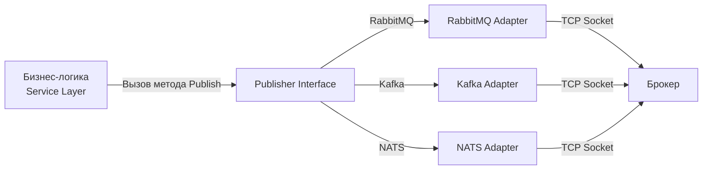
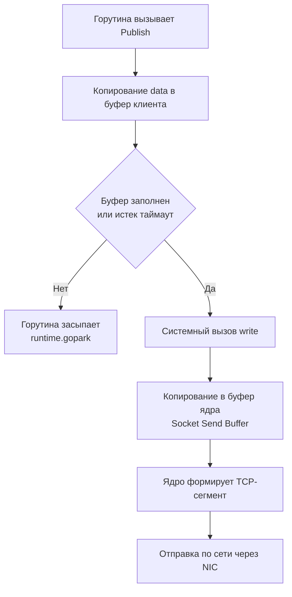

## Интеграция брокеров сообщений в Go-приложения

В идеальном мире мы проектируем систему, выбираем брокер, пишем код — и всё работает. В реальности работа с очередями в Go — это постоянная борьба с контекстами отмены, утечками горутин, переподключениями и правильным управлением ресурсами сетевого стека. 

Go дает нам мощные примитивы для конкурентности, но они не спасают от архитектурных ошибок при интеграции с внешними системами. В этой статье мы разберем, как правильно структурировать код работы с тремя основными типами брокеров — [[1. RabbitMQ. Архитектура и концепции|RabbitMQ]], [[1. Kafka. Архитектура и модель log based системы|Kafka]] и [[1. NATS. Легковесный брокер|NATS]] — с точки зрения production-ready инженерии.

## Архитектурный слой: Зачем нужен Client Wrapper

Прямое использование официальных SDK (например, `amqp091-go`, `confluent-kafka-go`, `nats.go`) в бизнес-логике — антипаттерн. SDK меняются, обрабатывают ошибки по-разному, имеют специфичные API для подключения и реконнекта. Бизнес-логика не должна знать, что для публикации сообщения в Kafka нужно создать `Producer` и вызвать `Produce()`, а для RabbitMQ — открыть `Channel` и вызвать `Publish()`.



Мы определяем узкий интерфейс в домене приложения и пишем адаптеры. Это также критически важно для тестирования — бизнес-код мокается на интерфейсе, а адаптеры тестируются интеграционно.

## Работа с RabbitMQ в Go

### Под капотом: `amqp091-go` и TCP-соединения

Библиотека `github.com/rabbitmq/amqp091-go` работает поверх сырого TCP. Внутри она мультиплексирует несколько логических каналов (AMQP Channels) поверх одного физического TCP-соединения.

> [!info] Под капотом
> AMQP — это бинарный протокол с фреймами. Каждая операция (публикация, подтверждение, объявление очереди) — это фрейм определенного типа. Библиотека `amqp091-go` использует горутину-ридер, которая в бесконечном цикле читает фреймы из TCP-соединения и диспетчеризирует их по внутренним слайсам `chan` (Go channels), привязанным к AMQP-каналам. Если физическое TCP-соединение рвется — **все** AMQP-каналы умирают мгновенно. Ручной реконнект в этой библиотеке не реализован "из коробки" — это полностью на совести разработчика.

### Правильная структура подключения

Ниже показан базовый шаблон инициализации. Обратите внимание на то, как жестко мы контролируем ресурсы.

```go
package rmqpublisher

import (
	"context"
	"fmt"
	amqp "github.com/rabbitmq/amqp091-go"
)

type Config struct {
	Host     string
	Port     int
	User     string
	Password string
}

type RabbitPublisher struct {
	conn    *amqp.Connection
	channel *amqp.Channel
}

func NewRabbitPublisher(ctx context.Context, cfg Config) (*RabbitPublisher, error) {
	url := fmt.Sprintf("amqp://%s:%s@%s:%d/", cfg.User, cfg.Password, cfg.Host, cfg.Port)
	
	conn, err := amqp.Dial(url)
	if err != nil {
		return nil, fmt.Errorf("dial rabbitmq: %w", err)
	}

	// Важно: amqp091-go не поддерживает передачу context.Context в Dial.
	// Если сервер недоступен, Dial будет блокировать горутину до таймаута ОС (обычно минуты).
	// Для production делают Dial с таймаутом через net.DialTimeout + amqp.Open,
	// но для краткости оставляем базовый вариант.

	ch, err := conn.Channel()
	if err != nil {
		// Обязательно закрываем conn, если channel не создался
		_ = conn.Close()
		return nil, fmt.Errorf("open channel: %w", err)
	}

	// Обязательно переводим канал в режим подтверждения публикации
	if err := ch.Confirm(false); err != nil {
		_ = ch.Close()
		_ = conn.Close()
		return nil, fmt.Errorf("put channel in confirm mode: %w", err)
	}

	pub := &RabbitPublisher{
		conn:    conn,
		channel: ch,
	}

	// Запускаем фоновую горутину для мониторинга закрытия соединения
	go pub.monitorConnection(ctx)

	return pub, nil
}

func (p *RabbitPublisher) monitorConnection(ctx context.Context) {
	// conn.NotifyClose возвращает канал, который закрывается,
	// когда TCP-соединение разрывается (с любой причиной).
	closeCh := p.conn.NotifyClose(make(chan *amqp.Error, 1))

	select {
	case <-ctx.Done():
		// Контекст приложения отменен (graceful shutdown)
		_ = p.channel.Close()
		_ = p.conn.Close()
		return
	case err := <-closeCh:
		if err != nil {
			// Здесь должна быть логика реконнекта.
			// В реальном мире мы отправляем сигнал в внешний service registry
			// или перезапускаем цикл реконнекта с exponential backoff.
			fmt.Printf("RabbitMQ connection lost: %v\n", err)
		}
	}
}

func (p *RabbitPublisher) Publish(ctx context.Context, exchange, routingKey string, body []byte) error {
	// PublishWithContext respects context cancellation
	err := p.channel.PublishWithContext(
		ctx,
		exchange,
		routingKey,
		false, // mandatory
		false, // immediate (deprecated в AMQP 0-9-1)
		amqp.Publishing{
			ContentType:  "application/octet-stream",
			Body:         body,
			DeliveryMode: amqp.Persistent, // Сохранить на диск брокера
		},
	)
	if err != nil {
		return fmt.Errorf("publish message: %w", err)
	}

	// Ожидаем подтверждение от брокера (для Exactly-Once в рамках брокера)
	// В реальном коде это делается через NotifyPublish в отдельной горутине
	return nil
}
```

> [!warning] Ловушка / Gotcha
> Метод `amqp.Dial()` блокирует горутину. Если DNS-запись недоступна или防火墙 dropped пакет, системный вызов `connect()` будет висеть до истечения таймаута TCP (обычно 2 минуты для Linux). Если вы делаете реконнект в цикле без собственного таймаута, вы быстро исчерпаете пул горутин, и ваше приложение зависнет. Всегда оборачивайте `Dial` в `time.After` или используйте `context.WithTimeout` с `amqp.DialConfig`.

## Работа с Kafka в Go

### Под капотом: `confluent-kafka-go` и `sarama`

В экосистеме Go есть два основных клиента: `github.com/IBM/sarama` (чистый Go) и `github.com/confluentinc/confluent-kafka-go` (обертка над C-библиотекой `librdkafka`). Выбор между ними — это классический trade-off.

**`sarama` (Pure Go):**
- Плюсы: Нет CGO, легко собирается в статических бинарниках (важно для Alpine/Docker `scratch`), проста в отладке через стандартный `pprof`.
- Минусы: Медленнее, нет полной поддержки всех фич newer версий Kafka (например, KRaft mode на ранних этапах, некоторые тонкости Exactly-Once).

**`confluent-kafka-go` (CGO + librdkafka):**
- Плюсы: Максимальная производительность, все фичи Kafka из коробки, единая кодовая база с клиентами для других языков.
- Минусы: **CGO**. Сборка требует наличия `librdkafka` в системе. Утечки памяти из C-кода не видны стандартным Go GC. Стек Go unwinding ломается на границе C/Go, что делает сложной отладку паник.

> [!tip] Собеседование
> **Вопрос:** Какой Kafka-клиент выбрать для production на Go?
> **Ответ:** Зависит от инфраструктуры и приоритетов. Если критичен размер Docker-образа, безопасность (нет C-зависимостей) и простота дебага — `sarama`. Если нужен экстремальный throughput и сложные топологии (KSQL, Exact-Once транзакции) — `confluent-kafka-go`. В большинстве типичных микросервисов, где Kafka используется как шина событий, `sarama` более чем достаточно.

### Производитель на Sarama: Идиоматичный подход

Kafka-продюсер уникален тем, что он **асинхронен по своей природе**. Когда вы вызываете `SendMessage()`, данные не уходят в сеть мгновенно. Они попадают во внутренний буфер, группируются в батчи (по размеру или по времени `linger.ms`) и только потом отправляются.

```go
package kafkaproducer

import (
	"context"
	"fmt"
	"log"
	"time"

	"github.com/IBM/sarama"
)

type KafkaProducer struct {
	prod sarama.SyncProducer
}

func NewKafkaProducer(brokers []string) (*KafkaProducer, error) {
	config := sarama.NewConfig()
	
	// ВНИМАНИЕ: SyncProducer не означает "синхронную отправку по сети"!
	// Он означает, что метод SendMessage() будет блокировать горутину
	// до тех пор, пока брокер не ответит Ack (или не произойдет таймаут).
	// Под капотом SyncProducer оборачивает AsyncProducer, ожидая результат из Successes/Errors каналов.
	config.Producer.RequiredAcks = sarama.WaitForAll // -1, ждем всех ISR
	config.Producer.Retry.Max = 5
	config.Producer.Retry.Backoff = 100 * time.Millisecond
	config.Producer.Return.Successes = true // Обязательно для SyncProducer

	// Настройки батчинга для оптимизации syscall-ов и TCP-пакетов
	config.Producer.Flush.Bytes = 1024 * 1024 // 1 MB
	config.Producer.Flush.Frequency = 10 * time.Millisecond

	prod, err := sarama.NewSyncProducer(brokers, config)
	if err != nil {
		return nil, fmt.Errorf("create kafka producer: %w", err)
	}

	return &KafkaProducer{prod: prod}, nil
}

func (p *KafkaProducer) Publish(ctx context.Context, topic string, key, value []byte) error {
	msg := &sarama.ProducerMessage{
		Topic: topic,
		Key:   sarama.ByteEncoder(key),
		Value: sarama.ByteEncoder(value),
	}

	// Mechanical Sympathy: SendMessage делает системный вызов send() только после накопления батча.
	// Один TCP-пакет может содержать сотни сообщений.
	select {
	case <-ctx.Done():
		// Если контекст отменен до отправки, мы не делаем syscall
		return ctx.Err()
	default:
		_, _, err := p.prod.SendMessage(msg)
		if err != nil {
			return fmt.Errorf("send message to kafka: %w", err)
		}
		return nil
	}
}

func (p *KafkaProducer) Close() error {
	// Flush очищает внутренние буферы перед выходом.
	// Если не вызвать Close, вы потеряете последние сообщения, находящиеся в батче!
	return p.prod.Close()
}
```

> [!warning] Ловушка / Gotcha
> Если ваше приложение падает по `SIGKILL` (например, OOM Killer или `docker kill -9`), метод `Close()` не вызывается. Все сообщения, которые находились в памяти продюсера в ожидании формирования батча, **будут безвозвратно потеряны**, даже если вы использовали `WaitForAll` (acks=-1). Брокер о них ничего не знал. Поэтому жизненно важен корректный [[2. Консьюмеры и graceful shutdown|graceful shutdown]], который ловит `SIGTERM`, останавливает прием новых запросов и вызывает `Close()` у продюсера.

## Работа с NATS в Go

### Под капотом: Легковесность и Netpoll

В отличие от Kafka и RabbitMQ, стандартный клиент NATS (`github.com/nats-io/nats.go`) написан с учетом архитектуры Go-рантайма.

> [!info] Под капотом
> NATS-клиент не создает отдельную горутину-ридер на каждое соединение, как это делает `amqp091-go`. Вместо этого он интегрируется с **netpoller'ом** Go-рантайма. Когда данных на сокете нет, горутина обработки не потребляет ресурсы CPU и стек памяти (она десcheduled планировщиком G-M-P через `runtime.gopark`). Это делает NATS идеальным для создания тысяч легковесных соединений (например, в микросервисной mesh) без раздувания памяти.

### JetStream: Публикация с гарантиями

[[2. Core NATS vs JetStream|JetStream]] добавляет persistence поверх базового протокола NATS. Работа с ним кардинально отличается от RabbitMQ — нет понятия "Exchange" или "Routing Key". Есть только `Subject` (строка с wildcard-символами `*` и `>`) и `Stream` (named durable log).

```go
package natspublisher

import (
	"context"
	"fmt"
	"time"

	"github.com/nats-io/nats.go"
)

type NATSPublisher struct {
	js nats.JetStreamContext
}

func NewNATSPublisher(ctx context.Context, url string) (*NATSPublisher, error) {
	// Options для Production
	opts := []nats.Option{
		nats.Name("MyServicePublisher"),
		nats.ReconnectWait(2 * time.Second),
		nats.MaxReconnects(5),
		nats.DisconnectErrHandler(func(nc *nats.Conn, err error) {
			if err != nil {
				fmt.Printf("NATS disconnected: %v\n", err)
			}
		}),
		nats.ReconnectHandler(func(nc *nats.Conn) {
			fmt.Printf("NATS reconnected to %s\n", nc.ConnectedUrl())
		}),
	}

	nc, err := nats.Connect(url, opts...)
	if err != nil {
		return nil, fmt.Errorf("connect to nats: %w", err)
	}

	js, err := nc.JetStream()
	if err != nil {
		_ = nc.Close()
		return nil, fmt.Errorf("create jetstream context: %w", err)
	}

	return &NATSPublisher{js: js}, nil
}

func (p *NATSPublisher) Publish(ctx context.Context, subject string, data []byte) error {
	// nats.PublishAsync не блокирует, но требует ручного управления
	// счётчиком pending сообщений, иначе можно сделать OOM.
	// Для надежности в большинстве случаев используют синхронную публикацию.
	
	ack, err := p.js.Publish(subject, data, nats.Context(ctx))
	if err != nil {
		return fmt.Errorf("jetstream publish: %w", err)
	}

	// ack.Sequence — это смещение в стриме (аналог offset в Kafka).
	// Если мы дошли сюда, сообщение гарантированно сохранено на диске лидер-сервера.
	_ = ack.Sequence 
	
	return nil
}
```

## Mechanical Sympathy: Сетевой стек и Аллокации

Когда вы отправляете сообщение в брокер, происходят следующие шаги на уровне ОС:



Ключевые точки, где вы теряете производительность:

1. **Аллокация `[]byte`**: Если на каждое сообщение вы делаете `json.Marshal()` или `[]byte(str)`, вы создаете мусор в куче. Go GC придется тратить CPU на очистку. В высоконагруженных системах используют `sync.Pool` для переиспользования буферов или кодогенерацию (например, `easyjson`), которая пишет прямо в `[]byte`, минуя аллокации через `reflect`.
2. **Системные вызовы `write`**: Каждый `write` — это переключение контекста Ring 3 $\to$ Ring 0. Батчинг (как в Kafka или в ручном `bufio` для RabbitMQ) решает эту проблему.
3. **Копирование в ядро**: Данные из User Space копируются в Kernel Space (Socket Buffer). Если сообщение больше, чем свободное место в сокете, системный вызов заблокирует горутину (если сокет в блокирующем режиме, что по умолчанию и есть в Go до Go 1.11, а сейчас `netpoll` сам отслеживает готовность сокета через `epoll`).

## Универсальный интерфейс публикации

Объединим подходы через интерфейс. Это позволяет бизнес-слою оставаться чистым и легко переключаться между брокерами (например, при миграции с RabbitMQ на Kafka).

```go
package messaging

import "context"

// Message представляет доменное сообщение
type Message struct {
	Key     []byte
	Payload []byte
	Headers map[string]string
}

// Publisher — узкий интерфейс для публикации.
type Publisher interface {
	Publish(ctx context.Context, topic string, msg Message) error
	Close() error
}
```

Адаптер для Kafka реализует этот интерфейс, конвертируя `Message` в `sarama.ProducerMessage`. Если завтра вам нужно будет добавить трассировку (добавлять `trace_id` в Headers), вы сделаете это в одном месте — в адаптере, не трогая сотни мест в бизнес-логике.

## Итоги

1. **Никогда не используйте SDK напрямую в бизнес-логике.** Инкапсулируйте брокер за интерфейсом `Publisher` и адаптером.
2. **RabbitMQ требует ручного реконнекта.** Обрыв TCP убивает все AMQP-каналы. `amqp091-go` не реконнектится сам — пишите state machine для переподключения с backoff.
3. **Kafka-продюсер буферизирует.** Без корректного `Close()` при `SIGTERM` вы теряете данные из недосланных батчей.
4. **NATS интегрирован с Go Runtime.** Клиент использует `netpoll`, поэтому тысячи подписок не создают тысяч заблокированных горутин-ридеров.
5. **Контекст — закон.** Все методы публикации должны принимать `context.Context` и проверять его отмену до того, как будут выделены ресурсы или сделаны системные вызовы.

В следующей статье мы разберем самую критичную часть работы с очередями — как правильно писать консьюмеры, чтобы они не теряли сообщения при перезапусках и не падали с OOM, реализуя полноценный [[2. Консьюмеры и graceful shutdown]].