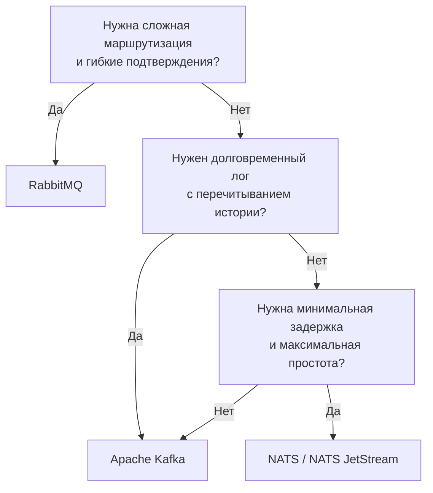

> [!NOTE]
> **Связи:** Эта статья подводит черту под всем разделом 13 «Очереди, брокеры сообщений и оркестраторы», связывая [[1. Обзор раздела. Асинхронность как основа масштабирования]] и все последующие материалы во всех подразделах. Мы завершаем изучение асинхронных коммуникаций и переходим к следующему фундаменту: [[14. Введение в распределенные системы]].

## Что мы построили

За двадцать с лишним статей мы прошли путь от вопроса «зачем нужна очередь сообщений» до тонкостей работы Kafka под капотом, идемпотентной обработки, транзакционного exactly-once и оркестрации сложных бизнес-процессов через Temporal. Раздел оказался одним из самых насыщенных в базе знаний, и это не случайно: асинхронное взаимодействие — нервная система современных бэкендов. Без него невозможно построить ни устойчивый к сбоям микросервисный ландшафт, ни высоконагруженный конвейер данных.

В этой итоговой статье мы не будем повторять содержание каждой темы — ссылки на статьи даны в тексте для быстрого перехода. Вместо этого мы соберём разрозненные знания в единую картину, сформулируем принципы выбора инструментов и паттернов, а главное — выработаем инженерный майндсет, необходимый для проектирования и эксплуатации асинхронных систем на Go.

## Переосмысление асинхронности: не быстрее, а надёжнее

Часто встречающееся заблуждение: «мы добавим очередь, и система станет быстрее». На самом деле асинхронность всегда добавляет задержку — сообщению нужно время, чтобы дойти от продюсера к брокеру и от брокера к консьюмеру. Плата за асинхронность — переход от немедленной согласованности к **eventual consistency** (согласованность в конечном счёте).

Истинная цель очередей и брокеров, сформулированная в [[2. Синхронное vs асинхронное взаимодействие]] — **развязка во времени и пространстве**. Сервис-отправитель может работать, даже если получатель временно недоступен. Получатель может обрабатывать запросы в своём темпе, не боясь быть перегруженным. Система в целом приобретает упругость (resilience), которой невозможно достичь синхронными вызовами по HTTP/gRPC.

## Центральные концепции раздела

Прежде чем обсуждать инструменты, закрепим понятия, проходящие красной нитью через все статьи.

### Модели доставки и их цена

Три семантики, разобранные в [[4. Модели доставки. At most once, at least once, exactly once]], определяют, сколько раз сообщение может быть обработано. На практике большинство систем тяготеет к **at-least-once**, компенсируя дубликаты через [[10. Idempotency в message processing]]. Exactly-once — это не магический флаг, а комбинация идемпотентного продюсера, транзакций брокера и изолированного чтения ([[6. Exactly once в Kafka]]), и она почти всегда ограничена рамками одной экосистемы.

### Порядок и параллелизм — фундаментальный конфликт

Глобальный порядок сообщений и горизонтальное масштабирование несовместимы. Компромисс — порядок в пределах одной партиции или одного ключа сообщения ([[5. Ordering и partitioning]]). Выбор ключа становится архитектурным решением, определяющим, какие сущности обрабатываются строго последовательно, а какие — параллельно.

### Управление нагрузкой

Без [[6. Backpressure и контроль нагрузки]] консьюмер может быть завален сообщениями быстрее, чем успевает обрабатывать. Pull-модель Kafka ([[3. Producer и consumer]]) даёт естественный backpressure: консьюмер запрашивает следующую порцию, только когда готов. В push-системах (RabbitMQ) критичен параметр **prefetch** ([[5. Prefetch и QoS]]), ограничивающий число неподтверждённых сообщений в обработке.

### Обработка ошибок и устойчивость

Ошибки неизбежны. Механизмы, которые не дают им разрушить систему:

- [[9. Retry стратегии и exponential backoff]] с экспоненциальной задержкой и максимальным числом попыток.
- [[8. Dead Letter Queue]] как последний рубеж для «отравленных» сообщений.
- [[4. Idempotent handlers]] для защиты от дубликатов при ретраях.
- [[6. Handling poison messages]] — операционные практики мониторинга DLQ и возврата сообщений в основную очередь после исправления бага.

## Выбор брокера: RabbitMQ, Kafka или NATS

Один из самых частых вопросов на проектировании — какой брокер выбрать. Ответ зависит от характера нагрузки и требований к обработке.

**RabbitMQ** — выбор для классических очередей заданий с гибкой маршрутизацией ([[2. Exchanges. Direct, Fanout, Topic, Headers]]), сложными схемами подтверждений и приоритезацией. Хорош, когда важна семантика «сообщение принадлежит конкретному получателю до подтверждения». Плата — более низкая пропускная способность и сложность горизонтального масштабирования (зеркалирование очередей в [[9. Cluster и HA в RabbitMQ]]).

**Apache Kafka** — стандарт для потоковой обработки, событийно-ориентированных архитектур ([[3. Event Driven Architecture]]) и сценариев, где данные нужно хранить часами или днями и перечитывать ([[8. Retention и compaction]]). Выигрывает за счёт последовательного ввода-вывода и zero-copy ([[7. Kafka storage под капотом]]), но требует зрелой инфраструктуры и глубокого понимания партиций и Consumer Groups ([[4. Consumer groups]]).

**NATS** — легковесный высокоскоростной брокер, идеальный для случаев, когда задержка важнее долговременного хранения ([[1. NATS. Легковесный брокер]]). JetStream ([[5. JetStream. Persistence и stream processing]]) добавляет персистентность, приближая NATS к Kafka, но с меньшей операционной сложностью. Сравнение всех трёх — в [[6. NATS vs Kafka vs RabbitMQ]].

## Паттерны: от простого pub/sub к сложным сагам

Раздел [[05. Паттерны и архитектура]] провёл нас по эволюции асинхронного проектирования:

1. **[[1. Pub Sub]]** — базовое уведомление многих подписчиков о событии.
2. **[[2. Work Queue]]** — распределение заданий между конкурирующими обработчиками.
3. **[[3. Event Driven Architecture]]** — события как основной способ коммуникации между сервисами.
4. **[[4. Event sourcing и брокеры]]** — хранение всех изменений как потока событий с возможностью восстановления состояния.
5. **[[5. CQRS и брокеры]]** — разделение модели на чтение и запись, где брокер синхронизирует проекции.
6. **[[6. Outbox pattern]]** и **[[7. Inbox pattern]]** — решение проблемы двойной записи (в БД и в брокер) в рамках одной транзакции.
7. **[[8. Saga через брокеры]]** — координация распределённых транзакций через хореографию (события) или оркестрацию ([[9. Message choreography vs orchestration]]).

Go-разработчику важно не просто знать эти паттерны, но и понимать их механическую цену: Outbox добавляет отдельную таблицу и процесс-релей; CQRS удваивает количество топиков и консьюмеров; Saga требует компенсационных транзакций ([[5. Retry и compensation logic]]), которые нужно писать и отлаживать.

## Оркестрация процессов: следующий уровень абстракции

Когда бизнес-логика становится сложной — несколько шагов, условные переходы, таймауты, ожидание внешних систем — сырые брокеры перестают быть удобным инструментом. Возникает потребность в **workflow orchestration**, и здесь в игру вступает Temporal ([[2. Temporal. Архитектура и концепции]]).

Ключевой прорыв Temporal — **durable execution** ([[3. Durable execution]]): код вашего workflow пишется на Go (или другом языке), вызывает activity, ждёт ответа, и если процесс упадёт в середине, Temporal восстановит его ровно с того же места, с теми же переменными и состоянием. Разработчик пишет линейный код без управления состоянием в БД, без retry-логики вручную — фреймворк берёт это на себя.

Temporal заменяет самодельные саги и state machines, особенно в сценариях с длительными ожиданиями (например, «заказ создан → ждём оплату до 30 минут → отменяем»). При этом [[4. Оркестрация vs хореография]] остаётся осознанным выбором: для простых потоков хореография через события проще и дешевле; для сложных бизнес-процессов оркестрация снижает когнитивную нагрузку.

## Практика в Go: чек-лист production-ready консьюмера

Раздел [[07. Практика]] собрал боевые рецепты для Go-разработчика. Если вы пишете консьюмер для Kafka, RabbitMQ или NATS, этот чек-лист должен быть выполнен:

1. **[[1. Работа с очередями в Go]]** — правильный выбор библиотеки, connect/reconnect логика.
2. **[[2. Консьюмеры и graceful shutdown]]** — перехват SIGTERM, `ctx.Done()`, завершение обработки текущего батча перед выходом.
3. **[[3. Параллелизм обработки сообщений]]** — worker pool или ограниченное количество горутин, защита от перегрузки.
4. **[[4. Idempotent handlers]]** — хранение обработанных ключей в Redis/БД, атомарная проверка и вставка.
5. **[[5. Batch processing сообщений]]** — накопление сообщений и запись в БД одним запросом для повышения пропускной способности.
6. **[[6. Handling poison messages]]** — перехват паники, запись в DLQ, алерт.
7. **[[7. Тестирование async систем]]** — unit-тесты с моками, интеграционные с Testcontainers, проверка гонок через `-race`.
8. **[[8. Observability очередей]]** — метрики лага, throughput, ошибок; трейсинг от продюсера до консьюмера; логирование ключевых событий.
9. **[[9. Мониторинг lag и throughput]]** — графики в Grafana, алерты при росте лага выше порога.

## Ключевой инженерный принцип: сложность не исчезает

Асинхронная архитектура — это не серебряная пуля. Она не упрощает систему; она **перемещает сложность** из синхронного «здесь и сейчас» в распределённое «где-то потом». Плата за это:

- Согласованность становится eventual: вы не знаете, когда именно данные дойдут до потребителя.
- Дебаггинг усложняется: стек вызовов разорван, нужна распределённая трассировка ([[10. Distributed tracing в async системах]]).
- Дубликаты и потеря порядка становятся нормой: нужна идемпотентность, тщательное проектирование ключей партиционирования.
- Появляются новые виды сбоев: брокер может упасть, сеть может разделиться, consumer group может перебалансироваться в неподходящий момент.

Не вводите очереди туда, где достаточно синхронного вызова. Но если вам нужна развязка, устойчивость к всплескам нагрузки и независимый жизненный цикл сервисов — асинхронность становится архитектурным must-have.

## Что дальше: распределённые системы

Раздел 13 закрыл тему асинхронного взаимодействия, но затронул лишь часть более широкой картины — распределённых систем. Теория CAP, алгоритмы консенсуса, распределённые транзакции, блокировки, Event Sourcing и CQRS на практике — всё это ждёт нас в следующем разделе.

Асинхронные брокеры — ключевой строительный блок распределённых систем, и теперь, понимая, как они работают под капотом, мы готовы перейти к проектированию отказоустойчивых, масштабируемых и консистентных кластерных решений.