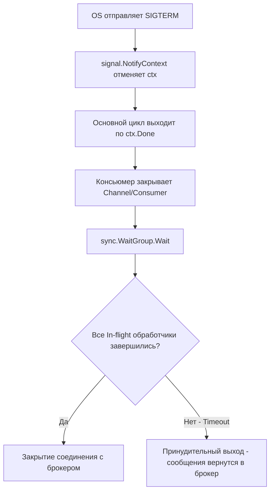

## Прерывая бесконечный цикл

В классических PHP или Python-приложениях生命周期 управления процессом прост: пришел запрос, отработал скрипт, процесс умер. Если вы перезапускаете PHP-FPM или UWSGI, мастер-процесс просто убивает воркеры. ОС очищает ресурсы, а соединения с БД и брокерами обрываются. В лучшем случае подключится супервизор и перезапустит процесс.

В Go мы пишем долгоживущие (long-lived) демоны. Консьюмер (потребитель сообщений) — это обычно набор горутин, которые крутятся в бесконечном цикле `for`, вычитывая сообщения из брокера (RabbitMQ, Kafka, NATS). Когда приходит время деплоя или подморозки (OOM), поду нужно завершиться. 

Но если просто убить процесс (`SIGKILL`), мы потеряем сообщения, которые уже вычитаны из брокера, но еще не обработаны, или (что еще хуже) обработаны, но не закоммичены (ACK/NACK). Это прямой путь к нарушению гарантий доставки, описанных в [[4. Модели доставки. At most once, at least once, exactly once]], и появлению дубликатов.

## Архитектура Graceful Shutdown в Go

Graceful Shutdown (плавная остановка) — это не просто вызов `os.Exit(0)`. Это строгая последовательность действий, которая должна гарантировать, что ни одно сообщение не останется в неопределенном состоянии.

Типичный паттерн в Go состоит из трех этапов:
1. **Перехват сигнала ОС** (SIGINT, SIGTERM).
2. **Остановка приема новых сообщений** (мы говорим брокеру: "Больше не слай мне данные").
3. **Ожидание завершения текущих обработчиков** (In-flight сообщения должны быть обработаны и закоммичены).



## Под капотом: Сигналы, Контекст и Планировщик

Давай разберем, как магия `signal.NotifyContext` работает на уровне рантайма Go и ОС.

Когда вы создаете контекст через `signal.NotifyContext(ctx, syscall.SIGTERM, syscall.SIGINT)`, рантайм Go регистрирует обработчик через системный вызов `sigaction` (в Linux). Когда ядро отправляет процессу сигнал (например, при `kubectl delete pod`), происходит программное прерывание.

> [!info] Под капотом
> В Go сигналы обрабатываются специальной горутиной `signal.recv`. Когда приходит сигнал, runtime не прерывает вашу бизнес-логику посреди строки кода. Вместо этого он записывает сигнал в внутренний канал обработчика. Когда `signal.recv` просыпается, он закрывает канал `ctx.Done()` для вашего контекста.
> 
> Закрытие канала в Go — это *broadcast* событие. Это значит, что все горутины, слушающие `ctx.Done()`, получат уведомление практически одновременно (в рамках планировщика G-M-P).

### Почему Context, а не Channels?

Многие разработчики, приходящие из других языков, пытаются сделать отдельный `stopChan chan struct{}` для сигнала остановки. В Go использование `context.Context` — это **идиома и абсолютный стандарт**. 
Во-первых, контекст можно передавать вглубь стека вызовов (например, в HTTP-клиенты или драйверы БД), и они тоже корректно оборвут таймаутные запросы. Во-вторых, это безопаснее с точки зрения конкурентности (закрытие канала можно пропустить, если читатель не слушает канал в данный момент, но `ctx.Err()` всегда вернет состояние).

## Паттерн WaitGroup: Считаем в полете

Самая частая ошибка при написании консьюмера — использовать `sync.WaitGroup` неправильно. 

Рассмотрим классический пример обработки сообщений из Kafka:

```go
func (c *Consumer) Start(ctx context.Context) error {
	// Подписываемся на контекст отмены
	ctx, cancel := signal.NotifyContext(ctx, syscall.SIGTERM, syscall.SIGINT)
	defer cancel()

	wg := sync.WaitGroup{}
	
	for {
		select {
		case <-ctx.Done():
			// Поймали сигнал остановки
			c.logger.Info("Получен сигнал остановки, ожидаем завершения обработчиков...")
			wg.Wait() // Ждем, пока все wg.Done() будут вызваны
			return nil
		case msg, ok := <-c.messagesCh:
			if !ok {
				return nil // Брокер закрыл канал
			}
			
			// ОШИБКА: wg.Add(1) здесь!
			// Между получением msg и wg.Add может произойти ctx.Done(),
			// и wg.Wait() выйдет раньше, чем мы успеем добавить 1.
			go c.processMessage(ctx, msg, &wg) 
		}
	}
}
```

> [!warning] Ловушка / Gotcha
> Вызов `wg.Add(1)` *внутри* горутины обработчика или после `select` — это data race и потенциальный дедлок. Если контекст отменится сразу после того, как сообщение попало в кейс `msg`, основная горутина может дойти до `wg.Wait()`, в то время как `wg.Add(1)` еще не выполнился. `Wait()` вернет ноль, приложение упадет, а сообщение потеряется.

**Правильный подход:** Инкрементировать `WaitGroup` строго *до* запуска горутины.

```go
		case msg, ok := <-c.messagesCh:
			if !ok {
				return nil
			}
			
			wg.Add(1) // Инкремент ДО go-рутины
			go func() {
				defer wg.Done() // Гарантированный декремент
				c.processMessage(ctx, msg)
			}()
```

## Hard Timeout: Защита от зависаний

Даже если вы реализовали WaitGroup, ваше приложение обязано иметь **Hard Timeout**. 

Представьте, что `processMessage` делает HTTP-запрос к стороннему API, а оно зависло. Или вы пытаетесь записать данные в PostgreSQL, но мастер-нода сейчас недоступна, и соединение повисло в ожидании TCP-таймаута. 

В Kubernetes по умолчанию на завершение пода дается 30 секунд (`terminationGracePeriodSeconds`). Если ваше приложение не завершится за это время, kubelet пришлет `SIGKILL`. Процесс умрет жестко, дампнет корку, а обработанные, но не закоммиченные сообщения пропадут (если у вас `auto-commit` или вы не успели вызвать `msg.Ack()`).

Поэтому мы обязаны дать обработчикам ограниченное время на завершение:

```go
case <-ctx.Done():
    c.logger.Info("Останавливаем консьюмер...")
    
    // Даем время на доработку, но не бесконечно
    done := make(chan struct{})
    go func() {
        wg.Wait()
        close(done)
    }()
    
    select {
    case <-done:
        c.logger.Info("Все обработчики завершились успешно")
    case <-time.After(15 * time.Second):
        c.logger.Error("Таймаут завершения! Принудительный выход. Возможна потеря данных!")
    }
    
    return nil
```

> [!tip] Собеседование
> **Вопрос:** Что произойдет с сообщением в RabbitMQ, если горутина обработала бизнес-логику, но перед отправкой `msg.Ack()` приложение убили по таймауту?
> **Ответ:** Сообщение не будет подтверждено. Брокер (RabbitMQ) увидит обрыв TCP-соединения и вернет сообщение в очередь (requeue). Это приведет к повторной обработке (дублированию). Именно поэтому важен [[4. Idempotent handlers]] и именно поэтому `Ack` должен следовать *сразу* после сохранения результата в БД (в идеале — в одной транзакции/транзакционном outbox).

## Production-ready скелет Консьюмера

Соберем все воедино. Вот как должен выглядеть надежный консьюмер на Go (на примере абстрактного брокера), учитывающий механику рантайма и требования отказоустойчивости:

```go
package consumer

import (
	"context"
	"log/slog"
	"os/signal"
	"sync"
	"syscall"
	"time"
)

type Message struct {
	Body []byte
	Ack  func() error
	Nack func() error
}

type BrokerClient interface {
	Consume(ctx context.Context) <-chan Message
	Close() error
}

type Handler func(ctx context.Context, msg Message) error

type Consumer struct {
	broker  BrokerClient
	handler Handler
	logger  *slog.Logger
}

func New(broker BrokerClient, handler Handler, logger *slog.Logger) *Consumer {
	return &Consumer{
		broker:  broker,
		handler: handler,
		logger:  logger,
	}
}

func (c *Consumer) Run(parentCtx context.Context) error {
	// 1. Перехватываем сигналы ОС на уровне контекста
	ctx, stop := signal.NotifyContext(parentCtx, syscall.SIGINT, syscall.SIGTERM)
	defer stop()

	messages := c.broker.Consume(ctx)
	wg := sync.WaitGroup{}

	// 2. Основной цикл вычитки
	for {
		select {
		case <-ctx.Done():
			c.logger.Info("Получен сигнал остановки")
			return c.shutdown(ctx, &wg)
		case msg, ok := <-messages:
			if !ok {
				// Брокер закрыл канал (сетевая ошибка)
				c.logger.Error("Канал сообщений закрыт брокером")
				return c.shutdown(ctx, &wg)
			}

			// 3. Правильный инкремент WG
			wg.Add(1)
			go func() {
				defer wg.Done()

				// ВАЖНО: Создаем дочерний контекст с таймаутом для конкретной обработки.
				// Если глобальный ctx отменен, обработка тоже прервется.
				// Но лучше дать ей шанс доработать, пока не истек жесткий таймаут.
				msgCtx, cancel := context.WithTimeout(context.Background(), 10*time.Second)
				defer cancel()

				if err := c.handler(msgCtx, msg); err != nil {
					c.logger.Error("Ошибка обработки сообщения", "error", err)
					// Если обработка упала, возвращаем в очередь или в DLQ
					if nackErr := msg.Nack(); nackErr != nil {
						c.logger.Error("Ошибка NACK", "error", nackErr)
					}
					return
				}

				// Успешная обработка
				if ackErr := msg.Ack(); ackErr != nil {
					c.logger.Error("Ошибка ACK", "error", ackErr)
					// Критическая ситуация: обработано, но не заакано. 
					// Возможно стоит запаниковать или отправить алерт.
				}
			}()
		}
	}
}

func (c *Consumer) shutdown(ctx context.Context, wg *sync.WaitGroup) error {
	// Ожидаем завершения с жестким таймаутом
	done := make(chan struct{})
	go func() {
		wg.Wait()
		close(done)
	}()

	select {
	case <-done:
		c.logger.Info("Все in-flight сообщения обработаны")
	case <-time.After(15 * time.Second):
		c.logger.Warn("Превышен таймаут graceful shutdown, принудительное завершение")
	}

	// Закрываем соединение с брокером
	if err := c.broker.Close(); err != nil {
		c.logger.Error("Ошибка закрытия соединения с брокером", "error", err)
		return err
	}

	return nil
}
```

### Анализ кода и механика памяти
1. **Отсутствие аллокаций в главном цикле:** Мы не создаем новые объекты в `select`, кроме замыкания для горутины. Go эффективно аллоцирует замыкания в куче (Escape Analysis унесет туда переменные `msg` и `wg`), но это неизбежная цена за конкурентность.
2. **`context.Background()` в обработчике:** Обратите внимание, что внутри горутины мы делаем `context.WithTimeout(context.Background(), ...)`. Почему не `ctx`? Потому что если мы передадим отмененный `ctx` в HTTP-клиент или БД внутри обработчика, они мгновенно оборвут соединения, и мы не сможем корректно завершить транзакцию, даже если у нас есть время до жесткого таймаута shutdown.
3. **Сложность ACK:** Вызов `msg.Ack()` — это часто сетевой системный вызов (отправка TCP-пакета обратно в брокер). Если сеть лагает, `Ack` может висеть дольше, чем сама бизнес-логика. Если вы упретесь в Hard Timeout на этапе `Ack`, сообщение будет потеряно/задублировано.

## Итог

1. Graceful shutdown консьюмера — это не опция, это жесткое требование для сохранения [[4. Модели доставки. At most once, at least once, exactly once]]. 
2. Используйте `signal.NotifyContext` — это идиоматичный способ связать сигналы ОС (Ring 0) с планировщиком горутин Go (User Space).
3. `sync.WaitGroup` требует строгой дисциплины: `wg.Add(1)` строго *до* `go func()`, а `wg.Done()` — через `defer`.
4. Всегда реализуйте Hard Timeout. Не надейтесь, что бизнес-логика доработает быстро. Защищайтесь от зависших TCP-соединений.
5. Помните, что отмена контекста в Go — это широковещательное событие, которое мгновенно прерывает все вложенные `select` и HTTP-вызовы, что может мешать корректному завершению (commit/ack) транзакций.

Теперь, когда мы понимаем, как безопасно остановить консьюмер, в следующей статье мы разберем, как ускорить его работу, распараллелив обработку сообщений, не сломав при этом порядок (ordering) и не создав гонку данных: [[3. Параллелизм обработки сообщений]].