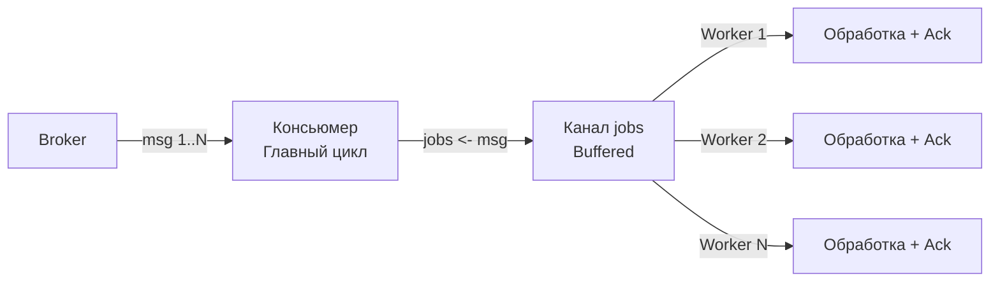

## Узкое горлышко синхронного консьюмера

В предыдущей статье мы построили надежный консьюмер, который умеет корректно завершать работу. Но в нём есть фундаментальная проблема производительности: он обрабатывает сообщения строго последовательно. 

Если ваш брокер (например, Kafka) отдает сообщения со скоростью 10 000 msg/s, а обработка одного сообщения включает HTTP-вызов стороннего API или сложный SQL-запрос к БД, занимающий 50 мс, ваша пропускная способность упрётся в максимум **20 msg/s**. Остальные 9980 сообщений будут скапливаться в брокере, увеличивая [[9. Мониторинг lag и throughput|Lag]].

В бэкенде на PHP или Python эта проблема решается горизонтальным масштабированием — запуском десятков независимых процессов-воркеров (например, через Supervisor). В Go, благодаря легковесным горутинам, у нас есть более гибкие и мощные инструменты, но и больше способов выстрелить себе в ногу.

## Fan-Out: Почему не стоит запускать горутину на каждое сообщение?

Первая мысль разработчика, переходящего на Go: "Горутины дешевые! Буду запускать `go process(msg)` на каждое сообщение". Это классический антипаттерн, ведущий к катастрофе.

> [!warning] Ловушка / Gotcha
> Неограниченный Fan-Out (запуск горутины на каждое сообщение) нарушает базовый принцип надежных систем — **Backpressure** (о котором мы говорили в [[6. Backpressure и контроль нагрузки]]).
> 
> 1. **OOM (Out of Memory):** Если брокер отдаст 1 000 000 сообщений, вы запустите 1 000 000 горутин. Стек каждой горутины изначально занимает 2-8 КБ (и может расти). Итог — потребление памяти в гигабайты и OOM Kill.
> 2. **Connection Pool Exhaustion:** Каждая горутина попытается записать данные в БД или сделать HTTP-запрос. Пул соединений БД (например, в `pgx` или `sql.DB`) имеет лимит (обычно 20-50). Тысячи горутин заблокируются в ожидании коннекта, создавая огромную очередь и таймауты.
> 3. **Scheduler Thrashing:** Планировщику Go (G-M-P) придется тратить такты CPU на переключение контекста между миллионами горутин вместо полезной работы.

## Worker Pool: Идиоматичный подход

Правильный способ распараллелить обработку — использовать **Worker Pool** (пул воркеров). Мы создаем фиксированное количество горутин-обработчиков (воркеров) на старте и отправляем им сообщения через канал.

Это элегантно решает проблему Backpressure: если все воркеры заняты, главный цикл просто не сможет отправить новое сообщение в канал (он заблокируется на `jobs <- msg`), пока воркер не освободится. Таким образом, система сама естественным образом замедляет вычитку, не давая себе задохнуться.



### Реализация Worker Pool

```go
func (c *Consumer) Run(ctx context.Context, workerCount int) error {
	ctx, cancel := signal.NotifyContext(ctx, syscall.SIGINT, syscall.SIGTERM)
	defer cancel()

	// Канал с буфером сглаживает микро-задержки между вычиткой и обработкой
	jobs := make(chan Message, workerCount) 
	wg := sync.WaitGroup{}

	// Запуск фиксированного пула воркеров
	for i := 0; i < workerCount; i++ {
		wg.Add(1)
		go func(workerID int) {
			defer wg.Done()
			c.worker(ctx, workerID, jobs)
		}(i)
	}

	// Главный цикл вычитки (Fan-Out в канал)
	for {
		select {
		case <-ctx.Done():
			c.logger.Info("Остановка: закрываем канал jobs")
			close(jobs) // Закрываем канал, чтобы воркеры завершили цикл range
			wg.Wait()   // Ждем завершения всех in-flight сообщений в воркерах
			return nil
		case msg, ok := <-c.brokerMessages:
			if !ok {
				close(jobs)
				wg.Wait()
				return nil
			}
			
			// Отправка в канал. Если все воркеры заняты — здесь консьюмер заблокируется.
			// Это и есть Backpressure!
			select {
			case jobs <- msg:
			case <-ctx.Done(): // На случай, если контекст отменится пока мы ждем воркера
				// Важно: сообщение не обработано. Нужно его Nack с requeue=true
				_ = msg.Nack(true) 
			}
		}
	}
}

func (c *Consumer) worker(ctx context.Context, id int, jobs <-chan Message) {
	for msg := range jobs {
		// Создаем изолированный контекст с таймаутом для сообщения
		msgCtx, cancel := context.WithTimeout(ctx, 5*time.Second)
		
		if err := c.handler(msgCtx, msg); err != nil {
			_ = msg.Nack(false) // NACK без возврата в очередь (или с возвратом, зависит от логики)
		} else {
			_ = msg.Ack()
		}
		cancel() // Обязательно вызываем cancel для сборщика мусора
	}
}
```

## Under the Hood: Планировщик G-M-P и Кэши CPU

Выбор количества воркеров (workerCount) — это не просто магическое число. Это вопрос Mechanical Sympathy.

Если ваша обработка **CPU-bound** (например, парсинг тяжелого JSON, криптография, сжатие данных), количество воркеров должно быть равно `runtime.GOMAXPROCS(0)` (количеству логических ядер CPU). 
Если вы запустите 100 CPU-bound воркеров на 8-ядерном процессоре, планировщик Go будет постоянно переключать горутины между потоками ОС (M). 

> [!info] Под капотом
> При каждом переключении горутин (когда время кванта в `runtime` истекает), планировщик сохраняет регистры CPU в стеке старой горутины и загружает регистры новой. Это само по себе не бесплатно. Но главное — **Cache Thrashing** (трэшинг кэша).
> 
> Данные вашей горутины (структуры, слайсы) лежат в RAM. Когда горутина работает, процессор подтягивает эти данные в кэш L1/L2 (очень быстрый, но маленький). Если горутина вытесняется, а на её место приходит другая, новые данные затирают кэш. Когда старая горутина вернется, процессор снова будет идти в медленную RAM. Больше горутин для CPU-работы = больше промахов кэша (Cache Misses) = драматическое падение производительности.

Если ваша обработка **IO-bound** (сеть, БД, внешние API), горутины будут большую часть времени спать в `runtime.netpoller`, ожидая ответа от ОС. В этом случае количество воркеров можно делать гораздо больше количества ядер (например, 100, 500 или даже 1000), так как они не будут конкурировать за CPU, а будут просто занимать память под свои стеки и ждать.

## Проблема порядка (Ordering)

При распараллеливании возникает критический архитектурный вопрос: что делать с [[5. Ordering сообщений и его цена|порядком сообщений]]?

Если брокер прислал сообщения `A, B, C` в строгом порядке, и мы раздали их разным воркерам, нет никакой гарантии, что они будут заакоммичены (ACK) в том же порядке. Воркер 2 может обработать `B` за 10 мс, а Воркер 1 будет ждать ответа по `A` от БД целую секунду. Итог: в БД сначала запишется `B`, потом `A`.

Поведение зависит от брокера:
1. **RabbitMQ:** По умолчанию нарушения порядка в рамках одной очереди не происходит, потому что RabbitMQ не отдаст следующее сообщение, пока предыдущее не будет ACK. *Но если вы используете Prefetch > 1*, брокер отдаст несколько сообщений в буфер консьюмера, и параллельные воркеры нарушат порядок обработки. Если `A` зафейлится и уйдет в NACK с requeue, оно вернется в очередь, но после `C`.
2. **Kafka:** Порядок гарантирован **только внутри одной партиции**. Но Kafka отдает сообщения пачкой (Fetch). Если один консьюмер читает партицию, и вы раскидываете сообщения по воркерам — порядок нарушается.

### Как сохранить порядок в Worker Pool?

Если строгий порядок (например, банковские транзакции по одному счету) критичен, классический Worker Pool не подходит. Нужен **Пул по ключу (Key-based Worker Pool / Hash Worker Pool)**.

Суть: мы извлекаем из сообщения ключ партицирования (например, `UserID` или `AccountID`). И отправляем сообщение строго тому воркеру, который закреплен за этим ключом (через хэширование `hash(key) % numWorkers`). 

```go
func (c *Consumer) Run(ctx context.Context, workerCount int) error {
    // Создаем слайс каналов — отдельный канал для каждого воркера
    workerChannels := make([]chan Message, workerCount)
    for i := 0; i < workerCount; i++ {
        workerChannels[i] = make(chan Message, 100)
        go c.worker(ctx, i, workerChannels[i])
    }

    for msg := range c.brokerMessages {
        key := msg.Key() // Например, ID пользователя
        // Deterministic routing
        workerID := fnv32(key) % uint32(workerCount)
        
        select {
        case workerChannels[workerID] <- msg:
        case <-ctx.Done():
            // ...
        }
    }
}
```

Этот подход гарантирует, что все сообщения для `AccountID=123` всегда обрабатываются одной и той же горутиной строго последовательно, а сообщения для `AccountID=456` могут обрабатываться параллельно в другой горутине. Это точная копия того, как Kafka обеспечивает порядок на уровне партиций, но реализованная на стороне приложения.

> [!tip] Собеседование
> **Вопрос:** Как распараллелить обработку сообщений из одной партиции Kafka, если обработка долгая (IO-bound), но строгий порядок всё ещё важен для некоторых ключей?
> **Ответ:** Использовать Key-based Worker Pool (Hash-маршрутизация по каналам). Это позволит обрабатывать сообщения с разными ключами параллельно, сохраняя строгий порядок для одинаковых ключей. Также можно использовать паттерн [[5. Batch processing сообщений]], если бизнес-логика позволяет накапливать события по ключу и применять их атомарно.

## Data Races в обработчиках

Параллелизм обработки требует абсолютной изоляции состояния. Если ваши воркеры обращаются к общим структурам данных (например, локальному кэшу метаданных или мапе с сессиями), вы получите Data Race.

> [!warning] Ловушка / Gotcha
> Никогда не читайте и не пишите в обычную `map` из разных горутин-воркеров без синхронизации. Это классическая ошибка, которая приводит к непредсказуемым паникам `fatal error: concurrent map read and map write` и порче памяти.
> 
> Если воркерам нужен общий кэш, используйте `sync.Map` (если ключи пишутся один раз и много читаются) или защищайте обычную мапу через `sync.RWMutex`. Но лучший подход — **stateless воркеры**. Держите состояние вне обработчиков (в Redis или БД).

## Итог

1. Неограниченный Fan-Out (`go process()`) убьет ваше приложение через OOM, исчерпание пулов соединений и трэшинг планировщика. Всегда используйте ограниченный Worker Pool.
2. Worker Pool на каналах — это идиоматичный способ реализовать [[6. Backpressure и контроль нагрузки|Backpressure]]. Блокировка на отправке в канал — это правильное поведение.
3. Количество воркеров должно соотноситься с типом нагрузки: `GOMAXPROCS` для CPU-bound, сотни/тысячи для IO-bound.
4. Параллелизация обработки убивает порядок сообщений. Если порядок критичен, используйте Key-based Worker Pool с хэш-маршрутизацией.
5. Избегайте общего изменяемого состояния (shared state) между воркерами, иначе Data Races неизбежны.

Теперь, когда мы умеем обрабатывать сообщения параллельно, мы неизбежно столкнемся с дубликатами — они появятся из-за повторных доставок при сбоях. В следующей статье мы разберем самую важную защиту от этого: [[4. Idempotent handlers]].