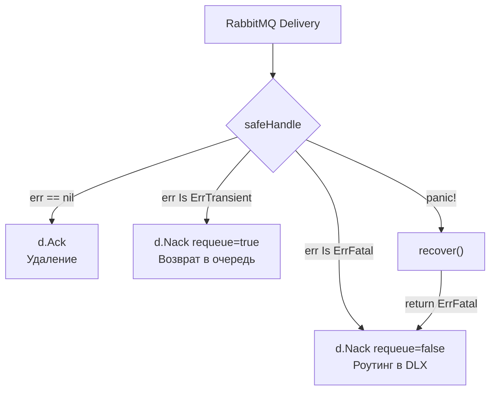

## Анатомия катастрофы в рантайме

В теоретическом разделе мы уже обсуждали концепцию очереди мертвых писем в статье [[8. Dead Letter Queue]]. Мы выяснили, что "ядовитое сообщение" (Poison Message) — это валидный с точки зрения брокера кусок данных, который вызывает фатальную ошибку в бизнес-логике консьюмера. 

Но теория часто разбивается о суровую практику системного программирования. Одно дело, когда `json.Unmarshal` аккуратно возвращает ошибку. И совсем другое, когда сообщение содержит данные, заставляющие ваш Go-код паниковать или бесконечно блокироваться (Deadlock).

Если ваш консьюмер просто вернет сообщение обратно в очередь (через `Nack` или отвал по таймауту), вы спровоцируете петлю смерти (Infinite Retry Loop).

> [!info] Под капотом: Mechanical Sympathy петли смерти
> Что происходит с сервером, когда Poison Message начинает "летать" между RabbitMQ и Go-консьюмером со скоростью 10 000 раз в секунду?
> 1. **Network I/O:** Сетевой стек ядра Linux (Ring 0) безостановочно обрабатывает прерывания от сетевой карты, перекладывая байты в буферы TCP-сокетов.
> 2. **GC Pressure:** Рантайм Go аллоцирует структуры `amqp.Delivery` (или аналогичные) в куче (Escape Analysis не может удержать их на стеке, так как они передаются через каналы). Каждая неудачная попытка порождает мусор. Сборщик мусора (GC) начинает запускаться непрерывно, отъедая до 50% CPU (вы увидите всплеск метрики `go_gc_duration_seconds`).
> 3. **Starvation:** Потоки ОС (`m`), привязанные к процессорам (`p`), заняты перемалыванием ядовитого сообщения. Полезная нагрузка (другие, валидные сообщения) выстраивается в очередь ожидания. Возникает Head-of-Line Blocking даже без жесткого Ordering-а.

В этой статье мы напишем production-ready каркас обработчика, который защитит ваш микросервис от ядовитых инъекций.

## Самый страшный яд: Неперехваченная паника

В языках вроде Java или C# исключения — это норма. В Go `panic` — это сигнал крушения. 

Если внутри обработчика сообщения произойдет `panic` (например, разыменование nil-указателя из-за отсутствующего поля в JSON, или выход за границы слайса), функция `runtime.gopanic` начнет раскручивать стек (Stack Unwinding). Если она не встретит `recover`, рантайм вызовет `runtime.crash`, который отправит процессу сигнал `SIGABRT`. 

Процесс умрет. Kubernetes увидит смерть пода и перезапустит его. Брокер сообщений увидит разорванное TCP-соединение, снимет с сообщения статус `Unacknowledged` и вернет его в начало очереди. Поднимется новый под, прочитает это же сообщение и снова умрет. Вы получите **CrashLoopBackOff**, и обработка остановится полностью.

### Правило №1: Изолируйте обработчик через `defer recover`

Любая горутина, читающая данные из внешнего мира, **обязана** быть обернута в `recover`. Паника должна конвертироваться в фатальную ошибку, а ядовитое сообщение должно быть отправлено в DLQ.

```go
package consumer

import (
	"context"
	"fmt"
	"runtime/debug"
)

// Обработчик одного сообщения
func (w *Worker) safeHandle(ctx context.Context, msg []byte) (err error) {
	// Спасаем процесс от падения
	defer func() {
		if r := recover(); r != nil {
			// Логируем Stack Trace для отладки
			w.logger.Error("panic in message handler", 
				"panic", r, 
				"stack", string(debug.Stack()),
			)
			// Превращаем панику в фатальную ошибку
			err = fmt.Errorf("%w: panic recovered: %v", ErrFatalPoisonPill, r)
		}
	}()

	// Здесь может быть потенциально опасный код
	return w.businessLogic(ctx, msg)
}
```

## Правило №2: Строгая классификация ошибок

Чтобы брокер (или сам код) понимал, отправлять сообщение в DLQ или на ретрай (см. [[9. Retry стратегии и exponential backoff]]), ваш слой бизнес-логики должен возвращать типизированные ошибки.

В современном Go (1.13+) для этого используют маркерные ошибки (Sentinel Errors) и оборачивание (`%w`).

```go
import "errors"

// Sentinel ошибки для классификации
var (
	// ErrFatalPoisonPill означает, что сообщение безнадежно
	ErrFatalPoisonPill = errors.New("fatal poison message")
	// ErrTransientRetry означает, что нужно попробовать позже
	ErrTransientRetry  = errors.New("transient error, retry needed")
)

func (w *Worker) businessLogic(ctx context.Context, data []byte) error {
	var payload OrderPayload
	if err := json.Unmarshal(data, &payload); err != nil {
		// Синтаксическая ошибка — это 100% яд. Ретрай не поможет.
		return fmt.Errorf("%w: invalid json: %v", ErrFatalPoisonPill, err)
	}

	if err := payload.Validate(); err != nil {
		// Бизнес-валидация не пройдена
		return fmt.Errorf("%w: validation failed: %v", ErrFatalPoisonPill, err)
	}

	err := w.db.SaveOrder(ctx, payload)
	if err != nil {
		// Ошибка БД (например, connection reset) — временная
		return fmt.Errorf("%w: db failure: %v", ErrTransientRetry, err)
	}

	return nil
}
```

## Практика для RabbitMQ: Nack и DLX

В RabbitMQ обработка Poison Messages выглядит элегантно благодаря встроенному механизму Dead Letter Exchange (DLX). Если вы правильно настроили очереди, вам достаточно просто сказать брокеру `Nack` с флагом `requeue=false`.

```go
func (w *Worker) consumeLoop(deliveries <-chan amqp.Delivery) {
	for d := range deliveries {
		err := w.safeHandle(context.Background(), d.Body)
		
		if err == nil {
			d.Ack(false)
			continue
		}

		if errors.Is(err, ErrFatalPoisonPill) {
			// Фатальная ошибка.
			// requeue=false заставляет RabbitMQ выбросить сообщение.
			// Если к очереди привязан DLX, сообщение улетит в DLQ.
			w.logger.Warn("poison message routed to DLQ", "error", err)
			_ = d.Nack(false, false) 
		} else {
			// Временная ошибка. 
			// В реальности здесь нужен Exponential Backoff, 
			// но для простоты — возвращаем в очередь.
			w.logger.Info("transient error, requeueing", "error", err)
			_ = d.Nack(false, true)
		}
	}
}
```



## Практика для Kafka: Ручное управление DLQ

Как мы помним, Kafka — это брокер, который ничего не знает про DLQ. Если консьюмер не справился, он не может просто сказать "Кафка, забери это в DLQ". Консьюмер должен **сам** выступить в роли продюсера.

Это порождает сложнейшую проблему надежности.

> [!warning] Ловушка / Gotcha
> Что если ваше сообщение — ядовитое, вы решаете отправить его в `dlq-topic`, делаете `producer.Produce()`, а кластер Kafka в этот момент недоступен на запись (например, перевыборы лидера партиции)? 
> Вы не можете отправить сообщение в DLQ, и вы **не имеете права** сдвинуть оффсет (Commit) в основном топике, иначе вы потеряете сообщение!
> В этой ситуации консьюмер обязан заблокироваться и бесконечно (с бэкоффом) пытаться записать яд в DLQ, пока Kafka не оживет.

Пример реализации паттерна для Kafka (псевдокод на базе абстрактного клиента):

```go
func (w *KafkaWorker) processMsg(ctx context.Context, msg KafkaMessage) {
	err := w.safeHandle(ctx, msg.Value)
	if err == nil {
		w.consumer.Commit(msg)
		return
	}

	if errors.Is(err, ErrFatalPoisonPill) {
		// Бесконечный цикл попыток записи в DLQ
		for {
			dlqErr := w.producer.ProduceSync(ctx, "dlq-topic", msg.Key, msg.Value, err.Error())
			if dlqErr == nil {
				// Успешно сохранили яд в изоляторе!
				// ТЕПЕРЬ мы обязаны сдвинуть оффсет основной очереди.
				w.consumer.Commit(msg)
				return
			}
			
			// Если не смогли записать в DLQ — ждем и повторяем, 
			// чтобы не потерять данные навсегда.
			w.logger.Error("failed to write to DLQ, retrying...", "err", dlqErr)
			time.Sleep(5 * time.Second)
		}
	} else {
		// Обработка временных ошибок (например, перекладывание в retry-topic)
		w.handleTransient(ctx, msg)
	}
}
```

> [!tip] Собеседование
> **Вопрос:** Мы используем Protobuf. Продюсер обновил схему (добавил новое обязательное поле), а консьюмер еще не обновился. Консьюмер падает при десериализации, считая все новые сообщения ядовитыми и сливая их в DLQ. Как отличить настоящий яд (битые данные) от проблем версионирования контрактов?
> **Ответ:** Это фундаментальная проблема Schema Evolution. Ошибки десериализации (Unknown fields или missing required fields) не всегда означают яд. Для решения используют **Schema Registry**. Каждое сообщение содержит ID схемы. Если консьюмер видит неизвестный ID схемы, он не должен считать сообщение ядовитым. Он должен считать это ошибкой инфраструктуры (Transient) — приостановить обработку (отдать Nack и запаузить партицию) и ждать, пока девопсы не раскатят новую версию консьюмера, умеющую читать эту схему.

## Итог

1. **Паники — главный враг.** Ядовитое сообщение не должно убивать процесс ОС. Изоляция горутин-воркеров через `defer recover` обязательна.
2. **Типизация ошибок.** Код должен явно разделять инфраструктурные затыки (база лежит) и невалидные данные.
3. **Безопасность переноса (Kafka).** При ручной отправке сообщения в DLQ, оффсет исходного сообщения коммитится *строго после* получения `Ack` от DLQ-топика.

Построение отказоустойчивых воркеров требует учета множества краевых случаев. Мы защитились от паник и ядовитых данных, но как нам доказать, что вся эта сложная асинхронная механика работает корректно? Интеграционное тестирование таких систем — нетривиальная задача. В следующей статье мы разберем подходы к проверке: [[7. Тестирование async систем]].