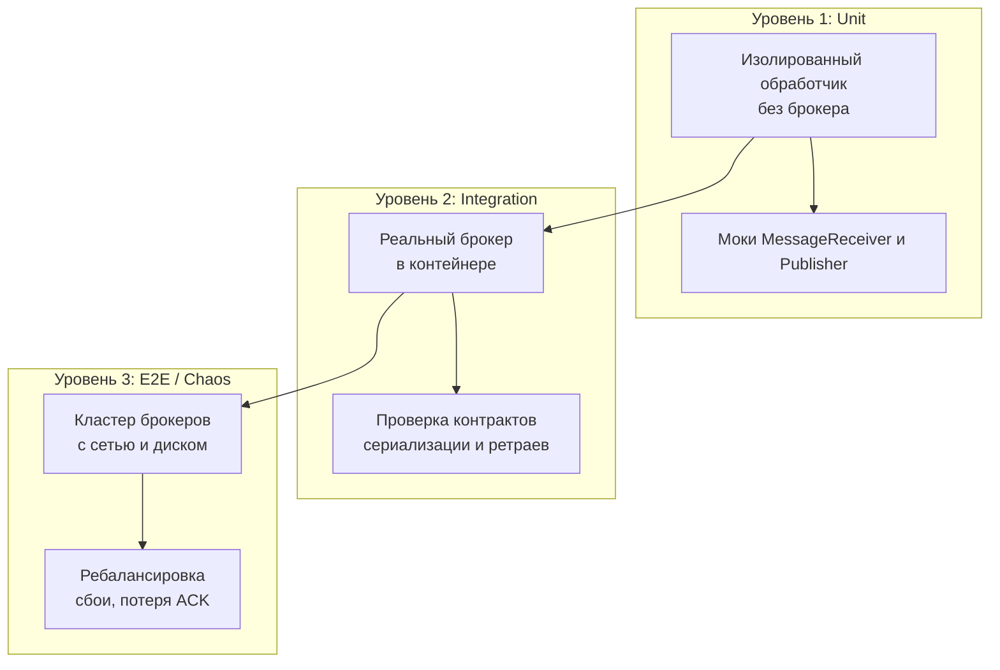

> [!NOTE]
> **Связи:** Эта статья продолжает практический блок и опирается на фундаментальные концепции: [[1. Обзор раздела. Асинхронность как основа масштабирования]], [[4. Модели доставки. At most once, at least once, exactly once]], [[9. Retry стратегии и exponential backoff]], [[10. Idempotency в message processing]], [[8. Dead Letter Queue]]. Также задействованы паттерны реализации: [[1. Работа с очередями в Go]], [[2. Консьюмеры и graceful shutdown]], [[4. Idempotent handlers]], [[6. Handling poison messages]].

## Почему тестировать асинхронный код сложно

В синхронном HTTP-обработчике мы дёргаем ручку, получаем ответ и проверяем статус. Тест линеен и предсказуем. Асинхронная обработка сообщений вносит недетерминизм: время, порядок доставки, конкурентность, ретраи, ребалансировки, сбои брокера. Тест, который прошёл сегодня, завтра может упасть из-за таймаута, потому что CI-машина чуть медленнее. Поэтому тестирование очередей и брокеров не сводится к отправке и проверке — это комплексная дисциплина, охватывающая изоляцию бизнес-логики, проверку конкурентных инвариантов и контроль инфраструктуры.

Главный принцип: **разделяйте логику обработки и транспорт**. Транспорт (подтверждения, реконнекты, управление оффсетами) тестируется отдельно и по возможности интеграционно; бизнес-логика — изолированно и быстро.

## Три уровня тестирования асинхронных систем



1. **Unit** — проверка чистых функций-обработчиков с моками транспорта. Сотни тестов за секунды.
2. **Integration** — реальный брокер в Docker (Testcontainers) или встроенный сервер. Проверка сериализации, ретраев, graceful shutdown.
3. **End-to-end / Chaos** — полный кластер в staging, проверка устойчивости к разделению сети и падению узлов. Обычно вне CI, здесь не рассматриваем.

## Unit-тестирование обработчиков сообщений

Бизнес-логика не должна знать, откуда пришло сообщение и куда уйдёт результат. Определяем интерфейсы:

```go
type OrderService struct {
    repo OrderRepository
}

func (s *OrderService) ProcessPayment(ctx context.Context, msg PaymentMessage) error {
    // бизнес-логика
    if msg.Amount <= 0 {
        return fmt.Errorf("invalid amount")
    }
    return s.repo.UpdateBalance(ctx, msg.UserID, msg.Amount)
}
```

Интерфейс `OrderRepository` легко мокировать. Сама структура не зависит от брокера. В тестах используем табличные тесты:

```go
func TestOrderService_ProcessPayment(t *testing.T) {
    tests := []struct {
        name    string
        msg     PaymentMessage
        repoOut error
        wantErr string
    }{
        {"success", PaymentMessage{UserID: "u1", Amount: 100}, nil, ""},
        {"invalid amount", PaymentMessage{UserID: "u1", Amount: 0}, nil, "invalid amount"},
        {"db error", PaymentMessage{UserID: "u1", Amount: 50}, errors.New("db down"), "db down"},
    }
    for _, tt := range tests {
        t.Run(tt.name, func(t *testing.T) {
            repo := &mockRepo{updateBalanceErr: tt.repoOut}
            svc := &OrderService{repo: repo}
            err := svc.ProcessPayment(context.Background(), tt.msg)
            if tt.wantErr == "" && err != nil {
                t.Errorf("unexpected error: %v", err)
            }
            if tt.wantErr != "" && (err == nil || !strings.Contains(err.Error(), tt.wantErr)) {
                t.Errorf("expected error containing %q, got %v", tt.wantErr, err)
            }
        })
    }
}
```

Это изолирует обработку от транспорта, позволяет проверять краевые случаи, панику и тайм-ауты без реального брокера.

## Тестирование идемпотентности обработчика

Idempotent handler ([[4. Idempotent handlers]]) должен при повторной доставке того же сообщения дать тот же результат, не создав побочных эффектов дважды. Тест должен эмулировать дубликат. Обычно обработчик запоминает обработанные идентификаторы (idempotency key). Пишем тест с конкурентными вызовами:

```go
func TestIdempotentHandler_Duplicate(t *testing.T) {
    repo := &inMemoryRepo{}
    handler := NewIdempotentHandler(repo, time.Minute)

    msg := Message{Key: "evt-123", Body: "data"}
    // Первый вызов
    err := handler.Handle(context.Background(), msg)
    require.NoError(t, err)
    // Повторный вызов с тем же ключом
    err = handler.Handle(context.Background(), msg)
    require.NoError(t, err)

    // Проверяем, что бизнес-действие выполнено один раз
    require.Equal(t, 1, repo.CallCount("evt-123"))
}

func TestIdempotentHandler_Concurrent(t *testing.T) {
    repo := &inMemoryRepo{}
    handler := NewIdempotentHandler(repo, time.Minute)
    msg := Message{Key: "evt-456", Body: "data"}

    var wg sync.WaitGroup
    for i := 0; i < 10; i++ {
        wg.Add(1)
        go func() {
            defer wg.Done()
            _ = handler.Handle(context.Background(), msg)
        }()
    }
    wg.Wait()
    require.Equal(t, 1, repo.CallCount("evt-456"), "действие должно выполниться ровно один раз")
}
```

Этот тест обнаруживает гонки в хранилище ключей идемпотентности, если таковые есть. Для детектирования утечек горутин дополнительно вызывают `goleak.VerifyNone(t)`.

## Тестирование ретраев и exponential backoff

При ошибках транспорт должен повторить обработку согласно стратегии ([[9. Retry стратегии и exponential backoff]]), а после исчерпания попыток отправить сообщение в Dead Letter Queue ([[8. Dead Letter Queue]]). Для unit-теста мокируем брокер так, чтобы он возвращал ошибки заданное число раз, после чего успех.

```go
type mockBroker struct {
    mu       sync.Mutex
    attempts int
    failFor  int
}

func (m *mockBroker) Publish(ctx context.Context, msg Message) error {
    m.mu.Lock()
    defer m.mu.Unlock()
    m.attempts++
    if m.attempts <= m.failFor {
        return errors.New("transient error")
    }
    return nil
}

func TestRetryMechanism(t *testing.T) {
    broker := &mockBroker{failFor: 2}
    dlq := &mockDLQ{}
    publisher := NewRetryPublisher(broker, dlq, RetryConfig{MaxRetries: 3, Backoff: 10 * time.Millisecond})

    err := publisher.Publish(context.Background(), Message{Key: "test"})
    require.NoError(t, err)                        // в итоге успешно
    require.Equal(t, 3, broker.attempts)           // 2 фейла + 1 успех
    require.Empty(t, dlq.Messages)                 // DLQ не затронута
}

func TestRetryExhausted(t *testing.T) {
    broker := &mockBroker{failFor: 10}
    dlq := &mockDLQ{}
    publisher := NewRetryPublisher(broker, dlq, RetryConfig{MaxRetries: 3, Backoff: 10 * time.Millisecond})

    err := publisher.Publish(context.Background(), Message{Key: "test"})
    require.Error(t, err)                          // попытки исчерпаны
    require.Equal(t, 4, broker.attempts)           // 4 попытки (начальная + 3 ретрая)
    require.Len(t, dlq.Messages, 1)                // одно сообщение в DLQ
}
```

> [!warning] Ловушка / Gotcha
> Не используйте `time.Sleep` в циклах ожидания. Применяйте `assert.Eventually` из testify с малым интервалом опроса, чтобы тест не был хрупким к задержкам CI.

## Интеграционное тестирование с реальным брокером

Unit-тестов недостаточно, когда нужно проверить сериализацию, партиционирование, работу Consumer Group, graceful shutdown или exactly-once гарантии. Здесь вступает в игру **Testcontainers for Go** — библиотека, запускающая Docker-контейнеры прямо из тестов.

### Подготовка контейнера Kafka

```go
import (
    "context"
    "testing"
    "time"

    "github.com/testcontainers/testcontainers-go"
    tckafka "github.com/testcontainers/testcontainers-go/modules/kafka"
    "github.com/twmb/franz-go/pkg/kgo"
)

func TestKafkaProduceConsume(t *testing.T) {
    ctx := context.Background()
    kafkaContainer, err := tckafka.RunContainer(ctx,
        tckafka.WithClusterID("test-cluster"),
        testcontainers.WithImage("confluentinc/confluent-local:7.5.0"),
    )
    require.NoError(t, err)
    defer kafkaContainer.Terminate(ctx)

    brokers, err := kafkaContainer.Brokers(ctx)
    require.NoError(t, err)
    require.NotEmpty(t, brokers)

    // Создаём топик
    adminCl := kgo.NewClient(kgo.SeedBrokers(brokers...))
    _, err = adminCl.CreateTopics(ctx, &kgo.CreateTopicsRequest{
        Topics: []kgo.CreateTopicsRequestTopic{{
            Topic:             "test-topic",
            NumPartitions:     1,
            ReplicationFactor: 1,
        }},
    })
    require.NoError(t, err)

    // Продюсер
    produceCl := kgo.NewClient(kgo.SeedBrokers(brokers...), kgo.DefaultProduceTopic("test-topic"))
    produceCl.ProduceSync(ctx, &kgo.Record{Value: []byte("hello")})
    produceCl.Close()

    // Консьюмер
    consumeCl := kgo.NewClient(kgo.SeedBrokers(brokers...), kgo.ConsumeTopics("test-topic"))
    ctx, cancel := context.WithTimeout(ctx, 10*time.Second)
    defer cancel()

    var received []string
    for {
        fetches := consumeCl.PollFetches(ctx)
        if fetches.IsClientClosed() || ctx.Err() != nil {
            break
        }
        fetches.EachRecord(func(r *kgo.Record) {
            received = append(received, string(r.Value))
        })
    }
    require.Equal(t, []string{"hello"}, received)
}
```

Этот тест проверяет сквозной путь: продюсер → брокер в контейнере → консьюмер. Testcontainers поднимает свежий экземпляр Kafka для каждого теста, гарантируя изоляцию. Аналогично тестируются RabbitMQ (через `testcontainers/modules/rabbitmq`) и NATS (можно встроенный сервер).

### Проверка graceful shutdown

Комбинируем контейнер с отправкой сигнала. Консьюмер запускается в горутине, получает несколько сообщений, затем контекст отменяется (эмулируя SIGTERM). Проверяем, что все извлечённые до отмены сообщения обработаны, а коммит offset-а в Kafka произведён.

```go
func TestGracefulShutdown(t *testing.T) {
    ctx, cancel := context.WithCancel(context.Background())
    client := kgo.NewClient(kgo.SeedBrokers(brokers...), kgo.ConsumeTopics("test-topic"))
    processed := make(chan string, 10)
    go func() {
        for {
            fetches := client.PollFetches(ctx)
            if fetches.IsClientClosed() {
                break
            }
            fetches.EachRecord(func(r *kgo.Record) {
                processed <- string(r.Value)
            })
        }
        close(processed)
    }()
    // Ждём обработки хотя бы одного сообщения, потом отменяем
    <-processed
    cancel()
    var all []string
    for v := range processed {
        all = append(all, v)
    }
    // Проверяем, что оставшиеся сообщения обработаны, а новые не поступают
    // ... более точные ассерты с количеством отправленных
}
```

## Тестирование конкурентной обработки

Множественные горутины-обработчики могут нарушить порядок сообщений одной партиции, если не соблюдается последовательная обработка. Тест должен отправить сообщения с одним ключом, обработать их в нескольких горутинах и проверить, что порядок сохранён (или наоборот, что агрегация всё равно корректна при нарушении порядка).

Для этого используют каналы и `atomic` счётчики. Такой тест может обнаружить состояние гонки, если общий кэш обновляется без синхронизации. Гонка детектируется флагом `-race`.

## Тестирование с фаззингом

Начиная с Go 1.18 доступен нативный фаззер. Для обработчика сообщений это мощный инструмент: подаём на вход случайные байтовые последовательности и проверяем, что обработчик не паникует и не зависает.

```go
func FuzzOrderHandler(f *testing.F) {
    f.Fuzz(func(t *testing.T, userID string, amount float64) {
        msg := PaymentMessage{UserID: userID, Amount: amount}
        // Вызываем обработчик и убеждаемся, что нет паники
        handler.ProcessPayment(context.Background(), msg)
    })
}
```

Фаззер быстро находит краевые случаи: пустые строки, NaN, отрицательные значения, огромные размеры. Это особенно ценно при десериализации JSON/Avro, где может быть неожиданная структура.

## Инструменты и лучшие практики

- **testify** — `assert`, `require`, `mock`, `Eventually`.
- **testcontainers-go** — управление Docker-контейнерами из Go-тестов, поддержка Kafka, RabbitMQ, PostgreSQL.
- **mockgen** (gomock) — кодогенерация моков для интерфейсов.
- **goleak** — обнаружение утечек горутин после тестов.
- **go test -race** — обязателен в CI для любого кода с горутинами и каналами.

Рекомендуемая структура тестов:
- Быстрые unit-тесты обработчиков и моков (миллисекунды).
- Интеграционные тесты с контейнерами, помеченные build-тегом `integration`, чтобы не замедлять обычный `go test`.
- E2E сценарии на staging.

> [!tip] Собеседование
> **Вопрос:** Как протестировать, что ваш сервис обеспечивает exactly-once обработку в Kafka?
> **Ответ:** Надо проверить три составляющие:
> 1. Идемпотентность обработчика — unit-тест с дубликатами сообщений.
> 2. Транзакционная запись (продюсер) и read_committed (консьюмер) — интеграционный тест с Testcontainers, где моделируем потерю ACK и повтор отправки, затем проверяем отсутствие дубликатов в выходном топике.
> 3. Атомарность коммита offset-а и результата обработки — интеграционный тест с принудительным падением консьюмера между Poll и коммитом и проверкой, что после перезапуска дубликатов не возникло.

## Заключение и следующие шаги

Тестирование асинхронных систем требует дисциплины: чистые интерфейсы, быстрые unit-тесты без брокера, полные интеграционные сценарии с Docker, и автоматическая проверка на гонки. Только так можно спать спокойно, зная, что ваш консьюмер выдержит ребалансировку, а ретрай не породит двойное списание.

Следующая статья в подразделе — [[8. Observability очередей]], где мы перейдём от тестов к тому, как видеть, что происходит внутри системы в реальном времени: метрики лага, трейсинг и алертинг.