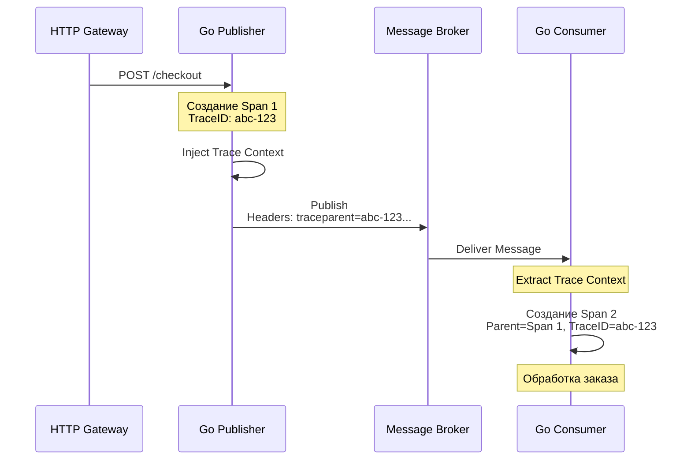

В синхронной архитектуре (например, микросервисы, общающиеся по HTTP/gRPC) отследить путь запроса относительно просто: запрос пришел, мы вызвали другой сервис, дождались ответа, вернули результат. Если произошла ошибка, мы видим всю цепочку в логах. 

В асинхронных Event-Driven системах (EDA) эта связь разрывается. Отправитель (Publisher) кладет сообщение в брокер и забывает о нем (Fire-and-forget). Получатель (Consumer) может забрать это сообщение через миллисекунду, а может через неделю (если оно лежало в DLQ). 

Если пользователь нажал кнопку на фронтенде, и через 5 минут где-то в недрах бэкенда упала горутина при обработке фоновой задачи, как понять, **какой именно** HTTP-запрос привел к этой ошибке? Для этого нам нужна **Observability (Наблюдаемость)**, которая в контексте очередей строится на трех столпах: Distributed Tracing, Metrics и Contextual Logging.

## 1. Распределенная трассировка (Distributed Tracing)

Единственный способ связать HTTP-запрос и фоновую обработку сообщения — это пробросить **Trace Context** через брокер сообщений. Де-факто стандартом сегодня является **OpenTelemetry (OTel)** и спецификация W3C Trace Context.

### Механика работы (Propagation)

Когда сообщение отправляется в брокер, мы не меняем его тело (Payload). Метаданные трассировки (TraceID, SpanID) всегда передаются в **Заголовках (Headers)** протокола. В RabbitMQ это `amqp.Table` (Headers Exchange), в Kafka — `Headers` внутри `Record`.



> [!info] Под капотом: W3C Trace Context
> В заголовки брокера внедряется ключ `traceparent`. Его значение выглядит примерно так:
> `00-4bf92f3577b34da6a3ce929d0e0e4736-00f067aa0ba902b7-01`
> Здесь зашифрованы: версия спецификации (00), TraceID (глобальный идентификатор бизнес-процесса), SpanID (идентификатор текущего шага) и флаги (например, сэмплируется ли этот трейс). Размер этого заголовка всего 55 байт, что не создает серьезного оверхеда на сеть или память брокера (Erlang VM).

### Идиоматичный Go: Inject и Extract

Библиотека `amqp091-go` не умеет работать с OpenTelemetry "из коробки" (в отличие от стандартного `net/http`). Нам нужно написать адаптер (Propagator), который научит OTel читать и писать в заголовки RabbitMQ.

```go
package tracing

import (
	amqp "[github.com/rabbitmq/amqp091-go](https://github.com/rabbitmq/amqp091-go)"
	"go.opentelemetry.io/otel/propagation"
)

// AMQPHeadersCarrier адаптирует amqp.Table к интерфейсу TextMapCarrier
type AMQPHeadersCarrier amqp.Table

func (c AMQPHeadersCarrier) Get(key string) string {
	val, ok := c[key]
	if !ok {
		return ""
	}
	strVal, ok := val.(string)
	if !ok {
		return ""
	}
	return strVal
}

func (c AMQPHeadersCarrier) Set(key string, value string) {
	c[key] = value
}

func (c AMQPHeadersCarrier) Keys() []string {
	keys := make([]string, 0, len(c))
	for k := range c {
		keys = append(keys, k)
	}
	return keys
}
```

**Сторона отправителя (Publisher):**
```go
// Предполагаем, что ctx уже содержит TraceID от HTTP-запроса
func PublishEvent(ctx context.Context, ch *amqp.Channel, body []byte) error {
	ctx, span := tracer.Start(ctx, "publish_event")
	defer span.End()

	headers := make(amqp.Table)
	// Внедряем контекст (traceparent) в amqp.Table
	propagator := otel.GetTextMapPropagator()
	propagator.Inject(ctx, AMQPHeadersCarrier(headers))

	return ch.PublishWithContext(ctx, "exchange", "routing", false, false, amqp.Publishing{
		Headers: headers,
		Body:    body,
	})
}
```

**Сторона получателя (Consumer):**
```go
func ConsumeEvent(d amqp.Delivery) {
	// Извлекаем контекст трассировки из заголовков сообщения
	propagator := otel.GetTextMapPropagator()
	ctx := propagator.Extract(context.Background(), AMQPHeadersCarrier(d.Headers))

	// Начинаем новый Span, который автоматически привяжется к родительскому (Publisher)
	ctx, span := tracer.Start(ctx, "process_event")
	defer span.End()

	// Бизнес-логика с использованием нового ctx...
	_ = doWork(ctx, d.Body)
	
	d.Ack(false)
}
```

> [!warning] Ловушка / Gotcha: Жизненный цикл `context.Context`
> Никогда не передавайте `context.Context` из HTTP-обработчика напрямую в фоновую горутину, которая делает Publish, если горутина переживет HTTP-ответ. Когда HTTP-запрос завершается, HTTP-сервер вызывает `cancel()` для своего контекста. Ваша фоновая горутина мгновенно упадет с `context canceled`.
> 
> **Решение (Go 1.21+):** Используйте `context.WithoutCancel(ctx)`. Это отвяжет контекст от отмены родителя, но **сохранит внутри все значения**, включая `TraceID` от OpenTelemetry.

## 2. Метрики (Prometheus) уровня приложения

Брокер сообщений имеет свои метрики (и мы разберем их в следующей статье). Но ваш Go-сервис **обязан** экспортировать собственные метрики для понимания здоровья консьюмеров и паблишеров.

Что обязательно нужно покрыть метриками (RED-паттерн для очередей):

1. **Rate (Частота):** - `events_published_total{topic="orders"}` (Counter)
   - `events_consumed_total{topic="orders", status="ack|nack"}` (Counter)
2. **Errors (Ошибки):**
   - Количество `Nack` с разбивкой по типам ошибок (бизнес-ошибка, ошибка сериализации, таймаут БД).
3. **Duration (Длительность):**
   - `event_processing_duration_seconds` (Histogram) — сколько времени Go-воркер тратит на выполнение бизнес-логики.

> [!tip] Собеседование
> **Вопрос:** Мы добавили в метрику `events_consumed_total` лейбл `user_id`, чтобы видеть, чьи заказы обрабатываются дольше. Через час Prometheus лег с OOM. Почему?
> **Ответ:** Проблема **High Cardinality (высокой кардинальности)**. В Prometheus каждая уникальная комбинация лейблов создает новый временной ряд (Time Series) в памяти. Уникальных `user_id` могут быть миллионы, что приведет к взрыву памяти. Лейблы должны иметь конечный, малый набор значений (например, имя очереди, статус `success/error`, код ошибки). Идентификаторы пользователей нужно писать в *логи*, а не в метрики.

## 3. Контекстное логирование (Structured Logging)

Трассировка и метрики показывают *где* и *как часто* происходит проблема. Логи объясняют *почему*.
В Go 1.21 появился стандартный пакет структурированного логирования `log/slog`.

Идиоматичный подход в микросервисах — писать логи в формате JSON и **всегда** прикреплять к ним `TraceID` и `MessageID`. Если ваша система сбора логов (например, ELK, Loki или Datadog) видит поле `trace_id` в JSON-логе, она автоматически свяжет этот лог с таймлайном трейса из Jaeger/OpenTelemetry.

```go
package logger

import (
	"context"
	"log/slog"
	
	"go.opentelemetry.io/otel/trace"
)

// LogWithContext достает TraceID из контекста и добавляет его к логу
func LogWithContext(ctx context.Context, logger *slog.Logger, level slog.Level, msg string, attrs ...slog.Attr) {
	spanCtx := trace.SpanContextFromContext(ctx)
	if spanCtx.HasTraceID() {
		attrs = append(attrs, slog.String("trace_id", spanCtx.TraceID().String()))
		attrs = append(attrs, slog.String("span_id", spanCtx.SpanID().String()))
	}
	
	logger.LogAttrs(ctx, level, msg, attrs...)
}

// Пример использования в Consumer:
// LogWithContext(ctx, myLogger, slog.LevelError, "failed to process DB transaction", slog.String("error", err.Error()))
```

## Итог

1. **Трассировка — основа асинхронного мира.** Без OTel и проброса `traceparent` через заголовки брокера ваша EDA-система превратится в неразрешимый клубок при первом же инциденте.
2. **Propagators:** Используйте встроенные механизмы OTel для извлечения и внедрения заголовков в `amqp.Table` или заголовки Kafka.
3. **Контекст в Go:** Помните про `context.WithoutCancel` при переходе из синхронного HTTP-мира в асинхронную отправку сообщений, чтобы не потерять TraceID.
4. **Метрики:** Измеряйте скорость обработки (Duration) и статус подтверждений (Ack/Nack rate) строго без высококардинальных лейблов.

Мы настроили "взгляд изнутри" — наше Go-приложение теперь прозрачно сообщает о своей работе. Но как дела обстоят "снаружи"? Что делать, если наши воркеры работают быстро, но в очереди все равно скапливаются миллионы сообщений? Об инфраструктурном мониторинге и главной метрике асинхронных систем мы поговорим в следующей статье: [[9. Мониторинг lag и throughput]].