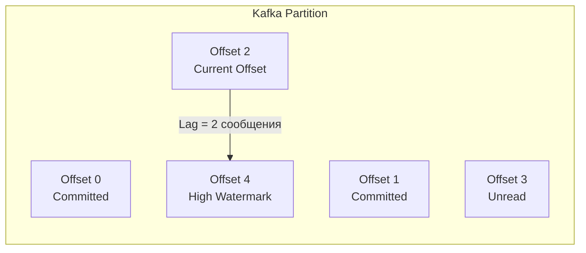

## Лететь вслепую — плохая идея

В предыдущих статьях этого раздела мы спроектировали надежные консьюмеры, научились обрабатывать ошибки, переживать падения сети и изолировать ядовитые сообщения. Но в распределенных системах есть одно золотое правило: **система, которую вы не мониторите, уже сломалась, просто вы об этом еще не знаете**.

Асинхронная архитектура коварна тем, что она скрывает сбои. Если в синхронном HTTP-монолите база данных начинает тормозить, пользователи сразу видят ошибки `504 Gateway Timeout`. В системе с брокерами сообщений база данных может лежать полчаса, пользователи будут получать успешные ответы `HTTP 202 Accepted` от API, а инфраструктура будет молча копить гигабайты долга в виде необработанных событий.

Главные пульсометры любой асинхронной системы — это **Throughput (Пропускная способность)** и **Lag (Отставание / Размер очереди)**. В этой статье мы разберем их физический смысл, научимся снимать метрики в Go и настраивать правильные алерты.

## Анатомия Lag (Отставания)

Lag показывает, сколько работы накопилось в системе. Если проводить аналогию, Throughput — это скорость, с которой вы черпаете воду из лодки, а Lag — это уровень воды в лодке.

Как именно считается Lag, сильно зависит от архитектуры брокера.

### Smart Broker (RabbitMQ)
В RabbitMQ метрика Lag встроена в ядро брокера, так как он сам управляет очередями. У каждой очереди есть два ключевых параметра:
* `messages_ready`: сообщения, которые лежат на диске/в RAM и ждут, когда свободный консьюмер их заберет. Это и есть чистый **Lag**.
* `messages_unacknowledged`: сообщения, которые уже переданы вашему Go-консьюмеру, но он еще не прислал `Ack`.

> [!info] Под капотом
> Высокий `messages_unacknowledged` при низком `messages_ready` обычно означает, что ваш Go-сервис (воркер-пул из статьи [[3. Параллелизм обработки сообщений]]) застрял. Все горутины заняты, они держат сообщения в памяти, но не могут их обработать (например, зависли на блокировке БД или исчерпали пул TCP-соединений).

### Dumb Broker (Kafka)
Kafka не знает концепции "Очередь". У нее есть Append-Only лог (партиция) и указатель (Offset). 
В Kafka **Consumer Lag** — это математическая разница:
`Lag = High Watermark (смещение последнего записанного Продюсером сообщения) - Current Offset (смещение последнего закомиченного Консьюмером сообщения)`.



### Главная ловушка: Message Count vs Time Lag

> [!warning] Ловушка / Gotcha
> Типичная ошибка джуниоров: настраивать алерты на количество сообщений (например, "Alert if Lag > 1000").
> 
> Почему это плохо? Представьте, что у вас есть два топика.
> * **Топик A (Push-уведомления):** Обрабатывается со скоростью 5000 сообщений в секунду. Lag в 1000 сообщений будет разобран за 0.2 секунды. Это вообще не проблема.
> * **Топик B (Генерация PDF-отчетов):** Один отчет генерируется 10 секунд. Lag в 1000 сообщений означает, что пользователь, нажавший кнопку сейчас, получит отчет через **почти 3 часа**. 
> 
> Настоящая метрика, за которой нужно следить — это **Time Lag (Latency очереди)**. Это время между `timestamp` создания сообщения продюсером и `timestamp` начала его обработки консьюмером. 

## Throughput (Пропускная способность)

Throughput измеряется в двух измерениях:
1. **RPS / MPS (Messages Per Second):** Важно для понимания нагрузки на CPU (каждое сообщение — это затраты на десериализацию JSON/Protobuf, аллокации в куче Go).
2. **Bytes Per Second (Bandwidth):** Важно для сети и дисковой подсистемы. Если вы гоняете картинки в base64 через Kafka, вы упретесь в пропускную способность сетевой карты (NIC) задолго до того, как загрузите CPU.

В здоровой системе должен соблюдаться баланс:
**$Average Consumer Throughput \ge Average Producer Throughput$**

Если Продюсеры стабильно пишут быстрее, чем Консьюмеры читают, система математически обречена на переполнение дисков.

## Практика в Go: Prometheus Instrumentation

Идиоматичный подход к мониторингу в Go — использование библиотеки `prometheus/client_golang`. Вместо того чтобы размазывать метрики по бизнес-логике, мы используем паттерн Middleware / Decorator.

Вот production-ready пример того, как правильно обернуть обработчик сообщений для сбора метрик Throughput и Processing Time.

```go
package consumer

import (
	"context"
	"time"

	"[github.com/prometheus/client_golang/prometheus](https://github.com/prometheus/client_golang/prometheus)"
	"[github.com/prometheus/client_golang/prometheus/promauto](https://github.com/prometheus/client_golang/prometheus/promauto)"
)

var (
	// Считаем Throughput (сообщения в секунду) в разрезе топиков и статусов
	messagesProcessed = promauto.NewCounterVec(prometheus.CounterOpts{
		Name: "queue_messages_processed_total",
		Help: "Total number of processed messages",
	}, []string{"topic", "status"}) // status: success, error_transient, error_fatal

	// Считаем время обработки (помогает выявить тормозящую БД или API)
	processingDuration = promauto.NewHistogramVec(prometheus.HistogramOpts{
		Name:    "queue_message_processing_duration_seconds",
		Help:    "Time spent processing a single message",
		Buckets: prometheus.DefBuckets, // стандартные бакеты от 5ms до 10s
	}, []string{"topic"})
)

type Handler func(ctx context.Context, msg []byte) error

// MetricsMiddleware оборачивает бизнес-логику и собирает метрики
func MetricsMiddleware(topic string, next Handler) Handler {
	return func(ctx context.Context, msg []byte) error {
		start := time.Now()
		
		// Выполняем полезную работу
		err := next(ctx, msg)
		
		// Фиксируем время выполнения (Histogram)
		processingDuration.WithLabelValues(topic).Observe(time.Since(start).Seconds())

		// Определяем статус для Throughput (Counter)
		status := "success"
		if err != nil {
			// В реальности здесь нужно использовать errors.Is для классификации
			status = "error_transient" 
		}
		
		messagesProcessed.WithLabelValues(topic, status).Inc()
		return err
	}
}
```

> [!tip] Собеседование
> **Вопрос:** Мы вывели метрику `messagesProcessed` (Throughput). Вдруг мы видим на графике Grafana, что Throughput упал в 2 раза. При этом ошибок нет (status="success"), и Lag равен нулю. Что сломалось в системе?
> **Ответ:** Скорее всего, ничего не сломалось в Консьюмере. Lag = 0 означает, что Консьюмер съедает всё, что есть в очереди. Падение Throughput при нулевом Lag означает, что **Продюсер стал отправлять меньше сообщений**. Возможно, упал трафик от пользователей, или сломался балансировщик перед API Продюсера. Метрики очередей всегда нужно анализировать в связке "Продюсер -> Очередь -> Консьюмер".

## Alerting: Что должно будить инженера ночью?

Написание алертов — это искусство подавления шума. Бесполезные алерты приводят к выгоранию дежурных (Alert Fatigue).

**Плохие алерты:**
* `RabbitMQ Queue Length > 5000` (Пиковая нагрузка — это нормально. Очереди для того и нужны, чтобы буферизировать пики).
* `Consumer CPU > 80%` (Если CPU утилизируется полезной работой — это отлично, мы не зря платим за железо).

**Хорошие алерты (Production Standard):**
1. **Time Lag (Возраст самого старого сообщения) > SLA.** Например, если бизнес требует обработки платежа за 10 минут, алерт должен срабатывать при Time Lag > 8 минут.
2. **Lag Derivative (Скорость изменения очереди).** Алерт срабатывает, если $Rate(Producer) - Rate(Consumer) > X$ на протяжении последних 15 минут. Это значит, что очередь не просто большая, она неуклонно *растет*, и консьюмеры математически не справляются. Вы упретесь в лимит диска, это вопрос времени.
3. **High Error Rate (Рост процента ошибок).** Внезапный всплеск метрики `messagesProcessed{status="error_transient"}` означает, что отвалилась внешняя зависимость (лежит база данных или сторонний API).

## Mechanical Sympathy: Оптимизация Throughput

Если вы видите, что ваш Go-консьюмер уперся в потолок (Throughput не растет, Lag увеличивается), а CPU и сеть недогружены, проблема почти всегда кроется в I/O операциях внутри обработчика.

Вместо того чтобы обрабатывать сообщения по одному (один `UPDATE` в БД на каждое сообщение из Kafka), используйте паттерны группировки. О том, как радикально повысить пропускную способность за счет амортизации сетевых вызовов, мы говорили в статье [[5. Batch processing сообщений]].

## Итог раздела

Эта статья завершает наш огромный практический блок работы с очередями. Мы прошли путь от фундаментальных концепций до написания production-ready кода на Go. 
* Мы защитили систему от блокировок с помощью Context.
* Настроили gracefully shutdown консьюмеров.
* Сделали обработку идемпотентной.
* Настроили DLQ и мониторинг.

Теперь у вас есть все знания, чтобы строить асинхронные микросервисы, способные выдерживать колоссальные нагрузки. Пора собрать всю картину воедино и зафиксировать ключевые паттерны в финальной статье: [[10. Итоги раздела. Асинхронная архитектура]].