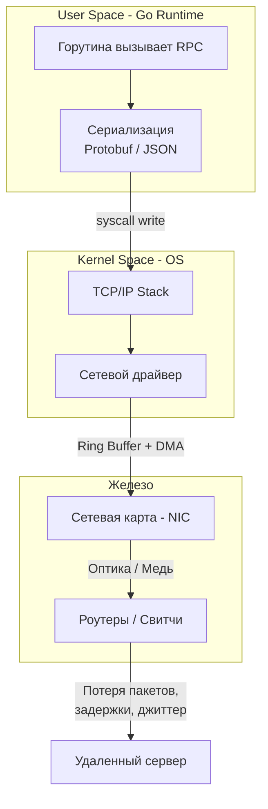

Ты научился выжимать максимум из одного узла. Ты знаешь, как работает сборщик мусора в Go, как оптимизировать аллокации через Escape Analysis, почему `sync.Mutex` переходит в состояние starvation и как правильно спроектировать схему базы данных, чтобы индексы полностью помещались в оперативную память. На одном сервере твой код работает безупречно. 

Но бизнес растет. Нагрузка увеличивается. И в какой-то момент ты упираешься в физический потолок одной машины — предел по CPU, памяти, пропускной способности шины PCIe или сетевой карты. Решение одно: масштабироваться горизонтально. Ты запускаешь свой код на нескольких серверах, которые общаются по сети.

Добро пожаловать в мир распределенных систем. Здесь правила физики меняются, а интуиция, наработанная на локальных приложениях, начинает играть против тебя.

## Иллюзия локального вызова

Самая большая ошибка при переходе к распределенной архитектуре — это попытка относиться к удаленному вызову так же, как к локальному вызову функции. 

В монолите, когда функция `A` вызывает функцию `B`, происходит следующее:
1. Процессор помещает аргументы в регистры или на стек.
2. Инструкция `CALL` изменяет регистр `RIP` (Instruction Pointer), прыгая по адресу функции `B`.
3. Выполнение продолжается. Если происходит сбой (например, panic), операционная система убивает весь процесс. Состояние системы детерминировано: она либо работает целиком, либо не работает вообще.

В распределенной системе вызов другой подсистемы выглядит похоже в коде:

```go
// Локально
res := Calculate(x)

// Распределенно
res, err := client.Calculate(ctx, x)
```

Но под капотом разверзается бездна сложности.

> [!info] Под капотом: Физика сетевого вызова
> Когда горутина вызывает `client.Calculate()`, процессор больше не может просто прыгнуть по адресу в памяти. Вместо этого:
> 1. **Сериализация**: Структура данных Go (которая уже лежит в L1/L2 кэше процессора) должна быть преобразована в поток байт (JSON, Protobuf). Это требует аллокаций в куче и работы CPU.
> 2. **Syscall**: Go-рантайм делает системный вызов `write` в сокет. Происходит дорогое переключение контекста с User Space в Kernel Space.
> 3. **Сетевой стек ОС**: Ядро Linux берет буфер, оборачивает его в TCP-сегмент, затем в IP-пакет, затем в Ethernet-кадр. Рассчитываются контрольные суммы.
> 4. **DMA и NIC**: Ядро дает команду сетевой карте -NIC- через прерывания забрать данные из оперативной памяти с помощью Direct Memory Access -DMA-.
> 5. **Физическая среда**: Электрический импульс или луч света бежит по кабелю через череду коммутаторов, роутеров, BGP-маршрутов до целевого сервера.
> 6. На целевом сервере происходит весь процесс в обратном порядке.



Разница во времени между переходом по указателю и сетевым вызовом — это **миллионы раз**. Если локальный вызов занимает наносекунды, то сетевой в лучшем случае доли миллисекунд, а при вызове в другой дата-центр (region) — десятки и сотни миллисекунд. 

## Три кита сложности распределенных систем

При переходе от монолита к микросервисам или распределенным базам данных, мы теряем три критически важные гарантии, которые давала нам работа в рамках одной машины с общим состоянием (Shared Memory).

### 1. Отсутствие общего состояния (No Shared Memory)
На одной машине все потоки (или горутины) могут видеть одну и ту же оперативную память. Ты можешь использовать `sync.Mutex`, чтобы защитить критическую секцию, или атомики `atomic.AddInt64`. 
В распределенной системе каждый узел имеет свою собственную изолированную память. Чтобы два узла договорились о значении переменной, им нужно обмениваться сообщениями по сети. Отсюда вытекают проблемы консенсуса, которые мы разберем в статьях о Raft и Paxos.

### 2. Частичный отказ (Partial Failure)
В монолите сбой фатален для всего приложения (Fail-Stop). В распределенной системе один узел может сгореть, второй — работать идеально, а сеть между третьим и четвертым — отбрасывать 50% пакетов. 

> [!warning] Ловушка / Gotcha: Византийский генерал
> Самая сложная ситуация: ты отправил запрос на списание денег (RPC вызов), но соединение оборвалось (Таймаут).
> Что произошло на той стороне?
> 1. Запрос не дошел? (Надо повторить запрос)
> 2. Запрос дошел, сервер его обработал, но ответ потерялся по пути назад? (Повтор запроса спишет деньги дважды)
> 3. Сервер получил запрос, начал обработку, но завис из-за долгой сборки мусора -STW-?
> 
> Ты, как клиент, **принципиально не можешь отличить одно состояние от другого**. Это проблема, требующая идемпотентности и паттернов надежности, которые мы будем детально изучать в разделе.

### 3. Отсутствие единого времени (No Global Clock)
В монолите мы можем использовать системные часы для упорядочивания событий: лог A с таймстемпом `T1` произошел раньше лога B с таймстемпом `T2`, потому что `T1 < T2`.
В распределенной системе кварцевые генераторы на разных серверах тикают с разной скоростью. Возникает **Clock Drift** (дрейф часов). Даже с протоколом синхронизации NTP разница между серверами может составлять миллисекунды. Это означает, что полагаться на физическое время для упорядочивания распределенных транзакций смертельно опасно. Придется использовать логические часы (Vector Clocks, Lamport timestamps).

## Почему Go — язык для распределенных систем?

Go создавался инженерами Google (Робом Пайком, Кеном Томпсоном, Робертом Гризмером) именно для того, чтобы писать инфраструктуру масштаба Google. Язык изначально спроектирован с учетом суровых реалий сети.

1. **Модель конкурентности (Goroutines + netpoll)**: 
   Исторически в C++ или Java каждый сетевой запрос часто обрабатывался отдельным тредом ОС (Thread-per-connection). Из-за накладных расходов на треды (аллокация стека 1-8 МБ, тяжелое переключение контекста в ядре) сервер мог держать лишь несколько тысяч подключений (проблема C10K).
   В Go, когда ты вызываешь `conn.Read()`, горутина делает неблокирующий системный вызов. Если данных нет, рантайм Go «паркует» горутину и снимает её с потока ОС (M). Специальный фоновый поток (`netpoller`, использующий `epoll` на Linux) ждет событий от ОС. Когда данные приходят, `netpoller` будит горутину. Это позволяет одному серверу на Go держать сотни тысяч и миллионы активных соединений, потребляя минимум ресурсов.

2. **Встроенный контекст (`context.Context`)**:
   Один из важнейших паттернов распределенных систем — возможность отменить каскад вызовов. Если пользователь закрыл браузер, нам нужно отменить запрос к API Gateway, который должен отменить запрос к сервису авторизации, который отменит запрос к базе данных. Пакет `context` встроен прямо в стандартную библиотеку Go, что приучает разработчиков всегда прокидывать таймауты и сигналы отмены (Cancellation signals) по всему графу вызовов.

3. **Ошибки как значения (Errors are values)**:
   В распределенных системах ошибки — это не исключительные ситуации (Exceptions), а нормальное течение бизнеса. Сеть падает постоянно. То, что `error` в Go — это обычное значение, заставляет разработчика явно обрабатывать каждую точку отказа в сетевом взаимодействии.

> [!tip] Собеседование
> **Вопрос:** Чем отличается надежность TCP от надежности RPC? Разве TCP не гарантирует доставку?
> **Ответ:** TCP гарантирует, что *поток байт* дойдет от сетевого стека ядра ОС одной машины до сетевого стека другой в правильном порядке. Но он **не гарантирует**, что приложение на целевой машине успешно обработает этот запрос и запишет данные на диск. Если ядро ОС подтвердило получение TCP-пакета (отправило ACK), а через миллисекунду сервер обесточило (до того как `epoll` отдал данные в Go), клиент будет уверен, что данные доставлены, хотя по факту они потеряны. Надежность на уровне бизнес-логики должна строиться поверх сети с помощью таймаутов, ретраев и подтверждений уровня приложения (Application-level ACKs).

## Что нас ждет дальше?

Архитектура распределенных систем — это всегда компромисс. Мы меняем простоту монолита и жесткие ACID-гарантии локальных баз данных на высокую доступность, устойчивость к сбоям оборудования и горизонтальное масштабирование. 

В этом разделе мы пройдем путь от фундаментальных проблем физики сети до продвинутых архитектурных паттернов. Мы разберем, как системы договариваются друг с другом, когда кто-то из них постоянно лжет или умирает.

В следующей статье мы подробно остановимся на том, какие именно вещи ломаются, как только код покидает уютный мир `localhost`: [[2. Проблемы распределенных систем]].