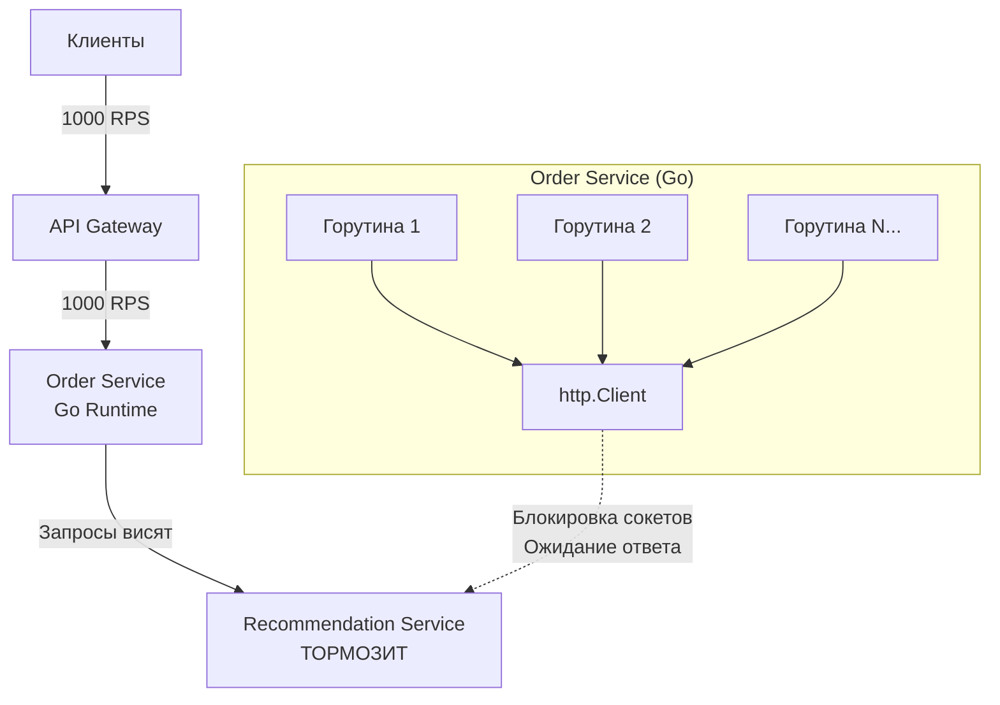

В прошлой статье мы затронули базовые отличия вызова функции в памяти от вызова по сети. Теперь, когда мы приняли тот факт, что сеть — это враждебная среда, давай посмотрим на архитектурные и инженерные проблемы, которые неизбежно возникают, когда мы режем монолит на части.

В распределенной системе компоненты работают на разных физических машинах, управляются разными процессами и общаются через ненадежные каналы связи. Это ломает множество привычных абстракций.

## 1. Отсутствие глобального состояния и транзакционности

В монолите у нас есть роскошь в виде одной реляционной базы данных. Если нужно списать деньги с баланса пользователя и создать запись о заказе, мы просто открываем транзакцию. База данных (благодаря ACID) гарантирует: либо произойдет и то, и другое, либо ничего.

В микросервисной архитектуре база данных заказа лежит в `Order Service` (например, PostgreSQL), а баланс — в `Billing Service` (Redis или другая БД). 

**Проблема:** Классические транзакции (BEGIN ... COMMIT) работают только в рамках одного инстанса БД. Как гарантировать консистентность, если после создания заказа `Billing Service` упал или сеть моргнула?

> [!info] Под капотом: Двухфазный коммит и его смерть
> Исторически эту проблему пытались решать через 2PC (Two-Phase Commit). Координатор транзакций опрашивал все БД: "Вы готовы закоммитить?". Если все отвечали "Да", отправлялась команда "Коммит". 
> На уровне ОС и сети это означает удержание жестких блокировок (locks) на строках в разных базах данных *в ожидании сетевых ответов*. Если координатор падал между фазами, базы данных оставались заблокированными навсегда, убивая пропускную способность всей системы. В современном Go-бэкенде 2PC практически не используется, уступая место асинхронным паттернам вроде `Saga` и `Eventual Consistency`.

## 2. Каскадные отказы и исчерпание ресурсов

В распределенной системе отказ одного минорного компонента может повалить весь кластер, как карточный домик. Это называется каскадным отказом (Cascading Failure).

Представь цепочку: `API Gateway` -> `Order Service` -> `Recommendation Service`. 
Внезапно `Recommendation Service` начинает отвечать не за 50 миллисекунд, а за 30 секунд (например, из-за долгой сборки мусора или неудачного релиза). 

Что происходит на уровне Go-рантайма в `Order Service`?



> [!warning] Ловушка / Gotcha: Дефолтный HTTP клиент
> Самая частая ошибка Junior/Middle Go-разработчиков — использование `http.DefaultClient` (или `http.Get()`) для походов во внешние сервисы.
> 
> ```go
> // ОПАСНО: Если сервис висит, горутина зависнет навсегда
> resp, err := http.Get("http://recommendation/api/v1/items")
> ```
> В исходниках Go у `http.DefaultClient` таймаут равен **нулю** (то есть бесконечность). Горутина, сделавшая такой вызов, засыпает в `netpoll`, ожидая данные из сокета, которые никогда не придут.

**Физика каскадного отказа:**
1. Запросы продолжают поступать (1000 RPS).
2. Под каждый запрос `Order Service` плодит новую горутину (сама горутина весит всего ~2 КБ, это дешево).
3. Но каждая зависшая горутина удерживает:
   - Открытый файловый дескриптор (TCP-сокет).
   - Объекты запроса в куче (heap), которые не может собрать Garbage Collector.
   - Соединения с базой данных (из пула `database/sql`), если они были взяты до HTTP-вызова.
4. Вскоре `Order Service` упирается либо в лимит ОС на открытые файлы (`ulimit -n`, обычно 65535), либо в лимит пула БД, либо в OOM (Out of Memory).
5. `Order Service` падает. Теперь `API Gateway` не может достучаться до заказов и тоже начинает копить горутины. Система мертва.

## 3. Недетерминированность и сложность отладки

Если в локальном коде есть баг, ты можешь написать юнит-тест или запустить `dlv` (Delve debugger), поставить брейкпоинт и пошагово посмотреть состояние регистров и памяти. 

В распределенной системе баг — это часто **эмерджентное свойство**. Он возникает не из-за ошибки в одном куске кода, а из-за специфического тайминга взаимодействия пяти разных сервисов под определенной нагрузкой. 

- Ты не можешь поставить систему на паузу брейкпоинтом: TCP-соединения отвалятся по таймауту, и стейт системы изменится.
- Порядок событий не гарантирован. Сообщение B может прийти раньше сообщения A, хотя было отправлено позже.
- Логи размазаны по десяткам серверов, и без проброса единого `TraceID` (Correlation ID) через HTTP-заголовки и контекст восстановить цепочку событий невозможно.

## 4. Проблема "Глухого телефона" (Отсутствие единого источника истины)

Каждый узел в распределенной системе видит мир только через призму сообщений, которые он получает по сети. 

> [!tip] Собеседование
> **Вопрос:** Что такое `Split-Brain` и почему это опасно?
> **Ответ:** Представьте кластер базы данных из двух Master-узлов (A и B), которые реплицируют данные друг другу. Внезапно свитч между ними сгорает. Узел A жив и принимает запросы клиентов. Узел B жив и тоже принимает запросы. Но они не могут связаться друг с другом. 
> Каждый из них думает, что второй умер, и берет на себя роль единственного лидера. В итоге они параллельно перезаписывают одни и те же данные (например, списывают деньги). Когда сеть восстановится, мы получим конфликт данных, который невозможно разрешить автоматически.

В Go эта проблема часто всплывает при реализации систем кэширования в памяти (in-memory cache) на нескольких инстансах приложения. Если инстансы не синхронизируют инвалидацию кэша (например, через Redis Pub/Sub), разные пользователи, балансируемые на разные поды в Kubernetes, будут видеть абсолютно разные, противоречивые данные.

## Идиоматичный Go против хаоса

Go предоставляет отличные инструменты для купирования этих проблем прямо из коробки:

1. **`context.Context`**: Фундамент устойчивости. Мы обязаны прокидывать контекст с таймаутом во все сетевые и IO-вызовы. Если родительский сервис отменил запрос (пользователь закрыл страницу), `Context` отменит все порожденные запросы вниз по цепочке, освобождая ресурсы.
   ```go
   ctx, cancel := context.WithTimeout(context.Background(), 2*time.Second)
   defer cancel()
   
   req, _ := http.NewRequestWithContext(ctx, http.MethodGet, url, nil)
   resp, err := client.Do(req) // Отвалится ровно через 2 секунды
   ```
2. **`sync.Pool`**: Для снижения нагрузки на GC при огромном количестве сетевых запросов мы переиспользуем буферы памяти для сериализации JSON/Protobuf.
3. **Каналы (Channels) и Select**: Позволяют легко реализовывать паттерны вроде таймаутов, fallback-ответов и лимитирования конкурентности (worker pools), чтобы не положить соседний сервис.

## Итог

Переход к распределенным системам заставляет нас сменить парадигму:
- Мы больше не пишем код так, как будто он выполнится успешно. Мы пишем код вокруг **стратегий обработки отказов** (Retry, Circuit Breaker, Fallback).
- Состояние размазано во времени и пространстве.
- Локальная оптимизация (быстрый парсинг JSON) ничего не значит, если сервис-сосед висит в `TIME_WAIT` и не отдает данные.

Все эти проблемы растут из фундаментальных физических ограничений сети. Чтобы проектировать устойчивую архитектуру, нужно знать врага в лицо. В следующей статье мы погрузимся в самые опасные сетевые иллюзии: [[3. Latency и network fallacies]].