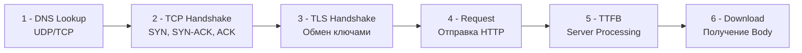

В предыдущих статьях мы выяснили, что распределенная система отбирает у нас надежность вызова и единое состояние. Но корень большинства этих проблем кроется в глубоко укоренившихся заблуждениях разработчиков о том, как работает сеть.

В 1994 году Питер Дойч (L. Peter Deutsch) и другие инженеры Sun Microsystems сформулировали знаменитые **«8 заблуждений о распределенных вычислениях» (The 8 Fallacies of Distributed Computing)**. За прошедшие десятилетия скорости выросли в тысячи раз, но эти заблуждения всё так же губят архитектуры современных микросервисов.

Давай разберем их через призму суровой физики и Go-разработки, уделив особое внимание главному врагу производительности — **задержке (Latency)**.

## 8 заблуждений о сети (The Network Fallacies)

Когда мы пишем код локально, мы подсознательно верим в эти восемь мифов. Архитектор распределенных систем обязан исходить из того, что каждое из этих утверждений — **ложь**.

1. **Сеть надежна.** Свитчи перезагружаются, кабели перебивают экскаваторы, BGP-маршруты схлопываются, а `OOM Killer` убивает соседние поды в Kubernetes, обрывая TCP-соединения.
2. **Задержка равна нулю.** Сетевой вызов всегда занимает время, ограниченное скоростью света и буферами промежуточных маршрутизаторов.
3. **Пропускная способность бесконечна.** Даже 10-гигабитный линк в дата-центре можно мгновенно забить неудачным "Select * from users", если база попытается выгрузить миллион строк в память твоего Go-сервиса.
4. **Сеть безопасна.** Если трафик идет между двумя твоими микросервисами внутри одной VPC в AWS — он всё еще уязвим. Отсюда паттерн `mTLS` (о котором мы поговорим позже).
5. **Топология не меняется.** Поды постоянно поднимаются и умирают, IP-адреса меняются. Хардкодить IP-адреса бессмысленно, нужен Service Discovery.
6. **Есть один администратор.** В микросервисах за `Service A` отвечает одна команда, а за базу данных, в которую он ходит — другая (или вообще AWS/GCP).
7. **Стоимость транспортировки равна нулю.** Сериализация (JSON/Protobuf), десериализация и сисадминские счета за исходящий трафик — это реальные ресурсы CPU и деньги бизнеса.
8. **Сеть однородна.** На пути твоего пакета могут встретиться Linux-серверы, проприетарные роутеры Cisco, балансировщики F5 и кривые прокси провайдеров.

Давай сфокусируемся на заблуждении №2, так как оно оказывает наибольшее влияние на проектирование бэкенда.

---

## Анатомия задержки (Latency)

**Задержка (Latency)** — это время, которое требуется пакету данных, чтобы добраться от источника до пункта назначения. 

> [!info] Под капотом: Физика и скорость света
> Скорость света в вакууме — ~300 000 км/с. 
> Скорость света в оптоволоконном кабеле — ~200 000 км/с из-за показателя преломления стекла. 
> Расстояние от Лондона до Нью-Йорка — около 5600 км. 
> Физический предел времени прохождения сигнала туда-обратно (RTT - Round Trip Time): `(5600 * 2) / 200 = 56 миллисекунд`.
> 
> Это абсолютный физический предел. Никакой язык программирования, никакой фреймворк и никакая оптимизация GC в Go не заставят пакет прилететь быстрее, чем позволяет физика. В реальности из-за маршрутизаторов RTT составит 70-90 мс.

### Из чего состоит сетевой запрос?

Когда ты делаешь простой `http.Get("https://api.github.com/")`, под капотом разворачивается драма, состоящая из множества сетевых обменов до того, как будет передан хотя бы один байт полезной нагрузки:



1. **DNS Lookup:** Поиск IP по домену.
2. **TCP Handshake:** 3-way handshake (1.5 RTT).
3. **TLS Handshake:** Обмен криптографическими ключами (еще 1-2 RTT).
4. **TTFB (Time To First Byte):** Время, пока целевой сервер сходит в свою БД, сформирует ответ и пришлет первый байт.

Если твой пинг (RTT) до сервера 50 мс, то установка нового HTTPS соединения займет `~150-200 мс` ПЕРЕД тем, как ты отправишь запрос.

> [!warning] Ловушка / Gotcha: Истощение портов и Latency
> Если твой Go-сервис при каждом запросе к соседнему микросервису создает новый `http.Client` (или использует криво настроенный `Transport`), он будет оплачивать цену TCP и TLS хэндшейков каждый раз.
> Более того, закрытые соединения переходят в состояние `TIME_WAIT` (по умолчанию на 60 секунд на уровне ядра Linux). При высокой нагрузке у тебя банально закончатся эфемерные порты (ephemeral ports) для исходящих соединений, и `Dial` начнет выдавать ошибку `address already in use`.

### Механическая симпатия: Connection Pooling в Go

Чтобы нивелировать влияние задержек на установку соединения, необходимо переиспользовать уже открытые TCP-сокеты (Keep-Alive). В стандартной библиотеке Go за это отвечает `http.Transport`.

Идиоматичный и production-ready клиент в Go выглядит так:

```go
package main

import (
	"net/http"
	"time"
)

func NewOptimizedClient() *http.Client {
	t := &http.Transport{
		// Максимальное кол-во idle-соединений по всем хостам.
		MaxIdleConns:        100,
		// КРИТИЧНО: По умолчанию тут 2! Если у тебя 100 RPS к одному сервису,
		// 98 соединений будут постоянно закрываться и открываться заново.
		MaxIdleConnsPerHost: 100,
		// Сколько держать соединение открытым без активности.
		IdleConnTimeout:     90 * time.Second,
		// Настройки для управления закрытием соединений со стороны сервера
		ExpectContinueTimeout: 1 * time.Second,
	}

	return &http.Client{
		Transport: t,
		// Таймаут на всю операцию: от DNS до конца скачивания Body!
		Timeout:   5 * time.Second,
	}
}
```

Когда горутина делает запрос через такой клиент, она берет "горячий" сокет из пула. `TCP/TLS Handshake` не происходит. Задержка сокращается до чистого `RTT + TTFB`.

## Проблема длинного хвоста (Tail Latency)

В распределенных системах мы никогда не измеряем среднюю задержку (Average/Mean). 

> [!tip] Собеседование
> **Вопрос:** Ваш сервис мониторинга показывает, что среднее время ответа (Average Latency) составляет 50 мс. Клиенты жалуются на жуткие тормоза. В чем дело?
> **Ответ:** Среднее значение врет. В распределенных системах метрики распределены не по Гауссу (нормальное распределение), а имеют "длинный хвост" (Long Tail). 
> Если 90 запросов выполнились за 10 мс, а 10 запросов зависли на сборке мусора (GC STW) на 410 мс, то среднее будет: `(90*10 + 10*410) / 100 = 50 мс`. 
> По графику всё отлично (50 мс), но **10% ваших пользователей испытывают полусекундные тормоза**.

Именно поэтому в индустрии используют **Перцентили (Percentiles)**:
* **P50 (Медиана):** 50% запросов выполняются быстрее этого времени.
* **P95:** 95% запросов быстрее этого времени.
* **P99:** 99% быстрее этого времени. Показывает "хвост" — то, что происходит во время пиковой нагрузки или пауз GC.

### Почему Tail Latency убивает микросервисы?

Представь, что у твоего API Gateway `P99 latency = 1 секунда`. Казалось бы, только 1 из 100 запросов тормозит. Не страшно?
Страшно. 
Если для рендера одной веб-страницы Frontend делает 50 параллельных фоновых запросов к микросервисам, вероятность того, что страница загрузится быстро (без попадания в 1% медленных запросов) равна:
`0.99 ^ 50 = 0.60`.

Это значит, что **40% загрузок страницы будут тормозить** из-за "хвоста" задержек. Чем больше микросервисов в цепочке, тем больше вероятность того, что хотя бы один из них сейчас собирает мусор, страдает от сетевого джиттера (Jitter) или ждет ответа от диска.

## Как Go справляется с ожиданием? (netpoll)

Когда мы говорим о задержках, важно понимать, что происходит с ресурсами сервера во время этого ожидания. Если горутина ждет ответа от базы данных 500 мс (latency) — не тратит ли она впустую процессорное время?

Нет, и это главная сила Go.

Когда горутина делает вызов `conn.Read()`, а данных в TCP-буфере ОС еще нет, рантайм Go (конкретно `network poller`) перехватывает этот вызов:
1. Горутина переводится в статус `Gwaiting`.
2. Рантайм говорит ОС: "Разбуди меня через `epoll` (Linux) или `kqueue` (macOS), когда в этот файловый дескриптор (сокет) придут байтики".
3. Поток операционной системы (Machine, `M`), на котором крутилась горутина, **не блокируется**. Планировщик (`P`) берет следующую готовую горутину из очереди и продолжает работу.
4. Когда пакет наконец прилетает по сети, ОС генерирует прерывание, `epoll` возвращает событие, `netpoll` переводит горутину в статус `Grunnable`, и она продолжает выполнение.

Именно поэтому Go-приложение может иметь 100 000 зависших (ожидающих ответа) сетевых запросов, потребляя при этом мизерное количество CPU и всего пару сотен мегабайт памяти под стеки горутин.

## Итог

1. **8 заблуждений:** Сеть ненадежна, имеет ограниченную пропускную способность и всегда вносит задержки.
2. **Физика задержки:** Время установки соединения часто превышает время передачи самих данных. Используй пулинг соединений (`MaxIdleConnsPerHost`).
3. **Перцентили:** Никогда не смотри на Average. Настраивай алерты и SLA по `P95` и `P99`.
4. **Рантайм Go:** Асинхронный IO (`epoll`) интегрирован прямо в ядро языка, что позволяет горутинам дешево ждать ответа по сети.

Задержки — это половина беды. Но что делать, когда ответ не просто задерживается, а сеть вообще рвется на середине транзакции? Об этом мы поговорим в следующей статье: [[4. Partial failure]].