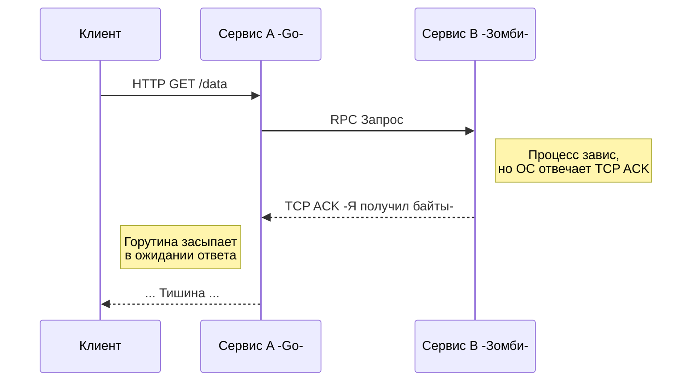

В прошлой статье [[3. Latency и network fallacies]] мы разобрались, почему сеть всегда вносит задержки и почему иллюзия мгновенного ответа смертельно опасна. Но задержка — это полбеды. Настоящий кошмар инженера начинается тогда, когда система ломается, но *не до конца*.

Добро пожаловать в концепцию **Частичного отказа (Partial Failure)** — определяющего свойства распределенных систем, которое навсегда изменит твой подход к написанию кода.

## Бинарный мир монолита vs Серые зоны микросервисов

Когда ты пишешь код внутри одного процесса (монолита), отказы детерминированы. Если функция деления на ноль вызывает панику, или процесс ловит `SIGKILL` от операционной системы — приложение умирает целиком. Это называется **Fail-Stop** поведением. 
Ты точно знаешь: система либо работает, либо лежит.

В распределенной системе, состоящей из 50 микросервисов, ситуация кардинально иная. 
Сервис `A` может работать идеально, база данных сервиса `B` — лежать в руинах, а сервис `C` — работать, но отвечать в 10 раз медленнее из-за деградации жесткого диска. 

> Система больше не находится в состоянии "Жива/Мертва". Она постоянно пребывает в состоянии "Частично деградировала".

## Медленный сервис хуже мертвого

Самая контринтуитивная вещь в распределенных системах: **быстрый отказ — это благо**. 

Если соседний сервис упал, и его ОС корректно закрыла TCP-сокеты (отправила пакет `RST` или `FIN`), твой Go-код мгновенно получит ошибку `connection refused`. Ты можешь сразу вернуть ошибку клиенту или отдать закэшированные данные. Ресурсы освобождаются.

Но что, если сервис "зомбирован"?
* Сервер физически включен, но процесс завис в мертвой блокировке (Deadlock).
* Ядро ОС принимает TCP-пакеты (отправляя `ACK`), помещает их в `Receive Buffer`, но приложение их не читает.
* Жесткий диск (EBS в AWS) деградировал, и системный вызов `fsync` занимает 40 секунд вместо 2 миллисекунд.
* Сборщик мусора (GC) в соседнем Java-сервисе ушел в минутный Stop-The-World.

В этот момент твой сервис отправляет запрос и... ждет.



### Mechanical Sympathy: Как нас обманывает Linux

Если ты не настроишь таймауты явно, то доверишь судьбу своей горутины операционной системе Linux и ее реализации TCP-стека.

Если пакет потеряется в сети, ядро Linux начнет попытки повторной передачи (TCP Retransmission) с экспоненциальным бэк-оффом. За это отвечает параметр ядра `tcp_retries2` (по умолчанию равен 15). 
Знаешь, сколько времени займут 15 повторных попыток отправки TCP-пакета, прежде чем `conn.Read()` в Go вернет ошибку `connection timed out`? **От 13 до 30 МИНУТ**.

Все эти 30 минут твоя горутина будет висеть в памяти. Если на сервис идет нагрузка 1000 RPS, за одну минуту ты накопишь 60 000 заблокированных горутин. Они исчерпают пул соединений к базе данных, забьют память (каждая горутина — это минимум 2 КБ стека плюс объекты, которые она удерживает от сборщика мусора) и в итоге твой сервис упадет по Out Of Memory (OOM). Это и есть классический **Каскадный отказ**, о котором мы говорили в [[2. Проблемы распределенных систем]].

## Анатомия неизвестности: Проблема двух генералов

Частичный отказ порождает фундаментальную проблему неопределенности состояния.

> [!tip] Собеседование
> **Вопрос:** Вы сделали HTTP POST запрос в сервис оплат для списания 100$. Через 5 секунд произошел таймаут, и `http.Client` вернул ошибку. Списались ли деньги?
> **Ответ:** Мы не знаем. Это состояние Шредингера.

Есть три возможных сценария таймаута:
1. Запрос потерялся по пути *туда*. Деньги не списались.
2. Запрос дошел, сервис оплат завис на этапе обработки (до коммита в БД). Деньги не списались.
3. Запрос дошел, сервис оплат закоммитил списание в БД, но ответный HTTP-пакет потерялся по пути *обратно*. Деньги **списались**.

Так как мы не можем отличить сценарий 1 от сценария 3, мы обязаны сделать повторный запрос (Retry). Но слепой повтор в сценарии 3 спишет деньги дважды! 

Отсюда рождается железное правило распределенных систем: **Все мутирующие API (POST/PUT/DELETE) обязаны быть идемпотентными**. Мы должны передавать уникальный `Idempotency-Key` (например, UUID транзакции), по которому принимающая сторона поймет, что это дубль, и просто вернет успешный ответ предыдущей попытки, не выполняя бизнес-логику повторно.

## Как Go защищает нас: `context.Context`

Go был создан в Google для решения именно этих инфраструктурных проблем. Его главное оружие против частичных отказов — пакет `context`.

Контекст — это стандартный механизм для контроля времени жизни дерева вызовов (Cancellation signal propagation).

```go
func FetchData(w http.ResponseWriter, r *http.Request) {
    // 1. Создаем контекст с жестким лимитом в 2 секунды
    ctx, cancel := context.WithTimeout(r.Context(), 2*time.Second)
    defer cancel() // Обязательно освобождаем ресурсы таймера!

    // 2. Прокидываем контекст в HTTP-клиент
    req, err := http.NewRequestWithContext(ctx, http.MethodGet, "http://service-b/api", nil)
    if err != nil {
        // ...
    }

    resp, err := http.DefaultClient.Do(req)
    if err != nil {
        if errors.Is(err, context.DeadlineExceeded) {
            http.Error(w, "Сервис B слишком медленный", http.StatusGatewayTimeout)
            return
        }
        // ... обработка других ошибок
    }
    // ...
}
```

> [!info] Под капотом: Как работает отмена контекста
> Интерфейс `context.Context` содержит метод `Done() <-chan struct{}`. 
> Когда ты вызываешь `context.WithTimeout`, Go-рантайм (под капотом) запускает таймер (`time.AfterFunc`). Если время истекает, вызывается внутренняя функция `cancel()`.
> 
> Эта функция использует мьютекс для защиты состояния, закрывает канал `Done` (через `close(c.done)`) и рекурсивно обходит всех "детей" этого контекста, отменяя и их. 
> Закрытие канала означает, что любая горутина, которая ждет в `select { case <-ctx.Done(): ... }`, мгновенно разблокируется. В случае с HTTP-клиентом, транспортный слой Go ловит этот сигнал и принудительно обрывает (закрывает) нижележащий TCP-сокет, возвращая управление твоей горутине.

> [!warning] Ловушка / Gotcha: Утечка таймеров
> Всегда вызывай `defer cancel()`, даже если операция завершилась успешно до истечения таймаута! 
> Функция `WithTimeout` аллоцирует таймер в куче рантайма. Если не вызвать `cancel()`, этот таймер будет висеть в памяти и потреблять ресурсы (Goroutine / Timer leak) до тех пор, пока таймаут физически не истечет.

## Стратегии защиты (Паттерны)

Осознание неизбежности частичных отказов привело к появлению паттернов отказоустойчивости (Resilience patterns), которые мы будем детально разбирать в разделе "05. Надежность". Короткий анонс:

1. **[[3. Timeout]]**: Жесткие дедлайны на каждый сетевой вызов (как мы видели с `Context`).
2. **[[2. Retry и backoff]]**: Если запрос упал с 503 или Network Error, пробуем еще раз, но с увеличивающейся задержкой (Exponential Backoff), чтобы не добить "приболевший" сервис.
3. **[[1. Circuit Breaker]]**: Если сервис `B` ответил ошибкой 100 раз подряд, нет смысла стучаться туда 101-й раз. Отключаем рубильник и возвращаем ошибку клиентам локально, давая сервису `B` время на восстановление.
4. **Bulkhead (Переборки)**: Ограничиваем количество горутин, которые могут одновременно делать запросы к сервису `B` (через семафор на канале), чтобы зависание одного соседа не сожрало все воркеры в нашем приложении.

## Итог

Частичный отказ — это нормальное состояние распределенной системы. Мы не можем его предотвратить, но можем изолировать. 

Когда ты пишешь код на Go, твой майндсет должен быть параноидальным. Перед каждым вызовом `conn.Read`, `db.QueryContext` или `client.Do` ты должен задавать себе вопросы: 
* Что будет, если эта операция займет 5 минут? 
* Ограничен ли этот вызов контекстом? 
* Достаточно ли идемпотентно целевое API для безопасного ретрая?

Мы поняли, что узлы могут падать и "тормозить" независимо друг от друга. Но как нам понять, в каком порядке происходили события на этих независимых серверах, если мы собираем логи аварии (постмортем)? В монолите мы просто смотрели на время. Почему в распределенных системах так делать нельзя — разберем в следующей статье: [[5. Time и clock drift]].