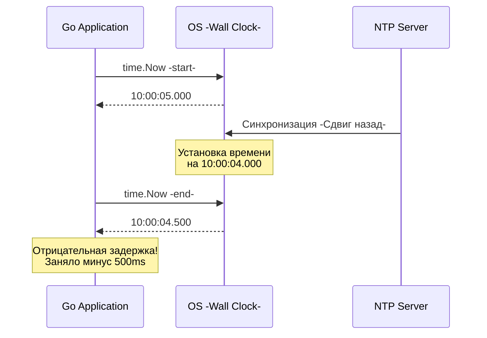

В прошлых статьях мы выяснили, что в распределенной системе сеть рвет соединения, задерживает пакеты и оставляет нас в состоянии полной неопределенности. Но есть еще один фундаментальный компонент монолита, который ломается при переходе к микросервисам. Это **Время**.

Когда ты разбираешь инцидент (post-mortem), первое, что ты делаешь — открываешь логи и пытаешься выстроить цепочку событий. Запрос пришел в `API Gateway` в 12:00:01.000. В 12:00:01.050 `Order Service` создал заказ. В 12:00:01.040 `Billing Service` списал деньги. 

Подожди. `Billing` списал деньги *до* того, как был создан заказ? Это невозможно по бизнес-логике. Но именно это ты увидишь в логах.

Добро пожаловать в проблему дрейфа часов (Clock Drift).

## Физика времени (Mechanical Sympathy)

Как сервер понимает, который сейчас час? 

На материнской плате твоего сервера установлен **кварцевый резонатор (Quartz Oscillator)**. Это буквально кусочек кристалла кварца, который под воздействием электрического тока вибрирует с определенной частотой (обычно 32 768 Гц для часов реального времени — RTC). Операционная система считает эти колебания и переводит их в секунды.

Но физика бессердечна. Частота вибрации кристалла меняется в зависимости от:
1. **Температуры в дата-центре**: Если сервер под нагрузкой разогрелся, кристалл начинает тикать быстрее или медленнее.
2. **Возраста железа**: Со временем структура кристалла деградирует.
3. **Производственных погрешностей**: Два идентичных сервера, сошедших с одного конвейера, будут тикать с разной скоростью.

Это явление называется **Clock Drift (Дрейф часов)**. Обычный серверный инстанс в облаке (AWS/GCP) уплывает от реального времени на **миллисекунды или даже секунды в день**.

## Иллюзия синхронизации: NTP

Чтобы сервера не разбегались во времени окончательно, используется протокол **NTP (Network Time Protocol)**. Демон `ntpd` или `chronyd` на сервере периодически опрашивает эталонные сервера точного времени (Stratum 0/1, подключенные к атомным часам или GPS-приемникам).

Но вспомни предыдущую статью [[3. Latency и network fallacies]]. Сеть вносит недетерминированные задержки! 

Когда сервер отправляет запрос к NTP-серверу: "Который час?", пакет летит 20 мс туда и 50 мс обратно из-за перегруженного свитча. Сервер получает ответ: "Сейчас 12:00:00", но это время было актуально *несколько миллисекунд назад*. NTP использует хитрые алгоритмы для компенсации RTT, но абсолютной точности добиться невозможно. Разница между двумя серверами в одном дата-центре с настроенным NTP может составлять от 1 до 15 миллисекунд. Для современного процессора 15 миллисекунд — это миллионы выполненных инструкций.

### Сдвиги времени (Time Steps)

Самое страшное происходит, когда NTP-демон понимает, что локальные часы сервера ушли слишком далеко вперед. Что он делает? Он **переводит время назад**.



> [!warning] Ловушка / Gotcha: Измерение длительности
> Если ты пишешь код для бенчмарка или таймаута:
> ```go
> start := time.Now()
> DoWork()
> elapsed := time.Now().Sub(start)
> ```
> До версии Go 1.9 переменная `elapsed` могла оказаться **отрицательной**, если во время выполнения `DoWork()` NTP-клиент перевел системные часы назад. Это приводило к паникам, зависаниям таймеров и необъяснимым багам на продакшене (знаменитый инцидент с падением Cloudflare в 2017 году из-за високосной секунды — Leap Second).

## Как Go решил эту проблему "под капотом"

Начиная с Go 1.9, команда разработчиков языка элегантно решила проблему сдвигов времени. В Go структура `time.Time` содержит не одно значение времени, а сразу два!

Операционные системы предоставляют два разных API для работы со временем:
1. **Wall Clock (Настенные часы):** Показывают время суток (например, `gettimeofday` в Linux). Они синхронизируются через NTP и могут прыгать вперед и назад.
2. **Monotonic Clock (Монотонные часы):** Измеряют время, прошедшее с момента старта ОС или конкретного процесса (например, `clock_gettime(CLOCK_MONOTONIC)`). Они не привязаны к часовым поясам и **никогда не идут назад**. Они просто считают такты железа.

> [!info] Под капотом: Структура `time.Time`
> В исходниках Go (`src/time/time.go`) структура времени выглядит примерно так:
> ```go
> type Time struct {
>     wall uint64 // Содержит время Wall Clock и флаги
>     ext  int64  // Содержит показания Monotonic Clock
>     loc *Location
> }
> ```
> Когда ты вызываешь `time.Now()`, Go делает системные вызовы и заполняет **оба** поля.
> 
> Когда ты вызываешь `time.Since(start)` или `start.Sub(end)`, Go-рантайм проверяет: если у обеих переменных есть показания монотонных часов, он использует **именно их** для вычисления разницы. 
> Даже если Wall Clock перевели на год назад, `time.Since()` вернет правильную положительную длительность, потому что опирается на монотонный счетчик `ext`.

## Архитектурные катастрофы из-за времени

### 1. Last-Write-Wins (LWW)
Самая частая ошибка при проектировании баз данных (особенно NoSQL типа Cassandra) — это использование timestamp для разрешения конфликтов.

Допустим, Клиент 1 отправляет запрос на изменение имени пользователя на `Сервер А`. Тот ставит timestamp `12:00:00.005` и пишет в БД.
Через миллисекунду Клиент 2 меняет имя на `Сервер B`. Тот ставит timestamp `12:00:00.002` (потому что его часы отстают!) и тоже пишет в БД.
Система сравнивает метки и решает: "Событие на Сервере А было позже, значит оставляем его данные". В итоге **более позднее событие перезаписывается более ранним**. Бизнес теряет данные.

### 2. Распределенные блокировки
Ты используешь Redis для создания Distributed Lock на 10 секунд.
1. `Сервер А` берет лок. Он думает, что у него есть 10 секунд на работу с БД.
2. Сразу после этого NTP переводит часы на `Сервере А` на 5 секунд вперед.
3. `Сервер А` считает, что прошло 5 секунд, и он еще в безопасности.
4. Но Redis считает, что лок истек, и отдает его `Серверу B`.
5. Теперь два сервера одновременно пишут в БД, нарушая гарантии эксклюзивного доступа (подобную проблему мы разберем в статье [[7. Distributed locks]]).

> [!tip] Собеседование
> **Вопрос:** Как упорядочить события в распределенной системе, если нельзя доверять физическим часам?
> **Ответ:** Использовать **Логические часы (Logical Clocks)**. Нам не нужно знать точное физическое время события. Нам нужно знать причинно-следственную связь: "Событие A произошло ДО события B". Для этого используют счетчики: часы Лэмпорта (Lamport timestamps) или Векторные часы (Vector Clocks). О них мы будем говорить в разделе про базы данных (статья [[5. Vector clocks]]).

## Исключение из правил: Google TrueTime

Существует только одна распределенная система, которая может полагаться на физическое время для упорядочивания транзакций — это Google Spanner. 
Инженеры Google поняли, что синхронизация по сети не работает. Поэтому они оснастили **каждую стойку** в своих дата-центрах аппаратными атомными часами и GPS-антеннами. 

Они создали TrueTime API, который вместо одного значения времени `time.Now()` возвращает интервал `[earliest, latest]`, гарантируя, что истинное время находится внутри этого физического окна (которое составляет мизерные 1-7 миллисекунд). Если Spanner нужно убедиться, что транзакция A прошла до транзакции B, он просто ждет несколько миллисекунд (Commit Wait), пока интервалы перестанут пересекаться. Но это оборудование стоит миллионы долларов. Мы, простые смертные, пишем код с учетом того, что часы нам врут.

## Итог

1. **Время относительно:** На каждом сервере оно течет со своей скоростью.
2. **NTP ненадежен:** Сетевые задержки делают идеальную синхронизацию невозможной. Часы могут прыгать назад.
3. **Сила Go:** `time.Time` под капотом использует Monotonic Clocks, поэтому `time.Since()` всегда безопасен и точен, даже при переводах времени ОС.
4. **Золотое правило:** Никогда не используй `time.Now()` для упорядочивания событий (Event Ordering) или разрешения конфликтов между разными серверами в распределенной системе.

Мы разобрали фундаментальные проблемы физики сетей и времени. Мы поняли, что всё ломается, задерживается и врет. Пришло время собрать всё это воедино и познакомиться с главным законом распределенных систем, который заставляет нас выбирать между доступностью сервиса и целостностью данных. 

Переходим к легендарной теореме: [[6. Consistency vs availability]].