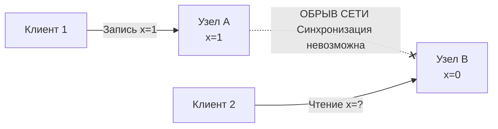

В предыдущих статьях мы планомерно разрушали иллюзии надежности. Мы узнали, что сеть рвет пакеты ([[3. Latency и network fallacies]]), узлы зависают в состоянии полусмерти ([[4. Partial failure]]), а полагаться на системные часы для упорядочивания событий — это путь к потере данных ([[5. Time и clock drift]]). 

Теперь, когда мы осознали, что хаос неизбежен, нам нужно научиться принимать инженерные решения. В распределенных системах мы не можем спасти всё. Когда происходит авария, нам придется выбирать, чем пожертвовать. 

Этот фундаментальный выбор сводится к противостоянию двух концепций: **Consistency (Согласованность)** против **Availability (Доступность)**.

## Анатомия выбора

Представь, что ты спроектировал распределенный in-memory кэш на Go (аналог Redis) с репликацией. У тебя есть два узла: `Node A` и `Node B`. Они общаются по сети и синхронизируют свое состояние (хеш-таблицы).

В нормальных условиях, когда сеть работает идеально, ты можешь иметь и то, и другое:
- Клиент записывает значение `x = 1` в `Node A`.
- `Node A` мгновенно отправляет обновление на `Node B`.
- Другой клиент читает `x` из `Node B` и получает `1`.

Но мы знаем, что сеть — это враждебная среда. Рано или поздно между `Node A` и `Node B` произойдет обрыв связи (Network Partition). Свитч перезагрузится, BGP-маршрут "схлопнется", или экскаватор перерубит оптику между дата-центрами. 

Узлы живы, клиенты могут к ним подключаться, но узлы **не видят друг друга**.



В этот момент Клиент 2 приходит к `Node B` и просит отдать значение `x`. 
Твой Go-код на `Node B` должен принять решение. И у тебя есть ровно два варианта.

### Вариант 1: Выбор в пользу Consistency (Согласованности)

Если для твоего бизнеса критично, чтобы никто и никогда не прочитал устаревшие данные (например, это баланс банковского счета), `Node B` должна ответить: **"Извини, я не могу связаться с мастером, я не уверена, что мои данные актуальны. Отказ обслуживания (HTTP 503)".**

> **Согласованность в распределенных системах** — это гарантия того, что любое чтение вернет самую последнюю успешную запись, либо вернет ошибку. Система ведет себя так, как будто все данные лежат на одной машине.

**Цена Согласованности:** Ты пожертвовал Доступностью. Система (или ее часть) физически работает, процесс Go запущен, но для клиента она "лежит", так как отказывается обслуживать запросы.

### Вариант 2: Выбор в пользу Availability (Доступности)

Если твой сервис — это счетчик лайков, корзина в интернет-магазине или лента новостей, тебе важнее, чтобы клиент получил хоть какой-то ответ, чем ошибку `503`. В этом случае `Node B` отвечает: **"Я не могу связаться с мастером, но вот последнее значение, которое я помню: x=0".**

> **Доступность** — это гарантия того, что каждый работающий узел системы возвращает корректный (не ошибочный) ответ за разумное время, **без гарантии**, что этот ответ содержит самые свежие данные.

**Цена Доступности:**
Ты пожертвовал Согласованностью. Клиент 1 видит `x=1`, Клиент 2 видит `x=0`. Произошло расщепление состояния (Split-Brain). Тебе придется как-то сливать эти конфликтующие состояния в будущем (Eventual Consistency).

> [!tip] Собеседование
> **Вопрос:** Чем отличается Consistency в ACID (базы данных) от Consistency в CAP-теореме (распределенные системы)?
> **Ответ:** Это абсолютно разные понятия, которые путают из-за одинакового слова. 
> * `C` в ACID означает, что транзакция переводит БД из одного валидного состояния в другое, не нарушая constraints (внешние ключи, триггеры, типы данных). 
> * `C` в распределенных системах (Linearizability) означает строгую временную упорядоченность событий между *разными физическими узлами*. Это про то, видят ли все читатели один и тот же байт в конкретный момент времени физического мира.

## Mechanical Sympathy: Физика консенсуса

Давай опустимся на уровень железа и рантайма Go, чтобы понять, почему мы не можем "как-нибудь обойти" эту проблему.

Чтобы обеспечить строгую согласованность, твой код должен синхронизировать состояние памяти на разных машинах. Как мы делаем это локально? Через `sync.Mutex`. Когда Горутина 1 захватывает мьютекс, Горутина 2 блокируется. На уровне CPU это реализуется через атомарные операции (Compare-And-Swap) и барьеры памяти, которые заставляют ядра сбрасывать свои L1/L2 кэши. Это занимает наносекунды.

В распределенной системе эквивалент мьютекса — это сетевой вызов (Distributed Lock или консенсус-протокол). 

```go
// Псевдокод узла B, выбравшего Consistency
func (n *NodeB) ReadX(ctx context.Context) (int, error) {
    // Чтобы вернуть свежее значение, мы обязаны сходить по сети к Узлу А
    reqCtx, cancel := context.WithTimeout(ctx, 50*time.Millisecond)
    defer cancel()
    
    freshData, err := n.rpcClient.AskNodeA(reqCtx, "x")
    if err != nil {
        // Сеть порвалась или таймаут. 
        // Мы выбираем Consistency -> возвращаем ошибку клиенту!
        return 0, errors.New("system unavailable: partition detected")
    }
    
    return freshData, nil
}
```

Когда сеть работает, этот код "тормозит" каждое чтение на RTT (Round Trip Time) до соседнего сервера (миллисекунды). 
Но когда сеть падает, твой вызов `AskNodeA` зависает. В этот момент горутина "паркуется" планировщиком Go (уходит в `netpoll`), ожидая ответа. Запрос клиента также ждет. 

Если ты не поставишь жесткий `context.WithTimeout`, у тебя начнут копиться заблокированные горутины, исчерпывая память (утечка ресурсов, о которой мы говорили в статье про Partial Failure). 
Если таймаут сработает — ты вернешь ошибку (Отказ Доступности). 
Физика непреклонна: **нельзя мгновенно прочитать то, что находится на жестком диске сервера за 100 километров от тебя, если кабель перерезан.**

## Тонкая настройка: Уровни согласованности

В реальном мире выбор редко бывает бинарным (только строгая консистентность или полная анархия). Инженеры придумали спектр моделей согласованности. Мы будем подробно разбирать их в подразделе "03. Данные и согласованность", но вот главные крайности:

1. **Strong Consistency (Linearizability):** Система ведет себя как один огромный мьютекс. Если запись завершилась, все последующие чтения гарантированно увидят эту запись. Достигается алгоритмами консенсуса (Raft, Paxos). Очень медленно, не терпит сетевых сбоев.
2. **Eventual Consistency (Согласованность в конечном счете):** Если прекратить запись новых данных, то через какое-то время (миллисекунды, секунды, часы) все реплики придут к одинаковому состоянию. Максимальная доступность, минимальная задержка (читаем из локальной RAM/L1 кэша), но клиент может прочитать "старые" данные.

> [!warning] Ловушка / Gotcha: Eventual Consistency и бизнес
> Разработчики обожают Eventual Consistency (например, асинхронную отправку событий в Kafka), потому что это позволяет сервисам отвечать за 2 миллисекунды и выдерживать огромный RPS. 
> Но бизнес часто этого не понимает. Если пользователь пополнил баланс, а потом сразу перешел на страницу оплаты и увидел старый баланс (потому что реплика БД еще не догнала мастера) — пользователь в панике пишет в саппорт. 
> Всегда уточняй у бизнеса: "Насколько старые данные допустимо показывать пользователю при аварии сети?".

## Итог

Дилемма "Согласованность vs Доступность" — это не теоретическая абстракция, а физическое ограничение скорости света и надежности оборудования.

1. **Consistency** требует сетевого обмена и блокировок, что делает систему уязвимой к обрывам связи.
2. **Availability** достигается локальным кэшированием и асинхронностью, но порождает конфликты данных и чтение устаревшей информации.
3. Ты, как архитектор, не можешь победить физику. Ты должен встраивать этот компромисс в бизнес-логику своего Go-кода (через таймауты в `context`, фолбеки, кэши и очереди).

Это противостояние легло в основу самой известной теоремы в мире распределенных систем. В следующей статье мы формализуем этот компромисс и разберем, как крупные корпорации применяют его на практике: [[7. CAP теорема на практике]].