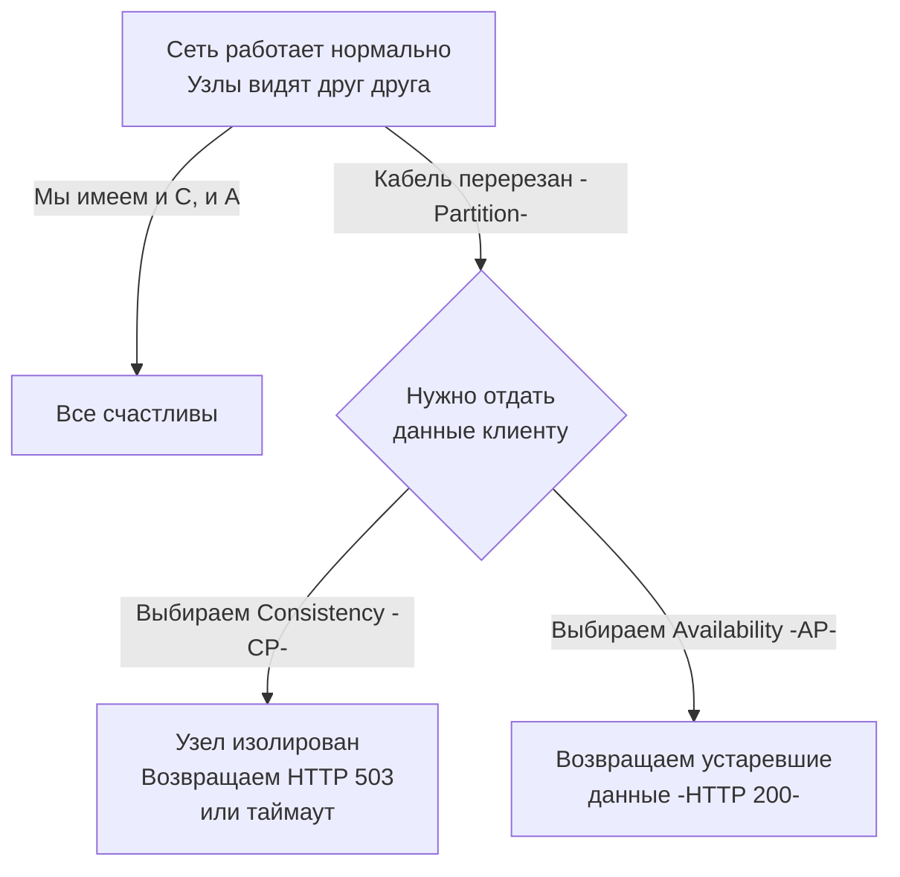

В прошлой статье [[6. Consistency vs availability]] мы разобрали физическую природу конфликта между доступностью сервиса и актуальностью его данных при сбоях в сети. В 2000 году Эрик Брюер (Eric Brewer) формализовал эту дилемму в виде постулата, который навсегда изменил архитектуру баз данных и бэкенда.

Встречай **Теорему CAP** (CAP Theorem).

Это альфа и омега System Design интервью и базовая ментальная модель для любого Senior-разработчика, проектирующего микросервисы.

## Что такое CAP?

CAP — это акроним трех желаемых свойств распределенной системы:

1. **C — Consistency (Согласованность)**
   Каждое чтение возвращает самую последнюю успешную запись (Linearizability). Независимо от того, к какому узлу кластера обратился клиент, он видит абсолютно те же самые данные.
2. **A — Availability (Доступность)**
   Каждый *неупавший* узел системы возвращает успешный ответ (не ошибку) за разумное время. Запрос не должен зависать бесконечно.
3. **P — Partition Tolerance (Устойчивость к разделению)**
   Система продолжает работать, даже если сеть между узлами задерживает или теряет любое количество сообщений (произошел обрыв сети — Network Partition).

Классическая, но **ошибочная** трактовка теоремы звучит так: *"Из трех свойств (C, A, P) распределенная система может гарантировать только два"*. 

## Главный миф: "Выберите любые два"

Многие разработчики рисуют треугольник и говорят: "Мы можем выбрать CA, CP или AP". Это фундаментальная ошибка.

В распределенной системе, работающей по сети (а не внутри одного процессора), обрывы связи неизбежны. Ты не можешь "отказаться" от Partition Tolerance (P). Нельзя подойти к маршрутизатору и приказать ему: "Никогда не ломайся".

> **Правильная формулировка CAP-теоремы:** > Сетевые разделения (P) обязательно произойдут. И в тот момент, когда сеть порвется, архитектор **обязан** выбрать между Согласованностью (C) и Доступностью (A).

Систем класса **CA** в распределенном мире **не существует**. CA — это твой локальный PostgreSQL, работающий на одном сервере (монолит). Как только ты настраиваешь репликацию на другой сервер, ты вступаешь в мир P и должен выбирать.



## CP-системы (Consistency + Partition Tolerance)

Если система выбирает CP, она гарантирует, что данные никогда не разойдутся (не будет Split-Brain). Если узел не может связаться с большинством других узлов, он переходит в режим "Только для чтения" или полностью отклоняет запросы.

**Представители:** `etcd` (написан на Go, стандарт де-факто в Kubernetes), `Consul`, `Zookeeper`, `HBase`, `MongoDB` (по умолчанию), реляционные БД (PostgreSQL/MySQL) с **синхронной** репликацией.

### Mechanical Sympathy: etcd и потеря кворума
`etcd` использует алгоритм консенсуса Raft. Чтобы принять запись, большинство узлов (Кворум) должны ее подтвердить. 
Если у тебя кластер из 3 узлов, кворум равен 2. 
Если происходит Partition, и 1 узел изолируется от двух других, он теряет кворум. 

Если твой Go-клиент отправит на этот изолированный узел запрос:
```go
// Пытаемся записать данные в изолированный узел etcd
ctx, cancel := context.WithTimeout(context.Background(), 2*time.Second)
defer cancel()

_, err := etcdClient.Put(ctx, "leader", "node-1")
```
Узел **отклонит** запрос (или запрос отвалится по таймауту). Доступность (Availability) принесена в жертву ради того, чтобы в кластере не появилось два разных "лидера".

## AP-системы (Availability + Partition Tolerance)

Если система выбирает AP, она гарантирует, что любой живой узел примет данные или отдаст то, что знает, даже если он полностью отрезан от остального мира. 

**Представители:** `Cassandra`, `DynamoDB`, `Riak`, `CouchDB`, реляционные БД с **асинхронной** репликацией.

В таких системах, если кластер разделен пополам, обе половины будут принимать записи от клиентов. Когда сеть восстановится, система попытается слить конфликтующие записи (Eventual Consistency) с помощью стратегий вроде Last-Write-Wins (LWW) или векторных часов. В AP-системах клиент может записать значение `A`, а при следующем чтении получить значение `B`.

> [!tip] Собеседование
> **Вопрос:** PostgreSQL — это CP или AP система?
> **Ответ:** Это вопрос с подвохом. Базы данных сами по себе не имеют жесткой привязки к буквам CAP, всё зависит от конфигурации.
> - PostgreSQL с **асинхронной** репликацией (по умолчанию) — это **AP**. Если Master падает, асинхронная реплика повышается до Master'а. Последние транзакции, не успевшие долететь по сети, **теряются**. Доступность сохранена, консистентность нарушена.
> - PostgreSQL с **синхронной** репликацией (`synchronous_commit = on`) — это **CP**. Транзакция не подтвердится клиенту, пока реплика не ответит. Если реплика отвалилась по сети, Master заблокирует все записи. Консистентность сохранена, база легла (нет доступности).

## Архитектура: Комбинирование CAP в Go-сервисах

В реальном мире ты редко проектируешь сервис целиком как AP или CP. Ты дробишь бизнес-логику и применяешь разные модели для разных подсистем.

Представь, что ты пишешь бэкенд интернет-магазина на Go.

1. **Сервис каталога (AP):** Если база с товарами недоступна, твой Go-сервис может отдать закэшированный в памяти (`sync.Map` или `freecache`) список товаров. Пусть цена будет старой на 5 минут, но пользователь сможет просматривать сайт. Мы выбираем Доступность.
2. **Сервис оплаты и инвентаризации (CP):** При чекауте (оплате) мы не имеем права списывать деньги "примерно" или продавать товар, которого уже нет на складе (Overbooking). Здесь мы требуем строгой транзакционности. Если сеть до платежного шлюза или БД "моргает" — мы возвращаем ошибку и просим попробовать позже.

### Реализация AP-фолбэка в Go

Типичный идиоматичный паттерн для AP-поведения в микросервисах — использование Fallback-ответа при превышении таймаута контекста.

```go
func (s *ProductService) GetProduct(ctx context.Context, id string) (Product, error) {
    // 1. Устанавливаем жесткий таймаут на поход в БД/микросервис
    reqCtx, cancel := context.WithTimeout(ctx, 100*time.Millisecond)
    defer cancel()

    // 2. Пытаемся получить строгие данные (Consistency)
    prod, err := s.db.FetchProduct(reqCtx, id)
    
    if err != nil {
        // Если ошибка таймаута (возможно, Partition или перегрузка)
        if errors.Is(err, context.DeadlineExceeded) || os.IsTimeout(err) {
            // ФОЛБЭК: Выбираем Availability! 
            // Отдаем слегка устаревшие данные из локального in-memory кэша
            if cachedProd, found := s.localCache.Get(id); found {
                log.Printf("DB timeout, serving stale data for product %s", id)
                return cachedProd, nil
            }
        }
        // Если данных нет даже в кэше — возвращаем ошибку
        return Product{}, err
    }
    
    // Обновляем локальный кэш свежими данными
    s.localCache.Set(id, prod)
    return prod, nil
}
```

> [!warning] Ловушка / Gotcha: Деградация "спрячет" проблему
> Если ты реализуешь AP-модель с fallback-закэшированными ответами, обязательно добавляй метрики (Prometheus: `fallback_responses_total`). Иначе твоя система может годами работать в деградированном состоянии (отдавая старые данные из-за тихо умершего соединения с БД), а ты даже не узнаешь об этом, потому что HTTP-ошибок (500) не будет.

## Итог и эволюция

1. Теорема CAP говорит о том, что в случае сетевого разделения (P) мы должны выбрать либо Консистентность (C), либо Доступность (A).
2. Выбор не статичен. В рамках одного Go-приложения разные endpoint'ы могут иметь разные гарантии.
3. Отношения с данными зависят от бизнес-требований, а не только от выбранной базы данных.

CAP-теорема — великая вещь, но у нее есть один существенный недостаток. Она описывает поведение системы **только в момент аварии** (обрыва сети). А что происходит с системой в остальные 99.9% времени, когда сеть работает нормально? Неужели нам не нужно делать никаких компромиссов?

Нужно. И чтобы описать этот второй, не менее важный компромисс повседневной работы, в 2010 году Даниэль Абади расширил теорему CAP. Об этом расширении, которое отвечает на вопросы производительности в мирное время, мы поговорим в следующей статье: [[8. PACELC]].