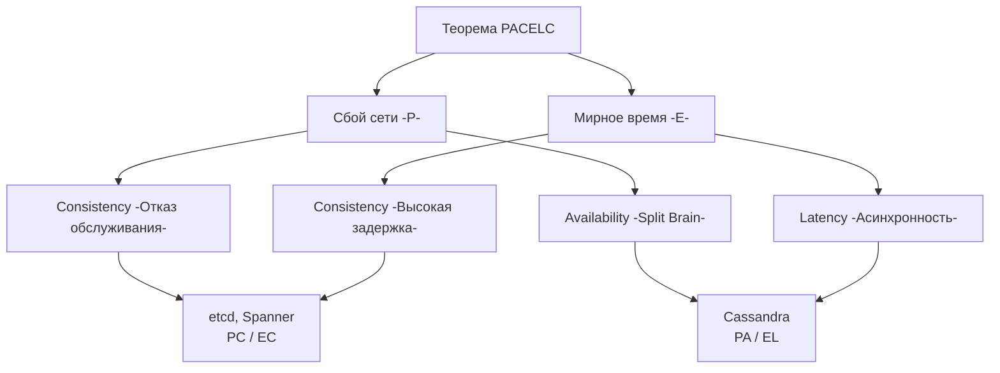

В прошлой статье [[7. CAP теорема на практике]] мы разобрались, как ведет себя система в моменты катастроф. Если кабель перерезан (Partition), мы обязаны выбрать между Доступностью (Availability) и Согласованностью (Consistency). 

Но давай будем честны. В современных дата-центрах (AWS, GCP, Yandex Cloud) обрывы сети (Network Partitions) — это не ежедневное явление. В 99.9% случаев сеть работает штатно. 

И тут возникает главная проблема CAP-теоремы: **она ничего не говорит о том, чем мы жертвуем в мирное время**. Если сеть работает идеально, означает ли это, что мы можем получить магическую базу данных, которая одновременно отвечает за 1 миллисекунду и гарантирует строгую консистентность по всей планете?

Ответ — категорически нет. И чтобы объяснить физику этого "мирного" компромисса, в 2010 году Даниэль Абади сформулировал теорему **PACELC**.

## Деконструкция PACELC

PACELC — это расширение CAP-теоремы. Это не просто академический термин, это таблица настроек твоего клиента к базе данных в Go-приложении.

Акроним расшифровывается так:
* **P** (if Partition) — если произошел обрыв сети...
* **A** (Availability) or **C** (Consistency) — мы выбираем Доступность или Согласованность.
* **E** (Else) — **иначе (в нормальном режиме работы)**...
* **L** (Latency) or **C** (Consistency) — мы выбираем **Задержку** или **Согласованность**.

Главный инсайт теоремы кроется в части **E -> L/C**. 
В распределенной системе, даже когда всё работает идеально, ты **обязан** платить за строгую согласованность (Consistency) временем ответа (Latency). 

## Mechanical Sympathy: Почему Consistency стоит времени?

Допустим, ты пишешь данные в кластер из трех серверов. Твой Go-бэкенд отправляет запрос на Master-узел. 
Чтобы гарантировать строгую согласованность (Consistency), Master не имеет права сказать твоему клиенту "Успешно" (HTTP 200 OK) до тех пор, пока он не синхронизирует эти данные с репликами.

Что происходит на уровне железа и сети?
1. Master-узел получает байты по сети, парсит запрос.
2. Делает системный вызов `write` в лог транзакций (WAL) и **обязательно** делает `fsync`, чтобы сбросить кэши ОС на физический диск (защита от отключения питания).
3. Отправляет данные по сети на Реплику 1 и Реплику 2.
4. Реплики делают свой `write` и `fsync` на диск.
5. Реплики отправляют сетевой ACK (подтверждение) обратно Мастеру.
6. Мастер собирает ответы (кворум) и только после этого возвращает ответ твоему Go-коду.

Каждый сетевой RTT (Round Trip Time) — это миллисекунды. Каждый `fsync` на NVMe-накопителе — это десятки или сотни микросекунд (а на HDD или перегруженном EBS — миллисекунды). 
**Ты ждешь физику.** Если твои сервера разнесены по разным Availability Zones (для отказоустойчивости), физика скорости света добавит к твоей задержке еще 2-5 миллисекунд.

> [!info] Под капотом: Асинхронность и Latency (Выбор L)
> Если ты выбираешь Latency (низкую задержку), Master-узел отвечает "Успешно" сразу после шага 2 (или даже 1, если `fsync` выключен). 
> Сетевой RTT до реплик убирается из критического пути. Твой Go-клиент получает ответ за 1-2 миллисекунды вместо 10-20. Но ты теряешь Consistency: если в этот момент Master сгорит дотла, данные не успеют долететь до реплик и будут безвозвратно потеряны (Data Loss), хотя твой клиент уже получил подтверждение.

## Классификация систем по PACELC

Вместо плоской CAP-теоремы, мы теперь можем классифицировать базы данных и архитектуры в 2D-пространстве.

1. **PC/EC (Partition: Consistency / Else: Consistency)**
   Система *всегда* ставит согласованность превыше всего. При разрыве сети она откажет в записи. В мирное время она будет тормозить (высокий Latency), ожидая синхронизации реплик.
   * *Примеры:* `etcd` (используемый в K8s), `Google Spanner`, реляционные БД (PostgreSQL/MySQL) с полностью синхронной репликацией.

2. **PA/EL (Partition: Availability / Else: Latency)**
   Система *всегда* жертвует консистентностью. При разрыве сети она продолжает принимать записи на всех узлах. В мирное время она отдает ответ мгновенно (асинхронная репликация). Это системы с Eventual Consistency.
   * *Примеры:* `Cassandra`, `Riak`, `DynamoDB`.

3. **PA/EC (Partition: Availability / Else: Consistency)**
   Интересный гибрид. При разрыве сети система выбирает доступность (например, позволяет читать устаревшие данные). Но в нормальном режиме работы она настроена на строгую согласованность, расплачиваясь задержкой.
   * *Примеры:* Дефолтный `MongoDB`. Если Primary узел падает, система продолжает отдавать старые данные с Secondary узлов (Availability), но пока Primary жив, все записи и чтения идут строго через него с подтверждением (Consistency).



## PACELC на практике в коде Go

Почему это важно для нас, бэкенд-инженеров? Потому что современные базы данных позволяют **настраивать PACELC на уровне каждого запроса** прямо из твоего Go-кода!

Тебе не нужно разворачивать две разные базы данных. Возьмем, к примеру, драйвер MongoDB (или Cassandra). База данных может вести себя и как EL, и как EC система, в зависимости от того, какие опции (Read/Write Concerns) ты передашь в контекст.

> [!warning] Ловушка / Gotcha: Дефолтные настройки драйверов
> Если ты просто подключаешься к базе и вызываешь `.InsertOne()`, ты используешь дефолтный профиль PACELC (обычно сбалансированный). Настоящий Senior-инженер всегда явно прописывает нужные гарантии в зависимости от бизнес-требований.

### Пример: Смещение баланса E (Else) в Go (MongoDB)

Допустим, у нас есть две операции:
1. Сохранение финансовой транзакции (Нужен EC - Consistency).
2. Запись лога действий пользователя (Нужен EL - Latency).

```go
package main

import (
	"context"
	"go.mongodb.org/mongo-driver/mongo"
	"go.mongodb.org/mongo-driver/mongo/options"
	"go.mongodb.org/mongo-driver/mongo/writeconcern"
)

func SaveFinancialTx(ctx context.Context, coll *mongo.Collection, doc interface{}) error {
	// Сдвигаемся в сторону EC (Consistency). 
	// W: "majority" означает, что мы ждем, пока большинство узлов (Кворум) 
	// запишут данные в память.
	// J: true (Journal) заставляет узлы дождаться fsync на физический диск.
	// Цена: Максимальный Latency (десятки миллисекунд).
	wc := writeconcern.New(writeconcern.WMajority(), writeconcern.J(true))
	opts := options.InsertOne().SetWriteConcern(wc)
	
	_, err := coll.InsertOne(ctx, doc, opts)
	return err
}

func SaveClickLog(ctx context.Context, coll *mongo.Collection, doc interface{}) error {
	// Сдвигаемся в сторону EL (Latency).
	// W: 1 означает, что мы ждем подтверждения только от ОДНОГО узла (Primary) 
	// и только в оперативную память (без ожидания fsync, так как J по умолчанию false).
	// Цена: Минимальный Latency (1-2 мс), но риск потери данных при сбое Primary.
	wc := writeconcern.New(writeconcern.W(1))
	opts := options.InsertOne().SetWriteConcern(wc)
	
	// Если мы используем Fire-and-Forget (W: 0), мы даже не будем ждать ответа от БД.
	_, err := coll.InsertOne(ctx, doc, opts)
	return err
}
```

> [!tip] Собеседование
> **Вопрос:** Что такое `Quorum` (Кворум) и как он связан с PACELC?
> **Ответ:** Кворум (формула `R + W > N`, где R — узлы для чтения, W — для записи, N — всего узлов) — это механизм тюнинга между Latency и Consistency (EC vs EL). 
> - Если мы требуем строгой консистентности (EC), мы ставим `W = majority`. Это медленнее, так как нужно дождаться ответа от `(N/2)+1` серверов по сети.
> - Если нам важна скорость (EL), мы ставим `W = 1`. Запись проходит почти мгновенно, но при чтении (`R = 1`) мы можем прочитать устаревшую реплику. (О кворумах мы подробнее поговорим в статье [[4. Quorum]]).

## Итог

1. CAP-теорема — это про катастрофы (обрывы сети). PACELC — это про повседневную жизнь.
2. В мирное время ты всегда платишь за Согласованность (Consistency) увеличением Задержки (Latency). Эта задержка складывается из сетевых RTT до реплик и дисковых `fsync`.
3. Хороший бэкенд-инженер не "мирится" с задержками, а тюнит их на уровне драйвера базы данных в Go, выбирая для критичных данных `EC` (Quorum/Majority writes), а для метрик и кэшей — `EL` (Async writes).