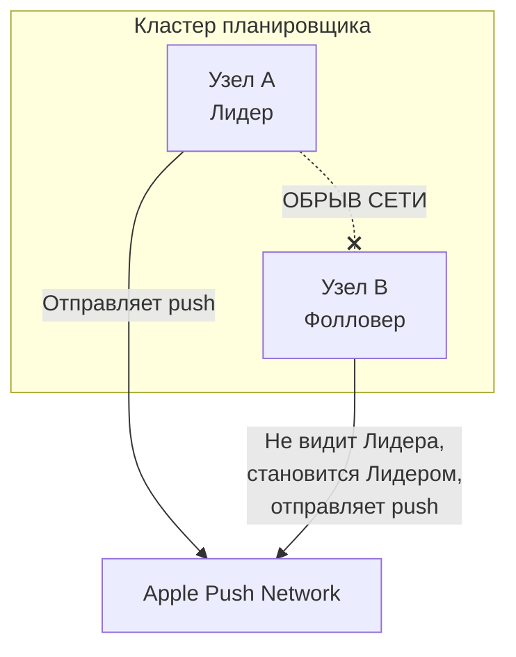

Ты закончил с фундаментом и теоремами. Ты знаешь, что сеть будет рваться, узлы будут падать, а часы будут врать. Теорема PACELC ([[8. PACELC]]) ясно дала понять: если тебе нужна согласованность (Consistency), придется платить задержкой, чтобы узлы успели договориться между собой. 

Но как именно они договариваются? Если нет ни единых часов, ни надежной сети, ни общего процессора, как заставить три разных сервера в разных дата-центрах прийти к единому, неоспоримому решению? 

Добро пожаловать в подраздел **Консенсус (Consensus)**. Это сердце любой надежной распределенной системы, от etcd в твоем кластере Kubernetes до баз данных вроде CockroachDB и систем оркестрации вроде Temporal.

## Потеря аппаратной магии

Чтобы понять масштаб проблемы, давай вспомним, как мы решаем задачу согласованности в рамках одного Go-приложения (монолита). 

Представь, что у нас есть переменная `balance int64` и две горутины, которые хотят одновременно ее изменить. 

```go
var balance int64

// Горутина 1
atomic.AddInt64(&balance, 100)

// Горутина 2
atomic.AddInt64(&balance, -50)
```

Мы пишем этот код и спим спокойно. Но что происходит "под капотом" на уровне железа? 

> [!info] Под капотом: Аппаратный консенсус (MESI)
> Когда ты вызываешь `atomic.AddInt64`, компилятор Go генерирует ассемблерную инструкцию с префиксом `LOCK` (например, `LOCK XADD` на x86). 
> Процессор, выполняя эту инструкцию, использует протокол когерентности кэшей (обычно MESI). Он отправляет сигнал по физической шине материнской платы: "Я эксклюзивно захватываю эту кэш-линию, все остальные ядра — сбросьте свои кэши!". 
> Шина — это сверхбыстрая, 100% надежная среда связи с нулевой потерей сообщений и задержками в наносекунды. Железо само решает проблему консенсуса между ядрами процессора.

В распределенной системе **у нас нет материнской платы**. У нас нет инструкции `LOCK`. Если `Сервер А` и `Сервер Б` пытаются одновременно списать деньги со счета, у них нет общей памяти. Единственный способ договориться — это отправить TCP-пакет по ненадежной сети. 

А сеть, как мы помним из законов распределенных систем, может этот пакет потерять, задержать или продублировать.

## Проблема Split-Brain (Расщепление мозга)

Главный страх любого архитектора — это состояние `Split-Brain`. Оно возникает, когда распределенная система теряет способность к консенсусу и распадается на две (или более) независимые части, каждая из которых считает себя "главной" и принимает конфликтующие решения.

Представь кластер из двух серверов, где запущен планировщик задач (например, отправка push-уведомлений пользователям). Только один сервер (Лидер) должен отправлять пуши, иначе пользователи получат спам. Второй сервер (Фолловер) стоит в резерве.



1. Происходит обрыв сети (Network Partition) между узлами.
2. `Узел B` перестает получать heartbeats (пульс) от `Узла A`.
3. `Узел B` делает вывод: "Лидер мертв. Я должен спасти систему и стать новым Лидером".
4. `Узел A` жив и продолжает считать себя Лидером, ведь он ничего не знает о проблемах сети, для него просто исчез `Узел B`.
5. Итог: оба узла параллельно отправляют миллионы дублирующихся push-уведомлений. Бизнес теряет деньги и репутацию.

Чтобы этого избежать, системе нужен механизм, который математически исключает появление двух лидеров. Нам нужен алгоритм консенсуса.

## Что такое Консенсус формально?

В информатике алгоритм консенсуса должен гарантировать выполнение трех свойств среди группы узлов (где некоторые узлы могут быть сломаны или недоступны):

1. **Согласованность (Agreement):** Все честные (исправные) узлы должны принять *одно и то же* решение.
2. **Валидность (Validity):** Принятое решение должно быть предложено одним из узлов (нельзя просто всегда договариваться о числе `0`, чтобы выполнить первое условие).
3. **Завершаемость (Termination):** Все исправные узлы в конечном итоге примут решение. Алгоритм не должен зависнуть в бесконечном цикле.

> [!tip] Собеседование
> **Вопрос:** Слышали ли вы о теореме FLP (Fischer, Lynch, Paterson)? Можно ли достичь 100% консенсуса?
> **Ответ:** Теорема FLP (1985 год) математически доказывает, что в асинхронной сети (где нет гарантий времени доставки пакета), если хотя бы *один* узел может выйти из строя, **детерминированный алгоритм консенсуса невозможен**. Мы никогда не можем отличить "мертвый" узел от "очень медленного".
> На практике алгоритмы (Raft, Paxos) "обходят" теорему FLP, добавляя понятие *таймаутов* (превращая сеть из полностью асинхронной в частично синхронную) и используя рандомизацию при выборах лидера.

## Основа консенсуса: Кворум (Quorum)

Как избежать Split-Brain, если узлы не могут связаться друг с другом? Ответ лежит в простом демократическом принципе большинства — **Кворуме**.

В распределенных системах Кворум (Majority) — это строго больше половины узлов кластера: `(N / 2) + 1`.

* Если в кластере 3 узла, кворум = 2.
* Если в кластере 5 узлов, кворум = 3.

**Математическое свойство кворума:** Любые два кворума в одной системе *обязательно* имеют как минимум один общий узел (пересекаются). 

Именно этот общий узел выступает гарантом того, что две изолированные части кластера никогда не примут конфликтующих решений. Узел, который уже проголосовал за "Кандидата А", не отдаст свой голос за "Кандидата Б", поэтому "Кандидат Б" никогда не наберет большинство.

```go
// Простейшая проверка кворума на Go
func HasQuorum(totalNodes int, votes int) bool {
    quorumSize := (totalNodes / 2) + 1
    return votes >= quorumSize
}

// Пример:
// 3 узла -> quorumSize = 2. Если votes == 2, кворум есть.
// Если кластер разделился на 2 и 1, меньшая часть НИКОГДА не соберет кворум.
```

> [!warning] Ловушка / Gotcha: Кластеры из четного числа узлов
> Никогда не разворачивай консенсус-кластеры (etcd, Zookeeper) с четным количеством узлов (2, 4, 6). 
> Допустим, у тебя 4 узла. Кворум `(4/2) + 1 = 3`. 
> Если кластер развалится пополам (2 и 2), **ни одна** из половин не сможет собрать кворум (3 голоса). Обе части кластера заблокируются, ожидая восстановления сети. 
> Если у тебя 3 узла, при разделении на 2 и 1, бОльшая часть (2 узла) сохранит кворум и продолжит работать. Добавление 4-го узла только *снижает* отказоустойчивость!

## Зачем нам Консенсус на практике?

Бэкенд-разработчик на Go не каждый день пишет алгоритм консенсуса с нуля, но использует его плоды постоянно:

1. **Leader Election (Выбор лидера):** В микросервисах часто запускают несколько подов (реплик) одного сервиса для отказоустойчивости. Но некоторые фоновые задачи (cron-джоба списания абонентской платы) должны выполняться строго в одном экземпляре. Кластер должен договориться, кто именно сейчас является Лидером ([[8. Leader election в системах]]).
2. **Distributed Locks (Распределенные блокировки):** Замена `sync.Mutex` для защиты общих ресурсов в базе данных или объектном хранилище. Позволяет гарантировать, что только один процесс в кластере имеет доступ к файлу ([[7. Distributed locks]]).
3. **Service Discovery и Конфигурации:** Хранение критичных настроек (например, IP-адреса мастера БД). Если конфигурация изменилась, все узлы должны увидеть новую версию одновременно. Для этого используется `etcd` или `Consul`, которые под капотом построены на консенсусе.

## Итог

1. Консенсус — это способ создать иллюзию общей памяти (shared memory) и единого состояния поверх ненадежной сети с изолированными серверами.
2. Главная цель консенсуса — предотвратить состояние Split-Brain, когда кластер принимает два конфликтующих решения.
3. Инструмент достижения консенсуса — строгий кворум `(N/2) + 1` и использование нечетного числа узлов в кластере.

До 2014 года миром распределенных систем правил алгоритм Paxos. Он был математически совершенен, но настолько сложен в понимании и реализации, что даже опытные инженеры совершали фатальные ошибки при написании кода. 
Поэтому инженеры из Стэнфорда создали алгоритм, главной целью которого была *понятность* (Understandability) для разработчиков. Сегодня этот алгоритм де-факто управляет всем облачным миром и Kubernetes. 

В следующей статье мы разберем этот шедевр инженерной мысли: [[2. Raft. Основы]].