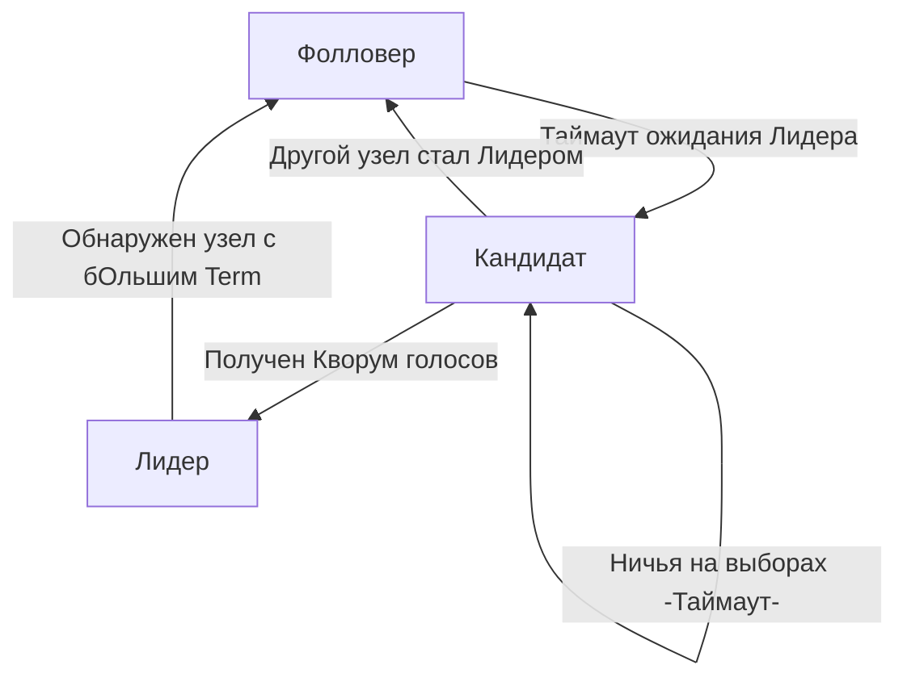

В статье [[1. Зачем нужен consensus]] мы выяснили, что без алгоритма консенсуса кластер неизбежно развалится на конфликтующие куски (Split-Brain) при первом же "моргании" сети. Долгое время индустрия пыталась использовать для решения этой проблемы алгоритм Paxos (созданный Лесли Лэмпортом в 1989 году). 

Проблема Paxos заключалась в том, что он был математически гениален, но абсолютно нечитаем. Инженеры не могли переложить его математические доказательства на реальный код без багов. Каждый раз, когда кто-то писал реализацию Paxos, получался новый, ни с чем не совместимый "диалект".

В 2013 году Диего Онгаро из Стэнфорда выпустил статью *"In Search of an Understandable Consensus Algorithm"*. Так появился **Raft**. 

Сегодня Raft — это абсолютный монополист в мире инфраструктуры. На нем работает `etcd` (мозг Kubernetes), `Consul`, `Nomad`, распределенные SQL базы данных (CockroachDB, TiDB), брокеры сообщений (Redpanda). И самое главное для нас — эталонные и самые производительные реализации Raft написаны именно на Go (библиотеки от CoreOS/etcd и HashiCorp).

## Декомпозиция сложности

Главная архитектурная инновация Raft — это не новая математика, а разделение сложной проблемы консенсуса на три независимые и понятные подзадачи:

1. **Leader Election (Выбор лидера):** Кластер должен выбрать одного главного узла. Пока лидер жив, он принимает все решения.
2. **Log Replication (Репликация лога):** Лидер принимает команды от клиентов и рассылает их остальным узлам так, чтобы все узлы применили эти команды в строго одинаковом порядке.
3. **Safety (Безопасность):** Гарантия того, что если узел применил команду к своей стейт-машине (базе данных), никакой другой узел не сможет применить другую команду на той же позиции в логе, даже при массовых сбоях оборудования.

В этой статье мы заложим фундамент: разберем состояния узлов и концепцию времени в Raft.

## 1. Роли узлов (Server States)

Raft использует концепцию **Сильного Лидера (Strong Leader)**. В нормальном режиме работы кластера запросы клиентов обрабатывает только один узел — Лидер. Остальные узлы пассивно исполняют его приказы. Это радикально упрощает систему: нет конфликтов записи, которые нужно разруливать (как в AP-системах вроде Cassandra).

В любой момент времени узел (Go-процесс) может находиться строго в одном из трех состояний:

* **Фолловер (Follower - Ведомый):** Пассивное состояние. Узел только отвечает на запросы от Лидера или Кандидатов. Если к нему приходит запрос от клиента (например, `HTTP POST`), он перенаправляет его Лидеру.
* **Кандидат (Candidate):** Промежуточное состояние. Если Фолловер слишком долго не слышит Лидера, он объявляет себя Кандидатом, голосует за себя и запрашивает голоса у остальных.
* **Лидер (Leader):** Активное состояние. Принимает записи от клиентов, пишет их в свой локальный лог и рассылает (через RPC `AppendEntries`) Фолловерам. Периодически шлет Heartbeat-сообщения (пульс), чтобы Фолловеры знали, что он жив.



> [!info] Под капотом: State Machine в etcd/raft
> В эталонной Go-библиотеке `go.etcd.io/raft` алгоритм реализован как чистая конечная автоматная машина (State Machine). Она не делает сетевых вызовов (`net.Dial`) и не пишет на диск (`os.WriteFile`). 
> Она принимает на вход сообщения (структуры `raftpb.Message`), меняет свое внутреннее состояние (в оперативной памяти) и отдает массив готовых сообщений, которые *твой* код должен отправить по сети, и записей, которые *твой* код должен сбросить на диск. Эта архитектурная изоляция делает код etcd невероятно тестируемым (через table-driven тесты без моков сети) и детерминированным.

## 2. Эпохи (Terms) — Логическое время Raft

В статье [[5. Time и clock drift]] мы говорили, что физическим часам (NTP) доверять нельзя. Raft решает эту проблему через **Логические часы**. В Raft они называются **Term** (Эпоха или Срок правления).

Терм — это монотонно возрастающее целое число (`uint64`). Каждые выборы начинаются с увеличения Терма.

Каждый узел хранит свой текущий Терм в персистентной памяти (на диске) и прикрепляет его к **каждому** сетевому сообщению (RPC).

**Золотое правило Термов:**
Если узел получает сообщение с Термом, который *больше* его текущего, он немедленно:
1. Обновляет свой Терм на этот новый, больший.
2. Сбрасывает свое состояние до **Фолловера**.

Это элегантно решает проблему "Зомби-Лидеров" после обрывов сети (Split-Brain).

> [!tip] Собеседование
> **Вопрос:** В кластере из 5 узлов произошел обрыв сети (Network Partition). Лидер `A` (Терм 1) и Фолловер `B` оказались в меньшинстве. Узлы `C`, `D`, `E` остались в большинстве. Что произойдет?
> **Ответ:** Узлы `C`, `D`, `E` перестанут получать пульс от `A`. У них сработает таймаут, они увеличат Терм до 2, выберут нового лидера (например, `C`) и продолжат работу. 
> Старый Лидер `A` по-прежнему считает себя главным (для Терма 1) и принимает запросы от клиентов в своей зоне изоляции. Но так как он не может получить ответы от большинства (у него есть только узел `B`), он не сможет зафиксировать (commit) ни одну транзакцию. 
> Когда сеть восстановится, `C` отправит сообщение `A` с Термом 2. `A` увидит, что `2 > 1`, поймет, что был изолирован, и немедленно понизит себя до Фолловера. Разделения мозга не произойдет.

## 3. Коммуникация (RPC)

Для достижения консенсуса узлам в Raft достаточно всего двух типов RPC вызовов (обычно поверх gRPC в Go-реализациях):

1. **RequestVote RPC:** Вызывается Кандидатами во время выборов для сбора голосов.
2. **AppendEntries RPC:** Вызывается Лидером. Выполняет сразу две функции:
   * **Репликация:** Передача новых команд для записи в лог.
   * **Heartbeat (Пульс):** Если отправить пустой `AppendEntries` (без данных лога), он служит сигналом "Я жив, я Лидер, сбросьте свои таймауты выборов".

## Mechanical Sympathy: Raft Node в рантайме Go

Как концепция Raft ложится на горутины и каналы? Идиоматичная реализация Raft-узла часто использует паттерн `select`-loop (событийный цикл) внутри одной управляющей горутины. Это позволяет избежать сложных блокировок мьютексами, так как доступ к состоянию узла сериализуется через каналы.

Упрощенный скелет выглядит так:

```go
type RaftNode struct {
    state  State     // Follower, Candidate, Leader
    term   uint64    // Логическое время
    log    []Entry   // Журнал команд
    
    // Каналы для RPC
    appendEntriesCh chan AppendEntriesMsg
    requestVoteCh   chan RequestVoteMsg
}

func (n *RaftNode) Run(ctx context.Context) {
    for {
        select {
        case <-ctx.Done():
            return
            
        // Событийный цикл для Фолловера
        case msg := <-n.appendEntriesCh:
            n.handleAppendEntries(msg)
            // Сброс таймера выборов происходит внутри обработчика
            
        case msg := <-n.requestVoteCh:
            n.handleRequestVote(msg)
            
        // Если таймаут истек (пульс от Лидера не пришел)
        case <-time.After(n.randomElectionTimeout()):
            if n.state == Follower || n.state == Candidate {
                n.becomeCandidate() // Увеличиваем Терм, начинаем выборы
            }
        }
    }
}
```

> [!warning] Ловушка / Gotcha: Асимметричный обрыв сети
> Представь, что узел `A` (Лидер) может посылать пакеты узлу `B` (Фолловер), но `B` не может посылать пакеты `A` (кабель перебит в одну сторону). Или `B` вообще отрезан от `A`, но видит `C`.
> `B` перестает получать пульс. Он увеличивает Терм и начинает рассылать `RequestVote`. Узлы отклоняют его (так как Лидер жив), но видят его новый Терм. По правилам Raft, Лидер `A`, увидев больший Терм от `B`, слагает полномочия. Кластер парализуется постоянными перевыборами.
> В современных Go-имплементациях (etcd) эта проблема решается фазой **PreVote (Пред-выборы)**: перед тем как увеличить свой Терм, Кандидат спрашивает кластер "А вы бы за меня проголосовали, если бы я выдвинулся?". Изолированный узел получит отказы и не будет наращивать Терм, защищая кластер от нестабильности.

## Итог

1. **Raft** — это де-факто стандарт консенсуса в Go-экосистеме (etcd, HashiCorp), пришедший на смену сложному Paxos.
2. Он базируется на строгом единовластии (**Сильный Лидер**), логическом времени (**Terms**) и правиле большинства (**Кворум**).
3. Инженерная красота Raft в том, что он разбивает проблему Split-Brain на независимые фазы, которые легко описать в виде State Machine внутри Go-рантайма.

Мы заложили базис состояний. Но как именно происходят выборы? Почему таймауты (как в коде выше `randomElectionTimeout`) должны быть обязательно рандомизированы, и почему без `math/rand` кластер заблокирует сам себя в бесконечном цикле (Livelock)? Об этом — в следующей статье: [[3. Raft. Leader election]].