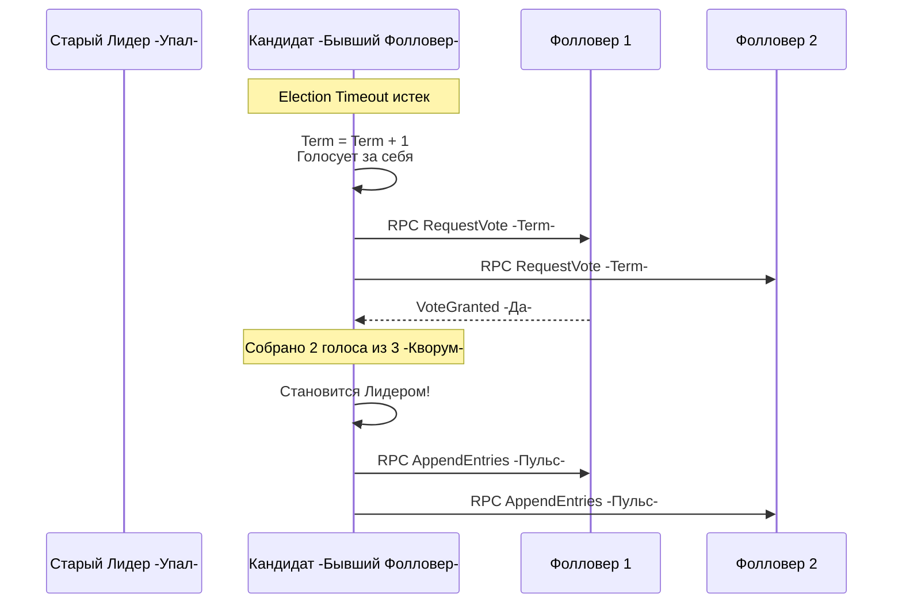

В прошлой статье [[2. Raft. Основы]] мы разобрались с ролями узлов и тем, как логическое время (Эпохи или Terms) спасает систему от хаоса. Мы выяснили, что в Raft правит Сильный Лидер, а все остальные узлы — это Фолловеры, которые пассивно исполняют его приказы и ждут от него подтверждения жизнеспособности (Heartbeat).

Но что происходит, когда Лидер умирает? Как из группы равных Фолловеров, не имеющих возможности просто "посмотреть в общую базу данных", за миллисекунды рождается новый Лидер, причем так, чтобы кластер не раскололся на части?

Выборы в Raft — это шедевр инженерного прагматизма, построенный на таймаутах, случайных числах и жестком правиле большинства.

## 1. Анатомия выборов: От молчания к власти

Всё начинается с тишины. У каждого Фолловера запущен таймер — **Election Timeout** (Таймаут выборов). 
Пока Лидер жив, он периодически (обычно каждые 50-100 мс) присылает пустые RPC-запросы `AppendEntries`, которые служат пульсом (Heartbeat). Получив такой запрос, Фолловер сбрасывает свой таймер обратно в ноль.

Если сеть "моргнула" или процесс Лидера упал (OOM, panic), пульс прекращается. Таймер Фолловера истекает. 

Далее происходит детерминированная цепочка событий:

1. **Смена роли:** Фолловер переходит в состояние **Кандидата (Candidate)**.
2. **Новая эпоха:** Кандидат инкрементирует свой текущий `Term` (Терм). Это заявление: "Старая эпоха закончилась, я начинаю новую".
3. **Голос за себя:** Кандидат отдает свой голос (Vote) сам себе.
4. **Агитация:** Кандидат асинхронно рассылает RPC-запрос `RequestVote` всем остальным узлам в кластере, прося проголосовать за него.



> [!warning] Ловушка / Gotcha: Правило одного голоса
> Важнейшее правило Raft: **В рамках одного Терма узел может проголосовать только один раз**. 
> Тот Кандидат, чей `RequestVote` придет к Фолловеру первым, заберет его голос. Если позже придет запрос от другого Кандидата с тем же Термом, Фолловер ответит отказом (`VoteGranted: false`). Именно это математически гарантирует, что в одном Терме не может быть выбрано два Лидера (невозможно собрать два Кворума из одной группы узлов).

У выборов может быть только три исхода:
* **Победа:** Кандидат собрал голоса большинства (Кворум) и мгновенно рассылает всем пульс, подавляя амбиции других Кандидатов.
* **Поражение:** Кандидат получает `AppendEntries` от другого узла, чей Терм больше или равен его собственному. Кандидат признает поражение и возвращается в статус Фолловера.
* **Ничья (Split Vote):** Голоса разделились, никто не собрал Кворум.

## 2. Mechanical Sympathy: Таймеры в рантайме Go

Таймаут выборов — это фундамент отказоустойчивости. Давай посмотрим, как правильно реализовать этот механизм ожидания в Go, потому что это классическое место для прострела ноги.

Многие начинающие разработчики пытаются реализовать событийный цикл Raft-узла через `time.After`:

```go
// АНТИПАТТЕРН: Утечка памяти!
func (n *RaftNode) followerLoop() {
    for {
        select {
        case msg := <-n.rpcCh:
            n.handleRPC(msg)
            // Пытаемся "сбросить" таймер, просто уйдя на новую итерацию цикла
        case <-time.After(300 * time.Millisecond):
            n.becomeCandidate()
            return
        }
    }
}
```

> [!info] Под капотом: Почему `time.After` в цикле — это зло
> В исходниках Go функция `time.After` создает новый объект `Timer` и аллоцирует его в куче (heap). Рантайм Go регистрирует этот таймер в глобальной куче таймеров (timer heap) процессора `P`. 
> Проблема в том, что этот таймер **не будет собран Garbage Collector-ом**, пока не истечет его время (300 мс). 
> Если Лидер шлет пульс каждые 50 мс, Фолловер будет переходить на новую итерацию цикла 20 раз в секунду, каждый раз создавая *новый* `time.After`. За секунду ты создашь 20 "висящих" таймеров. В высоконагруженной системе это приводит к безумной нагрузке на GC и планировщик.

**Идиоматичный подход (Idiomatic Go):**
Необходимо использовать один `time.Timer` и явно управлять его жизненным циклом.

```go
// ПРАВИЛЬНЫЙ ПОДХОД
func (n *RaftNode) followerLoop() {
    timeout := n.randomElectionTimeout()
    timer := time.NewTimer(timeout)
    defer timer.Stop() // Обязательно освобождаем ресурсы при выходе

    for {
        select {
        case msg := <-n.rpcCh:
            n.handleRPC(msg)
            // Эффективный сброс таймера без аллокаций
            if !timer.Stop() {
                // Вычитываем канал, если таймер уже успел сработать
                select {
                case <-timer.C:
                default:
                }
            }
            timer.Reset(n.randomElectionTimeout())

        case <-timer.C:
            n.becomeCandidate()
            return
        }
    }
}
```

## 3. Проблема ничьей и магия Рандомизации

Представь кластер из 4 узлов. Лидер упал. Осталось 3 Фолловера. 
Если у всех трех Фолловеров таймаут выборов жестко зашит в конфигурации (например, ровно 150 мс), произойдет катастрофа:

1. Все три таймера истекут одновременно.
2. Все три Фолловера станут Кандидатами (Терм + 1).
3. Все трое проголосуют за себя (у каждого по 1 голосу).
4. Они разошлют `RequestVote`.
5. Так как они уже проголосовали за себя, они откажут друг другу. 
6. Итог: ни один не набрал Кворум (нужно 3 голоса в кластере из 4 узлов). Ничья.

Что произойдет дальше? Таймеры истекут снова... и всё повторится. Система попадает в состояние **Livelock** (динамический паралич). Узлы работают, процессор греется, RPC летят, но полезная работа не выполняется.

Гениальное решение Диего Онгаро (создателя Raft) заключалось в отказе от детерминированности. **Таймауты выборов должны быть случайными** в диапазоне `[T, 2T]` (например, от 150 мс до 300 мс).

Из-за рандомизации один из узлов *гарантированно* проснется раньше остальных (например, через 162 мс, тогда как соседи спят до 210 мс и 280 мс). Этот "быстрый" узел станет Кандидатом, разошлет запросы и успеет собрать голоса спящих соседей до того, как их таймеры истекут.

## 4. Защита от глупца: Election Restriction

Мы решили проблему зависания выборов. Но есть проблема похуже: **потеря данных**.

Что если сеть моргнула у Фолловера, который сильно отстал от Лидера? Он пропустил последние 100 записей в БД. Его таймаут истекает, он случайным образом просыпается первым и... становится новым Лидером? Если это произойдет, он заставит всех остальных узлов откатить свои логи под его "пустую" версию. Данные бизнеса будут уничтожены.

Чтобы этого не произошло, в RPC `RequestVote` Кандидат обязан передать не только свой `Term`, но и метаданные своего лога: `LastLogIndex` (номер последней записи) и `LastLogTerm` (эпоха последней записи).

Фолловер, получив запрос на голосование, применяет жесткую логику (Safety Check):
* Если лог Кандидата старше (меньший `LastLogTerm`), то **Отказ**.
* Если эпохи логов равны, но лог Кандидата короче (меньший `LastLogIndex`), то **Отказ**.

> [!tip] Собеседование
> **Вопрос:** Гарантирует ли Raft, что Кандидат с самым длинным логом всегда победит на выборах?
> **Ответ:** Нет. Raft не гарантирует, что выберут узел с *самым* длинным логом. Он гарантирует, что выберут узел, лог которого **достаточно актуален** (содержит все закоммиченные записи). Если у Кандидата лог такой же актуальный, как у большинства (Кворума) узлов, он сможет получить их голоса. Главное — он не должен отставать от тех, кто за него голосует.

## 5. Go-реализация: Параллельный сбор голосов

Когда узел становится Кандидатом, он должен собрать голоса максимально быстро. Сетевые вызовы — это I/O операции. Делать их последовательно в цикле (`for range peers { client.RequestVote(...) }`) — верная смерть для производительности и таймаутов.

Мы обязаны использовать паттерн Fan-Out/Fan-In, порождая горутины под каждый запрос. Идиоматичный код на Go для сбора голосов выглядит примерно так:

```go
func (n *RaftNode) startElection() {
    n.mu.Lock()
    n.term++
    n.state = Candidate
    n.votedFor = n.id // Голосуем за себя
    savedTerm := n.term
    n.mu.Unlock()

    votes := 1 // Свой голос уже есть
    quorum := (len(n.peers) / 2) + 1
    
    // Канал для сбора результатов (буферизированный, чтобы горутины не заблокировались)
    voteCh := make(chan bool, len(n.peers))

    // Fan-Out: Отправляем RPC параллельно
    for _, peerID := range n.peers {
        go func(id string) {
            req := RequestVoteArgs{
                Term:         savedTerm,
                CandidateID:  n.id,
                LastLogIndex: n.log.lastIndex(),
                LastLogTerm:  n.log.lastTerm(),
            }
            
            resp, err := n.rpcClient.SendRequestVote(id, req)
            if err != nil {
                voteCh <- false
                return
            }

            n.mu.Lock()
            defer n.mu.Unlock()

            // Если кто-то ответил бОльшим Термом - мы мгновенно сдаемся
            if resp.Term > n.term {
                n.becomeFollower(resp.Term)
                voteCh <- false
                return
            }

            voteCh <- resp.VoteGranted
        }(peerID)
    }

    // Fan-In: Собираем результаты
    for i := 0; i < len(n.peers); i++ {
        if <-voteCh {
            votes++
        }
        
        n.mu.Lock()
        // Проверяем, не сменился ли статус, пока мы ждали сеть 
        // (например, прилетел пульс от нового Лидера)
        if n.state != Candidate || n.term != savedTerm {
            n.mu.Unlock()
            return 
        }
        
        if votes >= quorum {
            n.becomeLeader()
            n.mu.Unlock()
            return
        }
        n.mu.Unlock()
    }
}
```

> [!info] Под капотом: Буферизация каналов
> Обрати внимание на `make(chan bool, len(n.peers))`. Если мы наберем кворум на середине цикла сбора, функция выйдет (`return`). Горутины, которые еще ждут ответа от медленных узлов, попытаются записать результат в канал `voteCh`. Если канал будет небуферизированным, эти горутины зависнут навсегда (Goroutine Leak). Буферизация спасает от утечек.

## Итог

1. **Таймауты правят бал:** Выборы запускаются отсутствием сетевой активности (пульса).
2. **Рандомизация — ключ к успеху:** Только случайные таймауты спасают систему от бесконечного цикла ничьих (Livelock).
3. **Безопасность прежде всего:** Механизм `Election Restriction` запрещает отстающим узлам становиться Лидерами, защищая данные от затирания.
4. **Конкурентность Go:** Идиоматичная реализация требует аккуратной работы с таймерами (`time.Timer`), параллельными горутинами для RPC и защиты стейта мьютексами.

Теперь у нас есть единый, легитимный Лидер с актуальными данными. Как только он выбран, его главная задача — начать принимать запросы от клиентов и гарантировать, что эти записи никогда не потеряются. О том, как Лидер реплицирует данные и принуждает Фолловеров к послушанию, мы поговорим в следующей статье: [[4. Raft. Log replication]].