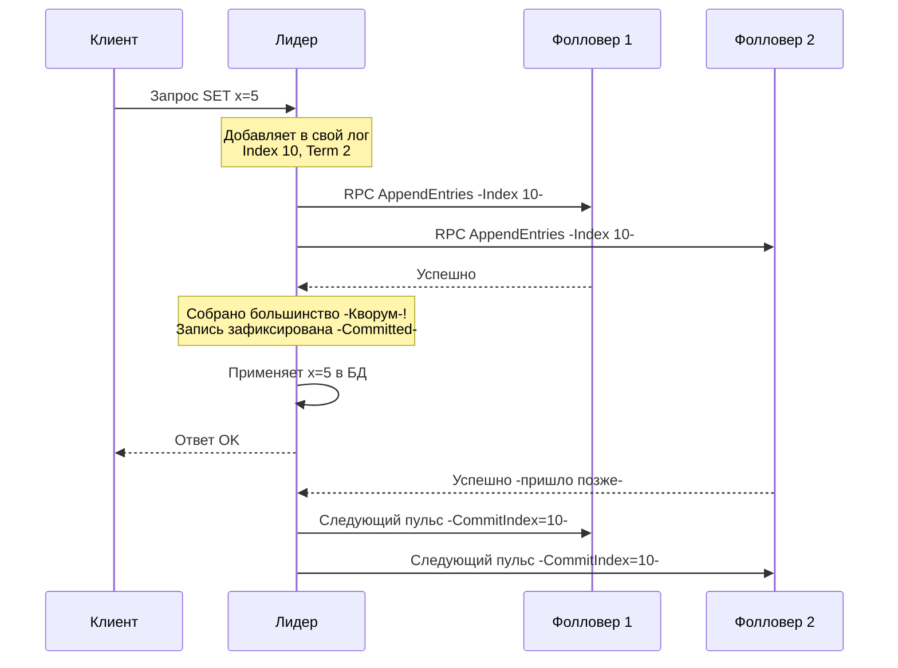

В прошлой статье [[3. Raft. Leader election]] мы разобрались, как кластер выбирает Лидера. Теперь у нас есть единый легитимный правитель. Его главная и единственная задача — принимать запросы от клиентов и надежно фиксировать их в системе, чтобы ни один байт данных не был потерян даже при массовых сбоях оборудования.

Этот процесс называется **Репликация лога (Log Replication)**. 

В основе Raft лежит фундаментальная концепция информатики — **State Machine Replication (Репликация конечного автомата)**. Идея проста: если два сервера (автомата) начинают с одинакового начального состояния и применяют один и тот же набор команд в строго одинаковом порядке, они придут к одному и тому же конечному состоянию. 

Лог в Raft — это и есть тот самый упорядоченный набор команд.

## Анатомия Журнала (The Log)

Каждый узел в кластере хранит на диске свой локальный Журнал (Log). Журнал состоит из записей (Entries). Каждая запись содержит:
1. **Index (Индекс):** Порядковый номер записи (монотонно возрастает).
2. **Term (Эпоха):** Логическое время, когда эта запись была создана Лидером.
3. **Command (Команда):** Полезная нагрузка для бизнес-логики (например, `SET x = 5`).

## Идеальный сценарий (Happy Path)

Когда клиент (например, твой HTTP-сервис) хочет изменить данные, он отправляет запрос Лидеру. Дальше разворачивается следующий процесс:

1. **Append (Добавление):** Лидер принимает команду, создает новую запись (Entry) с текущим Термом и добавляет её в свой локальный лог. *Запись пока не считается зафиксированной (uncommitted).*
2. **Replicate (Репликация):** Лидер параллельно рассылает эту запись всем Фолловерам через RPC `AppendEntries`.
3. **Acknowledge (Подтверждение):** Фолловеры получают `AppendEntries`, добавляют запись в свои логи и отправляют ответ "Успешно".
4. **Commit (Фиксация):** Как только Лидер получает "Успешно" от **большинства** узлов (Кворум, включая себя), запись объявляется зафиксированной (Committed).
5. **Execute (Выполнение):** Лидер передает зафиксированную команду в свою State Machine (базу данных) для выполнения.
6. **Reply (Ответ):** Лидер возвращает результат выполнения клиенту (HTTP 200 OK).
7. **Notify (Уведомление):** В следующих пакетах `AppendEntries` (даже в пустых Heartbeat-сообщениях) Лидер передает Фолловерам обновленный `LeaderCommit` индекс. Фолловеры видят, что запись зафиксирована, и тоже применяют её к своим базам данных.



> [!tip] Собеседование
> **Вопрос:** Если клиент получил ответ "Успешно" от Лидера, а через миллисекунду питание всего дата-центра отключилось. Сохранятся ли данные после перезапуска?
> **Ответ:** Да. Гарантия Raft заключается в том, что Лидер отвечает клиенту **только после** того, как Кворум узлов сохранил запись на энергонезависимый носитель (диск). Если кластер перезапустится, данные будут восстановлены из логов большинства узлов.

## Mechanical Sympathy: Цена дискового I/O

Здесь мы подходим к важнейшему моменту для понимания производительности распределенных систем. На шагах 1 и 3 узлы должны записать лог. Но мы не можем просто сделать `file.Write()`. 

Операционные системы (Linux) буферизируют запись в файл (Page Cache). Если ты сделал `Write` и ОС ответила успехом, байты всё еще лежат в оперативной памяти. Если сервер обесточить, данные исчезнут, и Raft потеряет свою консистентность.

> [!info] Под капотом: fsync и WAL
> Чтобы гарантировать сохранность, узел Raft **обязан** сделать системный вызов `fsync` (или `fdatasync`), который заставляет контроллер диска сбросить кэши на физический носитель. 
> 
> В Go это выглядит так:
> ```go
> file.Write(data)
> file.Sync() // syscall.Fsync под капотом
> ```
> `fsync` — это дорогая операция. На обычном SSD она занимает десятки микросекунд, на HDD — миллисекунды. 
> Именно поэтому логи в Raft реализуются как **WAL (Write-Ahead Log)**. Записи добавляются в конец файла (Append-only). Последовательная запись (Sequential I/O) — это самый быстрый вид дисковых операций. Диск не тратит время на поиск секторов, он просто льет данные потоком.

Чтобы оптимизировать этот процесс и не "убить" диск вызовами `fsync` на каждый мелкий запрос, высокопроизводительные реализации (как в etcd) используют **Batching (Пакетирование)**:
1. Запросы от клиентов скапливаются в памяти (в Go-каналах) в течение пары миллисекунд.
2. Горутина берет весь батч, пишет его в WAL одним `Write` и делает один `Sync()`.
3. Батч целиком отправляется по сети в одном RPC `AppendEntries`.

## Принуждение к согласию: Разрешение конфликтов

Идеальный сценарий работает, когда сеть стабильна. Но что, если предыдущий Лидер упал посередине репликации? У некоторых Фолловеров могут быть лишние записи (которые не успели закоммититься), а у некоторых может не хватать куска лога.

Главное правило Raft: **Лог Лидера — это абсолютная истина.** Лидер никогда не удаляет и не изменяет свои записи. Он принудительно перезаписывает логи Фолловеров, заставляя их стать точной копией своего лога.

### Log Matching Property (Свойство совпадения логов)

Чтобы найти место, где логи разошлись, RPC `AppendEntries` проводит проверку консистентности. Лидер отправляет не только новые записи, но и метаданные *предыдущей* записи (`PrevLogIndex`, `PrevLogTerm`).

Если Фолловер не находит в своем логе запись с такими `PrevLogIndex` и `PrevLogTerm`, он отвергает запрос (`success: false`).

### Как Лидер "догоняет" Фолловера (в коде Go)

Лидер хранит в оперативной памяти карту состояния каждого Фолловера. Важнейшая переменная — `nextIndex[]`. Это массив, где для каждого узла записан индекс следующей записи, которую Лидер планирует ему отправить. Изначально `nextIndex` равен (Индекс последней записи Лидера + 1).

Алгоритм исправления лога:
1. Лидер шлет `AppendEntries` для `nextIndex`.
2. Фолловер возвращает ошибку (несовпадение логов).
3. Лидер уменьшает `nextIndex` для этого Фолловера на 1 и пытается снова.
4. Процесс повторяется, пока они не найдут точку, где их логи полностью совпадают.
5. Как только точка найдена, Фолловер удаляет все свои конфликтующие записи после этой точки, а Лидер присылает ему правильные записи.

```go
// Псевдокод горутины Лидера, реплицирующей лог на конкретного Фолловера
func (l *Leader) replicateToFollower(followerID string) {
    for {
        nextIdx := l.nextIndex[followerID]
        prevIdx := nextIdx - 1
        
        // Подготавливаем аргументы с записями от nextIdx до конца лога
        args := AppendEntriesArgs{
            Term:         l.currentTerm,
            PrevLogIndex: prevIdx,
            PrevLogTerm:  l.log.TermAt(prevIdx),
            Entries:      l.log.GetEntriesFrom(nextIdx),
            LeaderCommit: l.commitIndex,
        }
        
        reply, _ := l.sendAppendEntries(followerID, args)
        
        if reply.Success {
            // Успех! Обновляем знания Лидера о Фолловере
            l.nextIndex[followerID] = nextIdx + len(args.Entries)
            l.matchIndex[followerID] = prevIdx + len(args.Entries)
            l.checkQuorumAndCommit() // Проверяем, не набрался ли кворум для коммита
            return
        } else {
            // Отказ. Уменьшаем nextIndex и пробуем снова (откатываемся назад по логу)
            l.nextIndex[followerID]--
        }
    }
}
```

> [!warning] Ловушка / Gotcha: Пошаговый откат — это медленно
> Базовая имплементация из статьи Raft уменьшает `nextIndex` на единицу. Если Фолловер был в отключке месяц и отстал на 1 000 000 записей, потребуется миллион сетевых запросов только для того, чтобы найти точку совпадения! 
> В production-реализациях (etcd) Фолловер при отказе возвращает не просто `false`, а подсказку: длину своего лога и Терм конфликтующей записи. Лидер использует эту информацию, чтобы "перепрыгивать" целые эпохи (Terms) за один запрос, сокращая время восстановления до миллисекунд.

## Итог

1. **State Machine Replication:** Все узлы приходят к консистентности, выполняя одни и те же команды из реплицированного лога.
2. **Quorum Commit:** Лидер отвечает клиенту только тогда, когда запись надежно сохранена на дисках большинства узлов.
3. **WAL и fsync:** Безопасность данных стоит денег. Операции сброса кэшей ОС на диск (`Sync()`) определяют пропускную способность всей системы. Батчинг I/O — жизненно необходим.
4. **Абсолютная власть:** Лог Лидера — это закон. Конфликты решаются путем удаления записей у Фолловеров и перезаписи их данными от Лидера.

Но есть один опасный крайний случай (corner case). Что если Лидер успел реплицировать запись на большинство, но упал *прямо перед* тем, как объявить её зафиксированной? Как новый Лидер поймет, что эта запись важна и её нельзя затирать? 

Это самая сложная математическая часть Raft, без которой система может перезаписать уже подтвержденные клиенту данные. Об этом важнейшем механизме защиты мы поговорим в следующей статье: [[5. Raft. Safety и гарантии]].