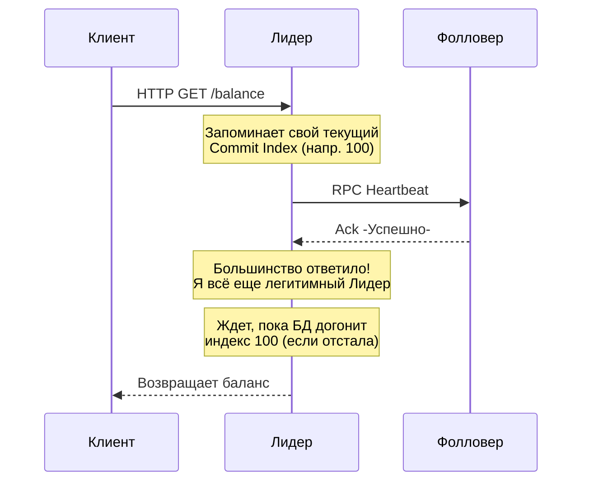

В предыдущих статьях мы разобрали, как узлы выбирают Лидера ([[3. Raft. Leader election]]) и как этот Лидер заставляет Фолловеров записывать свои команды в Журнал ([[4. Raft. Log replication]]). 

Казалось бы, алгоритм завершен: выбрали Лидера, раскидали лог по узлам, дождались большинства (Кворума) — и готово, можно отвечать клиенту HTTP 200 OK. 

Но дьявол распределенных систем кроется в крайних случаях (corner cases). Что, если Лидер успел скопировать данные на большинство серверов, но **упал за наносекунду до того**, как успел пометить эту запись зафиксированной (Committed) и отправить ответ клиенту? 

Новый Лидер увидит эту запись в логах, но как ему понять, стоит ли её фиксировать, или её нужно затереть? Без строгих математических гарантий безопасности (Safety) наша база данных рано или поздно перезапишет уже подтвержденную транзакцию, и бизнес потеряет деньги.

## Фундаментальная гарантия: State Machine Safety

Главная цель любого алгоритма консенсуса выражается одним правилом:

> **State Machine Safety Property:** Если какой-либо сервер применил запись лога с определенным индексом к своей базе данных (State Machine), никакой другой сервер никогда не сможет применить другую запись для этого же индекса.

Чтобы обеспечить это правило, Raft использует два элегантных механизма, которые связывают воедино Выборы и Репликацию.

## Механизм 1: Математика пересечения Кворумов

В статье про выборы мы упоминали **Election Restriction** (Ограничение выборов): Фолловер не отдаст свой голос Кандидату, если лог Кандидата старше (меньший Терм последней записи) или короче (тот же Терм, но меньший Индекс), чем лог самого Фолловера.

Почему это математически гарантирует безопасность?

Представь кластер из 5 узлов. Лидер успешно зафиксировал (committed) запись `X`. Это значит, что запись `X` физически лежит на дисках как минимум у 3 узлов (Кворум А).
Внезапно Лидер падает. Начинаются новые выборы. Чтобы победить, новому Кандидату тоже нужно получить 3 голоса (Кворум Б).

**Суть пересечения:** В системе из 5 узлов любые две группы по 3 узла **обязательно имеют как минимум один общий узел**. 

Это значит, что в Кворуме Б гарантированно есть хотя бы один сервер, который уже сохранил запись `X`. Когда "отстающий" Кандидат (у которого нет записи `X`) попросит голос у этого сервера, сервер сравнит логи, увидит, что лог Кандидата устарел, и **откажет ему**. Отстающий Кандидат никогда не наберет Кворум и не станет Лидером.

Лидером может стать только тот узел, который уже содержит все зафиксированные записи. Таким образом, данные никогда не теряются при смене власти.

## Механизм 2: Проблема прошлых эпох (Самое сложное в Raft)

Есть один специфический сценарий (известный как Figure 8 в оригинальной статье по Raft), который ломает интуицию. 

Допустим, Лидер (Терм 2) получил от клиента запись, успел реплицировать её на большинство узлов, но **упал до фиксации (commit)**. 
Выбирается новый Лидер (Терм 3). Он видит эту запись из Терма 2 на большинстве узлов. 

> [!warning] Ловушка / Gotcha: Логичная, но фатальная ошибка
> Интуитивно кажется, что новый Лидер должен рассуждать так: "Эта запись из Терма 2 уже есть у большинства. Отлично, значит я могу смело объявить её зафиксированной (Committed) и применить к БД!".
> **Это категорически запрещено в Raft.** > Если Лидер Терма 3 сделает так, а потом сам мгновенно упадет, может возникнуть ситуация, когда старый, "отставший" узел из Терма 1 внезапно проснется, каким-то чудом (за счет голосов других отставших узлов) выиграет выборы с Термом 4 и **затрет** эту "зафиксированную" запись, нарушив State Machine Safety.

**Железное правило Raft:** Лидер имеет право фиксировать (commit) записи **только из своей текущей эпохи (Терма)** путем подсчета реплик на большинстве узлов. 

Записи из *предыдущих* Термов Лидер никогда не фиксирует напрямую. Он просто продолжает добавлять новые записи своей эпохи. Как только **хотя бы одна запись текущей эпохи** будет успешно сохранена на большинстве узлов, **все предыдущие записи в логе автоматически считаются зафиксированными**. Это работает благодаря правилу Log Matching (о котором мы говорили в прошлой статье).

## Под капотом: Raft в Go и канал Ready

Чтобы понять, как эти гарантии превращаются в Go-код, давай заглянем в архитектуру `etcd/raft`. Это библиотека, на которой работают Kubernetes, CockroachDB и Yandex Database.

Авторы `etcd/raft` изолировали всю сложную математику Raft в чистую функцию, которая не делает системных вызовов (ни сети, ни диска). Взаимодействие с твоим Go-бэкендом происходит через канал `Ready()`.

Когда стейт-машина Raft понимает, что нужно что-то сохранить на диск (WAL) или применить к бизнес-БД, она выплевывает структуру `Ready`. Твой цикл (`select-loop`) должен её обработать в строгом порядке:

```go
// Идиоматичный цикл обработки узла на базе etcd/raft
for {
    select {
    case rd := <-raftNode.Ready():
        // 1. Механическая симпатия: Сначала ПИШЕМ НА ДИСК (fsync)
        // HardState содержит текущий Term и Vote (защита от Split-Brain при рестарте)
        // Entries - это новые записи лога, которые мы еще не закоммитили
        saveToDiskWAL(rd.HardState, rd.Entries)
        
        // 2. Отправляем сообщения по сети Фолловерам (RPC AppendEntries)
        // Только ПОСЛЕ того, как сохранили себе на диск!
        sendToPeersOverNetwork(rd.Messages)
        
        // 3. Безопасность: Применяем к БД только ЗАФИКСИРОВАННЫЕ записи
        for _, entry := range rd.CommittedEntries {
            // Здесь выполняется бизнес-логика (например, UPDATE users SET balance)
            applyToStateMachine(entry)
        }
        
        // 4. Говорим рантайму Raft, что мы всё обработали
        raftNode.Advance()
    }
}
```

> [!info] Под капотом: Идемпотентность стейт-машины
> Обрати внимание, что при краше сервера (OOM, panic) и последующем перезапуске, Raft может выдать тебе в массив `rd.CommittedEntries` записи, которые ты **уже применял** к БД до падения (но не успел сделать snapshot).
> Поэтому твоя функция `applyToStateMachine` **обязана быть идемпотентной**. Ты должен сохранять индекс последней примененной записи в саму БД в одной транзакции с бизнес-данными, чтобы при рестарте игнорировать дубликаты.

## Проблема "Грязного чтения" (Stale Reads)

Если Лидер — это единственный узел, который принимает решения, можно ли просто читать данные из него без записи в лог? Клиент делает HTTP GET, Лидер берет данные из памяти и отдает.

> [!tip] Собеседование
> **Вопрос:** Если мы будем выполнять операции чтения (Read-Only) на Лидере локально, без прохождения через Raft-лог, чем это грозит?
> **Ответ:** Это грозит чтением устаревших данных (Stale Read). Представьте, что произошел обрыв сети (Partition). Наш Лидер оказался в меньшинстве, и остальной кластер уже выбрал нового Лидера и обновил данные. Наш старый Лидер не знает, что он "свергнут" (пульсы до него не доходят). Если клиент спросит у него данные напрямую, он отдаст устаревшую информацию.

Чтобы гарантировать **Linearizability** (Строгую консистентность) для операций чтения, в Raft реализован механизм **ReadIndex**:



1. Клиент просит прочитать данные.
2. Лидер запоминает текущий `CommitIndex` (допустим, 100).
3. Лидер рассылает пустой пульс (`Heartbeat`) всему кластеру.
4. Если большинство ответило — Лидер убеждается, что его не свергли.
5. Лидер ждет, пока его локальная стейт-машина применит все записи вплоть до индекса 100.
6. Только после этого Лидер берет данные из стейт-машины и возвращает клиенту.

Этот подход стоит одного лишнего сетевого RTT (Round Trip Time). 
Для экстремальной оптимизации используют механизм **Lease Read** (Чтение по аренде), где Лидер полагается на точность системных часов и считает себя легитимным Лидером на время `Election Timeout`, отдавая данные мгновенно из локальной памяти. Но, как мы знаем из статьи про часы ([[5. Time и clock drift]]), если часы "прыгнут", Lease Read может вернуть Stale Data.

## Итог всего Raft

Мы завершили разбор самого популярного алгоритма консенсуса современности.

1. **Raft разделил сложную проблему на понятные части:** Leader Election, Log Replication, Safety.
2. **Safety базируется на пересечении Кворумов:** Лидером физически не может стать узел, у которого нет всех зафиксированных записей.
3. **Безопасность фиксации:** Лидер никогда не коммитит старые Термы подсчетом реплик, спасая систему от перезаписи истории при массовых сбоях.
4. **ReadIndex:** Чтения без записи в лог требуют проверки легитимности Лидера через пульс, иначе есть риск прочитать "призрачные" данные в изолированном сегменте сети.

Raft победил в индустрии благодаря своей простоте для разработчиков. Но справедливости ради, до его появления академический мир (и системы вроде Google Chubby и Spanner) использовали другой, гораздо более сложный алгоритм. В следующей статье мы отдадим дань уважения математической классике и посмотрим, как она устроена в общих чертах: [[6. Paxos обзорно]].