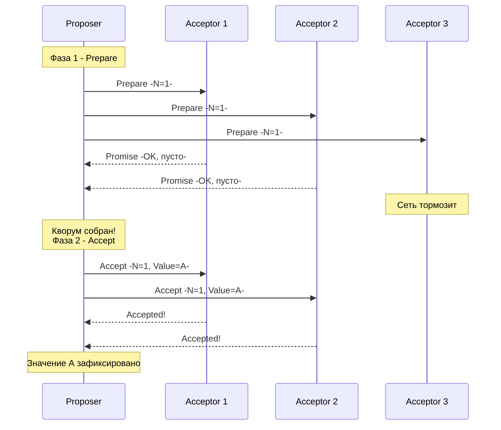

В предыдущих статьях (особенно в [[5. Raft. Safety и гарантии]]) мы досконально разобрали Raft — алгоритм, который де-факто управляет современным Cloud Native миром. Он понятен, он имеет эталонную реализацию на Go (`etcd/raft`), и его легко дебажить.

Но если ты придешь на System Design интервью в бигтех (особенно в Google) и тебя спросят про консенсус, разговор неизбежно зайдет о **Paxos**. 

Paxos — это дедушка всех алгоритмов консенсуса. Он был придуман Лесли Лэмпортом в 1989 году (статья "The Part-Time Parliament"). На Paxos построена вся внутренняя инфраструктура Google (Chubby, Spanner), AWS и многие классические базы данных вроде Cassandra (для легковесных транзакций - LWT).

Если Raft — это строгий инженерный чертеж, то Paxos — это чистая, абстрактная математика. Давай разберемся, как он работает и почему индустрия в итоге сбежала от него к Raft.

## Философия Paxos: Анархия вместо Диктатуры

Главное фундаментальное отличие Paxos от Raft заключается в отношении к Лидеру.

В [[2. Raft. Основы]] мы выяснили, что Raft использует концепцию **Сильного Лидера (Strong Leader)**. Лог Лидера — это закон. Только Лидер принимает запросы и только Лидер диктует Фолловерам, что писать.

**Paxos (в его базовой версии) — это протокол без лидера (Leaderless).** В Paxos любой узел в любой момент времени может предложить свое значение. Система спроектирована так, чтобы математически гарантировать: даже если десять узлов одновременно предложат разные значения, кластер выберет (зафиксирует) только **одно** из них, и все узлы с этим согласятся.

## Роли в Paxos

Вместо Фолловеров и Лидеров, Paxos разделяет ответственность на три логические роли (один физический сервер на Go может выполнять все три роли одновременно):

1. **Proposers (Предлагающие):** Получают запросы от клиентов и пытаются убедить кластер принять определенное значение.
2. **Acceptors (Принимающие):** Голосуют за предложения. Это "память" кластера. Именно они формируют Кворум.
3. **Learners (Изучающие):** Просто узнают, какое значение в итоге было выбрано кластером, чтобы применить его к своей базе данных и ответить клиенту.

## Две фазы Basic Paxos

Basic Paxos решает только одну задачу: **как договориться ровно об одном значении**. 
Процесс достижения консенсуса всегда разбит на две сетевые фазы (Phase 1 и Phase 2). 

> [!info] Под капотом: Номер Предложения (Proposal Number)
> Чтобы различать предложения, каждый Proposer генерирует уникальный, монотонно возрастающий номер — `N`. Это прямой аналог `Term` в Raft. Обычно номер состоит из таймстемпа и ID самого узла `[Timestamp]-[NodeID]`, чтобы номера никогда не пересекались.

### Фаза 1: Prepare и Promise (Подготовка и Обещание)
Цель первой фазы — "застолбить" номер предложения и узнать, не принял ли кластер какое-то значение до нас.

1. **Prepare:** `Proposer` выбирает номер `N` и отправляет запрос `Prepare N` всем `Acceptors`. Значение -саму полезную нагрузку- он пока НЕ отправляет.
2. **Promise:** `Acceptor` получает запрос. У него есть жесткое правило:
   * *Если `N` больше любого номера, который он видел ранее*, он отвечает обещанием (`Promise`): "Я обещаю больше не принимать предложения с номерами меньше `N`".
   * *Критичная деталь:* Если `Acceptor` ранее уже принял какое-то значение `Value=X` от другого Proposer-а, он обязан вернуть это значение в своем ответе: `Promise N, AcceptedValue=X, AcceptedN=...`.

### Фаза 2: Accept и Accepted (Принятие)
Цель второй фазы — зафиксировать значение, если большинство дало обещание.

1. **Accept Request:** `Proposer` собирает ответы. Если он получил `Promise` от **Кворума** (большинства), он может переходить ко второй фазе.
   * *Что предлагать?* Если кто-то из Acceptor-ов в Фазе 1 вернул уже принятое значение `Value=X`, наш `Proposer` **обязан** отказаться от своего изначального значения и предложить кластеру зафиксировать именно `X`.
   * Если все Acceptor-ы ответили пустотой (никто еще ничего не принимал), `Proposer` предлагает свое собственное значение.
   Он рассылает запрос `Accept N, Value`.
2. **Accepted:** `Acceptor` получает `Accept N, Value`. Он принимает это значение и записывает его на диск, **только если** за это время не успел дать обещание какому-то другому Proposer-у с номером больше `N`.
3. После того как Кворум `Acceptors` принял значение, оно считается зафиксированным (Chosen). Об этом уведомляются `Learners`.

## Dueling Proposers (Дуэль предложений) и Livelock

У анархии есть цена. Что произойдет, если два Proposer-а (Узел 1 и Узел 2) начнут одновременно слать запросы?

1. Узел 1 шлет `Prepare N=1`. Кворум обещает.
2. Узел 2 шлет `Prepare N=2`. Кворум обещает (так как 2 > 1).
3. Узел 1 шлет `Accept N=1, Value=A`. Кворум **отклоняет**, так как они уже пообещали Узлу 2 не принимать ничего меньше 2.
4. Узел 1 генерирует `Prepare N=3`. Кворум обещает.
5. Узел 2 шлет `Accept N=2, Value=B`. Кворум **отклоняет**, так как они пообещали Узлу 1 ничего меньше 3 не брать.

Они будут бесконечно перебивать номера друг друга. Это состояние **Livelock**. 

> [!warning] Ловушка / Gotcha: Решение Livelock
> Чтобы решить проблему дуэли, в Paxos приходится внедрять случайные таймауты (Exponential Backoff) или... выбирать "Отличного Proposer-а" (Distinguished Proposer), который временно становится единственным, кто имеет право делать предложения. 
> Иронично, но чтобы заставить Leaderless-протокол работать эффективно под нагрузкой, инженерам пришлось "сбоку" прикручивать концепцию Лидера!

## От Basic Paxos к Multi-Paxos

Basic Paxos описывает, как договориться только об одной переменной. Но для баз данных нам нужен распределенный Журнал (Log), где лежат тысячи команд. 

Алгоритм, который договаривается о массиве значений, называется **Multi-Paxos**. 
Суть в том, что мы запускаем отдельный инстанс Basic Paxos для *каждого* индекса в логе. 

Чтобы не делать 2 сетевых фазы (Prepare и Accept) для каждой строчки лога (это убьет производительность), в Multi-Paxos выбранный Лидер делает фазу `Prepare` один раз для всего лога вперед. После этого он просто шлет `Accept` сообщения потоком.

**Сложность:** В оригинальной статье Лэмпорта Multi-Paxos описан буквально в нескольких абзацах. Там нет жесткой спецификации:
* Как именно выбирать Лидера?
* Как реплицировать лог, если узлы отстали?
* Как безопасно изменять конфигурацию кластера (добавлять/удалять узлы)?

> [!tip] Собеседование
> **Вопрос:** Если вы читали статью про Paxos, почему инженеры говорят, что "существует только один алгоритм консенсуса — Paxos, а всё остальное — лишь его вариации"?
> **Ответ:** С математической точки зрения Raft — это просто сильно урезанный, жестко специфицированный диалект Multi-Paxos. Raft берет за основу концепцию выделенного Лидера из Multi-Paxos, но накладывает более строгие правила (например, лог может течь только от Лидера к Фолловерам, записи в логе должны быть строго последовательными).

## Почему индустрия перешла на Raft?

Когда инженер Google Чад Дарби реализовывал Paxos для системы Chubby (координатор распределенных блокировок), он написал знаменитую фразу:
*"Существуют значительные разрывы между описанием алгоритма Paxos и потребностями реальной системы. В итоге, любая реальная система базируется на недоказанном протоколе, который отдаленно напоминает Paxos".*

1. **Отсутствие стандарта:** Ты не найдешь двух одинаковых реализаций Paxos. Cassandra использует свой диалект для CAS-операций. CockroachDB начинал с Raft именно потому, что для него была готовая `etcd/raft` реализация на Go, в то время как Paxos пришлось бы писать и доказывать с нуля.
2. **Сложность понимания стейта:** В Raft лог всегда линеен. В Paxos в логе могут быть "дыры" (индекс 1 и 3 согласованы, а индекс 2 еще нет). Код, который резолвит эти дыры и применяет их к стейт-машине в правильном порядке, невероятно сложен и является источником бесконечных Data Races в Go.
3. **Отладка:** Если Raft кластер завис, ты можешь просто запросить `Term` и `CommitIndex` у узлов и понять, кто отстает. В Paxos состояние системы размазано по всем узлам, и восстановить причину бага (почему значение не было принято) бывает практически невозможно.

## Итог

1. **Paxos** — это теоретический фундамент консенсуса. Он гарантирует безопасность (Safety) даже в самых асинхронных и враждебных сетях.
2. **Leaderless природа:** В отличие от Raft, в базовом Paxos нет Лидера. Любой узел может предложить значение.
3. **Цена свободы:** Отсутствие лидера приводит к проблеме Livelock (дуэль предложений) и сложнейшей логике заполнения "дыр" в журнале транзакций.
4. **Реальность:** Несмотря на академическое величие Paxos, Go-разработчики в 99% случаев используют Raft-библиотеки, так как они предоставляют готовые State Machines без необходимости доказывать теоремы при каждом коммите.

На этом мы завершаем теоретический блок алгоритмов консенсуса. Мы поняли, как узлы договариваются между собой. Теперь давай посмотрим, как эти алгоритмы (будь то Raft или Paxos) применяются в бэкенд-инженерии для решения повседневных бизнес-задач. 

Первый и самый важный паттерн, который мы разберем — это то, как заблокировать общий ресурс, чтобы два микросервиса не записали в него данные одновременно. Переходим к практике: [[7. Distributed locks]].