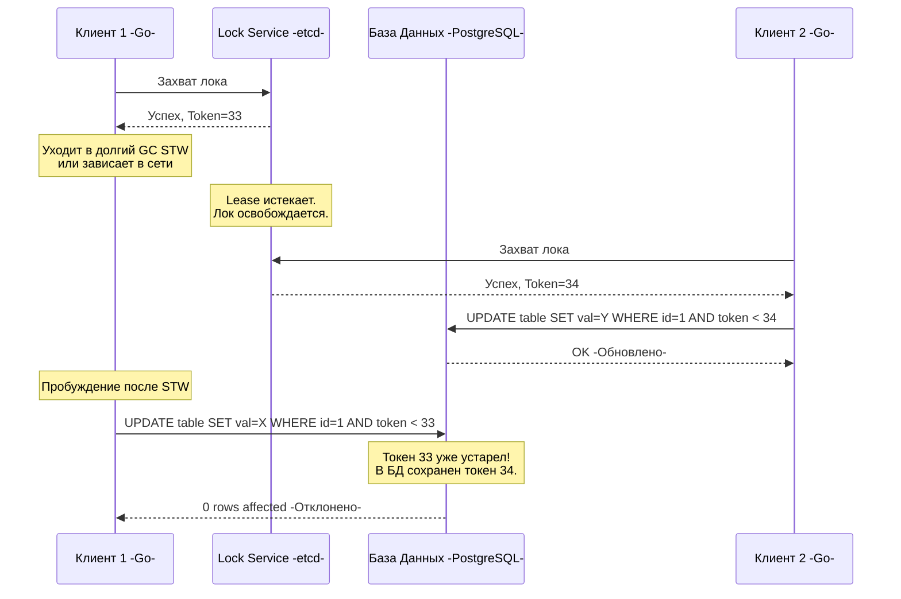

В рамках одного Go-приложения защитить общие данные от конкурентного доступа легко: ты берешь `sync.Mutex`, вызываешь `Lock()` и спокойно работаешь. Компилятор и рантайм делают всю грязную работу за тебя. 

Но когда твое приложение разворачивается в Kubernetes на 50 реплик (подов), локальный мьютекс становится бесполезен. Каждая реплика имеет свое изолированное адресное пространство памяти. Если две разные реплики попытаются одновременно списать деньги с одного и того же счета в базе данных или обновить один и тот же файл в S3, произойдет состояние гонки (Race Condition) на уровне инфраструктуры.

Нам нужен механизм, который заставит 50 независимых серверов выстроиться в очередь. Нам нужен **Distributed Lock (Распределенная блокировка)**.

## Mechanical Sympathy: Локальный vs Распределенный мьютекс

Чтобы понять глубину проблемы, давай сравним, чем мы жертвуем при переходе к распределенным блокировкам.

> [!info] Под капотом: Как работает `sync.Mutex` в Go
> Локальный мьютекс (`sync.Mutex`) в Go состоит всего из двух полей (8 байт): `state int32` и `sema uint32`. 
> 1. Сначала он пытается захватить блокировку через атомарную операцию процессора `Compare-And-Swap` (CAS). Это происходит в User Space за наносекунды, оперируя L1/L2 кэшем CPU.
> 2. Если мьютекс занят, рантайм Go переводит горутину в спящий режим (очередь ожидания на семафоре) через внутреннюю функцию `runtime_SemacquireMutex`. Поток операционной системы `M` при этом не блокируется, он берет другую горутину.
> 3. Когда мьютекс освобождается, вызывается `futex` (Fast Userspace Mutex) или его аналог в ядре ОС, который мгновенно будит ожидающую горутину.
> 
> Итог: **Задержка — наносекунды. Надежность — 100% (Fail-Stop).** Если процесс упадет, ОС сама освободит всю память. Никаких «повисших» мьютексов.

**Распределенный лок** ломает эти гарантии:
1. Захват блокировки требует похода по сети. Задержка возрастает с наносекунд до десятков миллисекунд (в 1 000 000 раз медленнее).
2. Клиент может упасть (OOM, panic) **после** захвата лока. Если лок не имеет таймаута, ресурс останется заблокированным навечно (Deadlock всей системы).
3. Из-за проблем со временем ([[5. Time и clock drift]]) и сборщиком мусора, система может решить, что клиент "умер", отдать лок другому, а первый клиент внезапно "оживет".

## Наивный подход: Redis и SETNX

Чаще всего Junior/Middle разработчики тянутся за Redis, когда им нужен распределенный лок. Команда `SETNX` (Set if Not eXists) кажется идеальным кандидатом.

```go
// Псевдокод базового Redis-лока
success, err := redisClient.SetNX(ctx, "lock:user:123", "my-unique-id", 10*time.Second).Result()
if err != nil || !success {
    return errors.New("не удалось захватить блокировку")
}

defer redisClient.Del(ctx, "lock:user:123") // Освобождаем лок
// Выполнение бизнес-логики...
```

Мы ставим таймаут в 10 секунд (TTL), чтобы предотвратить Deadlock, если наш Go-процесс умрет (Crash/OOM) во время выполнения работы. Через 10 секунд Redis сам удалит ключ.

### Почему это сломается? (Проблема STW)

Давай представим сценарий, который стабильно убивает подобные архитектуры на высоких нагрузках.

1. **Клиент 1 (Go)** захватывает лок на 10 секунд и начинает работу.
2. В рантайме Go запускается сборщик мусора (GC). Из-за огромной кучи (например, загрузили тяжелый кэш) фаза Stop-The-World (STW) или вытеснение планировщиком ОС занимает аномально долго. Или просто тяжелый SQL-запрос выполняется 12 секунд.
3. Проходит 10 секунд. **Redis удаляет лок по таймауту**.
4. **Клиент 2** запрашивает лок `lock:user:123`. Redis отвечает "Успех" (лок ведь свободен). Клиент 2 начинает работу.
5. **Клиент 1** просыпается после паузы GC. В его коде вызов функции еще не завершен. Он идет в БД и записывает данные.
6. **Клиент 2** тоже идет в БД и записывает данные.
7. **Итог:** Защита пробита, Race Condition в базе данных, потерянные деньги бизнеса.

> [!warning] Ловушка / Gotcha: Redlock и часы
> В Redis есть алгоритм `Redlock`, предложенный создателем Redis (Salvatore Sanfilippo) для кластеров. Но исследователь распределенных систем Мартин Клеппман (Martin Kleppmann) жестко раскритиковал его. 
> `Redlock` опирается на то, что физические часы на серверах Redis тикают примерно с одинаковой скоростью. Если часы на одном из узлов Redis "прыгнут" вперед (из-за NTP-синхронизации, см. [[5. Time и clock drift]]), узел сбросит лок раньше времени, и защита рассыплется. Для критичных финансовых транзакций Redis-локи использовать **категорически запрещено**.

## Решение для взрослых: Консенсус и etcd

Для по-настоящему надежных распределенных блокировок (где цена ошибки — разрушение БД) используются CP-системы на базе алгоритма консенсуса, такие как **etcd** (основан на Raft, см. [[2. Raft. Основы]]) или **ZooKeeper**.

Как etcd решает проблему "умершего клиента" без привязки к жестким таймаутам? Через механизм **Lease (Аренда)** и **KeepAlive**.

1. Go-клиент создает `Lease` в etcd с коротким TTL (например, 5 секунд).
2. Клиент захватывает лок и привязывает его к этому Lease.
3. Библиотека etcd в Go запускает **фоновую горутину**, которая каждую секунду отправляет `KeepAlive` (пульс) в кластер etcd по gRPC, продлевая аренду.
4. Если Go-процесс физически падает (OOM), горутина умирает, пульс прекращается. Через 5 секунд etcd автоматически удаляет лок, освобождая ресурс для других.

Но что насчет пауз GC? Защитит ли нас etcd, если Go-процесс зависнет на 10 секунд? 
Если горутина `KeepAlive` тоже заморожена, аренда истечет, и etcd отдаст лок другому. Мы возвращаемся к проблеме двух одновременных записей.

## Бронебойная защита: Fencing Tokens (Токены ограждения)

Единственный математически доказанный способ защиты ресурса в распределенной системе — это использовать механизм **Fencing Token**. Этот паттерн требует участия *самой базы данных* или системы, куда мы пишем.

Консенсус-система (etcd) при выдаче лока возвращает не просто "ОК", а монотонно возрастающее число — Токен (например, ревизию в etcd).



> [!tip] Собеседование
> **Вопрос:** Если мы используем PostgreSQL, как реализовать проверку Fencing Token без потери производительности?
> **Ответ:** Добавить колонку `last_fencing_token` в таблицу. В запросе обновления мы делаем условие: `UPDATE target_table SET data = $1, last_fencing_token = $2 WHERE id = $3 AND last_fencing_token < $2`. Если наш токен оказался старым, база данных просто не обновит ни одной строки (возвращая `0 rows affected`). Клиент проверит это и поймет, что его лок "протух" во время паузы.

## Идиоматичный Go: Реализация лока через etcd

В экосистеме Go пакет `go.etcd.io/etcd/client/v3/concurrency` предоставляет готовую, production-ready реализацию распределенного лока, которая под капотом использует механизм префиксов и ревизий (Revision) Raft-лога.

```go
package main

import (
	"context"
	"log"
	"time"

	clientv3 "go.etcd.io/etcd/client/v3"
	"go.etcd.io/etcd/client/v3/concurrency"
)

func DoCriticalWorkWithLock(ctx context.Context, cli *clientv3.Client) error {
	// 1. Создаем сессию. Под капотом она создает Lease и запускает
	// фоновую горутину с KeepAlive для поддержания аренды.
	session, err := concurrency.NewSession(cli, concurrency.WithTTL(5))
	if err != nil {
		return err
	}
	// Важно закрыть сессию, чтобы немедленно освободить Lease при нормальном выходе
	defer session.Close()

	// 2. Создаем объект мьютекса в пространстве ключей etcd
	mu := concurrency.NewMutex(session, "/my-distributed-lock/resource-1")

	// 3. Пытаемся захватить блокировку.
	// Если лок занят, Lock() заблокирует горутину и будет ждать через etcd Watch API,
	// пока ключ не освободится. Это НЕ активный пулинг (CPU не грузится).
	log.Println("Ожидание блокировки...")
	if err := mu.Lock(ctx); err != nil {
		return err // Вернет ошибку, если ctx был отменен по таймауту
	}
	
	log.Println("Лок захвачен! Fencing Token (Revision):", mu.Header().Revision)

	// Гарантируем освобождение блокировки
	defer func() {
		// Создаем новый контекст для Unlock, так как родительский мог уже истечь
		unlockCtx, cancel := context.WithTimeout(context.Background(), 2*time.Second)
		defer cancel()
		if err := mu.Unlock(unlockCtx); err != nil {
			log.Printf("Ошибка при освобождении лока: %v", err)
		}
	}()

	// 4. Выполняем бизнес-логику (передавая Fencing Token в БД)
	// doWork(ctx, mu.Header().Revision)
	time.Sleep(2 * time.Second)

	return nil
}
```

## Итог

1. **Redis (AP система) хорош только для некритичных блокировок** (например, чтобы не слать пользователю два email-письма). Он не защитит твои данные при сплит-брейнах или дрейфе часов.
2. **Консенсус-системы (etcd/Zookeeper) обязательны** там, где цена гонки данных — разрушение консистентности базы данных.
3. Никакой распределенный лок не спасет от пауз Garbage Collector-а в рантайме Go. Если система зависит от строгой очередности (Linearizability), база данных должна проверять **Fencing Token**.
4. В Go всегда используй готовые клиенты (например, `concurrency` в etcd) — они правильно реализуют Lease, KeepAlive и паттерн наблюдения (Watch), не сжигая CPU бесконечным опросом (polling).

Блокировки отлично подходят, когда тысячам воркеров нужно по очереди получать доступ к мелкому ресурсу. Но что, если нам нужно, чтобы в огромном кластере микросервисов только **один** инстанс выполнял роль координатора-планировщика в течение длительного времени, а все остальные просто стояли в горячем резерве? 

Для этого используется другой архитектурный паттерн, вытекающий из консенсуса, о котором мы поговорим в следующей статье: [[8. Leader election в системах]].