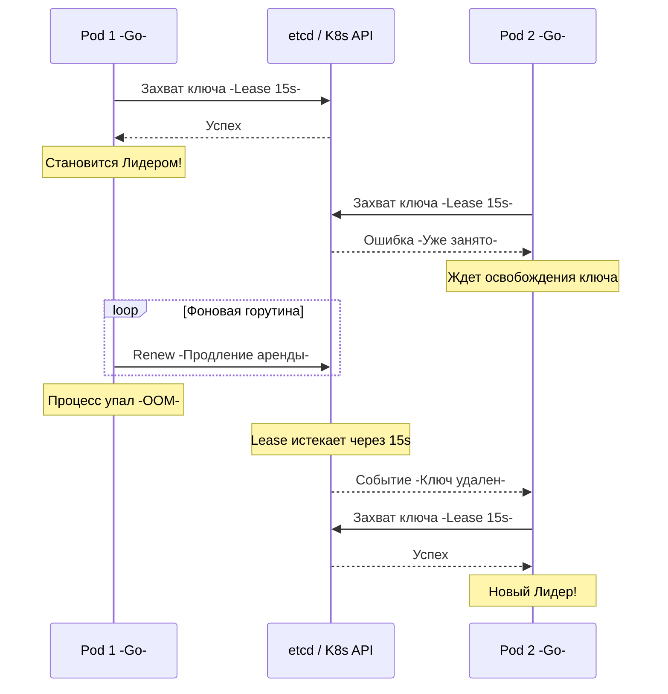

В предыдущих статьях мы погружались в алгоритмы консенсуса (Raft и Paxos) и разбирались, как базы данных (например, etcd) выбирают "главного" для обеспечения строгой консистентности. 

Но что, если ты пишешь не базу данных, а обычный stateless микросервис на Go (например, обработчик биллинга), который развернут в Kubernetes в 10 репликах (подах)? Тебе нужно, чтобы **только один** из этих подов выполнял фоновую задачу — например, списывал абонентскую плату по cron-расписанию или отправлял push-уведомления. Если два пода начнут делать это одновременно, бизнес потеряет деньги.

Здесь нам на помощь приходит паттерн **Leader Election (Выборы лидера в приложении)**. 

Важное уточнение: мы не будем писать алгоритм Raft внутри нашего бизнес-кода. Мы будем **использовать** внешнюю систему консенсуса (обычно etcd, Consul или Kubernetes API), чтобы наши Go-процессы договорились между собой.

## Зачем stateless-микросервисам Лидер?

Чаще всего Leader Election применяется в следующих сценариях:
1. **Singleton-воркеры:** Запуск периодических задач (CronJobs), которые нельзя распараллелить.
2. **Sequential Processing:** Чтение из очереди (например, партиции Kafka), где важен строгий порядок обработки событий одним консьюмером.
3. **External Rate Limiting:** Взаимодействие с внешним Legacy API, которое допускает строго одно активное соединение.

## Как это работает под капотом (Механика аренды)

Принцип выборов лидера в приложении строится поверх механизма распределенных блокировок (о которых мы говорили в статье [[7. Distributed locks]]).

Система консенсуса (например, `etcd`) предоставляет нам абстракцию **Lease (Аренда)**. 
1. Все инстансы твоего Go-сервиса одновременно пытаются создать уникальный ключ (Lock) в `etcd` с привязкой к Lease (например, на 15 секунд).
2. Только один инстанс преуспевает благодаря атомарной операции `Compare-And-Swap`. Он становится Лидером.
3. Остальные получают ошибку `Key already exists` и переходят в режим наблюдения (Watch), ожидая, когда ключ будет удален.
4. Инстанс-Лидер запускает фоновую горутину, которая регулярно (например, каждые 5 секунд) отправляет запросы `KeepAlive`, продлевая свою аренду.



## Leader Election в Kubernetes (client-go)

Если твой сервис крутится в Kubernetes, тебе не нужно напрямую ходить в `etcd` или тащить в проект Redis. Kubernetes API предоставляет готовый механизм `LeaderElection` из коробки, используя ресурс `Lease` (группа `coordination.k8s.io`).

Это абсолютный индустриальный стандарт для Go-бэкенда в K8s.

> [!info] Под капотом: K8s Lease
> Ресурс `Lease` — это легковесный объект в Kubernetes, созданный специально для heartbeat-механизмов. Ранее для этого абьюзили `ConfigMap` или `Endpoints`, что сильно нагружало API Server и контроллеры (каждое обновление конфигмапы триггерило тысячи event-ов по кластеру). `Lease` обновляется без лишнего шума.

Давай посмотрим на идиоматичный production-ready код с использованием библиотеки `k8s.io/client-go`.

```go
package main

import (
	"context"
	"log"
	"os"
	"time"

	metav1 "k8s.io/apimachinery/pkg/apis/meta/v1"
	"k8s.io/client-go/kubernetes"
	"k8s.io/client-go/rest"
	"k8s.io/client-go/tools/leaderelection"
	"k8s.io/client-go/tools/leaderelection/resourcelock"
)

func runLeaderElection(ctx context.Context) {
	// 1. Создаем клиент Kubernetes из In-Cluster конфигурации
	config, _ := rest.InClusterConfig()
	client := kubernetes.NewForConfigOrDie(config)

	// Уникальный ID текущего пода
	podID := os.Getenv("HOSTNAME")
	lockName := "my-billing-worker-lock"
	namespace := "production"

	// 2. Настраиваем объект блокировки (Lease)
	lock := &resourcelock.LeaseLock{
		LeaseMeta: metav1.ObjectMeta{
			Name:      lockName,
			Namespace: namespace,
		},
		Client: client.CoordinationV1(),
		LockConfig: resourcelock.ResourceLockConfig{
			Identity: podID,
		},
	}

	// 3. Запускаем машину состояний
	leaderelection.RunOrDie(ctx, leaderelection.LeaderElectionConfig{
		Lock:            lock,
		ReleaseOnCancel: true,
		LeaseDuration:   15 * time.Second, // На сколько выдается лок
		RenewDeadline:   10 * time.Second, // Как часто Лидер пытается продлить лок
		RetryPeriod:     2 * time.Second,  // Как часто Фолловеры пытаются захватить лок

		Callbacks: leaderelection.LeaderCallbacks{
			OnStartedLeading: func(ctx context.Context) {
				log.Printf("Я стал лидером: %s", podID)
				// ВАЖНО: Запускаем бизнес-логику здесь. 
				// Передаем внутрь ctx!
				doBusinessLogic(ctx)
			},
			OnStoppedLeading: func() {
				// Этот код выполнится, если мы потеряем лидерство 
				// (например, K8s API недоступен, и RenewDeadline просрочен).
				log.Printf("Я потерял лидерство: %s", podID)
				os.Exit(0) // Идиоматично просто убить под и дать K8s перезапустить его
			},
			OnNewLeader: func(identity string) {
				if identity == podID {
					return
				}
				log.Printf("Текущий лидер - %s. Ждем своей очереди...", identity)
			},
		},
	})
}
```

## Главная ловушка: Призрачный Лидер (Split-Brain)

В коде выше кроется самая опасная проблема выборов лидера в приложении.

Представь ситуацию: твой под (`Pod 1`) стал Лидером. Запустилась функция `doBusinessLogic(ctx)`. 
Она делает тяжелый запрос в базу данных или дергает внешнее API, что занимает 12 секунд.

В этот момент рантайм Go уходит в жесткую паузу (Stop-The-World) или планировщик ОС (CPU Throttling в Kubernetes) замораживает твой процесс на 15 секунд.
Фоновая горутина `client-go`, которая должна обновлять `Lease`, тоже заморожена.

1. Kubernetes видит, что `LeaseDuration` (15s) истек.
2. `Pod 2` замечает, что лок свободен, захватывает его и становится Лидером.
3. `Pod 2` начинает выполнять свою функцию `doBusinessLogic`.
4. В этот момент `Pod 1` "размораживается". 

> [!warning] Ловушка / Gotcha
> Что произойдет с `Pod 1`? Функция `doBusinessLogic` продолжит выполнение с того места, где остановилась! В системе появится **два активных Лидера одновременно**. Это классический Split-Brain.

### Mechanical Sympathy: Как защититься от призраков?

Ты не можешь отменить уже отправленный сетевой пакет или выполняющийся SQL-запрос. Но ты можешь минимизировать окно уязвимости.

Библиотека `client-go` при потере лидерства **отменяет (cancel)** переданный в `OnStartedLeading` контекст (`ctx`). Твоя бизнес-логика обязана маниакально проверять этот контекст на каждом шаге!

```go
// ПРАВИЛЬНЫЙ ПОДХОД
func doBusinessLogic(ctx context.Context) {
    for {
        select {
        case <-ctx.Done():
            // Мы потеряли лидерство! Немедленно прекращаем работу.
            log.Println("Контекст отменен, останавливаем воркер")
            return
        default:
            // Безопасная проверка контекста перед критичным действием
        }

        // Передаем ctx во ВСЕ сетевые и I/O вызовы
        err := db.ExecContext(ctx, "UPDATE billing SET status = 'processed'")
        if err != nil {
            // Обработка
        }
        
        time.Sleep(1 * time.Second) // Имитация работы
    }
}
```

> [!tip] Собеседование
> **Вопрос:** Спасет ли отмена контекста (`ctx.Done()`) от Split-Brain на 100%?
> **Ответ:** Нет. Между проверкой контекста и моментом, когда TCP-пакет физически покинет сетевую карту сервера, может пройти время, в течение которого произойдет пауза GC. Контекст в Go — это кооперативная (мягкая) отмена. 
> Абсолютную 100% защиту гарантируют только **Fencing Tokens** (Токены ограждения), проверяемые на стороне самой базы данных. О них мы подробно говорили в статье [[7. Distributed locks]]. Выборы Лидера в приложении — это оптимизация для снижения конкуренции (нагрузки), но финальная консистентность всегда должна обеспечиваться на уровне хранилища данных.

## Итог раздела "Консенсус"

9. **Выборы Лидера в приложении** — это паттерн выделения одного Worker-а из пула реплик для выполнения эксклюзивных задач.
10. **Инфраструктура:** Идиоматично делегировать эту задачу проверенным CP-системам (Kubernetes Lease API, etcd, Consul). Не используй Redis для критичного Leader Election.
11. **Жизненный цикл:** Лидерство удерживается механизмом Heartbeat (KeepAlive). Если сеть или процесс тормозят, лок будет передан другому.
12. **Контекст:** Бизнес-логика лидера обязана жестко реагировать на отмену контекста (`<-ctx.Done()`), чтобы минимизировать риск состояния Split-Brain.

Мы закончили огромный и сложный раздел про Консенсус. Мы поняли, как узлы договариваются между собой и как выбирают главных. Но консенсус (строгая консистентность) — это медленно. 

В реальном мире микросервисов мы часто не можем позволить себе платить задержкой (Latency) за каждый запрос. Мы начинаем ослаблять гарантии согласованности ради скорости. Какие модели консистентности существуют и как найти баланс между скоростью и целостностью данных? Переходим к новому разделу: [[1. Consistency модели]].