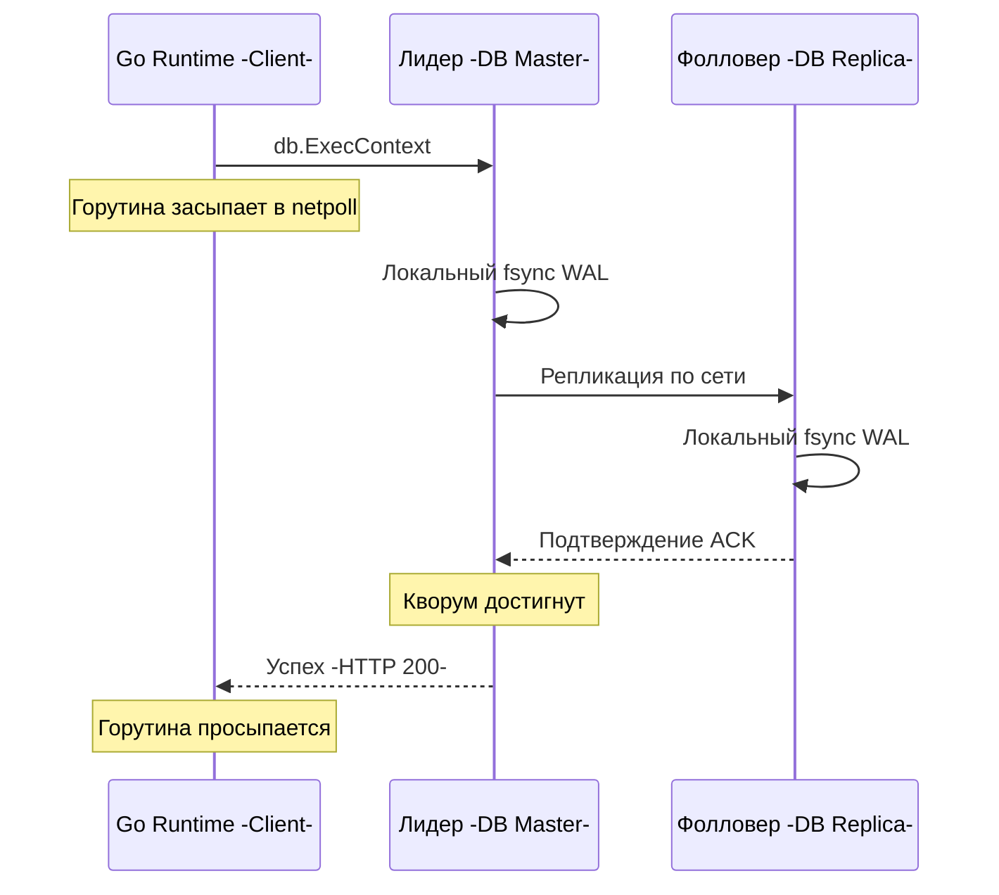
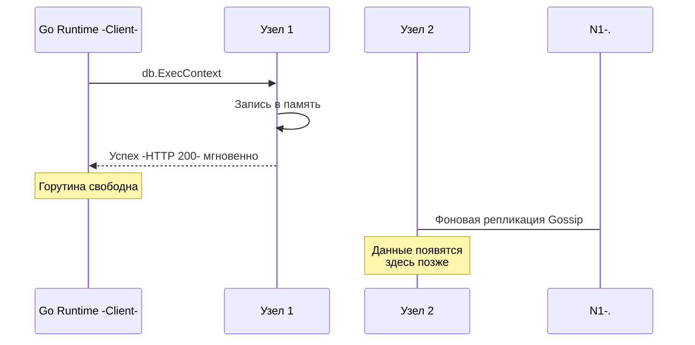

В прошлой статье [[1. Consistency модели]] мы разобрались, что согласованность — это контракт между распределенной базой данных и твоим кодом. Мы посмотрели на спектр этих моделей, от строгих до самых слабых. 

Теперь пришло время столкнуть лбами две самые популярные парадигмы, которые ты будешь встречать в 99% production-систем: **Strong Consistency (Строгая согласованность / Линеаризуемость)** и **Eventual Consistency (Согласованность в конечном счете)**. 

Выбор между ними — это не вопрос вкуса. Это инженерный компромисс, который диктует, как будет вести себя твой Go-код, сколько памяти он будет потреблять под нагрузкой и что увидят пользователи.

## Strong Consistency: Иллюзия монолита

**Строгая согласованность (Linearizability)** гарантирует: как только операция записи успешно завершена (клиент получил подтверждение), любое последующее чтение, к какому бы узлу кластера оно ни обратилось, вернет это новое значение. Система ведет себя так, словно существует всего одна копия данных.

Это идеальный мир для разработчика. Тебе не нужно думать о конфликтах или устаревших данных. Но физику обмануть нельзя, и за эту иллюзию мы платим жесточайшим налогом на производительность.

### Mechanical Sympathy: Налог на синхронизацию

Что происходит "под капотом", когда твой Go-бэкенд делает `INSERT` в строгую систему (например, в синхронный кластер PostgreSQL или etcd)?

Твоя горутина вызывает `db.ExecContext(ctx, query)`. Рантайм Go делает системный вызов `write` в TCP-сокет и "паркует" горутину (она переходит в состояние `Gwaiting`, ожидая ответа через `netpoll`).

А в это время на стороне базы данных разворачивается драма:
1. Master-узел получает запрос.
2. Он делает `write` и `fsync` в свой локальный WAL (Write-Ahead Log), сбрасывая кэши диска.
3. Он отправляет данные по сети на Реплики.
4. Реплики делают свои `write` и `fsync` на диск.
5. Реплики отправляют сетевой ACK -подтверждение- Мастеру.
6. Мастер убеждается, что собрал Кворум (большинство), и только после этого отправляет HTTP 200 OK твоему Go-коду.



**Цена вопроса:** Время выполнения твоего `db.ExecContext` — это сумма `RTT(до мастера) + Fsync(мастер) + RTT(до реплик) + Fsync(реплика) + RTT(обратно)`. 
Это десятки миллисекунд. Твоя горутина всё это время висит в памяти. Да, горутины дешевые (~2 КБ), но **соединения в пуле `database/sql` (или TCP-сокеты) ограничены**. При скачке RPS (Requests Per Second) твой пул соединений мгновенно исчерпается, и система начнет отказывать новым клиентам. Строгая согласованность радикально снижает пропускную способность (Throughput) системы.

## Eventual Consistency: Скорость ценой хаоса

**Согласованность в конечном счете (Eventual Consistency)** отказывается от иллюзии мгновенного распространения данных. Гарантия звучит так: *если новые записи прекратятся, то спустя некоторое время все узлы придут к единому состоянию*.

Это AP-системы (Cassandra, DynamoDB, асинхронные реплики SQL баз). Они созданы для того, чтобы "съедать" гигантский трафик без задержек.

### Mechanical Sympathy: Fire and Forget

Когда твой Go-код пишет в AP-базу данных (настроенную на Eventual Consistency, например, с Write Consistency Level = 1):

1. Узел получает запрос.
2. Он записывает данные в оперативную память (например, в Memtable в Cassandra) и, возможно, асинхронно сбрасывает в WAL без жесткого `fsync`.
3. Узел **мгновенно** отвечает твоему Go-клиенту HTTP 200 OK. Твоя горутина просыпается через 1-2 миллисекунды. Соединение возвращается в пул.
4. "Где-то в фоне" узел начинает рассылать эти данные соседям по кластеру (через протоколы Gossip / Anti-entropy).



Система работает с бешеной скоростью. Твой сервис выдерживает десятки тысяч RPS. Но что видит бизнес?

> [!warning] Ловушка / Gotcha: Аномалии чтения (Read-After-Write)
> Клиент загружает новую аватарку. Go-бэкенд пишет её в Узел 1 и мгновенно возвращает успех. Мобильное приложение клиента делает редирект на главную страницу и запрашивает данные профиля. Балансировщик нагрузки отправляет этот запрос (GET) на Узел 2. 
> Фоновая репликация (Gossip) еще не успела донести данные до Узла 2. Узел 2 честно отдает **старую** аватарку. 
> Клиент в ярости: "Где моя фотография?! Ваша система глючит!".

## Как это выглядит в коде (Эмуляция подходов)

Если бы мы писали брокер сообщений на Go, разница между этими подходами на уровне архитектуры рантайма выглядела бы так:

### Строгий подход (Synchronous Replication)
Мы блокируем горутину клиента, пока не дождемся ответов от реплик.

```go
func (s *Server) HandleWriteStrong(ctx context.Context, data []byte) error {
	// 1. Локальная запись
	if err := s.wal.Write(data); err != nil {
		return err
	}

	// 2. Синхронная репликация
	ackCh := make(chan struct{}, len(s.replicas))
	for _, replica := range s.replicas {
		go func(r *Replica) {
			if err := r.Send(ctx, data); err == nil {
				ackCh <- struct{}{}
			}
		}(replica)
	}

	// 3. Ждем кворума или таймаута
	acks := 1 // Учитываем себя
	quorum := (len(s.replicas) / 2) + 1

	for acks < quorum {
		select {
		case <-ackCh:
			acks++
		case <-ctx.Done():
			return fmt.Errorf("timeout waiting for quorum: %w", ctx.Err())
		}
	}

	return nil // Клиент получает Успех только после подтверждения большинства
}
```

### Eventual подход (Asynchronous Replication)
Мы отпускаем клиента мгновенно, сбрасывая работу в фоновый воркер-пул.

```go
func (s *Server) HandleWriteEventual(ctx context.Context, data []byte) error {
	// 1. Быстрая локальная запись (возможно только в RAM)
	if err := s.memtable.Write(data); err != nil {
		return err
	}

	// 2. Ставим задачу в фоновую очередь репликации (канал)
	select {
	case s.asyncReplicationQueue <- data:
		// Отправили в фон
	default:
		// Очередь переполнена (Backpressure)
		return errors.New("system overloaded")
	}

	// 3. Мгновенно возвращаем успех клиенту
	return nil 
}

// Фоновый воркер, живущий отдельно от жизненного цикла клиентского запроса
func (s *Server) backgroundReplicator() {
	for data := range s.asyncReplicationQueue {
		for _, replica := range s.replicas {
            // Если реплика недоступна, данные не потеряются, 
            // они будут доставлены позже через Gossip
			_ = replica.Send(context.Background(), data) 
		}
	}
}
```

> [!tip] Собеседование
> **Вопрос:** Если мы используем Cassandra (Eventual Consistency), можем ли мы сделать запрос строго консистентным?
> **Ответ:** Да. Модель согласованности в таких БД настраивается **на уровне каждого запроса** (Tunable Consistency). Если вы зададите `Write Consistency = QUORUM` и `Read Consistency = QUORUM`, система будет вести себя линеаризуемо (строго), но начнет тормозить. Главное правило: `R + W > N` (где N - размер кластера). Мы подробно разберем эту математику в статье [[4. Quorum]].

## Сравнение лоб в лоб

| Характеристика | Strong Consistency (Строгая) | Eventual Consistency (В конечном счете) |
| :--- | :--- | :--- |
| **Гарантии** | Чтение всегда возвращает последнюю запись. | Нет гарантий свежести данных. |
| **Latency (Задержка)** | Высокая (ожидание сетевых RTT и дискового I/O). | Очень низкая (отвечает мгновенно). |
| **Доступность (AP/CP)** | Падает при разрыве сети (CP). | Продолжает работать при разрыве сети (AP). |
| **Сложность бизнес-логики**| Низкая. Система проста и предсказуема. | Высокая. Нужно обрабатывать устаревшие данные и конфликты. |
| **Применение** | Биллинг, банковские счета, блокировки, транзакции заказов. | Лайки, аналитика, комментарии, IoT-телеметрия, ленты новостей. |

## Итог

1. **Strong Consistency** бережет нервы разработчиков и бизнеса, но не прощает высоких нагрузок и сетевых проблем. Ты должен защищать такие сервисы Rate Limiter-ами и держать большой запас соединений.
2. **Eventual Consistency** позволяет системе масштабироваться до бесконечности, но заставляет клиента смириться с "призраками" старых данных.

Но остается открытым самый страшный вопрос Eventual Consistency. Если узлы обновляются асинхронно, что произойдет, если два пользователя одновременно изменят одни и те же данные на двух разных, не успевших синхронизироваться узлах? У нас возникнет **Конфликт**, и узлы начнут верить в разные версии реальности. 

Как распределенные системы чинят эти конфликты во время чтения данных? Узнаем в следующей статье: [[3. Read repair]].