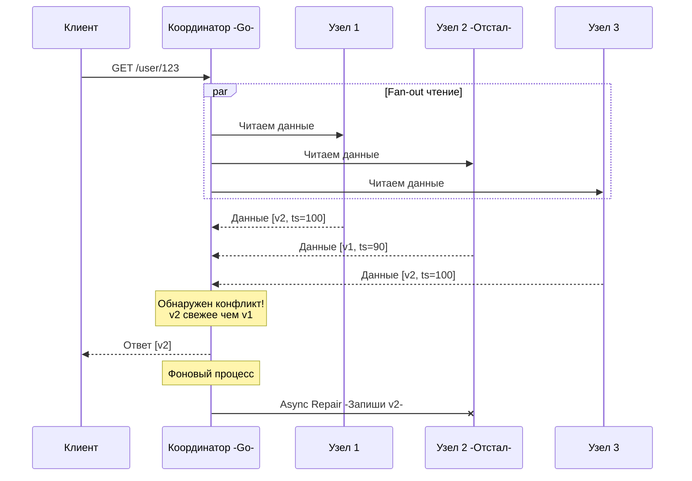

В прошлой статье [[2. Strong vs eventual consistency]] мы разобрали цену, которую приходится платить за скорость в системах с Eventual Consistency. Мы выяснили, что асинхронная репликация позволяет системе выдерживать гигантские нагрузки (AP-системы), но порождает проблему: разные узлы кластера могут иметь разные версии одних и тех же данных.

Возникает резонный вопрос: как система в конечном итоге (eventually) приходит к согласованности? 

Можно запустить тяжелый фоновый процесс, который будет постоянно сканировать все терабайты данных на всех дисках и синхронизировать их (это называется Anti-Entropy). Но это убьет дисковую подсистему (IOPS). 

Гениальное решение распределенных БД (Cassandra, Riak, DynamoDB) заключается в ленивом подходе: **пусть сами клиенты чинят данные в момент чтения**. Этот механизм называется **Read Repair (Ремонт при чтении)**.

## Механика Read Repair

Идея Read Repair элегантна: если мы всё равно идем в базу данных, чтобы прочитать значение, давайте запросим его сразу с нескольких реплик, сравним их и, если кто-то отстал, обновим его "на лету".

Вот как это работает пошагово на примере кластера из трех узлов:

1. Клиент отправляет запрос на чтение (GET) координатору (обычно это любой узел кластера, который принял HTTP/TCP запрос).
2. Координатор делает параллельный (Fan-out) запрос к узлам, которые хранят реплики этих данных.
3. Узлы возвращают данные вместе с меткой времени (Timestamp) или номером версии.
4. Координатор сравнивает версии. Если он видит, что `Узел 2` вернул версию `v1`, а `Узел 1` и `Узел 3` вернули версию `v2` (где `v2 > v1`), он понимает, что `Узел 2` отстал.
5. Координатор возвращает клиенту свежую версию `v2`.
6. **Ремонт:** Координатор асинхронно отправляет команду `Узлу 2`: "Обнови эти данные до `v2`".



> [!info] Под капотом: Экономия сетевого трафика (Digest Reads)
> Если в строке БД лежит 1 Мегабайт данных, запрашивать этот мегабайт с трех узлов (чтобы потом просто сравнить) — значит убить пропускную способность сети.
> 
> В реальных системах (например, в Cassandra) координатор просит полные данные только у **одного** узла. У остальных он запрашивает только **Дайджест (Digest)** — легковесный MD5/SHA хеш данных и их Timestamp. 
> Координатор хэширует полные данные от первого узла и сравнивает с дайджестами остальных. Если хэши совпали — данные консистентны. Если нет — координатор делает повторный запрос к отставшему узлу, запрашивая полные данные для слияния, и только потом запускает Read Repair.

## Mechanical Sympathy: Read Repair в Go

Давай посмотрим, как паттерн "Ремонт при чтении" реализуется на Go с использованием конкурентности. Это классическая задача на применение каналов и контекста для оркестрации запросов.

```go
type VersionedData struct {
	Payload   []byte
	Timestamp int64
	NodeID    string
}

// ReadWithRepair выполняет чтение с 3 реплик и чинит отставшие узлы
func ReadWithRepair(ctx context.Context, key string, replicas []Node) ([]byte, error) {
	// Канал для сбора ответов
	respCh := make(chan VersionedData, len(replicas))

	// 1. Fan-out: параллельно опрашиваем все реплики
	for _, node := range replicas {
		go func(n Node) {
			// Выполняем сетевой RPC-вызов (с таймаутом из ctx)
			data, ts, err := n.Fetch(ctx, key)
			if err == nil {
				respCh <- VersionedData{Payload: data, Timestamp: ts, NodeID: n.ID}
			}
		}(node)
	}

	var latestData VersionedData
	var staleNodes []string
	responsesCount := 0

	// 2. Fan-in: собираем ответы (в реальной БД мы бы ждали Кворум)
	for responsesCount < len(replicas) {
		select {
		case resp := <-respCh:
			responsesCount++
			if resp.Timestamp > latestData.Timestamp {
				// Если нашли данные новее, предыдущие узлы помечаем как отставшие
				if latestData.Timestamp > 0 {
					staleNodes = append(staleNodes, latestData.NodeID)
				}
				latestData = resp
			} else if resp.Timestamp < latestData.Timestamp {
				// Текущий ответ отстал от уже найденного
				staleNodes = append(staleNodes, resp.NodeID)
			}
		case <-ctx.Done():
			return nil, ctx.Err() // Таймаут
		}
	}

	// 3. Асинхронный Read Repair (Fire-and-Forget)
	if len(staleNodes) > 0 {
		go triggerReadRepair(key, latestData, staleNodes)
	}

	return latestData.Payload, nil
}

func triggerReadRepair(key string, freshData VersionedData, staleNodes []string) {
	// Отправляем RPC на отставшие узлы с требованием обновить данные
	for _, nodeID := range staleNodes {
		log.Printf("Read Repair: отправляем свежие данные ключа %s на узел %s", key, nodeID)
		// ... сетевой вызов
	}
}
```

В этом коде мы четко видим преимущество Eventual Consistency: мы не блокируем клиента на время ремонта (`triggerReadRepair` запускается в фоновой горутине). Клиент получает ответ с минимальной задержкой, а система "самоисцеляется" в фоне.

## Проблема "Мертвых душ" и Томбстоуны

Read Repair отлично работает для обновлений данных. Но что происходит при **удалении**?

Представь ситуацию:
1. `Узел 1` и `Узел 2` хранят запись пользователя. `Узел 3` временно отключен (сеть упала).
2. Клиент отправляет запрос `DELETE`. `Узел 1` и `Узел 2` удаляют запись.
3. Сеть восстанавливается. `Узел 3` снова в строю. У него осталась старая запись пользователя.
4. Приходит новый запрос на чтение (GET). Координатор опрашивает все 3 узла.
5. `Узел 1` и `Узел 2` отвечают: "Данных нет". `Узел 3` отвечает: "Вот данные пользователя!".

Как отработает логика Read Repair? Координатор решит, что `Узел 1` и `Узел 2` просто потеряли часть данных, и **восстановит удаленного пользователя** на всех узлах! Это называется "проблемой воскрешения" (Zombie resurrection).

> [!warning] Ловушка / Gotcha: Tombstones (Надгробия)
> В распределенных базах данных нельзя просто стирать данные с диска (`unlink` или `delete`). 
> Вместо этого БД записывает специальный маркер — **Tombstone (Надгробие)**. Это полноценная запись, у которой есть свой Timestamp, но её значение гласит "Эти данные мертвы".
> 
> Когда запускается Read Repair, `Узел 1` возвращает `[Tombstone, ts=105]`, а `Узел 3` возвращает `[Данные, ts=90]`. Координатор видит, что Timestamp надгробия больше, и "чинит" `Узел 3`, записывая надгробие и туда.
> Только спустя определенное время (grace period, обычно 10 дней в Cassandra), когда все узлы гарантированно получат надгробия, специальный процесс (Compaction) физически удалит данные с жесткого диска.

## Read Repair vs Anti-Entropy

Ленивый подход Read Repair имеет один фатальный недостаток: он чинит только **"горячие" данные** (те, которые читают клиенты). 

Если у нас есть архивные данные (например, логи 5-летней давности) и они разошлись по версиям на разных репликах из-за давнего сбоя сети, Read Repair их никогда не исправит, потому что их никто не запрашивает. С годами в кластере накапливается "тихая энтропия" (рассинхронизация холодных данных).

> [!tip] Собеседование
> **Вопрос:** Если Read Repair не чинит "холодные" данные, как AP-базы данных поддерживают 100% консистентность в долгосрочной перспективе?
> **Ответ:** Они используют двухуровневую систему. 
> 1. **Read Repair:** Мгновенно чинит "горячие" данные во время клиентских запросов.
> 2. **Anti-Entropy (Анти-энтропия):** Фоновый, ресурсоемкий процесс, который запускается по расписанию (например, раз в неделю). Он строит Деревья Меркла (Merkle Trees) — криптографические хэш-деревья всех данных на диске. Узлы обмениваются небольшими корнями деревьев Меркла. Если корни не совпадают, они спускаются по дереву ниже, находя конкретный отличающийся мегабайт данных, и синхронизируют только его, не перекачивая терабайты по сети.

## Итог

1. **Read Repair** — это механизм самоисцеления баз данных с Eventual Consistency. Клиент, запрашивающий данные, сам того не зная, выступает в роли санитара, который находит и устраняет расхождения между репликами.
2. **Производительность:** Чтобы не блокировать ответ клиенту, ремонт часто выполняется асинхронно в фоновой горутине. Для экономии сети используются Дайджесты (хэши).
3. **Удаление — это тоже запись:** Из-за Read Repair данные нельзя просто удалять. Необходимо использовать Tombstones, иначе удаленные записи будут "воскресать".

В коде выше мы использовали жестко заданную цифру: `responsesCount < len(replicas)`. Мы ждали ответа от всех узлов. Но если мы будем ждать всех, мы потеряем Availability (Доступность), ведь один мертвый узел заблокирует запрос. Как базам данных удается читать и писать данные надежно, даже если часть серверов в огне? Для этого мы используем математическое правило, о котором пойдет речь в следующей статье: [[4. Quorum]].