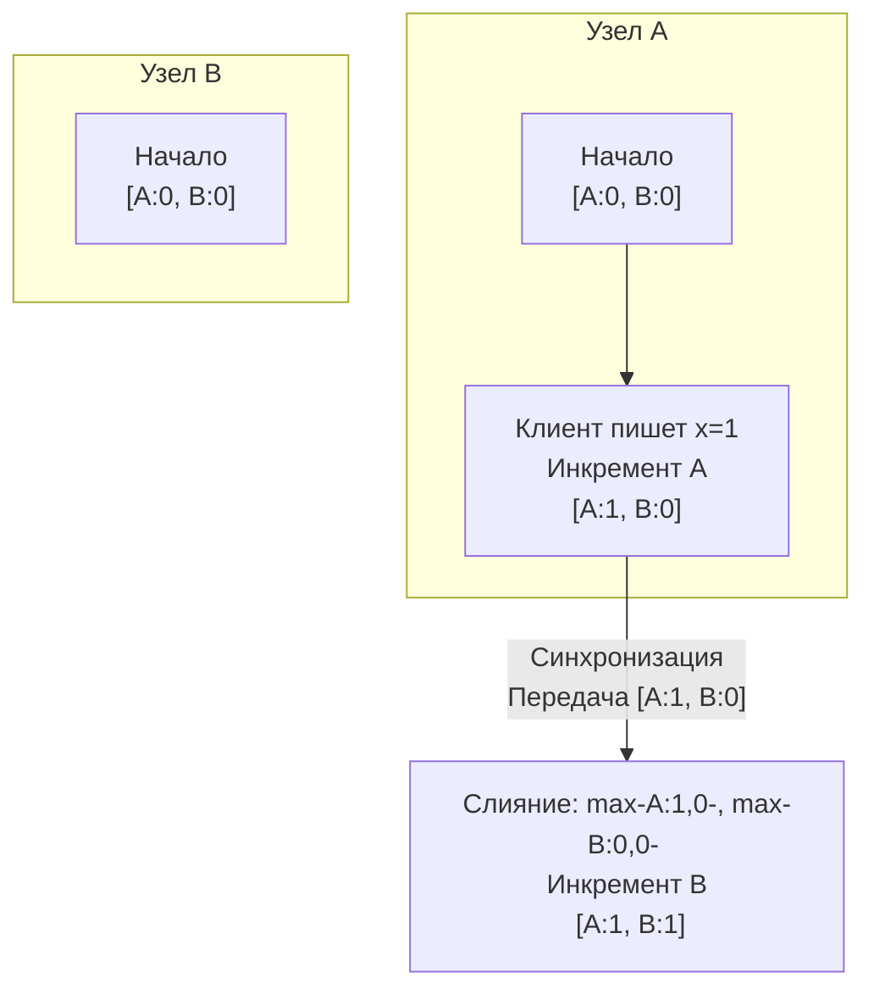

В статье [[5. Time и clock drift]] мы усвоили суровый урок: в распределенных системах нельзя доверять физическим часам (NTP). Из-за дрейфа кварцевых резонаторов и сетевых задержек время на серверах течет с разной скоростью. 

Если мы используем классические `timestamp` для разрешения конфликтов при параллельной записи (стратегия Last-Write-Wins), мы неизбежно потеряем данные. Сервер с отстающими часами может затереть более свежую запись просто потому, что его системное время оказалось меньше.

Нам нужен математический аппарат, который позволит отвечать на фундаментальный вопрос: **Какое событие произошло раньше?** И самое главное: **Произошли ли два события параллельно (одновременно)?**

Для этого инженеры отказались от физического времени и изобрели логическое. Вершина эволюции логического времени в базах данных (до появления TrueTime) — это **Векторные часы (Vector Clocks)**.

## Иллюзия времени: От Лэмпорта к Векторам

Изначально Лесли Лэмпорт придумал простые логические часы (Часы Лэмпорта). Это был просто счетчик (integer) на каждом узле, который увеличивался при каждом событии и передавался по сети. При получении сообщения узел брал `max(свой_счетчик, счетчик_из_сообщения) + 1`. 

Часы Лэмпорта отлично упорядочивали события, но у них был фатальный недостаток: **глядя на два числа (например, 4 и 5), ты не мог сказать, зависело ли событие 5 от события 4, или они произошли абсолютно независимо друг от друга на разных концах кластера.**

Чтобы выявлять независимые (конкурентные) события, счетчик превратили в **Вектор**.

## Анатомия Векторных Часов

**Векторные часы** — это массив (или хеш-таблица) счетчиков. Размер этого массива равен количеству узлов в кластере. Каждый узел знает не только свое "время", но и свои знания о "времени" всех остальных узлов.

В Go это можно представить как `map[string]uint64`, где ключ — это ID узла, а значение — его счетчик.

### Три золотых правила

Каждый узел (пусть это будут A, B и C) начинает с нулевого вектора: `[A:0, B:0, C:0]`.

1. **Локальное событие:** Перед любым значимым событием (запись в БД, отправка сообщения) узел увеличивает **свой собственный счетчик** на 1.
2. **Отправка:** Узел прикрепляет весь свой вектор к каждому исходящему сообщению по сети.
3. **Получение:** Когда узел получает сообщение, он:
   * Обновляет свой вектор, беря **максимум** для каждого элемента: `V_local[i] = max(V_local[i], V_received[i])`.
   * Увеличивает **свой собственный счетчик** на 1 (так как получение сообщения — это тоже событие).



## Математика причинности (Causality)

Имея два векторных часа `V1` и `V2` от разных объектов, мы можем математически доказать их причинно-следственную связь.

Сравнение происходит поэлементно (каждый счетчик с каждым):

1. **`V1 < V2` (V1 произошло строго ДО V2):**
   Если **каждый** элемент в `V1` меньше или равен соответствующему элементу в `V2`, и есть хотя бы один элемент, который строго меньше. 
   *(Пример: `[A:1, B:0]` произошло ДО `[A:1, B:1]`. Это значит, что V2 "знает" о V1).*
   
2. **`V1 == V2` (Идентичные события):**
   Все элементы равны. Это одни и те же данные.

3. **`V1 || V2` (Конфликт / Конкурентные события):**
   Если в `V1` есть хотя бы один элемент больше, чем в `V2`, **И** в `V2` есть хотя бы один элемент больше, чем в `V1`.
   *(Пример: `[A:2, B:1]` и `[A:1, B:2]`. Узел A убежал вперед по своему счетчику, а Узел B — по своему. Они не знают о последних записях друг друга. **Это конфликт.**)*

> [!tip] Собеседование
> **Вопрос:** База данных (AP-система) получила два запроса на обновление профиля пользователя с разных узлов с векторами `[A:3, B:1, C:1]` и `[A:2, B:4, C:1]`. Какой из них система должна сохранить?
> **Ответ:** Система **не имеет права** тихо перезаписывать один другим. Сравнивая векторы, мы видим конфликт (3 > 2 для узла A, но 1 < 4 для узла B). Это конкурентные записи (Concurrent Writes). База данных сохранит **обе** версии как "братьев" (Siblings) и при следующем чтении вернет их обе клиенту, чтобы приложение (или пользователь) разрешило конфликт вручную.

## Mechanical Sympathy: Векторные часы в Go

Реализация векторных часов требует аккуратной работы с памятью и примитивами синхронизации, так как они читаются и пишутся при каждом сетевом запросе.

```go
package vclock

import (
	"sync"
)

// VectorClock - потокобезопасная реализация логических часов.
// В production-системах вместо строк для NodeID используют байты или целые числа 
// для экономии памяти и избежания аллокаций.
type VectorClock struct {
	mu    sync.RWMutex
	nodeID string
	vc    map[string]uint64
}

func NewVectorClock(nodeID string) *VectorClock {
	return &VectorClock{
		nodeID: nodeID,
		vc:     make(map[string]uint64),
	}
}

// Increment вызывается перед любым локальным событием
func (v *VectorClock) Increment() {
	v.mu.Lock()
	defer v.mu.Unlock()
	v.vc[v.nodeID]++
}

// Merge применяется при получении данных от другого узла
func (v *VectorClock) Merge(remote map[string]uint64) {
	v.mu.Lock()
	defer v.mu.Unlock()

	// Берем поэлементный максимум
	for node, remoteCounter := range remote {
		if localCounter, exists := v.vc[node]; !exists || remoteCounter > localCounter {
			v.vc[node] = remoteCounter
		}
	}
	// Увеличиваем свой счетчик, так как слияние - это событие
	v.vc[v.nodeID]++
}

type Order int

const (
	Before Order = iota
	After
	Concurrent
	Equal
)

// Compare определяет причинно-следственную связь без изменения состояния
func (v *VectorClock) Compare(other map[string]uint64) Order {
	v.mu.RLock()
	defer v.mu.RUnlock()

	isLess := false
	isGreater := false

	// Сравниваем все известные узлы (объединение ключей)
	// Для оптимизации нужно итерироваться по обоим map
	// Здесь опущен полный код итерации для краткости...
	
	// Если isLess == true && isGreater == false -> return Before
	// Если isLess == false && isGreater == true -> return After
	// Если isLess == true && isGreater == true -> return Concurrent
    
	return Concurrent
}
```

### Цена метаданных и нагрузка на сеть/GC

Векторные часы — это невероятно мощный инструмент, но он имеет скрытую цену на уровне рантайма Go и сети.

> [!info] Под капотом: Проблема взрыва векторов (Vector Explosion)
> В нашей структуре мы используем `map[string]uint64`. При сериализации в JSON или Protobuf это занимает десятки байт. 
> В Dynamo-подобных базах данных (Riak) вектор прикрепляется к **каждой записи** (к каждому ключу) в базе данных. 
> Что произойдет, если размер кластера вырастет с 3 узлов до 100? А если узлы будут динамически добавляться и удаляться (автоскейлинг в Kubernetes)? Размер вектора (map) начнет бесконечно расти. 
> 
> Передача огромной мапы при каждом чтении/записи (на каждый запрос) забьет пропускную способность сети. В рантайме Go десериализация огромных мап на миллионах RPS приведет к аллокации миллионов "бакетов" (`bmap`) в куче, создавая катастрофическое давление на сборщик мусора (GC Pressure).

## Эволюция: Dotted Version Vectors (DVV)

Из-за проблемы взрыва векторов современные базы данных на базе Eventual Consistency (например, Riak KV) перешли от классических Vector Clocks к **Dotted Version Vectors (DVV)**.

В DVV вместо хранения огромного вектора для каждой версии данных, система разделяет контекст:
* **Vector Clock** хранится на уровне всего ключа (описывает общее состояние).
* Каждое конкретное значение (событие записи) помечается просто **Точкой (Dot)** — парой `[NodeID: Counter]`.

Это математическая оптимизация, которая:
1. Кардинально сокращает размер метаданных, гоняемых по сети.
2. Позволяет сборщику мусора базы данных безопасно обрезать старые узлы из векторов (Pruning), если они давно не были активны, без риска потери данных о причинности.

## Итог

1. Физическое время врет. Для отслеживания причинно-следственных связей в распределенных системах мы обязаны использовать **Логическое время**.
2. **Векторные часы** решают фундаментальную проблему: они позволяют не только упорядочить события, но и математически доказать факт их **конкурентности** (одновременности).
3. В AP-системах векторные часы являются основой механизма обнаружения конфликтов: если векторы двух версий параллельны (`V1 || V2`), система сохранит обе версии.
4. **Проблема масштабирования:** Чем больше кластер, тем "толще" векторы. В Go это выливается в рост сетевого I/O и аллокаций. Современные архитектуры решают это через Dotted Version Vectors.

Мы научились находить конфликты. Система поняла, что узел А и узел Б одновременно обновили профиль пользователя, и сохранила обе версии (создав Siblings). Но база данных не может вечно хранить две версии одного поля. 

Как объединить эти конфликтующие версии в одну правильную, не потеряв бизнес-данные? Об этом поговорим в следующей статье: [[6. Conflict resolution]].