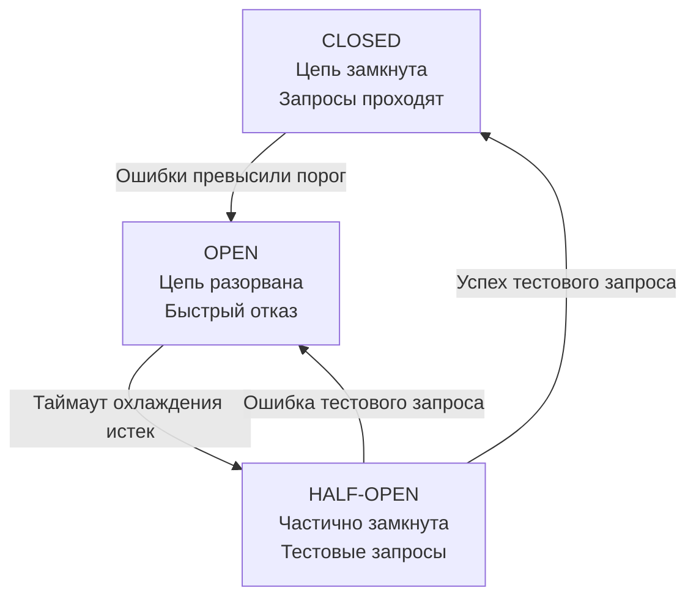

## Предохранитель для вашего бэкенда

Когда вы включаете в одну розетку микроволновку, чайник, обогреватель и мощный сервер, что происходит? Пробки выбивает. Электрический автомат (Circuit Breaker) разрывает цепь, чтобы предотвратить пожар. 

В распределенных системах мы сталкиваемся с той же проблемой. Когда один из микросервисов (или база данных) начинает «тормозить» или падать, если мы продолжим отправлять в него запросы, мы не только окончательно добьем его, но и вызовем каскадный отказ (cascading failure) во всей нашей инфраструктуре.

Паттерн **Circuit Breaker (Предохранитель)** защищает систему от перегрузки, реализуя принцип **Fast Failure (быстрого отказа)**.

В этой статье мы разберем, как именно отсутствие предохранителя убивает приложения на Go на уровне железа и рантайма, как реализовать этот паттерн и какие подводные камни ждут вас на system design собеседованиях.

---

## Анатомия катастрофы: Что если Circuit Breaker нет?

Представим классический сценарий из статьи [[4. Partial failure]]: ваш Go-сервис (Service A) ходит по HTTP в другой сервис (Service B). Service B начал деградировать и отвечать не за 50 мс, а за 10 секунд (достигая предела таймаута).

Если у вас нет Circuit Breaker, происходит следующее:

1. **Рост числа горутин (Goroutine Leak):** В Go каждый входящий HTTP-запрос обрабатывается в отдельной горутине. Если ответы от Service B задерживаются, горутины в Service A не завершаются. Они встают в очередь ожидания. 10 000 RPS превратятся в 100 000 зависших горутин за 10 секунд.
2. **Удар по памяти и GC:** Каждая горутина — это минимум 2 КБ стека. 100 000 горутин = ~200 МБ только на стеки, плюс аллокации для структур запросов, контекстов и буферов ответа. Сборщик мусора (GC) начинает тратить львиную долю процессорного времени на сканирование этих зависших объектов (ведь они не мусор, пока запрос жив).
3. **Истощение сетевых ресурсов (FD Exhaustion):** Каждый исходящий запрос держит открытый TCP-сокет. В Linux количество файловых дескрипторов (File Descriptors) ограничено (обычно 65535 или около того). Вы быстро исчерпаете пул эфемерных портов или лимит FD.
4. **Смерть Service A:** В итоге Service A падает по OOM (Out Of Memory) или перестает принимать новые соединения, потому что нет свободных файловых дескрипторов. 

Мы убили здоровый сервис просто потому, что ждали ответа от больного. 

Circuit Breaker решает это элегантно: если мы видим, что Service B болен, мы **перестаем к нему ходить** на некоторое время. Все вызовы функции немедленно возвращают ошибку (Fast Fail), горутина завершается за микросекунды, ресурсы освобождаются, GC счастлив.

---

## Машина состояний Circuit Breaker

В основе паттерна лежит конечный автомат (State Machine) с тремя классическими состояниями.



1. **CLOSED (Закрыт):** Нормальное состояние. Ток (запросы) течет. CB пропускает вызовы и считает ошибки.
2. **OPEN (Открыт):** Аварийное состояние. Порог ошибок превышен. CB мгновенно (не делая реального сетевого вызова) возвращает ошибку (например, `ErrCircuitBreakerOpen`). Даем больному сервису время на восстановление.
3. **HALF-OPEN (Полуоткрыт):** Состояние проверки. Спустя заданный таймаут охлаждения (sleep window), CB пропускает *один или несколько* тестовых запросов. Если они успешны — цепь замыкается (CLOSED). Если снова ошибка — возвращаемся в OPEN.

> [!info] Под капотом
> В состоянии OPEN экономия ресурсов колоссальна. Вместо того чтобы собирать HTTP-запрос, переключать контекст в ядро ОС через `syscall` для записи в сокет и парковать горутину в `netpoll`, мы просто возвращаем `error` из функции-обертки, используя всего пару десятков инструкций процессора.

---

## Реализация на Go: Идиомы и производительность

На практике чаще всего используют готовую библиотеку `github.com/sony/gobreaker` (или реализацию внутри resilience фреймворков). Но чтобы понять механику, посмотрим, как устроен этот паттерн под капотом, и какие решения по конкурентности там применяются.

### Наивная реализация (и почему она плоха)

Многие джуниоры пытаются написать CB, оборачивая всё состояние в `sync.Mutex`.

```go
// Антипаттерн для высоконагруженного CB
type NaiveCB struct {
    mu       sync.Mutex
    failures int
    state    State
}

func (cb *NaiveCB) Execute(req func() error) error {
    cb.mu.Lock()
    if cb.state == StateOpen {
        cb.mu.Unlock()
        return ErrOpen
    }
    cb.mu.Unlock()
    
    // ... выполнение и обновление стейта ...
}
```

**Проблема (Mechanical Sympathy):** В высоконагруженной системе CB — это горячая точка (hot path). Каждая горутина, делающая внешний вызов, будет бороться за один и тот же мьютекс. Это вызывает Lock Contention. Планировщик Go будет постоянно парковать и будить горутины, а кэш-линии процессора (Cache Lines), хранящие состояние мьютекса, будут инвалидироваться по всем ядрам (Cache Bouncing).

### Правильный подход: Атомарные операции

Продакшен-решения (как `sony/gobreaker`) минимизируют блокировки. Состояние (Closed, Open, Half-Open) и счетчики ошибок часто реализуются через `atomic`. Если всё же используется мьютекс, критическая секция делается микроскопической, только для чтения состояния, а не на всё время выполнения запроса.

Пример использования `gobreaker` в реальном проекте:

```go
package main

import (
	"errors"
	"fmt"
	"io"
	"net/http"
	"time"

	"[github.com/sony/gobreaker](https://github.com/sony/gobreaker)"
)

var cb *gobreaker.CircuitBreaker

func init() {
	var st gobreaker.Settings
	st.Name = "HTTP-Client"
	st.MaxRequests = 1              // Сколько запросов пропустить в Half-Open
	st.Interval = time.Minute       // Окно сброса счетчика ошибок в Closed
	st.Timeout = 10 * time.Second   // Время нахождения в Open перед переходом в Half-Open
	st.ReadyToTrip = func(counts gobreaker.Counts) bool {
		// Кастомная логика: открываем цепь, если ошибок > 50% и всего запросов > 10
		failureRatio := float64(counts.TotalFailures) / float64(counts.Requests)
		return counts.Requests >= 10 && failureRatio >= 0.5
	}

	cb = gobreaker.NewCircuitBreaker(st)
}

// DoRequest делает защищенный вызов
func DoRequest(url string) ([]byte, error) {
	// Execute оборачивает наш вызов в конечный автомат CB
	result, err := cb.Execute(func() (interface{}, error) {
		resp, err := http.Get(url)
		if err != nil {
			return nil, err
		}
		defer resp.Body.Close()

		if resp.StatusCode >= 500 {
			// Считаем 5xx за ошибку для Circuit Breaker
			return nil, fmt.Errorf("server error: %d", resp.StatusCode)
		}

		return io.ReadAll(resp.Body)
	})

	if err != nil {
		if errors.Is(err, gobreaker.ErrOpenState) {
			// Fast Failure: цепь разорвана! 
			// Здесь мы можем отдать кэш или дефолтное значение (Fallback)
			return nil, fmt.Errorf("circuit breaker is OPEN: fast fail")
		}
		return nil, err
	}

	return result.([]byte), nil
}
```

> [!tip] Собеседование
> **Вопрос:** Как вы обрабатываете ситуацию, когда Circuit Breaker возвращает `ErrOpenState`?
> **Ответ (уровень Senior):** Мы используем паттерн [[7. Graceful degradation]] (Плавная деградация). Если отвалился сервис рекомендаций, мы не падаем, а ловим ошибку от CB и отдаем пользователю статический список популярных товаров из локального кэша. Система деградировала, но осталась доступной.

---

## Архитектурные ловушки (Gotchas)

### 1. Circuit Breaker vs Retry
Паттерн [[2. Retry и backoff]] (повтор запросов) — это антоним Circuit Breaker-а. Retry бьет сервис запросами, пока не получит ответ. Circuit Breaker — защищает сервис от ударов. 
**Как их совмещать?** Retry должен стоять **внутри** (или за) Circuit Breaker'ом, либо сам инструмент Retry должен знать о состоянии CB. Если Circuit Breaker перешел в состояние `OPEN`, любые попытки `Retry` должны быть немедленно прерваны. Нет смысла ретраить то, что заведомо упадет (Fast Fail).

### 2. Игнорирование бизнес-ошибок
Не все возвращаемые ошибки должны открывать Circuit Breaker!
Если вы делаете запрос к API оплаты и получаете `400 Bad Request` или `403 Forbidden` (неверные данные пользователя), это означает, что целевой сервис работает отлично. Если вы будете инкрементировать счетчик ошибок CB на 4xx статусах, один злоумышленник с кривым запросом "положит" интеграцию для всех пользователей.
**Правило:** Считаем только технические ошибки: `5xx`, таймауты, обрывы соединений (network errors), `context.DeadlineExceeded`. См. также [[3. Timeout]].

### 3. Локальный vs Распределенный Circuit Breaker
Частая проблема в Kubernetes: у вас 100 подов вашего микросервиса. Порог открытия CB — 10 ошибок подряд.
Если целевой сервис умрет, каждый из ваших 100 подов сделает по 10 неудачных запросов, прежде чем *свой локальный* CB в памяти каждого пода перейдет в `OPEN`. Целевой сервис получит 1000 запросов по голове, прежде чем защита сработает.

* **Локальный CB (в памяти):** Быстрый, нет сетевых задержек на синхронизацию стейта. Идиоматичен для Go. Минус — "размазывание" лимитов по инстансам.
* **Распределенный CB (через Redis):** Единое состояние для всех подов. Но добавляет жесткую зависимость от Redis. Если упадет Redis — упадет весь роутинг. Добавляет latency на каждый вызов (чтобы обновить счетчик в Redis).

В 95% случаев в мире Go используют **локальные (In-Memory)** Circuit Breakers, просто настраивая порог срабатывания с учетом количества инстансов. Если подов много, делают динамический порог или используют агрегацию метрик через Service Mesh (например, Envoy сам умеет работать как распределенный CB на уровне sidecar-прокси).

## Итог

1. **Fast Failure:** Circuit Breaker спасает вашу систему от лавинообразного отказа, мгновенно сбрасывая запросы к умершему downstream-сервису, не забивая горутины и файловые дескрипторы.
2. **State Machine:** Состояния Closed (норма), Open (авария), Half-Open (проверка).
3. **Механика Go:** Правильный CB минимизирует Lock Contention, полагаясь на атомики, чтобы не стать узким местом при высоких RPS.
4. **Комбинаторика:** Обязательно комбинируйте Circuit Breaker с паттернами Fallback/Graceful Degradation для обеспечения непрерывного пользовательского опыта.

В следующей статье мы разберем другой важнейший инструмент повышения надежности, который мы уже косвенно упоминули: [[2. Retry и backoff]], и узнаем, почему неправильно настроенный Retry может убить базу данных быстрее, чем DDOS-атака.