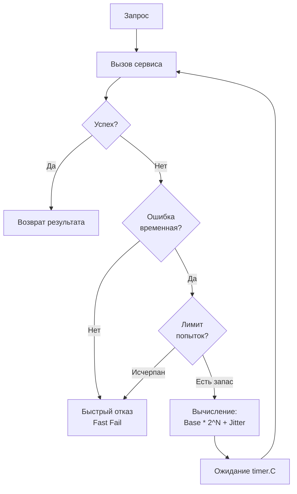

## Искусство не сдаваться (но делать это умно)

В предыдущей статье мы обсуждали [[1. Circuit breaker]] — паттерн, который говорит «хватит, мы падаем, не бей лежачего». Но что делать, если ошибка временная? Микросекундный обрыв сети, кратковременная блокировка строки в базе данных (deadlock) или рестарт пода целевого сервиса в Kubernetes. Сразу отвечать пользователю ошибкой — плохой UX. 

Мы должны попробовать еще раз. Паттерн **Retry (Повтор)** решает проблему транзитных (временных) ошибок. 

Однако, если реализовать его в лоб, вы создадите оружие массового поражения, способное организовать DDoS-атаку на вашу собственную инфраструктуру. В этой статье мы разберем математику правильных таймингов, реализацию на Go с учетом особенностей рантайма и архитектурные ловушки распределенных систем.

---

## Наивный Retry и Thundering Herd Problem

Представим классический код Junior-разработчика:

```go
// Антипаттерн: Наивный Retry
func BadRetry(do func() error) error {
    var err error
    for i := 0; i < 3; i++ {
        if err = do(); err == nil {
            return nil
        }
        time.Sleep(1 * time.Second) // Ждем секунду и повторяем
    }
    return err
}
```

Что здесь не так? Представьте, что база данных "моргнула" (ушла в failover) на 3 секунды. У вас 10 000 активных пользователей. 
Все 10 000 горутин получают ошибку, делают `time.Sleep` ровно на 1 секунду, просыпаются **одновременно** и бьют в БД. База, которая только что поднялась, мгновенно падает от шквала запросов. 

Это классическая проблема **Thundering Herd (Стадо бизонов)**. Строгие, синхронные интервалы повторов концентрируют нагрузку в одной точке времени.

---

## Математика спасения: Exponential Backoff и Jitter

Чтобы избежать стада бизонов, мы должны "размазать" повторные запросы по времени. Для этого используются две концепции:

### 1. Exponential Backoff (Экспоненциальная задержка)
Вместо фиксированного интервала мы увеличиваем время ожидания экспоненциально при каждой неудаче. 
Формула: `Wait = Base * 2^Attempt`.
* Попытка 1: 100ms
* Попытка 2: 200ms
* Попытка 3: 400ms

Это дает восстанавливающемуся сервису больше времени на "дыхание" при затяжной деградации.

### 2. Jitter (Джиттер / Случайный разброс)
Даже с экспоненциальной задержкой, если 1000 запросов упали одновременно, они одновременно придут через 100ms, затем через 200ms и так далее. Нам нужен хаос. **Jitter** добавляет случайную погрешность к времени ожидания.

Идеальный стандарт индустрии (популяризированный инженерами AWS) — это **Full Jitter**:
`Wait = random_between(0, Base * 2^Attempt)`



---

## Production-Ready реализация на Go

Идиоматичный Retry в Go должен учитывать контекст (отмену запроса) и избегать утечек горутин.

```go
package retry

import (
	"context"
	"errors"
	"fmt"
	"math/rand"
	"time"
)

// RetryConfig конфигурация для механизма повторов
type RetryConfig struct {
	MaxRetries int
	BaseDelay  time.Duration
	MaxDelay   time.Duration
}

// IsTransient проверяет, имеет ли смысл повторять запрос
func IsTransient(err error) bool {
	// В реальности здесь проверка на net.Error, таймауты 
	// или специфичные HTTP статусы (502, 503, 504)
	return err != nil 
}

// DoWithRetry выполняет функцию с экспоненциальным бэкоффом и джиттером
func DoWithRetry(ctx context.Context, cfg RetryConfig, fn func() error) error {
	for attempt := 0; attempt < cfg.MaxRetries; attempt++ {
		err := fn()
		if err == nil {
			return nil // Успех
		}

		if !IsTransient(err) {
			return err // Ошибка не транзитная, повторять нет смысла
		}

		if attempt == cfg.MaxRetries-1 {
			return fmt.Errorf("достигнут лимит попыток (%d): %w", cfg.MaxRetries, err)
		}

		delay := calculateBackoff(cfg.BaseDelay, cfg.MaxDelay, attempt)
		
		// Используем Timer вместо time.After для контроля над памятью
		timer := time.NewTimer(delay)
		
		select {
		case <-ctx.Done():
			timer.Stop()
			return ctx.Err() // Запрос отменен вызывающей стороной
		case <-timer.C:
			// Время ожидания вышло, идем на следующую попытку
		}
	}
	return nil
}

func calculateBackoff(base, max time.Duration, attempt int) time.Duration {
	// Экспоненциальный рост: base * 2^attempt
	exp := float64(base) * float64(int(1)<<attempt)
	
	if exp > float64(max) {
		exp = float64(max)
	}
	
	// Full Jitter: random(0, exp)
	jitter := rand.Float64() * exp
	return time.Duration(jitter)
}
```

> [!info] Под капотом
> **Почему `time.NewTimer` вместо `time.Sleep` или `time.After`?**
> В высоконагруженных системах `time.After` может вызывать утечку памяти (memory leak), так как созданный им таймер не собирается GC до тех пор, пока не истечет его время (даже если мы вышли из `select` по `ctx.Done()`). Используя `time.NewTimer` и `timer.Stop()`, мы явно освобождаем структуру таймера.
> 
> На уровне рантайма, когда горутина попадает в `<-timer.C`, она вызывает `runtime.gopark`. Горутина переходит в состояние `_Gwaiting` и отвязывается от потока ОС (M). Планировщик (Scheduler) продолжает выполнять другие горутины. Сам таймер помещается в специальную кучу таймеров (timer heap), которая локальна для каждого логического процессора (P). Когда системный монитор (`sysmon`) или сам P видят, что время пришло, они помещают время в канал, и горутина переводится в состояние `_Grunnable`, готовая к исполнению. Никаких блокирующих системных вызовов к ОС не происходит.

---

## Архитектурные ловушки (Gotchas)

### 1. Умножение повторов (Retry Amplification)
Представьте цепочку микросервисов: `A -> B -> C`. 
Если `C` недоступен, а в `A` и `B` настроено по 3 повтора, то:
- `B` попытается вызвать `C` 3 раза.
- После 3 неудач `B` вернет ошибку в `A`.
- `A` повторит запрос к `B`. `B` снова сделает 3 попытки к `C`.
В итоге `C` получит $3 \times 3 = 9$ запросов. В цепочке из 4 сервисов это будет 27 запросов! 
Вы сами устроите себе каскадный отказ.

**Решение:** В микросервисах повторы должны делаться **только на одном уровне**. Либо на самом краю (API Gateway или BFF), либо передавать через контекст (HTTP Headers) "бюджет повторов" (Retry Budget).

### 2. Идемпотентность — Строгое требование
Повторять можно только **идемпотентные** операции. 
Если вы сделали `POST /charge` (списание денег), запрос дошел до сервиса, деньги списались, но на обратном пути произошел обрыв сети (Network Timeout) — ваш клиент получит ошибку. Если клиент сделает Retry — деньги спишутся второй раз. См. статью [[4. Partial failure]].

> [!tip] Собеседование
> **Вопрос:** Как безопасно повторять не-идемпотентные запросы (например, POST)?
> **Ответ:** Использовать ключи идемпотентности (Idempotency Key). Клиент генерирует уникальный UUID для транзакции и отправляет его в заголовке `Idempotency-Key`. Сервер сохраняет этот ключ в БД. При повторном запросе сервер видит, что ключ уже обработан, не выполняет бизнес-логику повторно, а просто возвращает кешированный результат первого успешного выполнения.

### 3. Circuit Breaker + Retry
Как они взаимодействуют? В правильно спроектированной системе Retry является клиентом для [[1. Circuit breaker]]. 
Если целевой сервис лежит наглухо, Circuit Breaker переходит в состояние `OPEN`. Функция внутри нашего Retry мгновенно возвращает `ErrCircuitBreakerOpen`. Наш код Retry должен классифицировать эту ошибку как **не транзитную** и немедленно прервать цикл (Fast Fail). Нет смысла ждать и повторять запрос, если мы точно знаем, что рубильник выключен.

## Итог

1. **Никогда не используйте фиксированный Sleep.** Это прямой путь к проблеме Thundering Herd.
2. **Экспоненциальный Backoff + Jitter:** Замедляет запросы при сбоях и вносит хаос, размазывая нагрузку.
3. **Контроль контекста:** Retry-цикл обязан реагировать на `ctx.Done()`. Если клиент уже ушел, нет смысла пытаться выполнить его запрос.
4. **Идемпотентность:** Повторяйте только то, что безопасно выполнить дважды, или используйте Idempotency Keys.

Мы научились ждать и пробовать снова. Но сколько именно должен длиться каждый запрос до того, как мы признаем его неудачным? В следующей статье мы разберем критически важную тему: [[3. Timeout]], и почему отсутствие таймаутов — это самая частая причина падения production-систем.