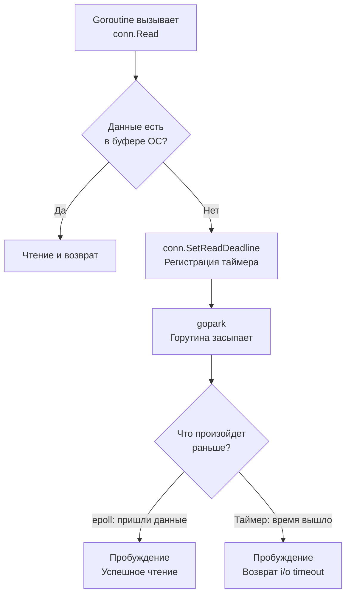

## Время как критический ресурс: Почему бесконечное ожидание убивает

В распределенных системах мы руководствуемся правилом из статьи [[4. Partial failure]]: **«Медленный ответ хуже, чем отсутствие ответа»**. 

Быстрая ошибка позволяет клиенту отреагировать: показать пользователю кэшированные данные, отправить запрос в резервный дата-центр или попытаться снова (с учетом [[2. Retry и backoff]]). Медленный ответ заставляет систему зависать в неопределенности, удерживая критические ресурсы (горутины, оперативную память, файловые дескрипторы сокетов), пока они не исчерпаются окончательно.

**Timeout (Таймаут)** — это абсолютная граница времени, которую мы готовы потратить на выполнение операции. Если время вышло, мы принудительно обрываем процесс.

В Go управление временем ожидания возведено в абсолют и встроено в стандартную библиотеку через пакет `context` и подсистему `net`. Разберем, как это работает на уровне рантайма и как правильно защищать свои микросервисы.

---

## Под капотом: context.WithTimeout

Главный инструмент управления временем жизни запроса в Go — это пакет `context`. Когда вы вызываете `ctx, cancel := context.WithTimeout(parent, 5*time.Second)`, под капотом происходит сложная оркестрация между рантаймом, планировщиком и кучей таймеров (Timer Heap).

1. Go создает структуру `timerCtx`, которая оборачивает `cancelCtx`.
2. Запускается внутренний таймер через `time.AfterFunc`. Этот таймер регистрируется в локальной куче таймеров текущего логического процессора (P).
3. Когда проходит 5 секунд, системный монитор рантайма (`sysmon`) или сам P замечают, что таймер истек.
4. Вызывается встроенная функция отмены (`cancel`). Она делает две вещи:
   - Меняет внутреннее состояние контекста (через атомарные операции).
   - Закрывает канал `done` (внутренний `chan struct{}`).

> [!info] Под капотом
> Закрытие канала в Go — это механизм широковещательной рассылки (broadcast). Когда канал `done` закрывается, **все** горутины, которые были заблокированы в ожидании `<-ctx.Done()`, мгновенно просыпаются. Чтение из закрытого канала возвращает нулевое значение без блокировки. РантаЙм переводит эти горутины из состояния `_Gwaiting` в `_Grunnable`, ставит их в локальную очередь (runq), и они продолжают работу, получая ошибку `context.DeadlineExceeded`.

---

## Network Timeouts и Netpoll: Взгляд со стороны ОС

Контекст — это высокоуровневый паттерн. Но что заставляет сетевой сокет перестать ждать байты от сервера? 

Когда Go открывает TCP-соединение (`net.Conn`), он переводит файловый дескриптор (FD) сокета в **неблокирующий режим (non-blocking mode)**. 

Если вы вызываете `conn.Read()`, а данных в буфере ОС нет:
1. Системный вызов `read` возвращает ошибку `EAGAIN` (попробуй позже).
2. Go не крутит цикл впустую. Он регистрирует этот FD в сетевом поллере (`netpoll`), который использует `epoll` (Linux) или `kqueue` (macOS).
3. Горутина "паркуется" (`gopark`), освобождая тред (M) для других горутин.

Когда мы устанавливаем таймаут через `conn.SetReadDeadline(time.Now().Add(time.Second))`, рантайм добавляет таймер. 



Если таймер срабатывает раньше, чем `epoll` сообщает о новых данных, рантайм будит горутину, а попытка прочитать данные возвращает ошибку `os.ErrDeadlineExceeded`.

---

## Ловушки стандартной библиотеки (Gotchas)

### 1. Дефолтный http.Client — путь к катастрофе

Самая частая ошибка Junior/Middle разработчиков на Go — использование стандартного HTTP клиента.

```go
// АНТИПАТТЕРН: Никогда так не делайте в production!
resp, err := http.Get("[http://api.service.com/data](http://api.service.com/data)") 
```

Дефолтный `http.Client` имеет таймаут, равный нулю. Это значит — **бесконечность**. Если сервер зависнет и перестанет отправлять данные, не закрывая TCP-соединение, ваша горутина навсегда останется висеть в памяти. Это приведет к утечке ресурсов и смерти сервиса (OOM).

> [!warning] Ловушка / Gotcha
> Вы обязаны явно настраивать таймауты как на уровне всего клиента, так и на уровне транспортного слоя (Transport), если вам нужен гранулярный контроль (например, отдельный таймаут на TLS Handshake).

**Production-ready конфигурация HTTP клиента:**

```go
// Идиоматичный подход к настройке HTTP клиента
var httpClient = &http.Client{
	// Общий таймаут на всю операцию (от Dial до чтения Body)
	Timeout: 10 * time.Second, 
	Transport: &http.Transport{
		// Таймаут на установку TCP соединения
		DialContext: (&net.Dialer{
			Timeout:   2 * time.Second,
			KeepAlive: 30 * time.Second,
		}).DialContext,
		// Максимальное время ожидания ответа в пуле соединений
		MaxIdleConns:          100,
		IdleConnTimeout:       90 * time.Second,
		// Таймаут на TLS рукопожатие
		TLSHandshakeTimeout:   3 * time.Second,
		// Таймаут ожидания заголовков (если сервер медленно отдает ответ)
		ResponseHeaderTimeout: 5 * time.Second, 
	},
}
```

### 2. Отмена контекста не "убивает" горутину аппаратно

Многие думают, что если мы передали `ctx` с таймаутом в функцию, и время вышло, то Go принудительно убьет горутину (как `kill -9` в Linux). Это фатальное заблуждение.

**В Go отмена контекста — это кооперативный механизм.** Контекст просто закрывает канал `Done()`. Если ваш код выполняет тяжелые вычисления в цикле и не проверяет `ctx.Err()`, горутина будет работать до победного конца, сжигая CPU, даже если клиент уже давно отвалился по таймауту.

```go
// ПЛОХО: Горутина будет работать 10 секунд, игнорируя таймаут контекста в 1 сек
func HeavyTask(ctx context.Context) {
    for i := 0; i < 1_000_000; i++ {
        doCryptographicHash() // Тяжелая CPU операция
    }
}

// ХОРОШО: Кооперативная проверка отмены
func HeavyTaskSafe(ctx context.Context) error {
    for i := 0; i < 1_000_000; i++ {
        // Проверяем, не отменен ли контекст
        select {
        case <-ctx.Done():
            return ctx.Err() // Прерываем работу, возвращаем deadline exceeded
        default:
            // Идем дальше, если канал не закрыт
        }
        
        doCryptographicHash()
    }
    return nil
}
```

> [!tip] Собеседование
> **Вопрос:** В чем разница между настройкой `Client.Timeout` и передачей `context.WithTimeout` в HTTP запрос?
> **Ответ:** `Client.Timeout` жестко ограничивает время *всего* цикла запроса (включая чтение `Body`). `Context` дает больше гибкости: его можно отменить снаружи по другому триггеру (например, пользователь закрыл браузер, и API Gateway прислал отмену), а также пробросить этот же контекст дальше в БД или другие сервисы, чтобы прервать всю цепочку вызовов распределенной транзакции одновременно.

---

## Server-Side Timeouts: Защита от медленных клиентов

Защищать нужно не только исходящие запросы, но и входящие. Без настроенных таймаутов на сервере вы становитесь жертвой атаки **Slowloris**. Злоумышленник (или просто мобильный клиент с плохим 3G) может открыть соединение и отправлять по одному байту в секунду. Если таких соединений наберется 10 000, ваш сервер исчерпает лимит открытых сокетов и "ляжет".

В Go сервер настраивается через структуру `http.Server`:

```go
srv := &http.Server{
    Addr:         ":8080",
    Handler:      mux,
    // Максимальное время на чтение всего запроса (включая body)
    ReadTimeout:  5 * time.Second,
    // Максимальное время на чтение только заголовков (защита от Slowloris)
    ReadHeaderTimeout: 2 * time.Second,
    // Максимальное время на запись ответа клиенту
    WriteTimeout: 10 * time.Second,
    // Время удержания keep-alive соединения пустым
    IdleTimeout:  120 * time.Second,
}
```

### БД и SQL Таймауты

Таймауты обязательны при работе с базами данных (см. [[12. Базы данных]]). Драйверы, такие как `pq` или `pgx` для PostgreSQL, глубоко интегрированы с контекстом.

Если вы делаете тяжелый `SELECT` и контекст отменяется по таймауту, драйвер `pgx` не просто вернет ошибку в Go. Он откроет *новое* служебное соединение с базой данных и отправит команду `pg_cancel_backend()`, чтобы СУБД (Postgres) тоже прекратила жечь CPU и прервала выполнение запроса на своей стороне.

## Итог

1. **Таймауты должны быть везде:** На HTTP клиентах, на серверах, на запросах к БД и в кэш. Бесконечное ожидание — это гарантированная авария.
2. **Кооперативность:** В Go отмена — это сигнал, а не расстрел. Ваш код (особенно CPU-bound) должен регулярно проверять `ctx.Done()`.
3. **Netpoll:** Сетевые таймауты работают невероятно эффективно благодаря интеграции планировщика горутин и неблокирующего I/O (epoll/kqueue).
4. **Контекст как стандарт:** Используйте `context.Context` для проброса дедлайнов сквозь все слои приложения — от HTTP-хендлера до SQL-драйвера.

Но что, если один медленный или проблемный эндпоинт (например, генерация тяжелых отчетов) начинает утилизировать все свободные горутины, не оставляя ресурсов для легких и быстрых эндпоинтов (например, проверки healthcheck)? Таймауты здесь помогут, но не спасут от исчерпания пула. Для изоляции ресурсов применяется другой паттерн, который мы разберем в следующей статье: [[4. Bulkhead]].