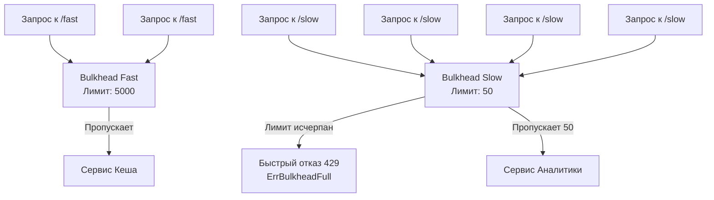

## Переборки непотопляемого бэкенда

Слово **Bulkhead (переборка)** пришло в системный дизайн из кораблестроения. Корпус подводной лодки или круизного лайнера разделен на водонепроницаемые отсеки. Если корабль получает пробоину, вода затапливает только один отсек. Корабль теряет часть функциональности, но остается на плаву. Если бы переборок не было — вода заполнила бы всё судно, и оно пошло бы ко дну.

В распределенных системах мы сталкиваемся с той же угрозой: один «пробитый» (медленный или зависший) downstream-сервис может утопить ваше приложение, исчерпав все доступные ресурсы (память, файловые дескрипторы, процессорное время сборщика мусора).

В предыдущих статьях мы разобрали [[1. Circuit breaker]] (рубильник по ошибкам) и [[3. Timeout]] (временные границы). Но что, если сервис отвечает успешно, но просто делает это очень медленно из-за наплыва легитимного трафика? Здесь на сцену выходит паттерн **Bulkhead**, который реализует строгую изоляцию ресурсов.

---

## Проблема: Разделяемые пулы в Go

Во многих классических языках (Java, C#) веб-серверы исторически использовали пулы потоков (Thread Pools) фиксированного размера. В такой модели паттерн Bulkhead реализуется выделением отдельного пула потоков для каждого внешнего сервиса. 

В Go философия иная. Рентайм Go поощряет создание новой горутины на каждый входящий запрос (`net/http` делает это автоматически). Горутины дешевы (около 2 КБ на стек), поэтому кажется, что пулы потоков нам не нужны.

**Но ресурсы ОС и рантайма — конечны.**

Представьте сервис API Gateway, который маршрутизирует запросы к двум микросервисам:
* `/fast` — проксирует запросы в быстрый сервис кеширования.
* `/slow` — проксирует запросы в тяжелый сервис аналитики (генерация отчетов).

Если сервис аналитики начинает тормозить, клиенты, запрашивающие `/slow`, висят в ожидании. В Go запускаются десятки тысяч новых горутин. Каждая горутина выделяет память под буферы, держит открытым TCP-сокет к клиенту и HTTP-соединение в пуле (`http.Transport`). 

Вскоре ваш API Gateway падает по OOM (Out Of Memory) или достигает лимита открытых файлов `ulimit -n`. В итоге запросы к `/fast` тоже перестают обрабатываться, хотя целевой сервис кеширования жив и здоров. Корабль утонул целиком из-за одной пробоины.

---

## Реализация Bulkhead в Go: Семафоры

Поскольку в Go мы не ограничиваем потоки ОС, мы должны ограничить **конкурентность (concurrency)** выполнения определенного блока кода. Идиоматичный способ сделать это — использовать **Семафор (Semaphore)**, построенный на базе буферизированного канала (`buffered channel`).

```go
package bulkhead

import (
	"context"
	"errors"
	"fmt"
)

// ErrBulkheadFull возвращается, когда отсек полностью заполнен
var ErrBulkheadFull = errors.New("bulkhead is full: no available slots")

// Bulkhead ограничивает количество конкурентных выполнений
type Bulkhead struct {
	sem chan struct{}
}

// NewBulkhead создает новую переборку с заданным лимитом
func NewBulkhead(maxConcurrent int) *Bulkhead {
	return &Bulkhead{
		sem: make(chan struct{}, maxConcurrent),
	}
}

// Execute выполняет функцию в пределах выделенной емкости
func (b *Bulkhead) Execute(ctx context.Context, fn func() error) error {
	// Пытаемся занять слот в семафоре
	select {
	case b.sem <- struct{}{}:
		// Слот успешно занят. 
		// Гарантируем освобождение слота при выходе (даже при панике в fn)
		defer func() { <-b.sem }()
	case <-ctx.Done():
		// Вызывающая сторона отменила контекст до того, как мы дождались слота
		return ctx.Err()
	default:
		// Фаст-фейл: канал заполнен, ждать нельзя (если не хотим блокироваться)
		// В некоторых реализациях здесь делают таймаут ожидания слота, 
		// но для чистого Bulkhead лучше отвечать сразу.
		return ErrBulkheadFull
	}

	// Выполняем полезную нагрузку
	return fn()
}
```

### Как это использовать в архитектуре?

Мы создаем отдельный экземпляр `Bulkhead` для каждого внешнего ресурса.

```go
// Инициализация при старте приложения
analyticsBulkhead := NewBulkhead(50)  // Максимум 50 тяжелых отчетов одновременно
cacheBulkhead := NewBulkhead(5000)    // Быстрый кеш выдержит много

func HandleAnalytics(w http.ResponseWriter, r *http.Request) {
    err := analyticsBulkhead.Execute(r.Context(), func() error {
        // ... долгий HTTP запрос к сервису аналитики ...
        return nil
    })
    
    if errors.Is(err, ErrBulkheadFull) {
        http.Error(w, "Сервис аналитики перегружен", http.StatusTooManyRequests)
        return
    }
}
```



---

## Mechanical Sympathy: Почему канал, а не Mutex?

> [!tip] Собеседование
> **Вопрос:** Почему для семафора используют канал `chan struct{}`, а не `sync.Mutex` с `int` счетчиком?
> **Ответ:** `sync.Mutex` предназначен для защиты данных, а не для оркестрации горутин. Если использовать мьютекс, реализовать отмену по контексту (`ctx.Done()`) или таймаут ожидания слота становится архитектурным кошмаром. Вам придется писать циклы опроса (spin-locks) или использовать `sync.Cond`, что сложно и чревато дедлоками. Конструкция `select` с каналом интегрирована прямо в планировщик Go и решает эту задачу аппаратно-эффективно.

> [!info] Под капотом
> Как работает `b.sem <- struct{}{}` в рантайме?
> Внутри Go структура канала `hchan` содержит кольцевой буфер `buf` и две очереди ожидания: `recvq` и `sendq` (двусвязные списки структур `sudog`).
> 
> Поскольку размер `struct{}` равен нулю байт, Go не выделяет под данные буфера ни байта памяти (`elemtype.size == 0`). Канал работает чисто как счетчик (`hchan.qcount`).
> 
> Когда буфер заполнен (достигнут лимит Bulkhead), а мы используем конструкцию `select` с блоком `default`, компилятор Go оптимизирует это до неблокирующего вызова функции `chanpark`. Рантайм просто проверяет атомарно счетчик. Если места нет — мгновенно выполняется ветка `default` (не происходит `gopark`, горутина не засыпает, нет переключения контекста). Это невероятно быстрая операция (единицы наносекунд).

---

## Продвинутый вариант: Weighted Semaphore

Иногда разные операции потребляют разное количество ресурсов целевой системы. Легкий `SELECT` в БД — это 1 единица. Тяжелый `JOIN` — 10 единиц. 

Для таких случаев обычный буферизированный канал не подойдет. В стандартной библиотеке (точнее в расширенном пакете) есть готовое высокопроизводительное решение: `golang.org/x/sync/semaphore`.

```go
import "golang.org/x/sync/semaphore"

// Создаем семафор с общим весом 100
var dbBulkhead = semaphore.NewWeighted(100)

func DoHeavyQuery(ctx context.Context) error {
    // Пытаемся захватить 10 единиц веса.
    // Если свободных нет, горутина уснет до их появления или до отмены контекста.
    if err := dbBulkhead.Acquire(ctx, 10); err != nil {
        return err // вернет ошибку, если ctx.Done() сработает быстрее
    }
    defer dbBulkhead.Release(10)

    // Выполнение тяжелого запроса
    return nil
}
```

Под капотом `x/sync/semaphore` использует не каналы, а классический мьютекс `sync.Mutex` с двусвязным списком ожидающих горутин. Каждая горутина создает свой локальный канал `ready := make(chan struct{})`, кладет его в список и засыпает на нем через `select`. Когда вес освобождается, просыпается ровно столько горутин, чьи запросы удовлетворяет новый свободный вес. Это решает проблему Thundering Herd.

---

## Архитектурные ловушки (Gotchas)

### 1. Bulkhead vs Rate Limiter vs Circuit Breaker
Эти паттерны часто путают на собеседованиях. Разберем разницу:
1. **Rate Limiter:** Ограничивает *события во времени* (например, 100 запросов в секунду). Защищает от DDoS.
2. **Circuit Breaker:** Реагирует на *ошибки*. Если сервис упал, отключает трафик к нему. См. [[1. Circuit breaker]].
3. **Bulkhead:** Ограничивает *конкурентность в моменте* (не более 50 активных запросов одновременно). Защищает локальные ресурсы (память, пулы) от исчерпания при деградации времени ответа целевой системы.

Они не заменяют друг друга, а применяются слоями: API Gateway сначала рейт-лимитит клиента по IP, затем отправляет запрос через Bulkhead, который обернут в Circuit Breaker.

### 2. Подбор лимитов
Самая большая проблема Bulkhead — это магия чисел. Если вы поставите лимит в 10, вы можете урезать пропускную способность легитимного трафика. Если 10 000 — вы словите OOM до того, как сработает паттерн.
Лимиты должны вычисляться на основе нагрузочного тестирования. Формула Литтла (Little's Law) — ваш друг: `Concurrency = RPS * Latency`. Если вы ожидаете 1000 RPS к сервису, который отвечает за 0.1 сек, нормальный уровень конкурентности — 100. Bulkhead можно настроить на 150-200 (с небольшим запасом на флуктуации).

## Итог

1. **Изоляция сбоев:** Паттерн Bulkhead гарантирует, что медленный внешний ресурс или тяжелый эндпоинт не утащит на дно всё ваше приложение.
2. **Горутины — не бесплатны:** Несмотря на легковесность, заблокированные горутины жгут оперативную память и FD.
3. **Реализация:** Идиоматичный Go использует `chan struct{}` для простых лимитов конкурентности с фаст-фейлом через `select default`.
4. **Взвешенные лимиты:** Для сложного распределения нагрузки используется `x/sync/semaphore`.

Мы научились защищать себя от медленных ответов (Timeout, Bulkhead) и падений (Circuit Breaker). Но что делать, когда наш собственный сервис начинает задыхаться от огромного потока входящих запросов, с которыми он физически не может справиться, даже если внешние зависимости работают идеально? На этот случай у нас есть последний рубеж обороны. В следующей статье мы разберем паттерн [[5. Load shedding]].