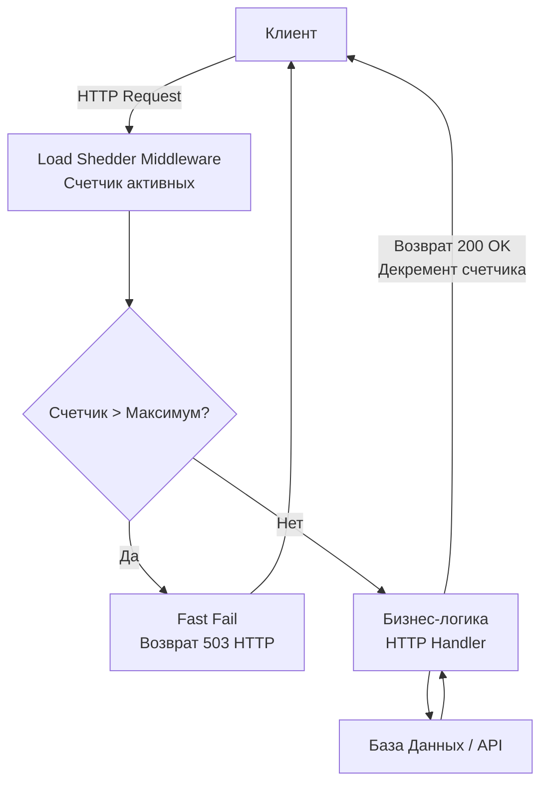

## Сброс балласта: Искусство выживания при перегрузке

Представьте, что вы летите на воздушном шаре, и он стремительно теряет высоту, рискуя разбиться о скалы. У вас нет времени разбираться, почему он падает — вам нужно немедленно сбросить балласт, чтобы спасти гондолу и пассажиров. 

В мире распределенных систем этот паттерн называется **Load Shedding (Сброс нагрузки)**. 

Когда сервис перегружен, попытка обработать *все* входящие запросы приведет к тому, что не будет обработан *ни один*. Сервис уйдет в глубокий отказ (OOM или CPU Starvation), потянув за собой соседние узлы. Load Shedding — это осознанный, контролируемый отказ в обслуживании части запросов ради того, чтобы система могла стабильно обработать хотя бы свой номинальный максимум.

В этой статье мы разберем механику деградации Go-сервисов, научимся отличать Load Shedding от Rate Limiting и напишем легковесный предохранитель для HTTP-сервера.

---

## Mechanical Sympathy: Спираль смерти сборщика мусора

Что происходит с Go-приложением (например, стандартным сервером на `net/http` или `gRPC`), когда на него обрушивается трафик, превышающий его физические возможности (например, x10 от нормы)?

1. **Безудержный рост горутин:** Стандартный `http.Server` вызывает `go c.serve(ctx)` на каждое новое входящее TCP-соединение. ОС (через epoll) принимает соединения очень быстро, порождая десятки тысяч горутин.
2. **Аллокация памяти:** Каждая горутина — это минимум 2 КБ стека (которые могут расти), плюс выделение памяти в куче (Heap) под буферы запроса, структуры JSON, контексты и объекты бизнес-логики.
3. **GC Death Spiral (Спираль смерти GC):** По мере заполнения памяти просыпается Garbage Collector. В Go GC работает параллельно с приложением (Concurrent Mark and Sweep). Ему нужно просканировать все эти десятки тысяч зависших стеков и мегабайты указателей. 
4. **Голодание CPU:** GC начинает отбирать процессорное время (до 25% CPU по умолчанию, или больше, если работает ассистирование аллокациям — *Mark Assists*). Полезная работа останавливается. Время ответа (Latency) сервиса улетает в космос.
5. **Каскадный эффект:** Из-за огромного Latency клиенты отваливаются по таймаутам (см. [[3. Timeout]]) и, что еще хуже, начинают делать новые попытки (см. [[2. Retry и backoff]]), умножая трафик в 2-3 раза. Сервис падает по Out Of Memory.

Load Shedding прерывает эту цепь на самом первом шаге. Он говорит: «У меня уже 1000 активных запросов. Я не приму 1001-й, я сразу верну ему `503 Service Unavailable`».

---

## Rate Limiting vs Load Shedding

> [!tip] Собеседование
> **Вопрос:** В чем разница между Rate Limiter и Load Shedder?
> **Ответ:** > * **Rate Limiter (Ограничение скорости):** Защищает систему от конкретного *клиента*. Базируется на квотах (например, 100 запросов в минуту для IP 192.168.1.1). Решение принимается на основе *идентификатора*.
> * **Load Shedding (Сброс нагрузки):** Защищает систему саму от себя. Базируется на *глобальном состоянии сервера* (CPU загружен на 90%, в обработке 5000 запросов). Решение принимается независимо от того, кто делает запрос — если мы тонем, мы сбрасываем всех подряд.

---

## Метрики для сброса: Как понять, что мы тонем?

Чтобы Load Shedding работал быстро, он должен проверять метрики за наносекунды. Нельзя делать сложный анализ при каждом входящем запросе.

Существует несколько подходов к измерению перегрузки:

1. **CPU / Memory Based:** Чтение метрик ОС или `runtime.ReadMemStats`. 
   * *Минус:* Метрики запаздывают. Пока вы увидите CPU 100%, очередь уже забьется.
2. **In-flight Requests (Количество активных запросов):** Самый популярный и надежный подход в Go. Мы используем атомарный счетчик для отслеживания количества запросов, которые прямо сейчас выполняются хендлерами.
3. **Queue Latency (Задержка в очереди / Соджорн тайм):** Использование алгоритмов вроде CoDel (Controlled Delay). Если запрос пролежал во внутренней очереди дольше определенного времени (например, 500 мс), он сбрасывается.

---

## Реализация In-Flight Load Shedder на Go

Напишем идиоматичный, lock-free (без мьютексов) middleware для HTTP-сервера, который сбрасывает запросы, если сервер обрабатывает слишком много задач одновременно.

```go
package loadshedding

import (
	"net/http"
	"sync/atomic"
)

// InFlightShedder ограничивает общее количество конкурентных HTTP-запросов
type InFlightShedder struct {
	inflight atomic.Int64
	max      int64
}

func NewInFlightShedder(maxRequests int64) *InFlightShedder {
	return &InFlightShedder{
		max: maxRequests,
	}
}

// Middleware оборачивает HTTP-хендлеры
func (ls *InFlightShedder) Middleware(next http.Handler) http.Handler {
	return http.HandlerFunc(func(w http.ResponseWriter, r *http.Request) {
		// Атомарно увеличиваем счетчик активных запросов
		current := ls.inflight.Add(1)
		
		// Гарантированно уменьшаем счетчик при выходе (даже если будет panic)
		defer ls.inflight.Add(-1)

		// Если превысили лимит - быстро отказываем (Fast Fail)
		if current > ls.max {
			// ВАЖНО: не читаем Body, не аллоцируем лишнюю память!
			http.Error(w, "Service Unavailable: Load Shedding", http.StatusServiceUnavailable)
			
			// Опционально: можно добавить заголовок Retry-After
			// w.Header().Set("Retry-After", "5")
			return
		}

		// Выполняем полезную работу
		next.ServeHTTP(w, r)
	})
}
```

> [!info] Под капотом
> Почему атомики (`atomic.Int64`), а не канал-семафор, как в [[4. Bulkhead]]? 
> Bulkhead используется, когда вы *готовы подождать* в очереди (до достижения таймаута). Load Shedding — это абсолютный и мгновенный Fast Fail на входе в приложение. Атомарная операция инкремента/декремента выполняется за единицы тактов процессора аппаратно (инструкция `LOCK XADD` на x86), что делает этот middleware практически бесплатным.



---

## Архитектурные ловушки (Gotchas)

### 1. Приоритезация (Priority Load Shedding)
Сбрасывать запросы случайным образом — плохая идея для сложных систем. Если ваш сервис занимается и проведением платежей, и сбором некритичной телеметрии от мобильных клиентов, при перегрузке телеметрия забьет все слоты, а платежи начнут падать с ошибкой `503`.

**Решение:** Внедрение приоритетов. 
Например, резервирование мощностей. Максимальный лимит — 1000. 
- Для фоновых задач (Background) лимит — 600.
- Для обычных запросов — 800.
- Для критических (Critical) — 1000.
Если сейчас `inflight = 650`, фоновые задачи начнут получать `503`, а платежи продолжат успешно проходить. Разбор приоритета должен делаться максимально дешево (по пути URL или HTTP-заголовкам), до парсинга JSON-тела.

### 2. LIFO vs FIFO (Парадокс очередей)
Если ваш Load Shedder работает на уровне очереди (например, в брокере сообщений, а не HTTP-сервере), возникает нюанс.
Обычно очереди работают по принципу FIFO (First In, First Out). Но при перегрузке старые сообщения, пролежавшие в очереди 5 секунд, обрабатывать *бесполезно* — клиент уже отвалился по таймауту.
В моменты жесткой деградации продвинутые системы переключают очереди в режим **LIFO (Last In, First Out)** — начинают обрабатывать самые свежие запросы, а весь "хвост" старых запросов массово сбрасывают (Drop Tail).

### 3. Куда ставить Load Shedding?
В идеальном мире Load Shedding должен происходить максимально близко к границе сети (Edge). Сбрасывать трафик прямо в Nginx, Envoy или API Gateway гораздо эффективнее, чем пускать его в Go-приложение (где даже на отклоненный запрос все равно тратится микро-ресурс на парсинг HTTP-заголовков). 
Однако наличие локального Load Shedder-а в самом Go-коде обязательно как "последний рубеж обороны" (defense in depth), на случай если прокси настроен неверно или трафик внутрикластерный.

## Итог

1. **Защита от спирали смерти:** Load Shedding спасает рантайм Go от лавинообразного создания горутин и паралича сборщика мусора.
2. **Fast Fail на максималках:** В отличие от Circuit Breaker, который защищает *исходящие* вызовы, Load Shedding защищает *само* приложение от входящего шторма.
3. **Реализация:** Дешевые атомарные счетчики (`atomic.Int64`) для In-Flight запросов — золотой стандарт для написания защитных middleware.
4. **Приоритеты:** При сбросе балласта сначала выбрасываем мешки с песком (фоновую аналитику), а не пассажиров (платежи).

Мы защитили наше приложение таймутами, мьютексами-семафорами и сбросом нагрузки. Теперь оно может выдержать практически любой шторм. Но как оркестратор (например, Kubernetes) узнает, что наше приложение перегружено, тонет или вообще зависло в дедлоке? Чтобы система могла сама себя лечить, ей нужна телеметрия жизнедеятельности. В следующей статье мы разберем [[6. Health checks]].