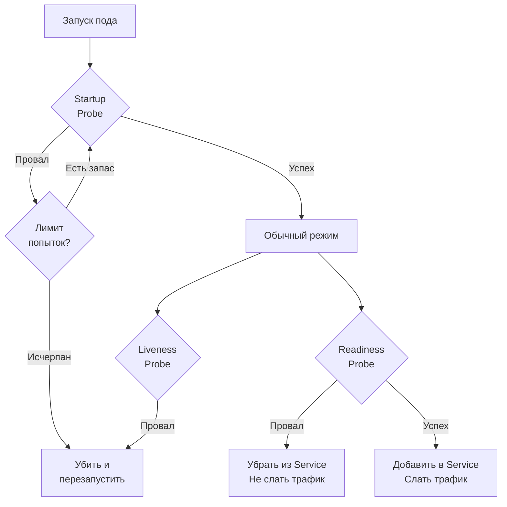

## Пульс системы: Зачем сервису рассказывать о своих болезнях

Мы построили настоящую крепость. Наш сервис защищен от внешних сбоев с помощью [[1. Circuit breaker]] и [[3. Timeout]]. От внутренних перегрузок нас спасают [[4. Bulkhead]] и [[5. Load shedding]]. 

Но любая крепость может пасть из-за внутренней диверсии. 

Что если горутина захватила мьютекс и зависла в бесконечном цикле (deadlock)? Что если мы исчерпали пул соединений с базой данных, и теперь каждый новый запрос будет вечно ждать освобождения коннекта? Процесс ОС (и контейнер) при этом жив, потребление CPU может быть около нуля, но сервис фактически **мертв** — он не способен обрабатывать полезную нагрузку.

Если оркестратор (например, Kubernetes или балансировщик нагрузки) не узнает об этом, он продолжит слать трафик в этот «зомби-сервис», а пользователи будут получать ошибки. 

Паттерн **Health Checks (Проверки работоспособности)** — это механизм телеметрии, с помощью которого приложение регулярно сообщает инфраструктуре о своем состоянии. В этой статье мы разберем, как правильно реализовать эти проверки на Go, почему нельзя смешивать их с бизнес-трафиком и как одна неверная настройка может положить весь кластер.

---

## Три кита Health Checks в мире Kubernetes

В современных распределенных системах стандартом де-факто стала модель проб (probes) из Kubernetes (см. [[2. Kubernetes. Основы]]). Оркестратору нужно отвечать на три разных вопроса, и для каждого используется свой тип проверки.

### 1. Liveness Probe (Проверка живости)
**Вопрос:** "Ты вообще жив или завис наглухо?"
**Действие при провале:** Оркестратор **убивает** контейнер (посылает SIGTERM/SIGKILL) и запускает новый.
**Имплементация:** Это должна быть максимально легковесная проверка. Возврат `200 OK`. 

### 2. Readiness Probe (Проверка готовности)
**Вопрос:** "Ты готов принимать клиентский трафик прямо сейчас?"
**Действие при провале:** Оркестратор не убивает под, но **исключает его из балансировки** (Service endpoint). Трафик перестает поступать, пока сервис снова не станет готов.
**Имплементация:** Здесь мы проверяем зависимости. Если мы потеряли коннект к Redis, мы не можем обслуживать запросы. Проваливаем Readiness, ждем восстановления связи.

### 3. Startup Probe (Проверка запуска)
**Вопрос:** "Ты уже инициализировался?"
**Зачем нужна:** Некоторые Go-сервисы (например, читающие гигабайты конфигураций в RAM или прогревающие кэши) могут стартовать несколько минут. Если бы мы использовали Liveness, Kubernetes бы убивал их за таймаут до того, как они успеют запуститься. Startup блокирует остальные пробы до своего первого успешного завершения.



---

## Архитектура на Go: Изоляция портов

> [!warning] Ловушка / Gotcha
> Самая частая ошибка при написании Health Checks на Go — это регистрация роутов `/health` и `/ready` в том же самом мультиплексоре (`http.ServeMux`), который обслуживает бизнес-логику, на том же порту (например, 8080).

**Почему это катастрофа (Mechanical Sympathy)?**
Представьте, что на ваш сервис пошел шквал трафика. Все файловые дескрипторы (FD) исчерпаны, или все ресурсы Bulkhead-семафоров заняты. Очередь на акцепт TCP-соединений (`somaxconn`) в ядре Linux переполнена.
Kubernetes стучится на `http://pod-ip:8080/health`, но ядро Linux отбрасывает (drop) эти пакеты, потому что очередь сокета полна. 
Kubelet считает, что Liveness провален, и... **убивает живой, но тяжело нагруженный сервис**. Это приводит к тому, что соседним подам становится еще хуже, и кластер складывается как карточный домик.

**Правильный паттерн (Senior Level):** Инфраструктурные эндпоинты (Health, Prometheus метрики, pprof) должны работать на **отдельном порту**, который не доступен из интернета и изолирован от основного пула HTTP-соединений.

```go
package main

import (
	"context"
	"log"
	"net/http"
	"sync/atomic"
	"time"
)

// Состояние готовности приложения
var isReady atomic.Bool

func main() {
	// 1. Инфраструктурный сервер (Health checks, Metrics, Pprof)
	infraMux := http.NewServeMux()
	
	// Liveness: Всегда 200 OK, если горутина сервера жива
	infraMux.HandleFunc("/healthz", func(w http.ResponseWriter, r *http.Request) {
		w.WriteHeader(http.StatusOK)
		w.Write([]byte("OK"))
	})

	// Readiness: Зависит от состояния приложения
	infraMux.HandleFunc("/readyz", func(w http.ResponseWriter, r *http.Request) {
		if isReady.Load() {
			w.WriteHeader(http.StatusOK)
			w.Write([]byte("READY"))
			return
		}
		// 503 означает, что мы живы, но трафик слать пока не надо
		w.WriteHeader(http.StatusServiceUnavailable) 
		w.Write([]byte("NOT READY"))
	})

	infraServer := &http.Server{
		Addr:    ":8081", // ВАЖНО: Отдельный порт!
		Handler: infraMux,
		// Инфраструктурный сервер должен иметь очень короткие таймауты
		ReadTimeout:  1 * time.Second,
		WriteTimeout: 1 * time.Second,
	}

	go func() {
		log.Println("Starting infra server on :8081")
		if err := infraServer.ListenAndServe(); err != http.ErrServerClosed {
			log.Fatalf("Infra server failed: %v", err)
		}
	}()

	// 2. Основной бизнес-сервер
	businessMux := http.NewServeMux()
	businessMux.HandleFunc("/api/v1/data", func(w http.ResponseWriter, r *http.Request) {
		// ... бизнес логика ...
	})

	businessServer := &http.Server{
		Addr:    ":8080",
		Handler: businessMux,
	}

	// Симуляция инициализации (прогрев кэша, подключение к БД)
	go func() {
		time.Sleep(3 * time.Second) // Долгая работа
		isReady.Store(true)         // Включаем прием трафика
		log.Println("Application is ready to serve traffic")
	}()

	log.Println("Starting business server on :8080")
	if err := businessServer.ListenAndServe(); err != http.ErrServerClosed {
		log.Fatalf("Business server failed: %v", err)
	}
}
```

> [!info] Под капотом
> Запуск двух `http.Server` создает два независимых потока прослушивания сокетов в ядре Linux. Сетевой поллер Go (`netpoll`) будет обслуживать их независимо. Даже если слушатель на порту 8080 заблокирован (например, из-за нехватки горутин-обработчиков при кривой настройке лимитов), слушатель на 8081 продолжит мгновенно принимать соединения от kubelet, рапортуя о состоянии сервиса.

---

## Архитектурные ловушки (Deep Health Checks)

> [!tip] Собеседование
> **Вопрос:** Стоит ли в Liveness probe проверять доступность базы данных (PostgreSQL), с которой работает сервис?
> **Ответ:** **Категорически НЕТ.** Это классический антипаттерн, приводящий к каскадному отказу.

Представьте: в сети произошел минутный сбой (network partition) между вашими сервисами и базой данных PostgreSQL. 

**Что будет, если БД проверяется в Liveness:**
Все 100 подов вашего микросервиса провалят Liveness-проверку. Kubernetes начнет их **одновременно убивать и перезапускать** (CrashLoopBackOff). Когда сеть поднимется, базе данных придется одновременно принять 100 новых тяжелых подключений, аллоцировать память и провести аутентификацию (Thundering Herd). СУБД рухнет от перегрузки.

**Что будет, если БД проверяется в Readiness:**
Все 100 подов провалят Readiness. Kubernetes исключит их из балансировки (пользователи увидят 503 ошибки). **Но процессы останутся живы.** Соединения с базой (через `database/sql` pool) останутся открытыми или попытаются переподключиться в фоне. Как только сеть восстановится, Readiness вернет `200 OK`, Kubernetes вернет поды в ротацию, и система плавно продолжит работу за миллисекунды.

**Золотое правило Deep Checks:**
* **Liveness:** Строго локальная проверка. Проверяем только себя (нет ли дедлока, инициализирован ли стейт). Никаких сетевых вызовов.
* **Readiness:** Может проверять жизненно важные зависимости (базу, кэш), НО с очень коротким таймаутом (200-500мс) и кэшированием статуса. Если 1000 раз в секунду дергать `SELECT 1` из базы чисто ради Readiness — вы убьете базу своими же хелсчеками.

## Итог

1. **Три уровня проверки:** Liveness (жизнеспособность), Readiness (готовность к трафику), Startup (прогрев приложения).
2. **Изоляция:** Инфраструктурные роуты всегда должны висеть на отдельном порту, чтобы не делить очереди ОС с бизнес-трафиком.
3. **Опасность Deep Checks:** Использование проверок зависимостей в Liveness ведет к рестарт-штормам и убивает кластер при малейших сетевых флапах.
4. **Легковесность:** Health checks должны быть lock-free и отрабатывать за наносекунды, предпочтительно используя атомарные переменные (`atomic.Bool`), которые обновляются фоновым процессом-воркером.

Мы поняли, как сообщать системе о нашем здоровье. Но что если мы заболели лишь частично? Например, база данных легла, но кэш жив. Должны ли мы возвращать `503` на все запросы? Нет. В следующей статье мы разберем, как реализовать паттерн [[7. Graceful degradation]], чтобы наш сервис мог достойно выполнять хотя бы часть своих функций даже в условиях тяжелой аварии.