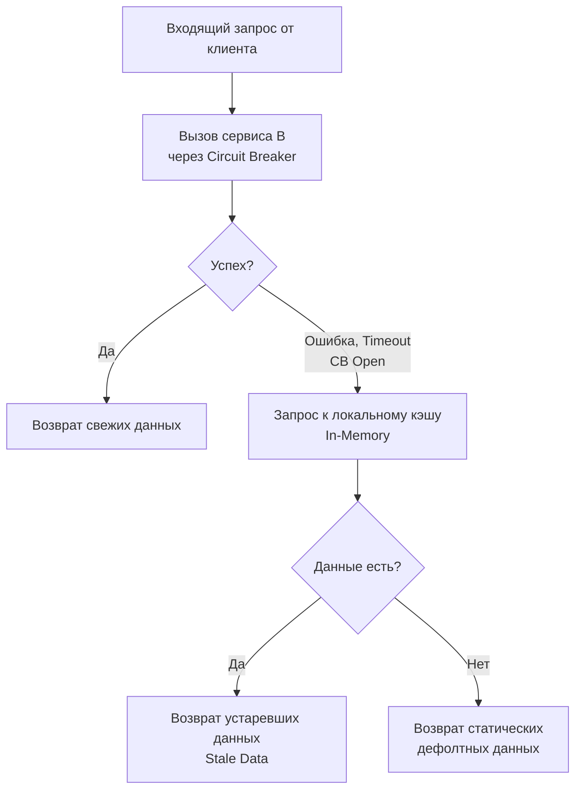

## Искусство падать с достоинством: Эскалатор становится лестницей

В мире инженерии есть известная шутка: «Эскалатор не может сломаться, он может только стать лестницей». Это идеальное описание того, как должна вести себя правильно спроектированная распределенная система.

Все паттерны, которые мы изучили ранее — [[1. Circuit breaker]], [[3. Timeout]], [[4. Bulkhead]], [[5. Load shedding]] — это защитные механизмы инженера. Они предотвращают каскадные сбои на уровне инфраструктуры и рантайма, обрывая соединения и возвращая технические ошибки (например, `503 Service Unavailable` или `context.DeadlineExceeded`). 

Но для бизнеса и конечного пользователя чистая техническая ошибка — это провал. Если у вас отвалился микросервис персонализированных рекомендаций, клиент не должен видеть белый экран или сообщение «Internal Server Error». Он должен увидеть базовый каталог товаров. 

Паттерн **Graceful Degradation (Плавная деградация)** — это продуктовый и архитектурный ответ на технические сбои. Это способность системы продолжать предоставлять базовую бизнес-ценность, даже когда часть её компонентов (или зависимостей) полностью уничтожена.

В этой статье мы разберем стратегии деградации, напишем идиоматичный Go-код с фокусом на производительность (потому что при аварии система и так перегружена) и разберем фатальные ошибки кэширования на собеседованиях.

---

## Иерархия ответов: От идеала к выживанию

Когда микросервис A обращается к микросервису B за данными, у нас есть строгая иерархия того, что мы можем вернуть пользователю:

1. **Primary (Свежие данные):** Идеальный сценарий. Сервис B ответил быстро и корректно.
2. **Stale Data (Устаревшие данные):** Сервис B недоступен (или Circuit Breaker в состоянии OPEN). Мы идем в локальный кэш (RAM или Redis) и отдаем данные, которые закэшировали 10 минут назад. В рамках [[6. Consistency vs availability]] мы выбираем доступность в ущерб консистентности.
3. **Default/Static Data (Статика):** Кэш пуст, сервис B мертв. Мы возвращаем жестко зашитые в код популярные товары или пустой, но безопасный список `[]`, чтобы UI фронтенда не сломался.
4. **Feature Toggle (Отключение фичи):** Если данные получить невозможно в принципе (например, сервис процессинга платежей недоступен), мы скрываем кнопку «Оплатить» на UI или меняем её на «Оставить заявку», деградируя функционал до асинхронного.



---

## Реализация в Go: Zero-Allocation Fallbacks

Главное правило Graceful Degradation: **Фолбэк должен быть абсолютно бесплатным для CPU и памяти.**

Когда система уходит в деградацию, она, скорее всего, уже испытывает перегрузку (по сети, CPU или памяти). Если ваш код фолбэка будет аллоцировать новые структуры, парсить JSON или делать тяжелые вычисления, вы только добьете систему, вызвав всплеск активности Garbage Collector.

> [!info] Под капотом: Mechanical Sympathy
> В Go создание пустого слайса `make([]Item, 0)` или аллокация дефолтной структуры `&Response{}` на каждый упавший запрос в момент аварии (когда RPS может достигать десятков тысяч) — это выстрел в ногу. Стек горутины не всегда может удержать эти аллокации (Escape Analysis перенесет их в кучу, если они возвращаются из функции).
> 
> **Решение:** Использовать глобальные, предварительно аллоцированные переменные (Read-Only) для статического фолбэка. Указатель на одну и ту же структуру в памяти не стоит ничего.

### Архитектура надежного клиента

Посмотрим, как выглядит production-ready реализация клиента, который умеет плавно деградировать.

```go
package catalog

import (
	"context"
	"errors"
	"log/slog"
	"time"

	"[github.com/sony/gobreaker](https://github.com/sony/gobreaker)"
)

// Item представляет товар
type Item struct {
	ID    string
	Title string
}

// Global pre-allocated fallback data (Zero-allocation on error)
// Эта память выделяется один раз при старте приложения
var defaultRecommendations = []Item{
	{ID: "pop-1", Title: "Хит продаж: Ноутбук"},
	{ID: "pop-2", Title: "Хит продаж: Смартфон"},
}

// Client управляет запросами к нестабильному сервису рекомендаций
type Client struct {
	cb    *gobreaker.CircuitBreaker
	cache Cache // Интерфейс к in-memory кэшу (например, Ristretto или BigCache)
}

func NewClient(cache Cache) *Client {
	return &Client{
		cache: cache,
		cb: gobreaker.NewCircuitBreaker(gobreaker.Settings{
			Name:    "recommendations-api",
			Timeout: 5 * time.Second,
		}),
	}
}

// GetRecommendations возвращает рекомендации с плавной деградацией
func (c *Client) GetRecommendations(ctx context.Context, userID string) ([]Item, error) {
	// 1. Попытка получить свежие данные (Primary)
	// Execute оборачивает вызов в Circuit Breaker
	res, err := c.cb.Execute(func() (interface{}, error) {
		return c.fetchRemote(ctx, userID)
	})

	if err == nil {
		items := res.([]Item)
		// Успех! Асинхронно обновляем кэш в фоне
		go c.updateCacheSafely(userID, items)
		return items, nil
	}

	// === НАЧАЛО ФАЗЫ ДЕГРАДАЦИИ ===
	
	// Логируем факт деградации, но не возвращаем ошибку клиенту!
	slog.Warn("recommendations primary failed, degrading", "user", userID, "err", err)

	// 2. Попытка отдать Stale Data из кэша
	if cached, ok := c.cache.Get(userID); ok {
		slog.Debug("serving stale recommendations from cache")
		return cached.([]Item), nil
	}

	// 3. Абсолютный фолбэк: отдаем статику (Default Data)
	// Важно: возвращаем ссылку на преаллоцированный глобальный слайс, 
	// экономя аллокации в куче!
	slog.Debug("serving static default recommendations")
	return defaultRecommendations, nil
}

// fetchRemote симулирует нестабильный HTTP-вызов
func (c *Client) fetchRemote(ctx context.Context, userID string) ([]Item, error) {
	// Здесь был бы реальный http.Client с настроенным Timeout
	// ...
	return nil, errors.New("network timeout")
}

func (c *Client) updateCacheSafely(userID string, items []Item) {
	// Сохраняем в кэш. Время жизни кэша делаем большим (например, 24 часа), 
	// чтобы при затяжной аварии данные сохранялись.
	c.cache.Set(userID, items, 24*time.Hour)
}
```

---

## Архитектурные ловушки (Gotchas)

Плавная деградация таит в себе несколько опасных антипаттернов, о которых часто спрашивают на собеседованиях уровня Senior.

> [!tip] Собеседование
> **Вопрос:** Что такое "Poisoned Fallback" (Отравленный фолбэк) и как его избежать?
> **Ответ:** Это критическая ошибка проектирования, когда вы кэшируете результат деградации как успешный ответ. 

Представьте:
1. Вы запрашиваете профиль пользователя.
2. База данных (Primary) лежит.
3. Вы возвращаете дефолтный профиль: `User{Name: "Гость", Status: "Offline"}`.
4. **Ошибка:** Ваш код (или API Gateway) радостно сохраняет этот объект "Гостя" в Redis под ключом реального пользователя с TTL на час.
5. База данных поднимается через 10 секунд.
6. Но ваш пользователь еще целый час будет видеть себя как "Гость", потому что кэш "отравлен" успешной записью фолбэка.

**Правило:** *Никогда не кэшируйте дефолтные ответы и ответы с деградацией.* В кэш должны попадать только данные, полученные от Primary-источника с HTTP кодом `200 OK`.

### Частичная сборка (Partial Assembly) с errgroup

В микросервисной архитектуре (см. [[5. API contracts]] и [[5. BFF]]) Backend-For-Frontend часто агрегирует данные из 5-10 сервисов для отрисовки одной страницы.

Если мы используем стандартный пакет `golang.org/x/sync/errgroup`, и одна горутина вернет ошибку, весь контекст отменится, и вся сборка страницы упадет. Это противоречит Graceful Degradation.

Для агрегации мы должны обрабатывать ошибки *внутри* горутин, возвращая в саму `errgroup` всегда `nil` (чтобы не убить остальные запросы), и подменяя данные на фолбэки.

```go
func BuildProductPage(ctx context.Context, productID string) Page {
    var page Page
    g, ctx := errgroup.WithContext(ctx)

    // 1. Критический запрос (если упадет - деградация невозможна)
    g.Go(func() error {
        info, err := fetchProductInfo(ctx, productID)
        if err != nil {
            return err // Убиваем группу, без этого товара страница не имеет смысла
        }
        page.Info = info
        return nil
    })

    // 2. Некритичный запрос (рейтинг)
    g.Go(func() error {
        rating, err := fetchRating(ctx, productID)
        if err != nil {
            slog.Warn("rating degraded")
            page.Rating = "N/A" // Деградация: рейтинг временно недоступен
            return nil // ВАЖНО: не возвращаем err в группу!
        }
        page.Rating = rating
        return nil
    })

    if err := g.Wait(); err != nil {
        return HandleFatalError() // Возвращаем 500 только если упал критический компонент
    }
    
    return page // Возвращаем частично заполненную страницу
}
```

## Итог

1. **Бизнес превыше всего:** Graceful Degradation маскирует технические сбои инфраструктуры, позволяя бизнесу продолжать работу, пусть и в ограниченном режиме.
2. **Иерархия кэширования:** Всегда имейте план Б (Stale Data из in-memory кэша) и план В (преаллоцированные статические дефолты).
3. **Mechanical Sympathy:** Фолбэк должен быть невероятно легковесным. Используйте глобальные структуры или `sync.Pool`, чтобы не добить захлебывающийся GC лишними аллокациями памяти.
4. **Осторожность с кэшем:** Никогда не сохраняйте деградированные данные в Primary-кэш, чтобы не получить Poisoned Fallback.

Мы рассмотрели все основные паттерны проектирования надежных систем: от таймаутов до плавной деградации. Но как доказать, что всё это действительно работает, а не просто красиво выглядит в коде? Инженеры не верят на слово. Чтобы убедиться в надежности системы, мы должны намеренно попытаться её сломать прямо в production. В следующей статье мы переходим к радикальной практике проверки наших архитектурных решений: [[8. Chaos engineering]].