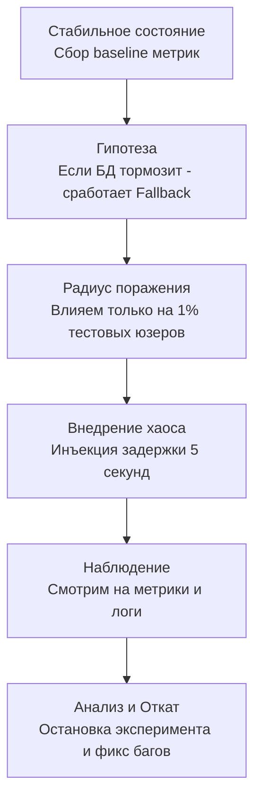

## Контролируемое разрушение: Зачем ломать то, что работает

Мы потратили шесть предыдущих статей на создание брони для нашего приложения. Мы внедрили [[1. Circuit breaker]], настроили [[3. Timeout]], защитили ресурсы через [[4. Bulkhead]] и [[5. Load shedding]], а также научились деградировать с достоинством в [[7. Graceful degradation]]. На бумагах и в юнит-тестах наша система выглядит абсолютно неуязвимой.

Но распределенная система живет в реальном мире, где серверы горят, экскаваторы рвут оптику, а в ядре Linux случаются баги. Если вы не тестируете отказы в production (или в среде, максимально к нему приближенной), вы не можете быть уверены, что ваша броня выдержит удар. 

**Chaos Engineering (Хаос-инженерия)** — это дисциплина проведения контролируемых экспериментов над распределенной системой с целью выявления ее уязвимостей до того, как они приведут к реальной аварии.

В этой статье мы разберем, как применять хаос-инженерию в Go-бэкенде, что происходит с рантаймом при инъекции сетевых аномалий, и как использовать фичи компилятора Go для безопасной доставки "хаоса".

---

## Научный метод, а не вандализм

Многие ошибочно полагают, что хаос-инженерия — это просто случайное убийство подов в Kubernetes с помощью скрипта (наследие раннего Netflix Chaos Monkey). 

На самом деле, это строгий научный процесс:



Если у вас нет Observability (метрик, трейсов, логов), хаос-инженерия вам противопоказана. Вы просто сломаете систему и не поймете почему. Сначала мониторинг, потом эксперименты.

---

## Уровни инъекции хаоса

Мы можем ломать систему на разных слоях. Для глубокого понимания (Mechanical Sympathy) разработчику важно знать, как каждый слой влияет на Go-приложение.

### 1. Инфраструктурный уровень (Убийство подов/узлов)
Самый грубый уровень. Kubernetes (K8s) оркестраторы вроде Chaos Mesh или LitmusChaos просто делают `kubectl delete pod`. 
**Как реагирует Go:** Приложение получает сигнал `SIGTERM`. Здесь мы тестируем наш Graceful Shutdown. Хватает ли приложению времени (обычно 30 секунд), чтобы завершить текущие горутины, дописать данные в БД и корректно закрыть TCP-соединения, или клиенты получают обрыв соединения (Connection Reset by Peer)?

### 2. Сетевой уровень (Network Partition & Latency)
Инструменты используют Linux Traffic Control (`tc qdisc`) или `iptables`/eBPF для отбрасывания пакетов (Drop), дублирования пакетов или добавления задержки (Delay).

> [!info] Под капотом: Go и Linux tc
> Если мы пропишем в Linux задержку в 5 секунд на исходящий трафик к базе данных:
> 1. Ваша горутина вызывает `sql.Query()`.
> 2. Под капотом происходит вызов системного `syscall.Write` в TCP-сокет.
> 3. Данные уходят в буфер ядра ОС, но Linux `tc qdisc` (Queueing Discipline) искусственно удерживает пакет.
> 4. Горутина блокируется в ожидании ответа через `epoll`. Рантайм паркует ее (`gopark`), освобождая `M` (поток ОС).
> 5. Начинают накапливаться новые запросы. Количество зависших горутин растет экспоненциально.
> 
> Именно этот тест физически доказывает, правильно ли вы настроили размер пула соединений БД (`SetMaxOpenConns`) и работает ли ваш паттерн [[4. Bulkhead]]. Если лимитов нет, рантайм сожрет всю память под новые горутины, и система умрет от OOM.

### 3. Уровень приложения (Application Fault Injection)
Это самый хирургически точный метод. Мы не трогаем сеть или инфраструктуру, мы заставляем сам код на Go симулировать ошибки: возвращать ошибку при обращении к кэшу, паниковать в случайном месте или спать внутри хендлера.

---

## Реализация Chaos Middleware в Go (Idiomatic Approach)

Как безопасно внедрить код для хаоса в бэкенд, чтобы он случайно не активировался в production и не ударил по реальным пользователям? 

Идиоматичный подход в Go — использование **Build Tags (Тегов сборки)** и маршрутизации на основе HTTP-заголовков.

### Шаг 1: Изоляция через Build Tags
Мы создаем два файла: один для нормальной сборки, другой — только для тестов с хаосом.

Файл `chaos_noop.go` (компилируется по умолчанию):
```go
//go:build !chaos

package chaos

import "net/http"

// Injector в обычном билде ничего не делает (нулевой оверхед)
func Injector(next http.Handler) http.Handler {
	return next
}
```

Файл `chaos_active.go` (компилируется только при флаге `-tags chaos`):
```go
//go:build chaos

package chaos

import (
	"log/slog"
	"net/http"
	"time"
)

// Injector перехватывает запросы и применяет правила хаоса
func Injector(next http.Handler) http.Handler {
	return http.HandlerFunc(func(w http.ResponseWriter, r *http.Request) {
		// Ограничиваем радиус поражения: 
		// Хаос применяется ТОЛЬКО к запросам со специальным хидером
		if r.Header.Get("X-Chaos-Experiment") != "true" {
			next.ServeHTTP(w, r)
			return
		}

		action := r.Header.Get("X-Chaos-Action")
		switch action {
		case "delay":
			slog.Warn("CHAOS: Injecting 3 second delay")
			time.Sleep(3 * time.Second) // Тестируем Timeout и Load Shedding
		case "error":
			slog.Warn("CHAOS: Injecting 500 Internal Server Error")
			http.Error(w, "Chaos Injection: DB Deadlock", http.StatusInternalServerError)
			return // Тестируем Circuit Breaker клиента
		case "panic":
			slog.Warn("CHAOS: Injecting Panic")
			panic("Chaos Injection: Unexpected nil pointer") // Тестируем recovery middleware
		}

		next.ServeHTTP(w, r)
	})
}
```

### Шаг 2: Использование в основном приложении

В вашем `main.go` вы просто оборачиваете ваш роутер в эту мидлварь:

```go
package main

import (
	"net/http"
	"myapp/internal/chaos" // Наш пакет
)

func main() {
	mux := http.NewServeMux()
	mux.HandleFunc("/api/data", dataHandler)

	// В продакшене (go build) это будет пустая обертка, компилятор ее заинлайнит.
	// На staging (go build -tags chaos) это будет активная точка инъекции.
	handler := chaos.Injector(mux)

	http.ListenAndServe(":8080", handler)
}
```

> [!tip] Собеседование
> **Вопрос:** Как протестировать, что ваш Retry работает корректно, если целевой сервис доступен только по gRPC, а сеть в кластере стабильна?
> **Ответ:** Использовать gRPC Interceptors (аналог HTTP Middleware) с применением инъекции ошибок. Можно настроить интерцептор так, чтобы он возвращал `codes.Unavailable` в 30% случаев. В Go это легко интегрируется через опции `grpc.WithUnaryInterceptor`. Мы запускаем тесты и проверяем по трейсам (OpenTelemetry), что клиент делает именно 3 попытки с экспоненциальным бэкоффом.

---

## Архитектурные ловушки (Gotchas)

### 1. Тестирование "Сферического коня в вакууме"
Часто разработчики тестируют хаос только на Staging-окружении, где нет реальной нагрузки. 
**Ловушка:** В пустом кластере Timeout в 2 секунды сработает идеально. В Production, где CPU занят на 80%, а GC борется с мусором, таймер рантайма Go может сработать с небольшой задержкой (timer drift), или освобождение контекста займет больше времени из-за lock contention. 
**Решение:** Высший пилотаж — это хаос-эксперименты в Production, но с использованием **Shadow Traffic (Теневого трафика)** или четко выделенных тестовых аккаунтов (пробрасываемых через заголовки, как в примере выше).

### 2. Забытый Fallback
При внедрении хаоса на уровне БД часто забывают, что кэш (например, Redis) тоже может отказать. Что если умрет и БД, и кэш одновременно? Это называется *составной отказ (Compound Failure)*. Ваш эксперимент всегда должен проверять глубину деградации (до статического ответа из памяти), иначе система просто зависнет на поиске резервных вариантов.

### 3. Исчерпание энтропии (Entropy Exhaustion)
Редкий, но интересный кейс на стыке железа и ОС. Если ваш хаос-эксперимент создает тысячи оборванных TLS-соединений в секунду (симулируя отвалы клиентов), ядро Linux может исчерпать пул криптографической энтропии (`/dev/urandom` или старый `/dev/random`), необходимой для генерации новых ключей сессий. Ваша система начнет дико тормозить на этапе рукопожатия (TLS Handshake), и вы будете искать причину в Go, хотя проблема в пуле энтропии ОС.

## Итог

1. **Хаос — это инструмент проверки:** Он нужен не для того, чтобы ломать, а чтобы доказывать, что система выживет.
2. **Mechanical Sympathy:** Понимание того, как ОС блокирует сокеты и как планировщик Go реагирует на спящие горутины, критически важно для проектирования правильных ограничений.
3. **Idiomatic Go:** Используйте Build Tags (`//go:build chaos`) для изоляции тестового кода от релизных бинарников, гарантируя нулевой оверхед (Zero Overhead) в production.
4. **Контроль радиуса:** Всегда начинайте с малого — внедряйте хаос для одного тестового пользователя или отдельного хидера, постепенно увеличивая нагрузку.

В этом разделе мы научились защищать наши сервисы от любых внутренних и внешних сбоев. Но до сих пор мы рассматривали систему глазами самого микросервиса. В современном облачном мире управление сетевым взаимодействием, шифрованием, таймаутами и ретраями всё чаще выносят за пределы Go-приложения — на уровень инфраструктуры. Мы переходим к следующему большому разделу нашей базы знаний. Следующая статья: [[1. Service mesh]].