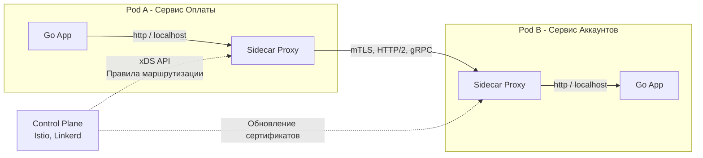

## Умная сеть для глупых клиентов: Эволюция архитектуры

В предыдущем разделе «Надежность» мы потратили много времени на написание сложного кода. Мы оборачивали наши HTTP-клиенты в [[1. Circuit breaker]], писали логику для [[2. Retry и backoff]], тщательно настраивали [[3. Timeout]] и защищали рантайм через [[4. Bulkhead]]. 

Теперь представьте, что ваша компания выросла. У вас 100 микросервисов. Часть из них написана на Go, часть — легаси на Java, а дата-саентисты выкатили сервисы на Python. 

Вам нужно обновить логику Circuit Breaker, чтобы он лучше реагировал на 503 ошибки. В мире «толстых библиотек» (Fat Libraries) вам придется:
1. Написать реализацию для Go, Java и Python.
2. Провести ревью кода в трех разных командах.
3. Дождаться, пока все 100 сервисов обновят зависимости, пройдут CI/CD и выкатятся в продакшен. 

Этот процесс займет месяцы. И ровно в этот момент системная архитектура переходит от парадигмы «Умные клиенты и глупая сеть» к парадигме **«Глупые клиенты и умная сеть»**. Это и есть **Service Mesh (Сервисная сетка)**.

В этой статье мы разберем, что такое Service Mesh, как он освобождает Go-разработчиков от написания инфраструктурного кода и какую цену (в тактах процессора и системных вызовах) мы за это платим.

---

## Анатомия Service Mesh

**Service Mesh** — это выделенный инфраструктурный слой для обеспечения безопасного, быстрого и надежного взаимодействия между сервисами.

Логически он делится на две фундаментальные части:

### 1. Data Plane (Плоскость данных)
Это набор интеллектуальных прокси-серверов (например, Envoy или Linkerd-proxy), которые разворачиваются рядом с каждым экземпляром вашего приложения. В Kubernetes это реализуется через паттерн **Sidecar** (мотоциклетная коляска) — прокси работает в отдельном контейнере, но внутри того же самого Pod-а, разделяя с Go-приложением одно сетевое пространство (Network Namespace).
Data Plane перехватывает **весь** входящий и исходящий трафик приложения.

### 2. Control Plane (Плоскость управления)
Это «мозг» системы (например, Istiod в Istio). Control Plane не пропускает через себя пользовательский трафик. Его задача — хранить конфигурации (маршруты, лимиты, сертификаты) и динамически рассылать их всем прокси-серверам в Data Plane через специальные API.

---

## Что Service Mesh забирает на себя?

Когда вы внедряете Service Mesh (например, Istio), код вашего Go-приложения кардинально упрощается. Ваш сервис больше не должен знать о топологии сети.

1. **Service Discovery:** Вы больше не пишете логику балансировки. Go-клиент просто делает `http.Get("http://accounts-service")`. Прокси перехватывает запрос, сам находит актуальные IP-адреса подов, проверяет их Health Checks и выбирает наименее загруженный (Least Request Load Balancing).
2. **Reliability (Надежность):** Retry, Timeout и Circuit Breaker настраиваются не в Go-коде, а в YAML-манифестах Kubernetes. Прокси сам сделает 3 попытки при ошибке 503, сам обрежет долгий запрос и сам отключит трафик к упавшему поду.
3. **Observability (Наблюдаемость):** Прокси автоматически отдает метрики RED (Rate, Errors, Duration) в Prometheus. Вам не нужно оборачивать каждый HTTP-хендлер в Go-мидлварь для сбора метрик сетевого взаимодействия.
4. **Безопасность:** Прокси автоматически шифруют трафик между собой. Ваше Go-приложение общается по чистому HTTP (без сертификатов), а в сеть уходит зашифрованный mTLS.

---

## Mechanical Sympathy: Налог на Service Mesh

> [!warning] Ловушка / Gotcha
> Ничто не дается бесплатно. Архитекторы часто забывают, что внедрение Service Mesh добавляет минимум два сетевых хопа (прыжка) на КАЖДЫЙ сетевой вызов между сервисами. Для инженера, пишущего высоконагруженный код на Go, критически важно понимать цену этих хопов на уровне ОС.

Давайте разберем, что происходит под капотом Linux при исходящем запросе из Go-приложения в кластере с Istio:

1. **Go Runtime:** Ваша программа выполняет `syscall.Write`, отправляя HTTP-запрос в TCP-сокет.
2. **iptables (Ядро Linux):** При старте пода Istio Init-контейнер прописал жесткие правила `iptables`. Ядро перехватывает исходящий пакет из Go-приложения (с помощью механизма `netfilter`) и выполняет операцию `REDIRECT`, перенаправляя пакет на порт Sidecar-прокси (обычно `15001`).
3. **Sidecar Proxy (User Space):** Прокси читает байты из сокета (`syscall.Read`), парсит HTTP-заголовки, чтобы понять, куда вы реально хотели пойти. Применяет правила Circuit Breaker.
4. **Шифрование:** Прокси шифрует пакет (TLS) и делает `syscall.Write` уже в реальную сеть.
5. **Целевой Pod:** На принимающей стороне происходит обратный процесс — пакет попадает в ядро, перехватывается `iptables`, читается прокси-сервером, расшифровывается, и только потом прокси отправляет его в ваше целевое Go-приложение на `localhost`.

### Цена вопроса
* **Memory Copying:** Данные несколько раз копируются между пространством ядра (Kernel Space) и пространством пользователя (User Space).
* **Context Switches:** Переключения контекста при системных вызовах `read/write` кратно возрастают.
* **Latency:** В среднем Service Mesh добавляет от 1 до 5 миллисекунд к каждому вызову (зависит от настроек и нагрузки). Если ваш бизнес-процесс требует цепочки из 5 микросервисов, общая задержка может вырасти на 15-25 мс только за счет проксирования.
* **CPU & Memory:** Sidecar-контейнеры требуют ресурсов. Если у вас 1000 подов, у вас будет 1000 запущенных инстансов Envoy, каждый из которых может потреблять 50-100 МБ RAM.

> [!info] Под капотом: eBPF спешит на помощь
> Современные решения (например, Cilium Service Mesh или свежие версии Istio с режимом Ambient Mesh) уходят от использования устаревшего и медленного `iptables`. Они используют **eBPF** (Extended Berkeley Packet Filter). Это позволяет запускать программы прямо внутри ядра Linux, минуя лишние копирования памяти и `iptables` цепочки. В режиме Ambient Sidecar вообще исчезает из пода, заменяясь легковесным узловым агентом (ztunnel).

---

## Service Mesh vs API Gateway

Это один из самых частых вопросов на собеседованиях при проектировании архитектуры.

> [!tip] Собеседование
> **Вопрос:** Зачем нам Service Mesh, если у нас уже есть Nginx/Kong/KrakenD в качестве API Gateway? Разве они не делают то же самое?
> **Ответ:** Разница в направлении трафика и зоне ответственности.
> 
> * **API Gateway** обслуживает **North-South трафик** (Север-Юг) — запросы от внешних клиентов (браузеры, мобильные приложения) внутрь дата-центра. Его задачи: авторизация пользователей (JWT), защита от DDoS, терминация публичных SSL-сертификатов, преобразование протоколов (например, HTTP в gRPC) и аггрегация ответов.
> * **Service Mesh** обслуживает **East-West трафик** (Восток-Запад) — запросы микросервисов друг к другу ВНУТРИ безопасного периметра дата-центра. Он не знает о "пользователях", он знает только о "сервисах".

Во многих современных топологиях они работают вместе: запрос от клиента бьется в API Gateway (North-South), Gateway проводит авторизацию и отправляет запрос во внутренний микросервис, а уже это взаимодействие подхватывается Data Plane-ом сервисной сетки (East-West).

## Итог

1. **Делегирование ответственности:** Service Mesh позволяет убрать из Go-кода сложную логику маршрутизации, ретраев и шифрования, перенеся её на уровень инфраструктуры. Приложение становится "глупее" и чище.
2. **Sidecar паттерн:** Data Plane состоит из прокси-серверов, работающих бок о бок с вашими приложениями в общих сетевых пространствах.
3. **Плата за удобство:** Перехват трафика через `iptables` и двойная сериализация/десериализация добавляют overhead по CPU, памяти и Latency. Инженерам необходимо учитывать это при расчетах SLA.

В этой статье мы говорили о Data Plane абстрактно, называя его "умным прокси". Но в 90% случаев в современном мире под этим словом скрывается конкретный инструмент, написанный на C++, который стал индустриальным стандартом. В следующей статье мы заглянем под капот этого монстра: [[2. Envoy и sidecar]].