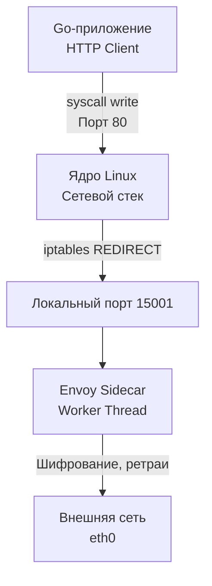
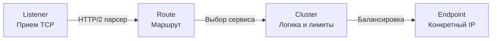

## Envoy: Титановый прокси в коляске

В прошлой статье [[1. Service mesh]] мы разобрали, зачем архитекторы выносят логику сетевого взаимодействия (ретраи, таймауты, балансировку) из кода сервиса на уровень инфраструктуры. Мы говорили о "плоскости данных" (Data Plane) как об абстрактных "умных прокси".

В 90% современных инсталляций Kubernetes этот "умный прокси" — это **Envoy**. 

Envoy — это высокопроизводительный распределенный прокси-сервер L3/L4 и L7, изначально разработанный в Lyft, а теперь являющийся бриллиантом Cloud Native Computing Foundation (CNCF). Именно он работает под капотом Istio, AWS App Mesh, Consul Connect и множества других Service Mesh реализаций.

Для Go-разработчика, претендующего на Senior-уровни, Envoy — это не просто "черный ящик", который настраивают девопсы. Это ключевой компонент, напрямую влияющий на задержки (latency) и потребление ресурсов вашего микросервиса.

В этой статье мы заглянем под капот Envoy, разберем его потоковую модель, процесс перехвата трафика и поймем, почему его не написали на Go.

---

## Mechanical Sympathy: Почему C++, а не Go?

Это один из самых философских вопросов. Go — идеальный язык для бэкенда и облачной инфраструктуры (Docker, Kubernetes, Prometheus, Terraform написаны на Go). Тот же Traefik или ранний Linkerd написаны на Go и Scala/Rust. Так почему царем горы стал Envoy, написанный на современном C++14?

**Ответ: Непредсказуемость Garbage Collector (GC) и борьба за хвостовые задержки (Tail Latency).**

В Go сборщик мусора работает параллельно (Concurrent Mark and Sweep). Несмотря на то, что паузы STW (Stop The World) в современном Go сведены к долям миллисекунд, работа GC потребляет процессорное время (иногда до 25% CPU при жестком профиле аллокаций). 

Прокси-сервер, через который проходят миллионы запросов в секунду (RPS), постоянно выделяет и освобождает буферы под сетевые пакеты. 
* В Go это привело бы к огромному давлению на GC, что вызвало бы спайки (всплески) задержек на перцентилях p99 и p99.9.
* В C++ память управляется вручную (через RAII и умные указатели). Envoy использует пулы арен (Arena Memory Allocation), переиспользуя участки памяти для сетевых буферов. Это гарантирует абсолютно предсказуемую и ровную задержку, независимо от нагрузки.

---

## Потоковая модель Envoy (Threading Model)

Чтобы прокси не стал бутылочным горлышком, он должен работать с железом максимально эффективно. Envoy использует архитектуру **Event-Driven Non-Blocking I/O** (похожую на Nginx, но со своими особенностями).

В Envoy есть два типа потоков ОС:
1. **Main Thread (Главный поток):** Занимается инициализацией, конфигурацией (xDS API), сбором метрик и управлением процессами. Он НИКОГДА не касается пользовательского трафика.
2. **Worker Threads (Рабочие потоки):** Занимаются непосредственно обработкой сетевого трафика. По умолчанию Envoy запускает ровно столько воркеров, сколько у вас ядер процессора.

> [!info] Под капотом
> Каждый Worker Thread крутит свой собственный цикл событий (на базе `epoll` в Linux). 
> **Самое важное правило Envoy:** Каждое сетевое соединение (connection) жестко привязывается к ОДНОМУ воркеру на всё время своей жизни. 
> 
> Это означает, что при обработке конкретного HTTP-запроса внутри Envoy **вообще нет мьютексов (Locks)**. Воркеру не нужно синхронизировать доступ к буферам памяти с другими потоками. Это устраняет Lock Contention и проблему инвалидации кэш-линий процессора, позволяя прокси молотить трафик со скоростью света.

---

## Как Sidecar перехватывает трафик вашего Go-приложения?

Вы написали простейший HTTP-клиент на Go: `http.Get("http://user-service/api/users")`. Ваш код ничего не знает про Envoy. Как запрос попадает в прокси?

В Kubernetes это реализуется через механизм **Mutating Admission Webhook** и контейнер инициализации (`InitContainer`).

1. **Инъекция:** Когда вы деплоите свой под, Kubernetes API видит это и "на лету" добавляет в манифест вашего пода еще два контейнера: `istio-init` и `istio-proxy` (сам Envoy).
2. **Настройка iptables:** Контейнер `istio-init` запускается самым первым с привилегиями `NET_ADMIN`. Он выполняет bash-скрипт, который переписывает правила маршрутизации ядра Linux (`iptables`) **только внутри сетевого пространства этого пода**.
3. **Перехват:** Правило `iptables` гласит: "Любой исходящий TCP-пакет, кроме тех, что сгенерировал пользователь envoy, должен быть перенаправлен (REDIRECT) на локальный порт 15001".

> [!warning] Ловушка / Gotcha
> Ваш Go-сервис (условно 20 МБ RAM) теперь делит ресурсы с Envoy (условно 50-150 МБ RAM). Более того, прохождение через `iptables` и возврат в User Space для обработки в Envoy добавляет накладные расходы на переключение контекста. Это "налог", который вы платите за функционал Service Mesh. В высоконагруженных системах с микро-задержками этот налог пытаются убрать с помощью технологий eBPF (минуя iptables), о которых мы упоминали ранее.

---

## Динамическая конфигурация: Магия xDS

> [!tip] Собеседование
> **Вопрос:** Почему Nginx нельзя использовать как Sidecar в Service Mesh, а Envoy — можно?
> **Ответ:** Главное отличие — архитектура конфигурации. Nginx использует статические файлы. При обновлении списка серверов вам нужно обновить конфиг и послать сигнал `reload`. Это создает новый процесс воркеров и медленно "сливает" (drain) старые. В облаке поды появляются и умирают ежесекундно. Постоянный `reload` убил бы производительность.
> Envoy был изначально спроектирован для **динамической конфигурации по gRPC потокам** без перезагрузки процессов. 

Набор этих gRPC API называется **xDS (Discovery Service)**. Control Plane (например, Istiod) стримит изменения прямо в память Envoy.

Разберем конвейер обработки запроса внутри Envoy через призму xDS-сущностей:

1. **LDS (Listener Discovery Service):** Прокси слушает порты. Листенер на порту 15001 принимает перехваченный трафик.
2. **RDS (Route Discovery Service):** Прокси читает HTTP-заголовки. "Ага, мы идем на Host: user-service, путь /api/users". Роутер решает, в какой кластер направить запрос.
3. **CDS (Cluster Discovery Service):** Кластер — это логическая группа сервисов. Envoy знает, что кластер `user-service` требует таймаута в 2 секунды и Circuit Breaker-а.
4. **EDS (Endpoint Discovery Service):** Envoy смотрит список конкретных IP-адресов подов, где живет `user-service`, применяет алгоритм балансировки (например, Least Request) и отправляет байты на выбранный IP.

---

## Архитектурные ловушки для Go-разработчика

### 1. Двойные таймауты и ретраи
Распространенная ошибка — дублирование логики. Если вы настроили [[2. Retry и backoff]] в вашем Go-клиенте на 3 попытки, и девопсы настроили ретраи в Istio (Envoy) на 3 попытки, то при сбое сети ваш сервис сгенерирует $3 \times 3 = 9$ запросов, устроив DDoS зависимой системе.
**Правило:** Если в кластере есть Service Mesh, вырезайте всю логику ретраев и Circuit Breakers из Go-кода. Оставьте только жесткие высокоуровневые таймауты через `context.Context` (как защиту последнего рубежа).

### 2. Потеря истинного IP клиента
Когда запрос проходит через несколько Envoy (Ingress Gateway -> Sidecar A -> Sidecar B), на уровне TCP соединение всегда идет от локального Envoy. Истинный IP клиента теряется.
**Решение:** Ваш Go-бэкенд должен читать IP не из `r.RemoteAddr`, а из заголовка `X-Forwarded-For` (или `X-Real-IP`). Envoy заботливо поддерживает эту цепочку заголовков, если настроен правильно.

### 3. Graceful Shutdown и Race Conditions
Когда Kubernetes убивает под, он одновременно посылает `SIGTERM` вашему Go-приложению и Sidecar-контейнеру Envoy. 
Если Envoy закроется на долю секунды раньше, чем ваше Go-приложение успеет завершить текущие запросы и дописать данные в базу (сделав исходящий HTTP-вызов), вы получите ошибку "Connection refused", так как прокси уже мертв, а `iptables` всё еще заворачивают трафик на него.
**Решение:** В Kubernetes нужно настраивать задержку (preStop hook) на убиение Envoy, чтобы он гарантированно жил, пока ваше Go-приложение не завершит работу (обычно через паттерны координации или задержку завершения sidecar-контейнера).

## Итог

1. **Envoy — это Data Plane:** Высокопроизводительный С++ прокси, работающий по событийной модели без блокировок.
2. **Sidecar-инъекция:** Перехватывает трафик через прозрачную модификацию `iptables` в ядре Linux, делая Go-код полностью независимым от топологии сети.
3. **xDS API:** Основа динамичности Service Mesh, позволяющая обновлять маршруты, лимиты и сертификаты на лету без перезагрузки процессов.
4. **Контроль пересечений:** Не дублируйте паттерны надежности. Если работает Service Mesh, ваш Go-код должен стать "глупым".

Мы выяснили, как Envoy направляет и контролирует потоки данных. Но одна из главных "продающих" фич Service Mesh — это прозрачная криптография и безопасность внутри кластера. Как сделать так, чтобы никто в дата-центре не мог прослушать ваш трафик или притвориться вашим сервисом? В следующей статье мы разберем технологию, за которую отвечает Envoy: [[3. mTLS]].