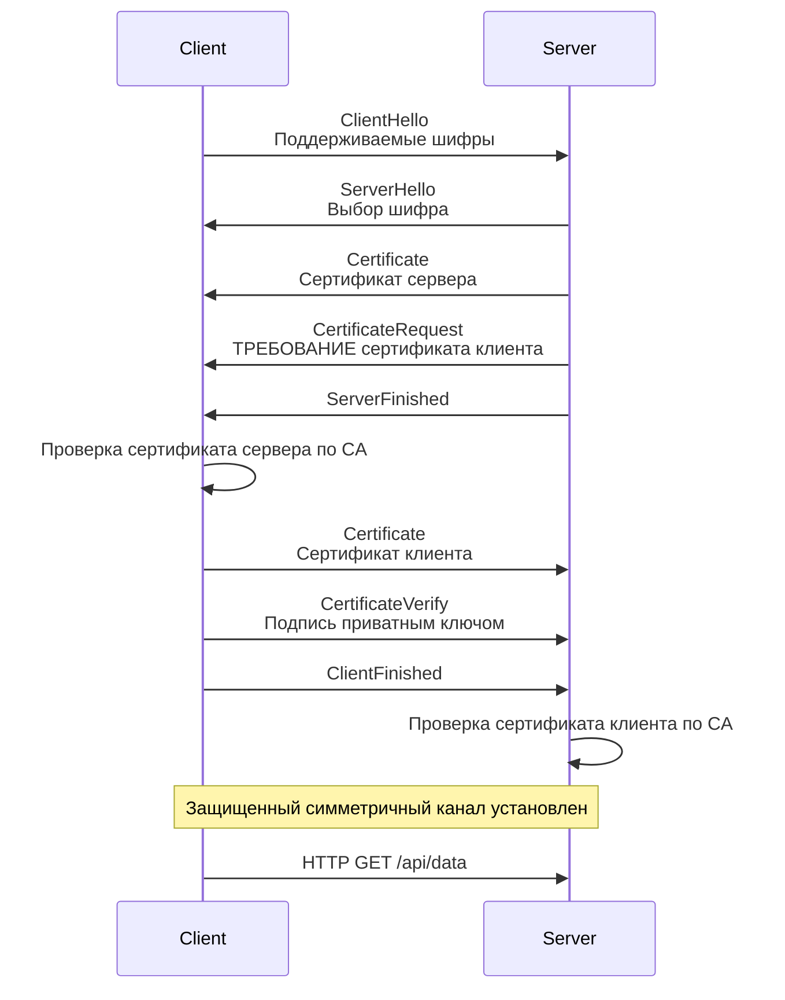

## Паранойя как стандарт: Zero Trust и взаимная аутентификация

Исторически внутренние сети дата-центров строились по принципу замка со рвом (Castle-and-Moat). Если вы прошли через внешний фаервол (API Gateway) и оказались во внутренней сети кластера, вам автоматически доверяли. Микросервис `A` мог делать любые запросы к микросервису `B` по обычному HTTP.

Но с ростом облачных инфраструктур парадигма сменилась на **Zero Trust (Нулевое доверие)**. Мы больше не верим никому, даже соседу по Kubernetes-узлу. Сеть считается изначально скомпрометированной. Злоумышленник, получивший доступ к одному слабому контейнеру, не должен иметь возможность прослушивать трафик других сервисов (Man-in-the-Middle) или выдавать себя за доверенный сервис (Impersonation).

**mTLS (Mutual Transport Layer Security)** — это двусторонняя аутентификация. Если обычный TLS (как в браузере) гарантирует клиенту, что сервер — это действительно тот, за кого он себя выдает, то mTLS заставляет *и клиента* доказать свою личность серверу, предъявив свой клиентский сертификат.

В этой статье мы разберем механику mTLS, реализуем его на Go, погрузимся в стоимость криптографии на уровне процессора и поймем, как правильно управлять сертификатами.

---

## Под капотом: Рукопожатие mTLS (Handshake)

mTLS базируется на инфраструктуре открытых ключей (PKI). И у клиента, и у сервера есть свой приватный ключ и публичный сертификат, подписанный единым Центром Сертификации (Certificate Authority, CA).

Разберем, как выглядит процесс установки соединения в mTLS (на примере TLS 1.3):



Главное отличие от обычного HTTPS — это сообщение `CertificateRequest` от сервера и последующие `Certificate` и `CertificateVerify` от клиента. Если клиент не предоставит валидный сертификат, подписанный доверенным CA, сервер разорвет TCP-соединение еще до того, как прочитает первый байт HTTP-запроса.

---

## Реализация mTLS на Go (Standard Library)

В Go поддержка mTLS встроена прямо в ядро стандартной библиотеки `crypto/tls`. Вам не нужны сторонние пакеты.

### Серверная часть (Защищенный API)

Чтобы сервер требовал клиентский сертификат, нам нужно настроить поле `ClientAuth` в `tls.Config`.

```go
package main

import (
	"crypto/tls"
	"crypto/x509"
	"log"
	"net/http"
	"os"
)

func main() {
	// 1. Загружаем корневой сертификат (CA), которым подписаны сертификаты клиентов
	caCert, err := os.ReadFile("ca.crt")
	if err != nil {
		log.Fatalf("Ошибка чтения CA: %v", err)
	}
	caCertPool := x509.NewCertPool()
	caCertPool.AppendCertsFromPEM(caCert)

	// 2. Настраиваем TLS
	tlsConfig := &tls.Config{
		// RequireAndVerifyClientCert - это суть mTLS!
		// Сервер прервет handshake, если клиент не даст валидный сертификат.
		ClientAuth: tls.RequireAndVerifyClientCert,
		ClientCAs:  caCertPool,
		
		// Ограничиваем минимальную версию для безопасности
		MinVersion: tls.VersionTLS13, 
	}

	server := &http.Server{
		Addr:      ":8443",
		TLSConfig: tlsConfig,
		Handler: http.HandlerFunc(func(w http.ResponseWriter, r *http.Request) {
			// Вытаскиваем информацию о клиенте из его сертификата
			clientName := r.TLS.PeerCertificates[0].Subject.CommonName
			w.Write([]byte("Hello, authenticated client: " + clientName))
		}),
	}

	log.Println("Starting mTLS server on :8443")
	// Передаем сертификат и приватный ключ самого сервера
	log.Fatal(server.ListenAndServeTLS("server.crt", "server.key"))
}
```

### Клиентская часть

Дефолтный `http.Client` не знает о ваших клиентских сертификатах. Мы должны настроить `http.Transport`.

```go
package main

import (
	"crypto/tls"
	"crypto/x509"
	"io"
	"log"
	"net/http"
	"os"
)

func main() {
	// 1. Загружаем сертификат и ключ клиента (наш "паспорт")
	clientCert, err := tls.LoadX509KeyPair("client.crt", "client.key")
	if err != nil {
		log.Fatalf("Ошибка загрузки ключей клиента: %v", err)
	}

	// 2. Загружаем CA, чтобы мы могли доверять серверу
	caCert, err := os.ReadFile("ca.crt")
	if err != nil {
		log.Fatalf("Ошибка чтения CA: %v", err)
	}
	caCertPool := x509.NewCertPool()
	caCertPool.AppendCertsFromPEM(caCert)

	// 3. Собираем TLS конфиг
	tlsConfig := &tls.Config{
		Certificates: []tls.Certificate{clientCert},
		RootCAs:      caCertPool,
	}

	// 4. Подменяем Transport у клиента
	client := &http.Client{
		Transport: &http.Transport{
			TLSClientConfig: tlsConfig,
		},
	}

	resp, err := client.Get("https://localhost:8443")
	if err != nil {
		log.Fatalf("mTLS Request failed: %v", err)
	}
	defer resp.Body.Close()

	body, _ := io.ReadAll(resp.Body)
	log.Printf("Response: %s", body)
}
```

---

## Mechanical Sympathy: Налог на криптографию

Шифрование не бывает бесплатным. Для бэкенд-инженера важно понимать стоимость mTLS на уровне железа.

TLS состоит из двух фаз:
1. **Асимметричная криптография (Handshake):** Обмен ключами (например, ECDHE) и верификация подписей (RSA или ECDSA). Асимметричная математика (операции с эллиптическими кривыми или большими простыми числами) **очень медленная** и требует много процессорных тактов.
2. **Симметричная криптография (Data Transfer):** Передача самих данных HTTP-запроса шифруется симметричным ключом (AES-GCM или ChaCha20), который сгенерировали на первом шаге. AES выполняется **очень быстро**, так как современные процессоры (x86_64 и ARM) имеют аппаратные инструкции для AES (AES-NI), обрабатывая гигабайты в секунду практически без оверхеда.

> [!warning] Ловушка / Gotcha
> Если вы не используете переиспользование соединений (Connection Pooling), каждый HTTP-запрос будет открывать новое TCP-соединение и выполнять полный TLS Handshake. 
> Из-за mTLS хэндшейк стал "тяжелее" (нужно верифицировать сертификаты с двух сторон). Ваш CPU будет на 90% занят математикой эллиптических кривых и аллокациями памяти для парсинга ASN.1 структур (формат x509 сертификатов), а не полезной бизнес-логикой.
> **Решение:** Тонкая настройка `MaxIdleConns` и `IdleConnTimeout` в `http.Transport` клиента.

---

## Архитектурные ловушки и паттерны (Senior Level)

### 1. Ротация сертификатов без даунтайма
Сертификаты имеют срок годности. В современных системах (в духе Zero Trust) сертификаты живут не годами, а днями или даже часами (Short-lived certificates). 

Если вы жестко загрузили сертификат при старте сервера через `tls.LoadX509KeyPair`, то при его протухании вам придется рестартовать процесс Go (а это прерывание трафика).

> [!tip] Собеседование
> **Вопрос:** Как обновить сертификаты в Go-сервере "на горячую", не разрывая текущие соединения и не перезапуская `http.Server`?
> **Ответ:** Использовать коллбэк `GetCertificate` в `tls.Config`.

Вместо статического слайса `Certificates` вы передаете функцию. Рантайм Go будет вызывать её *при каждом новом хэндшейке*. 

```go
// Идиоматичный паттерн горячей ротации
tlsConfig := &tls.Config{
    GetCertificate: func(hello *tls.ClientHelloInfo) (*tls.Certificate, error) {
        // certManager - это ваш потокобезопасный объект (c sync.RWMutex), 
        // который в фоне читает новые файлы с диска или из Vault 
        // и кэширует их в памяти.
        return certManager.GetLatestCert(), nil
    },
    ClientAuth: tls.RequireAndVerifyClientCert,
}
```

### 2. Time и Clock Drift
Важнейшая уязвимость mTLS кроется в системных часах ОС. Валидация x509-сертификата жестко привязана к датам `NotBefore` и `NotAfter`. 
Если на одном из серверов "уплыло" время (Clock Drift — мы детально обсуждали это в статье [[5. Time и clock drift]]), сервер может отвергнуть абсолютно валидный сертификат клиента, посчитав его просроченным, или, наоборот, из будущего. Наличие работающего NTP-демона на узлах кластера критически важно для mTLS.

### 3. Service Mesh: Возвращение к истокам
Вспомним предыдущие статьи: [[1. Service mesh]] и [[2. Envoy и sidecar]].
Писать код работы с `crypto/tls` (как в примерах выше) в каждом микросервисе — это боль. Вы получите зоопарк версий, протухшие сертификаты и забытые настройки `MinVersion`.

Именно поэтому в современных распределенных системах **mTLS полностью делегируют Service Mesh**.
Ваше Go-приложение пишет и читает **обычный HTTP без шифрования** на `localhost`. Sidecar-прокси (Envoy) перехватывает этот трафик, сам получает краткосрочные сертификаты от Control Plane (через протоколы вроде SPIFFE/SPIRE), сам выполняет mTLS Handshake с соседним подом и сам ротирует ключи. Вы получаете строгую криптографическую защиту, не написав ни строчки кода по работе с x509 в Go.

## Итог

1. **Zero Trust:** mTLS — это краеугольный камень безопасности внутренних сетей. Не доверяй никому, проверяй криптографическую подпись каждого клиента.
2. **Go `crypto/tls`:** Стандартная библиотека Go предоставляет мощный и безопасный инструментарий для mTLS. Ключевая настройка для сервера — `ClientAuth: tls.RequireAndVerifyClientCert`.
3. **Цена рукопожатия:** Из-за асимметричной криптографии и аллокаций при парсинге сертификатов, постоянный переустановки mTLS-соединений убьют производительность CPU. Connection pooling обязателен.
4. **Горячая ротация:** Используйте `GetCertificate` для динамического обновления ключей без перезапуска сервисов.

Шифрование mTLS гарантирует, что мы точно знаем, *кто* к нам пришел. Но *имеет ли он право* делать то, что просит? Тот факт, что "Сервис корзины" имеет валидный сертификат, не означает, что ему разрешено читать данные из "Сервиса профилей пользователей". Авторизация на уровне сети — это следующий шаг. В следующей статье мы разберем: [[4. Network policies]].