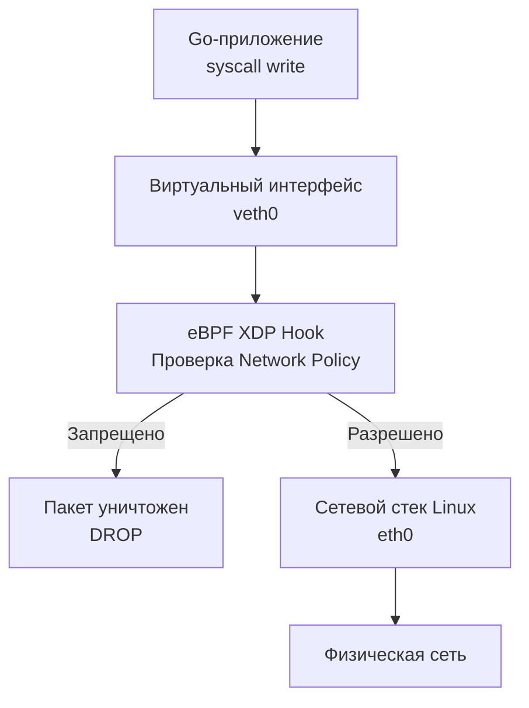

## Фаервол для микросервисов: Изоляция на уровне пакетов

В прошлой статье [[3. mTLS]] мы перешли к парадигме Zero Trust. Мы заставили наши сервисы предъявлять криптографические паспорта при каждом соединении. Кажется, мы в полной безопасности: даже если злоумышленник проникнет в кластер, он не сможет прочитать трафик или выдать себя за другой сервис без приватного ключа.

Но криптография отвечает только на вопрос *«Кто ты?»*. Она работает на прикладном уровне (L7) или на верхнем транспортном (TLS). Что если зараженный контейнер попытается просканировать порты базы данных? Или попытается отправить гигабайты мусорного трафика в соседний под, вызывая отказ в обслуживании (DDoS)? 

Доводить дело до TLS-рукопожатия (которое, как мы помним, очень дорогое для CPU) в таких случаях — непозволительная роскошь. Вражеский трафик нужно уничтожать еще на подлете, на уровне сетевых пакетов (L3/L4). 

В Kubernetes за это отвечает **Network Policies (Сетевые политики)**. В этой статье мы разберем, как они работают под капотом, почему из-за них зависают Go-клиенты и как правильно сегментировать сеть.

---

## Иллюзия плоской сети

По умолчанию в Kubernetes работает правило плоской сети (Flat Network): **Любой под может установить соединение с любым другим подом в кластере**, даже если они находятся в разных namespace-ах.

Представьте, что у вас есть namespace `frontend` и namespace `finance-db`. По умолчанию взломанный pod фронтенда может напрямую открыть TCP-сокет к базе данных с платежами. Если в БД есть уязвимость, или пароль утек в переменные окружения, кластер скомпрометирован.

Сетевые политики — это манифесты, которые говорят Kubernetes: «Разреши этому поду общаться только с вот этими подами на таких-то портах, а весь остальной трафик — уничтожь».

---

## Mechanical Sympathy: CNI, iptables и eBPF

Сами по себе манифесты `NetworkPolicy` в Kubernetes ничего не делают. Kubernetes API просто сохраняет их в `etcd`. Всю грязную работу выполняет **CNI (Container Network Interface)** — сетевой плагин кластера (например, Calico, Cilium, Flannel).

Как именно CNI физически блокирует пакет?

### Классический подход (iptables)
В плагинах вроде Calico агент, работающий на каждой ноде кластера, транслирует NetworkPolicy в тысячи правил `iptables` (или `IPVS`) ядра Linux.
Каждый пакет, выходящий из вашего Go-приложения или входящий в него, проходит через длинные цепочки проверок (`PREROUTING`, `FORWARD`, `POSTROUTING`). Если правил много (тысячи подов), маршрутизация пакета начинает потреблять заметное процессорное время, увеличивая Latency.

### Современный подход (eBPF)
Современные CNI, такие как Cilium, используют **eBPF (Extended Berkeley Packet Filter)**. Вместо того чтобы гонять пакеты по цепочкам `iptables`, Cilium компилирует C-подобный код проверки политик прямо в ядро Linux и прикрепляет его непосредственно к виртуальному сетевому интерфейсу пода (`veth`). 
Это происходит на уровне драйвера (XDP - eXpress Data Path), еще до того, как пакет попадет в сетевой стек ОС. Если пакет запрещен, он уничтожается за наносекунды с нулевым оверхедом.



---

## Взгляд из Go: DROP против REJECT

Это самый важный раздел для бэкенд-разработчика. Разница между тем, КАК фаервол блокирует пакет, радикально влияет на поведение рантайма Go.

Фаервол (и Network Policies в K8s) всегда использует правило **DROP (Отбросить)**, а не REJECT (Отклонить). 

* **REJECT:** Если фаервол использует REJECT, он отправляет обратно пакет `RST` (Reset) или `ICMP Port Unreachable`. Ваш Go-код (`http.Get` или `net.Dial`) мгновенно получит ошибку `connection refused` и пойдет дальше по логике (например, в деградацию).
* **DROP (Поведение K8s):** Пакет просто бесследно исчезает. Сервер ничего не отвечает.

> [!warning] Ловушка / Gotcha
> Что происходит внутри Go при DROP?
> Ваша горутина вызывает `net.DialContext`. В ядро ОС улетает пакет `TCP SYN`. Ответа нет.
> Ядро Linux (и Go-рантайм, заблокированный в `epoll`) начинает ждать. Linux делает экспоненциальные ретраи отправки `SYN` (1s, 2s, 4s, 8s...). 
> По умолчанию (параметр `tcp_syn_retries` = 6) **ОС сдастся только через 130 секунд!** > 
> Все эти 2 минуты ваша горутина будет висеть в памяти. Если на этот роут идет трафик, вы за минуты исчерпаете пул горутин и словите OOM. 

**Именно поэтому отсутствие таймаутов смертельно в K8s.** Если вы забыли настроить контекст (как мы обсуждали в [[3. Timeout]]), ошибка настройки Network Policy у девопсов полностью убьет ваш микросервис.

---

## Паттерн: Default Deny (Запретить всё)

Лучшая практика (Best Practice) при внедрении сетевых политик — это подход **Default Deny**. Мы закрываем весь трафик в namespace, а затем точечно пробиваем «дырки» для легитимных связей.

```yaml
# Пример политики Default Deny для namespace
apiVersion: networking.k8s.io/v1
kind: NetworkPolicy
metadata:
  name: default-deny-all
  namespace: my-services
spec:
  podSelector: {} # Пустой селектор означает "выбрать ВСЕ поды"
  policyTypes:
  - Ingress # Блокируем весь входящий трафик
  - Egress  # Блокируем весь исходящий трафик
```

После применения этого манифеста **все ваши Go-сервисы в этом namespace перестанут работать**. Они не смогут общаться ни друг с другом, ни с БД.

Далее мы разрешаем конкретному сервису (например, `auth-service`) принимать трафик только от `api-gateway`:

```yaml
apiVersion: networking.k8s.io/v1
kind: NetworkPolicy
metadata:
  name: allow-gateway-to-auth
spec:
  podSelector:
    matchLabels:
      app: auth-service # Политика применяется к auth-service
  policyTypes:
  - Ingress
  ingress:
  - from:
    - podSelector:
        matchLabels:
          app: api-gateway # Разрешаем входящие только от api-gateway
    ports:
    - protocol: TCP
      port: 8080
```

---

## Скрытая угроза: DNS Resolution

Когда вы применяете Default Deny `Egress` (запрет исходящего трафика), вы обрубаете связи не только с базами данных. Вы обрубаете связь с **CoreDNS** — внутренним DNS-сервером Kubernetes.

> [!tip] Собеседование
> **Вопрос:** Вы применили Network Policy, разрешающую доступ к `database-pod`. Но ваш Go-клиент при вызове `sql.Open` получает ошибку: `dial tcp: lookup database-svc on 10.96.0.10:53: no such host` или таймаут. В чем проблема?
> **Ответ:** Go-приложению нужно разрезолвить имя `database-svc` в IP-адрес. Пакет `net` делает UDP-запрос на порт 53 к `kube-dns`. Так как Default Deny блокирует весь Egress-трафик, DNS-запрос отбрасывается. 

Чтобы Go-приложение вообще могло находить другие сервисы, вы **обязаны** создать политику, разрешающую исходящий трафик по протоколу UDP на порт 53 в namespace `kube-system`.

```yaml
apiVersion: networking.k8s.io/v1
kind: NetworkPolicy
metadata:
  name: allow-dns-egress
spec:
  podSelector: {} # Для всех подов
  policyTypes:
  - Egress
  egress:
  - to:
    - namespaceSelector:
        matchLabels:
          kubernetes.io/metadata.name: kube-system
    ports:
    - protocol: UDP
      port: 53
```

---

## Network Policies vs Service Mesh (Istio)

Мы изучили Service Mesh в статьях [[1. Service mesh]] и [[2. Envoy и sidecar]]. В Istio есть свой механизм управления доступом — `AuthorizationPolicy`. Зачем нам Kubernetes Network Policies?

Это классический принцип **Defense in Depth (Глубокоэшелонированная защита)**.

* **Istio AuthorizationPolicy (L7):** Работает на прикладном уровне. Он может сказать: "Разрешить `api-gateway` делать HTTP GET на путь `/api/v1/users`, но запретить HTTP POST". Это очень гибко. Но если в самом коде прокси Envoy (написанном на C++) найдут критическую уязвимость (RCE или Buffer Overflow), злоумышленник получит контроль над контейнером Envoy и сможет отправлять любые пакеты в сеть.
* **Kubernetes NetworkPolicy (L3/L4):** Работает на уровне IP-адресов и портов в ядре Linux. Он ничего не знает про HTTP-пути. Но если Envoy скомпрометирован, NetworkPolicy, контролируемый ядром ОС и CNI (через eBPF), просто не выпустит TCP-пакеты хакера за пределы пода к ресурсам, к которым у этого пода не должно быть доступа.

## Итог

1. **Изоляция:** Network Policies делят плоскую сеть кластера на изолированные отсеки, предотвращая распространение атаки (lateral movement).
2. **Уровень пакетов:** CNI (Cilium/Calico) блокирует трафик в ядре (iptables/eBPF) с помощью отбрасывания пакетов (DROP).
3. **Опасность DROP для Go:** Отброшенные пакеты не возвращают ошибку. Они вызывают зависание горутин на фазе установки TCP-соединения (`SYN`), делая жесткие таймауты (`context.WithTimeout`) абсолютно необходимыми.
4. **Не забудьте про DNS:** Политики по умолчанию блокируют всё, включая критически важные запросы к CoreDNS.

Мы настроили железный фаервол внутри кластера. Сеть защищена от несанкционированных проникновений и подмены лиц. Но что делать, если легитимный трафик ведет себя непредсказуемо? Если кто-то начинает скачивать гигантские файлы, забивая весь канал, или один клиент отправляет миллион валидных запросов в секунду? Нам нужно научиться управлять формой и объемом трафика. Об этом — в следующей статье: [[5. Traffic shaping]].