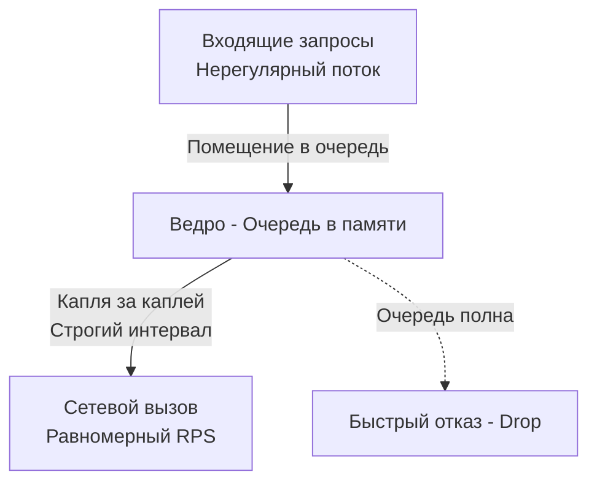

## Укрощение шторма: Плавное формирование трафика

В распределенных системах трафик редко бывает равномерным. Пользователи просыпаются, запускаются cron-задачи, системы восстанавливаются после сбоев (инициируя [[2. Retry и backoff]]) — всё это порождает **всплески (bursts)**. 

Когда мы говорили про [[5. Load shedding]], мы защищали *наш собственный* сервер от перегрузки путем жесткого сброса "лишних" запросов. Это паттерн отсечения. 

Но что если мы находимся на стороне *клиента*? Нам нужно отправить 100 000 уведомлений в сторонний API (например, Telegram или биллинговую систему), у которого жесткий лимит — не более 500 запросов в секунду. Если мы отправим всё сразу, мы получим ошибку `429 Too Many Requests` или нас заблокируют. 

Нам нужно сгладить пики. Это и есть **Traffic Shaping (Формирование трафика)**. В отличие от жесткого лимитирования (Policing / Rate Limiting, которое отбрасывает пакеты), Traffic Shaping задерживает (буферизирует) трафик, чтобы он выходил из системы равномерным потоком.

В этой статье мы разберем физику микро-всплесков, напишем идиоматичный "сглаживатель" на Go и обсудим фатальную проблему Bufferbloat.

---

## Mechanical Sympathy: Анатомия микро-всплесков

> [!info] Под капотом
> Представьте, что у вас есть канал связи 1 Гбит/с, и вы измеряете средний трафик — он показывает комфортные 100 Мбит/с. Кажется, сеть свободна на 90%. 
> Но среднее значение врет. В масштабе миллисекунд трафик может передаваться **микро-всплесками (micro-bursts)**. Сервер может попытаться "выплюнуть" 10 мегабайт данных за 1 миллисекунду. В этот момент скорость стремится к бесконечности, буферы сетевых коммутаторов (Switches) переполняются, и коммутатор начинает отбрасывать пакеты (Tail Drop).
> 
> Начинают работать механизмы TCP: потеря пакета вызывает Retransmission TimeOut (RTO). Окно перегрузки TCP (Congestion Window) схлопывается. Ваша задержка (Latency) прыгает с 1 мс до 200 мс. Вы даже не достигли 10% пропускной способности канала, но уже сломали сеть из-за микро-всплесков.

**Traffic Shaping (Pacing)** на уровне приложения или ОС решает эту проблему, принудительно расставляя микро-паузы между отправкой пакетов или запросов.

---

## Паттерн Leaky Bucket (Дырявое ведро)

Алгоритм **Leaky Bucket** — это классический механизм формирования трафика. Представьте ведро с отверстием в дне. 
* Вода (запросы) может вливаться в ведро неравномерно, большими порциями.
* Вода вытекает из отверстия (отправляется в сеть) строго с постоянной скоростью — ни каплей больше, ни каплей меньше.
* Если ведро переполняется (буфер заполнен) — новые запросы переливаются через край (отклоняются).



---

## Реализация Traffic Shaping на Go

В Go есть два идиоматичных способа управлять формой трафика: ручной (через каналы и `time.Ticker`) и стандартный (через пакет `golang.org/x/time/rate`). Разберем оба, так как они показывают разную глубину понимания рантайма.

### Подход 1: Канал и time.Ticker (Классический Pacing)

Если нам нужно гарантировать, что запросы уходят не чаще, чем раз в `N` миллисекунд (строгое сглаживание без возможности всплеска).

```go
package shaping

import (
	"context"
	"log/slog"
	"time"
)

// PacedSender отправляет задачи с жестко заданным интервалом
type PacedSender struct {
	tasks  chan func()
	ticker *time.Ticker
}

// NewPacedSender создает шейпер.
// rps - сколько запросов в секунду мы хотим отправлять.
// bufferSize - размер "ведра" (очереди).
func NewPacedSender(rps int, bufferSize int) *PacedSender {
	interval := time.Second / time.Duration(rps)
	return &PacedSender{
		tasks:  make(chan func(), bufferSize),
		ticker: time.NewTicker(interval),
	}
}

// Start запускает фоновый воркер, "выливающий" запросы
func (s *PacedSender) Start(ctx context.Context) {
	go func() {
		defer s.ticker.Stop()
		for {
			select {
			case <-ctx.Done():
				return
			case task := <-s.tasks:
				// Ждем тика перед отправкой задачи
				select {
				case <-s.ticker.C:
					task()
				case <-ctx.Done():
					return
				}
			}
		}
	}()
}

// Submit кладет задачу в "ведро"
func (s *PacedSender) Submit(task func()) error {
	select {
	case s.tasks <- task:
		return nil
	default:
		// Ведро переполнено. Возвращаем ошибку (Fast Fail)
		return errors.New("bucket is full")
	}
}
```

**Плюс:** Код предельно понятен, работает на нативных примитивах конкурентности Go. Идеально сглаживает трафик.
**Минус:** Создает жесткую очередь. Горутины, вызывающие `Submit`, не блокируются, но сами задачи зависают в памяти.

### Подход 2: golang.org/x/time/rate

В Google разработали мощный пакет `x/time/rate`, основанный на алгоритме **Token Bucket (Маркерная корзина)**. В отличие от Leaky Bucket, Token Bucket позволяет кратковременные всплески (Burst), если токены накопились.

Главная фича этого пакета для Traffic Shaping — метод `Wait(ctx)`. Он блокирует горутину до тех пор, пока не появится право на отправку запроса.

```go
package shaping

import (
	"context"
	"fmt"
	"golang.org/x/time/rate"
	"time"
)

type ApiClient struct {
	// Лимит: 50 RPS, максимальный разрешенный всплеск (Burst): 5
	limiter *rate.Limiter
}

func NewApiClient() *ApiClient {
	return &ApiClient{
		// rate.Limit(50) - генерирует 50 токенов в секунду
		limiter: rate.NewLimiter(rate.Limit(50), 5),
	}
}

func (c *ApiClient) DoRequest(ctx context.Context, payload string) error {
	// Wait заблокирует горутину (`gopark`), пока не появится свободный токен.
	// Это И ЕСТЬ шейпинг: мы искусственно задерживаем запрос,
	// чтобы вписаться в пропускную способность.
	if err := c.limiter.Wait(ctx); err != nil {
		return fmt.Errorf("request aborted: %w", err)
	}

	// Выполнение реального сетевого вызова
	// ...
	return nil
}
```

> [!tip] Собеседование
> **Вопрос:** В чем разница между `limiter.Allow()` и `limiter.Wait()` в пакете `x/time/rate`?
> **Ответ:** > * `Allow()` — это Rate Limiting (Policing). Он немедленно возвращает `true` или `false`. Если токенов нет, мы сразу сбрасываем запрос (возвращаем 429 или отменяем работу).
> * `Wait()` — это Traffic Shaping. Он не сбрасывает запрос, а усыпляет горутину (`gopark` в рантайме Go), пока токен не появится, тем самым выстраивая запросы в ровную очередь по времени.

---

## Архитектурные ловушки (Gotchas)

Формирование трафика — обоюдоострый меч. Пытаясь сделать потоки ровными, инженеры часто совершают критические ошибки.

### 1. Bufferbloat (Раздувание буфера)
Это одна из главных проблем современного интернета и распределенных систем. Когда вы используете `Wait(ctx)` или буферизированные каналы для шейпинга, вы превращаете всплески трафика в **очередь ожидания**.

Представьте: лимит 50 RPS. Клиент отправляет 500 запросов одновременно.
Последние запросы в очереди будут ждать **10 секунд** только для того, чтобы *начать* выполняться.

Если на этих запросах висит `context.WithTimeout(ctx, 5*time.Second)` (как мы учили в [[3. Timeout]]), то половина запросов умрет в очереди с `context.DeadlineExceeded`, так и не дойдя до сети. Но при этом они сожрут токены лимитера (ведь `Wait` ждал их)! 

**Решение:** Шейпинг должен применяться только к асинхронным (фоновым) задачам, где Latency не критичен (например, отправка push-уведомлений или синхронизация данных). Для синхронных пользовательских HTTP-запросов задержка в очереди хуже отказа: используйте жесткий Drop (`Allow()`) или [[5. Load shedding]].

### 2. Утечка горутин (Goroutine Leaks)
При использовании `limiter.Wait(ctx)` тысяча входящих HTTP-запросов создаст 1000 горутин, которые просто будут спать, ожидая своей очереди.
Если у вас нет [[4. Bulkhead]] (ограничения на количество конкурентных горутин), шторм входящих запросов заставит ваш сервер выделить гигабайты памяти под стеки спящих горутин, даже если исходящий трафик идеально "причесан".

### 3. Глобальный vs Локальный Shaping
Как и в случае с Circuit Breaker, `rate.Limiter` работает локально в памяти одного пода.
Если ваш сторонний API дает квоту 100 RPS, а у вас в Kubernetes 10 подов, вы должны настроить шейпер в каждом поду на `10 RPS` (100 / 10). Но если количество подов динамически меняется (HPA - Horizontal Pod Autoscaling), статические лимиты в коде сломаются (вы либо превысите квоту API, либо не утилизируете её полностью).

В таких случаях шейпинг выносят на инфраструктурный уровень: например, используют Envoy (через Global Rate Limiting Service, который мы обсуждали в [[1. Service mesh]]) или проксируют вызовы к стороннему API через единый выделенный egress-gateway.

## Итог

1. **Суть:** Traffic Shaping — это про *задержку* и сглаживание, а не про немедленный отброс трафика.
2. **Инструментарий Go:** Пакет `golang.org/x/time/rate` с методом `Wait()` — индустриальный стандарт для управления потоком исходящих запросов.
3. **Опасность очередей:** Шейпинг порождает проблему Bufferbloat. Синхронные клиентские запросы лучше отбрасывать, а не заставлять бесконечно ждать в памяти. Формирование трафика — удел фоновых воркеров и асинхронных консьюмеров из очередей (Kafka, RabbitMQ).

Мы научились "причесывать" наш исходящий трафик, чтобы не ломать чужие системы. Но что делать, когда чужие (или наши же) системы бьют по *нашим* публичным эндпоинтам безумным потоком неконтролируемого трафика? Мы переходим от защиты других к защите себя. Следующая статья: [[6. Rate limiting]].