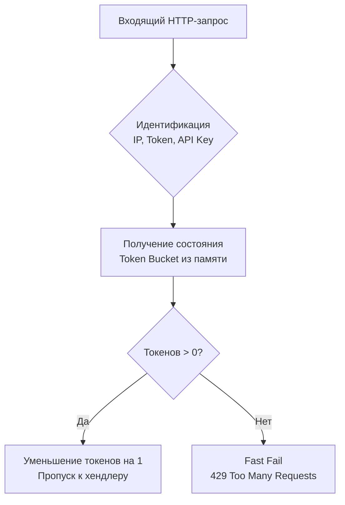

## Фейсконтроль для вашего API: Защита от абьюза и DDoS

В предыдущей статье мы обсуждали [[5. Traffic shaping]], где учились "причесывать" наш исходящий трафик, чтобы быть вежливыми клиентами и не ломать чужие системы. Теперь мы меняем перспективу: мы — сервер, выставленный в жестокий интернет, и нам нужно защищать себя.

Даже если у нас настроен [[5. Load shedding]] (защита сервера от глобальной перегрузки), это не решает проблему несправедливости. Один агрессивный клиент (или скрипт парсера) может занять все 100% пропускной способности нашего `Load Shedder`, из-за чего честные пользователи получат `503 Service Unavailable`. 

Паттерн **Rate Limiting (Ограничение скорости)** — это механизм квотирования ресурсов. Он определяет, *кто* делает запрос, проверяет его лимит и, если лимит исчерпан, возвращает `429 Too Many Requests`. 

В этой статье мы разберем математику классических алгоритмов лимитирования, напишем middleware на Go с учетом утечек памяти и поймем, почему Redis — лучший друг Rate Limiter'а в распределенных системах.

---

## Алгоритмы Rate Limiting

Чтобы писать эффективный код, нужно понимать, как работают фундаментальные алгоритмы квотирования. На system design собеседованиях от вас ждут не просто названий, а понимания краевых эффектов (edge cases) каждого из них.

### 1. Fixed Window Counter (Счетчик фиксированного окна)
Самый простой алгоритм. Мы делим время на фиксированные окна (например, с 12:00 до 12:01). Заводим счетчик для каждого клиента. Если счетчик превышает лимит (100 запросов), отклоняем трафик до начала следующей минуты.

* **Плюс:** Элементарно реализуется в памяти или Redis (`INCR` + `EXPIRE`).
* **Минус (Thundering Herd):** Проблема всплеска на границе окон. Клиент может отправить 100 запросов в 12:00:59 и еще 100 в 12:01:00. Итого сервер получит 200 запросов за 2 секунды, хотя лимит был "100 в минуту".

### 2. Sliding Window Log (Журнал скользящего окна)
Вместо счетчика мы сохраняем точный *timestamp* каждого запроса клиента (например, в Sorted Set в Redis). При новом запросе мы удаляем все timestamp'ы старше одной минуты и считаем оставшиеся.

* **Плюс:** Абсолютно точное ограничение, никаких всплесков на границах.
* **Минус:** Огромное потребление памяти. Если лимит миллион запросов — вам придется хранить миллион timestamp'ов для каждого пользователя. Это дорого.

### 3. Sliding Window Counter (Счетчик скользящего окна)
Гибридный подход, являющийся индустриальным стандартом (используется в Cloudflare). Мы храним счетчики для текущей и предыдущей минуты, и вычисляем вес пропорционально прошедшему времени в текущей минуте.
*Формула:* `Запросы = (Счетчик предыдущей минуты * % оставшегося времени) + Счетчик текущей минуты`.

### 4. Token Bucket (Маркерная корзина)
Тот самый алгоритм, который мы использовали в пакете `x/time/rate` для формирования трафика, но теперь применяем для фильтрации входящих (используя метод `Allow()`, а не `Wait()`). Токены генерируются с постоянной скоростью, позволяя кратковременные всплески (burst), но строго ограничивая среднюю скорость.



---

## Реализация In-Memory (Локальный Rate Limiter)

Частая задача на собеседовании — написать middleware для защиты API по IP-адресу с использованием стандартных библиотек Go.

> [!warning] Ловушка / Gotcha
> Джуниоры часто пишут структуру с `sync.Map`, где ключом является IP-адрес, а значением — `rate.Limiter`. **Это классическая утечка памяти (Memory Leak).** > Если ваш сервис торчит наружу, его будут сканировать миллионы ботов с разных IP-адресов. Ваша мапа раздуется до гигабайтов и убьет сервис по OOM. Правильная реализация ОБЯЗАНА иметь фоновый процесс очистки старых записей.

```go
package ratelimit

import (
	"log"
	"net/http"
	"sync"
	"time"

	"golang.org/x/time/rate"
)

// client содержит лимитер и время последней активности (для очистки)
type client struct {
	limiter  *rate.Limiter
	lastSeen time.Time
}

type IPMiddleware struct {
	mu      sync.RWMutex
	clients map[string]*client
	r       rate.Limit
	b       int
}

// NewIPMiddleware создает лимитер: r - кол-во запросов в секунду, b - всплеск
func NewIPMiddleware(r rate.Limit, b int) *IPMiddleware {
	m := &IPMiddleware{
		clients: make(map[string]*client),
		r:       r,
		b:       b,
	}

	// Запускаем фоновый сборщик мусора для старых IP
	go m.cleanupStaleClients()
	return m
}

// Limit - стандартный HTTP middleware
func (m *IPMiddleware) Limit(next http.Handler) http.Handler {
	return http.HandlerFunc(func(w http.ResponseWriter, r *http.Request) {
		ip := r.RemoteAddr // Упрощенно. В реальности нужно парсить X-Forwarded-For

		m.mu.Lock() // Глобальный лок - узкое место! (См. Mechanical Sympathy)
		c, exists := m.clients[ip]
		if !exists {
			c = &client{limiter: rate.NewLimiter(m.r, m.b)}
			m.clients[ip] = c
		}
		c.lastSeen = time.Now()
		m.mu.Unlock()

		if !c.limiter.Allow() { // Allow() работает атомарно под капотом, без сна
			http.Error(w, "Too Many Requests", http.StatusTooManyRequests)
			return
		}

		next.ServeHTTP(w, r)
	})
}

// cleanupStaleClients удаляет IP, которые не делали запросов более 3 минут
func (m *IPMiddleware) cleanupStaleClients() {
	for {
		time.Sleep(time.Minute)
		m.mu.Lock()
		for ip, client := range m.clients {
			if time.Since(client.lastSeen) > 3*time.Minute {
				delete(m.clients, ip)
			}
		}
		m.mu.Unlock()
	}
}
```

### Mechanical Sympathy: Проблема глобального мьютекса
В коде выше есть `sync.RWMutex`, который блокируется на **каждый** входящий HTTP-запрос. На 10 000 RPS этот мьютекс превратится в горячую точку (Lock Contention). Горутины будут парковаться, планировщик сойдет с ума, а кэш-линии процессора будут постоянно инвалидироваться.

**Как оптимизировать?**
Вместо одной большой мапы использовать паттерн **Shard Map** (как в `concurrent-map`). Разбить хэш-таблицу на 256 шардов (корзин), каждая со своим мьютексом. Хэш от IP-адреса будет определять корзину. Это снизит конкуренцию (contention) в 256 раз!

---

## Распределенный Rate Limiter (Redis)

Локальный Rate Limiter в памяти отлично подходит для защиты от DDoS. Но для бизнес-лимитов (например, "Тариф Базовый: 100 запросов API в час") он не годится. У вас 10 подов в Kubernetes — клиент будет попадать на разные инстансы и сможет обойти лимит в 10 раз.

Нам нужно единое хранилище состояния. Идеальный кандидат — Redis.

Для реализации Sliding Window в Redis используют **Lua-скрипты**. 

> [!info] Под капотом
> Почему именно Lua?
> Redis выполняет Lua-скрипты атомарно. Пока выполняется скрипт, никакие другие команды от других клиентов не обрабатываются. Это гарантирует отсутствие состояния гонки (Race Condition), когда 10 подов Go одновременно пытаются прочитать лимит, увеличить его и записать обратно.

Пример логики Lua-скрипта для Fixed Window (для простоты):
```lua
local key = KEYS[1]
local limit = tonumber(ARGV[1])
local current = redis.call("GET", key)

if current and tonumber(current) >= limit then
    return 0 -- Лимит превышен (HTTP 429)
end

redis.call("INCR", key)
if not current then
    -- Если ключ только что создан, ставим TTL 60 секунд
    redis.call("EXPIRE", key, 60)
end
return 1 -- Запрос разрешен (HTTP 200)
```
В Go вы используете пакет `go-redis`, компилируете этот скрипт при старте и вызываете его через `EvalSha`, передавая `KEYS` (IP или Token) и `ARGV` (Лимит).

---

## Архитектурные ловушки (Gotchas)

### 1. Подмена X-Forwarded-For (IP Spoofing)
В коде выше мы использовали `r.RemoteAddr`. Если ваш сервис стоит за балансировщиком (AWS ALB, Nginx, Envoy), `RemoteAddr` всегда будет показывать IP-адрес балансировщика! 
Вам нужно читать HTTP-заголовок `X-Forwarded-For` или `X-Real-IP`. 
**Ловушка:** Заголовки можно подделать. Если злоумышленник отправит запрос `X-Forwarded-For: 1.2.3.4`, а ваш Nginx просто допишет туда свой IP, вы заблокируете не того человека.
**Решение:** Настраивайте ваш Edge-прокси так, чтобы он ПЕРЕЗАПИСЫВАЛ (или строго валидировал) `X-Forwarded-For`, отбрасывая фальшивые значения от недоверенных клиентов.

### 2. Цена распределенного лимитирования
Делать сетевой запрос к Redis на *каждый* входящий HTTP-запрос — значит добавить от 1 до 5 мс Latency к ответу. Если Redis "моргнет", ваш Rate Limiter может положить весь кластер. 
**Решение:** Разделяйте уровни. Защиту от DDoS по IP делайте локально в памяти на уровне API Gateway или через Service Mesh (например, Global Rate Limit Service в Envoy — см. [[2. Envoy и sidecar]]). А в Redis проверяйте только сложные бизнес-лимиты по JWT-токенам.

> [!tip] Собеседование
> **Вопрос:** Что делать, если Redis, хранящий счетчики Rate Limits, упал? Должен ли ваш Go-сервис возвращать ошибку 500?
> **Ответ:** Зависит от приоритетов бизнеса. Но стандартный подход — **Fail Open (Отказ с открытием)**. Ограничение скорости — это некритичный бизнес-процесс (в отличие от авторизации). Если Redis недоступен, мы должны пропустить трафик, залогировав ошибку. Лучше обслужить клиента сверх лимита, чем полностью остановить продажи из-за падения инфраструктурного компонента.

## Итог раздела "Сеть"

1. **Многоуровневость:** Мы защищаем сервер слоями. Сначала Rate Limiting (от недобросовестных клиентов), затем Load Shedding (от глобальной перегрузки).
2. **Аллокации и локи:** Локальный Rate Limiter в Go — частая причина утечек памяти и Lock Contention. Используйте фоновую очистку и шардированные мапы.
3. **Распределенность:** Для точных бизнес-лимитов используйте Redis + Lua (для гарантии атомарности). 
4. **Безопасность:** Никогда не доверяйте заголовкам клиента напрямую, только через настроенный Edge-прокси.

Мы закончили огромный раздел, посвященный сети, надежности, проксированию и защите распределенных систем. Наш код стал пуленепробиваемым. Но как нам упаковать этот код, чтобы он одинаково надежно работал и на ноутбуке разработчика, и на тысячах серверов в дата-центре? Мы переходим к фундаментальным основам инфраструктуры и развертывания. Следующий раздел и его первая статья: [[1. Контейнеризация и Docker]].