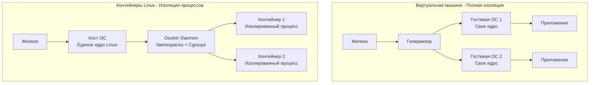

## Иллюзия одиночества: Как работают контейнеры

В предыдущих разделах мы проектировали архитектуру, защищали сеть и оптимизировали код. Но даже самый идеальный код бесполезен, если его невозможно надежно доставить на сервер. Исторически деплой бэкенда выглядел как установка нужной версии языка, настройка переменных окружения и запуск демона через `systemd`. Это приводило к классической проблеме: «На моем ноутбуке всё работает, а на проде падает».

**Контейнеризация** решила эту проблему, позволив упаковать приложение и всю его среду выполнения в единый, неизменяемый артефакт (образ).

Для языка Go контейнеризация — это не просто удобный инструмент, это идеальный симбиоз. В этой статье мы разберем, что такое Docker под капотом (и почему это не виртуальная машина), как правильно собирать минималистичные образы для Go и почему рантайм Go может сойти с ума внутри контейнера.

---

## Mechanical Sympathy: Ложь во спасение

Главное заблуждение новичков: контейнер — это легковесная виртуальная машина. Это в корне неверно. 

**Контейнер — это обычный процесс операционной системы Linux**, которому ядро изощренно врет. В контейнере нет гостевой ОС, нет виртуализированного железа и отдельного ядра. Все контейнеры на сервере делят одно и то же ядро хоста (см. [[2. Устройство и работа ОС]]).

Иллюзия изоляции создается двумя механизмами ядра Linux:

### 1. Namespaces (Пространства имен)
Они ограничивают то, что процесс **видит**.
* **PID Namespace:** Процесс внутри контейнера получает PID 1. Он не видит процессы хоста или других контейнеров.
* **MNT Namespace:** Процесс получает свой собственный изолированный корень файловой системы (через механизм `chroot` / `pivot_root`).
* **NET Namespace:** У процесса свой виртуальный сетевой интерфейс (`veth`), свой IP-адрес и своя таблица маршрутизации.

### 2. Control Groups (Cgroups)
Они ограничивают то, что процесс **использует**.
Cgroups (контрольные группы) говорят ядру: «Этот процесс (контейнер) не имеет права использовать больше 512 МБ оперативной памяти и больше 50% процессорного времени одного ядра». Если процесс попытается выделить больше памяти, ядро убьет его (OOM Killer).



---

## Идеальный симбиоз: Почему Go создан для Docker

Языки вроде Python, Ruby или Java требуют для работы среду выполнения (Интерпретатор или JVM), которая весит сотни мегабайт. Ваш образ содержит не только ваш код, но и кучу системных библиотек.

Go, по умолчанию, компилирует код в **статически слинкованный бинарный файл (Statically Linked Binary)**. Это значит, что весь рантайм языка, сборщик мусора и все зависимости уже вшиты в один `.exe` или `ELF` файл. Этому файлу не нужна операционная система для запуска (в смысле утилит и библиотек) — ему нужно только ядро Linux, чтобы делать системные вызовы!

Это позволяет нам использовать паттерн **Multistage Build** и супер-минималистичный базовый образ `scratch`.

---

## Idiomatic Go Dockerfile (Production-Ready)

Вот так выглядит профессиональный Dockerfile для современного Go-бэкенда.

```dockerfile
# === СТАДИЯ 1: Сборка (Builder) ===
# Используем официальный образ Go на базе Alpine Linux (он легкий)
FROM golang:1.22-alpine AS builder

# Устанавливаем часовые пояса и корневые сертификаты (критично для HTTPS)
RUN apk add --no-cache tzdata ca-certificates

# Создаем непривилегированного пользователя для безопасности
RUN adduser -D -g '' appuser

WORKDIR /app

# Кэшируем загрузку зависимостей
# Если go.mod не изменился, Docker переиспользует этот слой
COPY go.mod go.sum ./
RUN go mod download

# Копируем исходный код
COPY . .

# Собираем статический бинарник
# CGO_ENABLED=0 отключает использование библиотек языка C (glibc/musl)
# -ldflags="-w -s" вырезает отладочную информацию (Dwarf), уменьшая размер бинарника
RUN CGO_ENABLED=0 GOOS=linux GOARCH=amd64 go build \
    -ldflags="-w -s" \
    -o /go/bin/myapp ./cmd/main.go

# === СТАДИЯ 2: Финальный образ (Release) ===
# scratch - это абсолютно пустой образ (0 мегабайт)
FROM scratch

# Копируем пользователя, часовые пояса и сертификаты из builder-а
COPY --from=builder /etc/passwd /etc/passwd
COPY --from=builder /etc/group /etc/group
COPY --from=builder /usr/share/zoneinfo /usr/share/zoneinfo
COPY --from=builder /etc/ssl/certs/ca-certificates.crt /etc/ssl/certs/

# Копируем собранный бинарный файл
COPY --from=builder /go/bin/myapp /myapp

# Переключаемся на непривилегированного пользователя (AppSec Best Practice)
USER appuser:appuser

# Указываем порт, который слушает приложение (информативно)
EXPOSE 8080

# Запускаем бинарник
ENTRYPOINT ["/myapp"]
```

> [!info] Под капотом
> Итоговый образ из такого Dockerfile будет весить ровно столько, сколько весит ваш бинарный файл (обычно от 10 до 20 Мегабайт).
> В этом образе нет оболочки `sh`, утилит `ls`, `curl` или `cat`. Поверхность атаки (Attack Surface) равна нулю. Даже если злоумышленник найдет RCE-уязвимость в вашем Go-коде, он не сможет выполнить ни одну классическую команду Linux внутри контейнера, потому что их там физически нет.

---

## Архитектурные ловушки (Gotchas)

Контейнеры скрывают от разработчика железо, и для рантайма Go это может стать фатальным сюрпризом.

### 1. Слепота рантайма (Cgroups Blindness)

> [!tip] Собеседование
> **Вопрос:** Вы запустили Go-сервер в Kubernetes-поде, выделив ему лимит в 2 CPU. Нода (физический сервер) имеет 64 ядра. Почему ваш сервис начинает жутко тормозить (Throttling)?
> **Ответ:** Рантайм Go при старте опрашивает ОС, чтобы узнать количество ядер и создать соответствующее количество логических процессоров `P` (см. [[7. Глубокий Go (Внутреннее устройство)]]). 

Проблема в том, что системный вызов `sched_getaffinity` или чтение `/proc/cpuinfo` возвращает информацию о **хосте**. Go увидит 64 ядра и создаст 64 процессора `P`. 

Ваши горутины будут распределены по 64 потокам ОС (`M`). Но cgroups ограничил вас лишь двумя ядрами! В итоге ядро Linux будет постоянно "ставить на паузу" потоки вашего приложения (Throttling), а переключение контекста между 64 потоками сожрет всю полезную производительность.

**Решение:** Вы обязаны синхронизировать рантайм Go с квотами cgroups.
Используйте библиотеку от Uber в функции `init()` вашего `main.go`:
```go
import _ "go.uber.org/automaxprocs"
// Она автоматически прочитает квоты из /sys/fs/cgroup/... 
// и сделает runtime.GOMAXPROCS(2)
```

### 2. OOM Killer и сборщик мусора

Похожая история происходит с оперативной памятью. Если у вас лимит контейнера в 512 МБ, а на хосте 128 ГБ, Garbage Collector Go будет думать, что у него полно места, и не будет торопиться собирать мусор. В итоге Linux ядро просто убьет процесс (OOM Kill), потому что он превысил квоту в 512 МБ.

**Решение:** Начиная с Go 1.19, появился механизм `GOMEMLIMIT` (подробнее мы обсуждаем это в [[16. Профилирование, отладка и производительность]]). Вы должны передать контейнеру переменную окружения (например, 90% от хард-лимита):
`ENV GOMEMLIMIT=450MiB`
Это заставит GC работать агрессивнее при приближении к порогу, предотвращая вмешательство OOM Killer-а ОС.

### 3. CGO и Alpine (Musl vs Glibc)

Если ваш код использует `CGO` (например, вы используете драйвер `go-sqlite3` или обертки над C-библиотеками изображений), вы не можете собрать полностью статический бинарник с `CGO_ENABLED=0`. Вам нужен рантайм C.

Если вы будете собирать образ на `debian/ubuntu` (которые используют стандартную библиотеку `glibc`), а запускать в `alpine` (который использует `musl libc`), ваш бинарник упадет при старте с ошибкой `not found`.
**Правило:** Среда сборки (Builder) и среда выполнения (Runner) должны использовать одну и ту же реализацию стандартной библиотеки C.

## Итог

1. **Контейнер — это иллюзия:** Это процесс Linux, ограниченный через Cgroups и изолированный через Namespaces. 
2. **Go идеален для Docker:** Статическая линковка позволяет использовать сверхлегкие и безопасные образы `scratch` без ОС внутри.
3. **Multistage Builds:** Обязательная практика. Никогда не тащите компилятор языка и исходный код в production-образ.
4. **Слепота рантайма:** Go-приложению нужно явно указывать лимиты (`automaxprocs` и `GOMEMLIMIT`), иначе оно будет пытаться утилизировать все ресурсы физического хоста, что приведет к катастрофическому троттлингу и OOM.

Теперь мы умеем упаковывать наше приложение в идеальный, безопасный и предсказуемый контейнер. Но кто будет управлять сотнями таких контейнеров, следить за их падениями, перезапускать их, распределять по серверам и настраивать сеть между ними? Эту задачу берет на себя оркестратор. В следующей статье мы переходим к сердцу современной инфраструктуры: [[2. Kubernetes. Основы]].