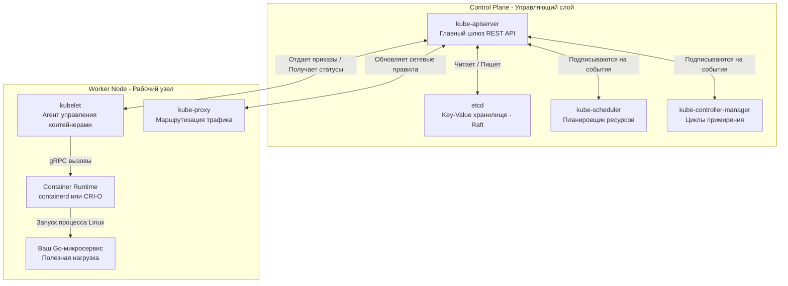

## Оркестрация хаоса: Как управлять армией контейнеров

В предыдущей статье [[1. Контейнеризация и Docker]] мы научились упаковывать наше Go-приложение в идеальный, герметичный и изолированный процесс (контейнер). На локальной машине разработчика этого достаточно. Вы делаете `docker run`, и всё работает.

Но что происходит в Production?
Представьте, что у вас 50 физических серверов (нод) и 1000 микросервисов. 
Как решить, на какой сервер поставить новый контейнер? Что делать, если сервер сгорел? Как направить трафик к контейнеру, если его IP-адрес меняется при каждом перезапуске? Как обновить приложение без даунтайма?

Docker не умеет решать эти проблемы. Для управления армией контейнеров нужен «генерал» — **Оркестратор**. 
**Kubernetes (K8s)** стал абсолютным монополистом в этой сфере. Это распределенная операционная система для кластера.

Для Go-разработчика Kubernetes имеет особое значение: он полностью написан на Go. Понимание того, как он устроен, не только поможет вам правильно деплоить приложения, но и научит писать идеальный системный код, подсматривая за архитектурой лучших инженеров Google.

В этой статье мы разберем анатомию кластера, механику примирения (Reconciliation) и скрытые ловушки K8s на собеседованиях.

---

## Архитектура: Мозг и Мышцы

Любой кластер Kubernetes физически и логически разделен на две части: **Control Plane** (Управляющий слой, мозг) и **Worker Nodes** (Рабочие узлы, мышцы).

### Control Plane (Управляющий слой)

Это набор системных компонентов (тоже работающих в виде контейнеров), которые принимают глобальные решения о кластере.

1. **`kube-apiserver` (Сердце системы):** Это массивный REST API сервер, написанный на Go. **Ни один компонент кластера (даже администратор с консолью) не общается друг с другом напрямую.** Всё взаимодействие идет строго через `kube-apiserver`. Он проверяет авторизацию (RBAC), мутирует запросы и валидирует их.
2. **`etcd` (Память):** Высоконадежное Key-Value хранилище. Это **единственный** stateful-компонент (хранящий состояние) в Control Plane. Все остальные компоненты stateless. `etcd` использует алгоритм консенсуса (об этом мы говорили в [[2. Raft. Основы]]) для обеспечения отказоустойчивости. Если база `etcd` умрет, кластер потеряет память и рухнет.
3. **`kube-scheduler` (Логист):** Когда вы просите создать новый контейнер, `kube-apiserver` просто сохраняет эту запись в `etcd`. Он ничего не запускает. В этот момент `kube-scheduler` видит новый объект без назначенного сервера. Он анализирует свободные ресурсы (CPU, RAM) на нодах, учитывает правила (Node Affinity, Taints) и назначает контейнеру оптимальную ноду.
4. **`kube-controller-manager` (Нервная система):** Это набор фоновых процессов (бесконечных `for` циклов), которые непрерывно сравнивают желаемое состояние кластера с его фактическим состоянием. 

### Worker Nodes (Рабочие узлы)

Это ваши физические (или виртуальные) серверы, на которых крутится полезная нагрузка — ваши Go-микросервисы.

1. **`kubelet` (Агент / Капитан узла):** Демон, работающий на каждой ноде. Он слушает команды от `kube-apiserver`. Когда `scheduler` назначает контейнер на эту ноду, `kubelet` получает приказ и говорит Container Runtime (например, containerd): «Эй, скачай этот образ и запусти процесс». `kubelet` следит за тем, чтобы контейнер не падал, и репортит статус обратно в API.
2. **`kube-proxy` (Сетевой менеджер):** Этот компонент настраивает сетевые правила на узле (чаще всего через манипуляции с ядром Linux — `iptables` или `IPVS`), чтобы сетевой трафик (например, от Service) правильно доходил до нужного контейнера.

---

## Парадигма Декларативности и Reconciliation Loop

Это самый важный концепт для понимания Kubernetes, отличающий его от bash-скриптов и старых систем администрирования.

* **Императивный подход:** Вы говорите системе *КАК* сделать. (Пример: "Запусти контейнер. Проверь его. Если упал - перезапусти").
* **Декларативный подход (Kubernetes):** Вы говорите системе *ЧТО* вы хотите получить (Desired State). (Пример: "Я хочу, чтобы всегда работало ровно 3 копии моего Go-сервиса").

Система сама решает, КАК достичь этой цели. Это реализуется через паттерн **Reconciliation Loop (Цикл примирения)**.

> [!info] Под капотом: Mechanical Sympathy
> Как компоненты узнают об изменениях, если они общаются только через API Server?
> Делать HTTP GET запросы каждую секунду (`Polling`) — убило бы API Server из-за огромной нагрузки.
> 
> Вместо этого в Go-клиенте Kubernetes (`client-go`) реализован механизм **Watch API**. Это долгоживущие HTTP-соединения (с использованием Chunked Transfer Encoding). `kube-apiserver` выступает как брокер сообщений. Когда в `etcd` меняется объект, API Server мгновенно "пушит" это событие в открытые TCP-соединения всем заинтересованным контроллерам. Это работает невероятно эффективно и позволяет кластеру реагировать на миллисекунды.

---

## Анатомия создания: Что происходит, когда вы деплоите приложение?

> [!tip] Собеседование
> **Вопрос:** Опишите пошагово, что происходит в кластере, когда вы выполняете команду `kubectl apply -f app.yaml`?
> **Ответ (уровень Senior):** Это классический вопрос на понимание асинхронной природы K8s.

1. **kubectl** валидирует ваш YAML локально и делает HTTP POST запрос к `kube-apiserver`.
2. **kube-apiserver** проводит аутентификацию, авторизацию (RBAC), пропускает манифест через мутирующие и валидирующие вебхуки (Admission Controllers) и сохраняет объект в **etcd**. На этом синхронная часть заканчивается. API сервер возвращает `201 Created`. Вашего приложения еще нет, есть только запись в БД!
3. **Controller Manager** (через Watch API) замечает, что вы хотите Deployment (например, 3 реплики). Он генерирует 3 объекта типа Pod и отправляет их в `kube-apiserver` (сохраняя в etcd).
4. **Scheduler** замечает 3 новых Pod-а, у которых поле `nodeName` пустое. Он прогоняет алгоритм скоринга нод, выбирает лучшие серверы и отправляет в `kube-apiserver` апдейт: "Pod 1 должен жить на Node A".
5. **kubelet** на Node A замечает, что ему назначили новый Pod. Он дергает Container Runtime Interface (CRI) через gRPC сокетов.
6. **Containerd** создает Linux Namespaces и Cgroups (о которых мы говорили в [[1. Контейнеризация и Docker]]), скачивает образ и запускает процесс вашего Go-приложения.
7. **kubelet** рапортует API-серверу, что контейнер запущен, и начинает прогонять Health Checks (Liveness/Readiness).

Это полностью событийно-ориентированная архитектура (Event-Driven). Компоненты ничего не знают друг о друге, они общаются исключительно через изменение состояния объектов в базе данных.

---

## Архитектурные ловушки (Gotchas)

### 1. Перегрузка API Сервера
В Kubernetes API сервер — это узкое горлышко (Bottleneck). Если вы пишете свой собственный оператор на Go (Custom Controller) и делаете много запросов LIST (запрос всех объектов) вместо использования кэшируемого механизма Informer/Lister (встроенного в `client-go`), вы легко можете "положить" API-сервер, вызвав отказ всего кластера (OOM на `kube-apiserver`).

### 2. Split Brain в etcd
`etcd` требует кворума. Если у вас 3 мастер-ноды, и сеть между ними разорвалась так, что одна нода оказалась отрезана от двух других, кластер выживет (2 из 3 — это кворум). Отрезанная мастер-нода перейдет в режим Read-Only. 
Но если у вас 2 мастер-ноды (антипаттерн) и одна падает — кворума нет (1 из 2 — это не большинство). Весь кластер перейдет в Read-Only режим. Ваши Go-приложения продолжат работать на воркерах, но вы не сможете задеплоить ничего нового или перезапустить упавший под.

### 3. Эфемерность всего сущего
Главный сдвиг майндсета при переходе с "железа" на Kubernetes: **Никогда не привязывайтесь к IP-адресам контейнеров или локальному диску**.
Kubernetes устроен так, что любой под может быть убит в любую секунду (нода перегружена, пришел процесс с более высоким приоритетом). Ваш Go-бэкенд должен хранить состояние строго во внешних БД, а при завершении работы — правильно обрабатывать сигнал `SIGTERM` (Graceful Shutdown).

## Итог

1. **Асинхронность:** K8s — это не монолитная программа. Это набор независимых контроллеров, реагирующих на изменения в единой базе состояния (`etcd`).
2. **Watch API:** Взаимодействие компонентов происходит практически мгновенно благодаря механизму постоянных стримов, реализованному в Go.
3. **Декларативность:** Вы не управляете контейнерами. Вы описываете желаемое будущее, а K8s непрерывно подгоняет реальность под ваше описание.
4. **Контракт выживания:** Ваш Go-код внутри K8s должен быть готов к внезапной смерти, быстрому рестарту и не должен хранить состояние локально.

Мы поняли, как работает кластер на уровне инфраструктуры. Но как нам, как разработчикам, описать это самое "желаемое будущее" для нашего микросервиса? Какими сущностями (объектами) оперирует Kubernetes, чтобы запустить, масштабировать и выставить наше приложение в сеть? Переходим к практике: [[3. Pod, Deployment, Service]].