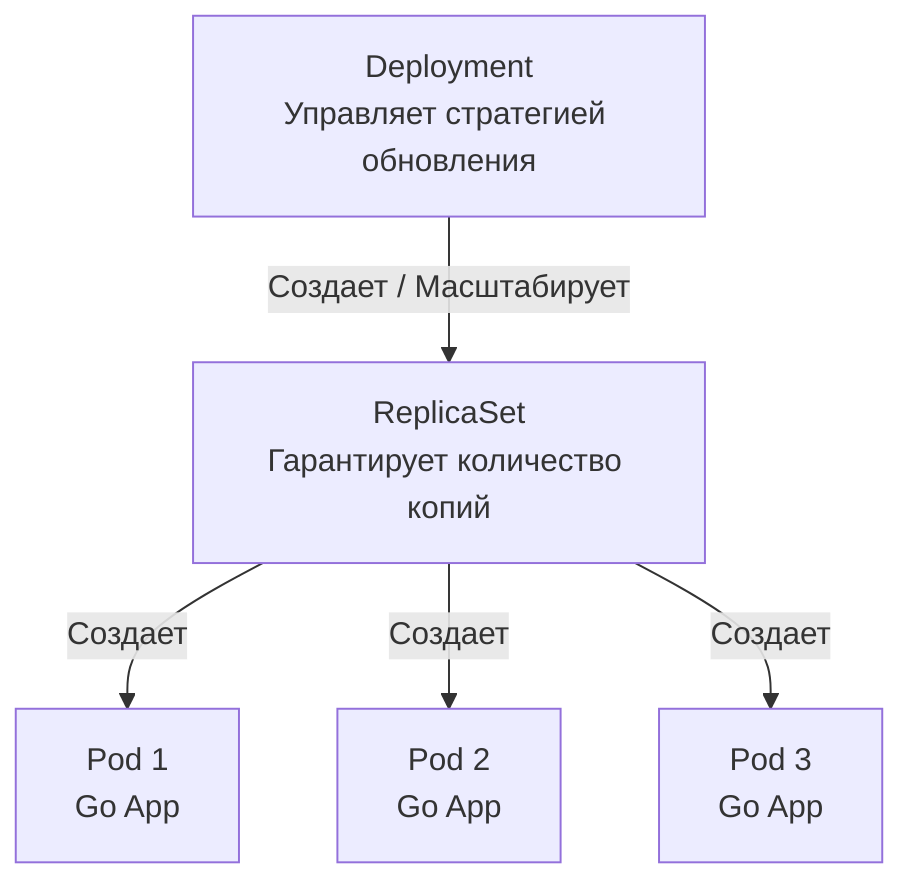
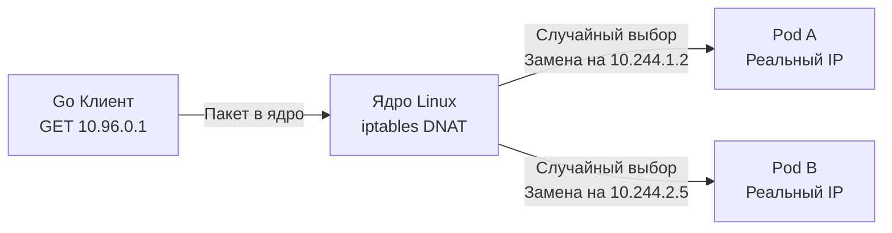

## Святая троица Кубернетеса: Как код превращается в сервис

В прошлой статье [[2. Kubernetes. Основы]] мы разобрали архитектуру кластера: мозг (Control Plane), отдающий приказы, и мышцы (Worker Nodes), их исполняющие. Мы поняли, что Kubernetes работает по декларативной модели — мы описываем желаемое состояние, а кластер сам решает, как его достичь.

Но какими именно словами мы описываем это желаемое будущее? Как объяснить кластеру, что нам нужно запустить наш скомпилированный Go-бинарник, обеспечить ему отказоустойчивость и дать возможность другим сервисам отправлять в него HTTP-запросы?

Для этого используются три фундаментальных абстракции: **Pod**, **Deployment** и **Service**. В этой статье мы заглянем под капот каждой из них с позиции сурового системного инженера, разберем магию виртуальных IP-адресов и поймем, почему "голые" поды — это признак непрофессионализма.

---

## 1. Pod: Атом кластера (и ложь о контейнерах)

Самое главное правило, которое нужно усвоить: **Kubernetes не управляет контейнерами напрямую.** Он не оперирует сущностями Docker (см. [[1. Контейнеризация и Docker]]). Минимальная единица развертывания в кластере — это **Pod (Под)**.

Под — это логическая обертка (горошина), внутри которой могут работать один или несколько контейнеров. Все контейнеры внутри одного пода делят:
1. **Сетевое пространство (Network Namespace):** У них один IP-адрес на всех, одни и те же порты. Они могут общаться друг с другом просто по `localhost`.
2. **IPC (Inter-Process Communication):** Они могут использовать общую разделяемую память (Shared Memory).
3. **Тома (Volumes):** Они могут монтировать общие директории для обмена файлами.

Именно благодаря тому, что контейнеры делят сеть, паттерн Sidecar из статьи [[2. Envoy и sidecar]] вообще работает: ваш Go-сервис поднимается на порту 8080, а Envoy проксирует его трафик, потому что они буквально находятся в одной виртуальной сети пода.

> [!info] Под капотом: Pause Container
> Если вы зайдете на Worker Node по SSH и сделаете `docker ps` (или `crictl ps`), вы увидите странную картину. На каждый ваш запущенный Go-микросервис будет приходиться еще один маленький контейнер с названием `pause` (или `infra`).
> 
> **Что это такое?** Когда `kubelet` создает Под, он сначала запускает контейнер `pause`. Это крошечная программа на С/Ассемблере, которая делает системный вызов `pause()` и засыпает навсегда. 
> Ее единственная задача — **захватить и держать открытыми Linux Namespaces (сеть, IPC)**. Затем `kubelet` запускает ваш Go-контейнер и помещает его в *уже существующие* неймспейсы контейнера `pause`. 
> 
> Если ваш Go-сервис упадет по панике (Panic) или OOM, `kubelet` перезапустит только ваш контейнер. IP-адрес пода при этом не изменится, потому что сеть держит бессмертный `pause`-контейнер!

---

## 2. Deployment: Армия клонов и менеджмент состояния

Вы можете создать "голый" Под манифестом `kind: Pod`. Но так никогда не делают в Production. 

Под эфемерен. Это "скот, а не домашние питомцы" (Cattle vs Pets). Если сервер, на котором крутится ваш под, сгорит (отказ по питанию), голый Под просто исчезнет. Kubernetes не станет его перезапускать на другой ноде.

Чтобы система была отказоустойчивой, нам нужен менеджер, который будет следить за тем, чтобы нужное количество подов всегда было живо. Этот менеджер — **Deployment (Развертывание)**.

### Цепочка делегирования

Deployment тоже не создает Поды напрямую. Он использует промежуточную сущность — **ReplicaSet**.

1. **Deployment** описывает *что* мы запускаем (какой образ Docker) и *как* мы это обновляем (например, Rolling Update — поочередная замена подов без даунтайма).
2. **ReplicaSet** — это тупой контроллер (из `kube-controller-manager`), у которого в коде крутится цикл: `Текущее количество подов == Желаемое количество подов?`. Если нода сгорела, ReplicaSet видит, что подов стало 2 вместо 3, и мгновенно создает новый Под, который Scheduler отправит на живую ноду.

> [!warning] Ловушка / Gotcha: Graceful Shutdown
> Когда ReplicaSet решает убить Под (при обновлении (Deployment) или масштабировании (Scale down)), он посылает вашему Go-приложению сигнал `SIGTERM`. 
> 
> Многие Junior-разработчики игнорируют сигналы ОС, в результате чего процесс принудительно убивается сигналом `SIGKILL` через 30 секунд (по умолчанию). Это приводит к обрыву активных HTTP-запросов и поврежденным транзакциям в БД.
> 
> Идиоматичный Go-код **обязан** перехватывать сигналы и использовать метод `server.Shutdown(ctx)` (см. [[6. Health checks]]), чтобы дождаться завершения текущих горутин перед выходом из `main`.

---

## 3. Service: Стабильный якорь в море хаоса

Поды постоянно умирают и рождаются заново на других серверах. Их IP-адреса постоянно меняются. Как микросервису `Frontend` узнать, по какому IP-адресу сегодня живет микросервис `Backend`?

Для этого существует абстракция **Service (Сервис)**. Это стабильный, несгораемый IP-адрес (ClusterIP) и DNS-имя, которые не меняются всё время жизни приложения.

Когда вы создаете Service, внутренний DNS кластера (CoreDNS) создает запись. Теперь ваш Go-код может делать запросы:
`http.Get("http://backend-svc.my-namespace.svc.cluster.local:8080/api")`

### Иллюзия ClusterIP (Mechanical Sympathy)

> [!tip] Собеседование
> **Вопрос:** Если вы сделаете `ifconfig` (или `ip addr`) на любом Worker Node или внутри Пода, вы нигде не найдете IP-адрес вашего Service (ClusterIP). Где он существует физически?
> **Ответ:** Нигде. ClusterIP — это виртуальный IP-адрес (VIP). Это **ложь, запрограммированная в ядре Linux**.

Всю магию роутинга делает демон `kube-proxy`, который крутится на каждой Worker-ноде (мы упоминали его в [[2. Kubernetes. Основы]]).

1. Когда вы создаете Service, `kube-proxy` замечает это через Watch API.
2. Он идет в ядро Linux и пишет правила фаервола **iptables** (или IPVS).
3. Когда ваш Go-клиент отправляет HTTP-запрос на IP-адрес сервиса (например, 10.96.0.1), пакет доходит до сетевого стека текущего сервера.
4. Правило `iptables` перехватывает этот пакет (в цепочке `PREROUTING`), видит магический IP-адрес 10.96.0.1 и выполняет операцию **DNAT (Destination Network Address Translation)**.
5. Ядро на лету переписывает IP-адрес назначения в заголовке пакета на реальный IP-адрес одного из живых Подов бэкенда (например, 10.244.1.5). Балансировка нагрузки (Round Robin) в режиме iptables реализуется через статистический модуль ядра Linux.

### Headless Service (Безголовый сервис) и gRPC

В мире Go мы очень любим gRPC. И здесь кроется огромная архитектурная засада.
gRPC использует HTTP/2. Соединение HTTP/2 — долгоживущее (Persistent Connection). 

Если вы используете обычный Service (ClusterIP) для балансировки gRPC-трафика, произойдет следующее:
Ваш Go-клиент разрезолвит DNS, получит ClusterIP (10.96.0.1), отправит `TCP SYN`. Ядро (через iptables) пробросит коннект на Pod-A. Соединение установится. **Все последующие тысячи gRPC-вызовов (RPCs) будут лететь в одно и то же TCP-соединение, а значит, только в Pod-A!** Остальные 9 Подов вашего бэкенда будут простаивать. Iptables балансирует только TCP-соединения, а не HTTP/2 стримы!

**Решение для Go/gRPC:** Использование **Headless Service**.
Вы указываете в манифесте `clusterIP: None`.
В этом случае `kube-proxy` не создает виртуальный IP и не пишет правила в iptables. Вместо этого Kube-DNS возвращает клиенту **список всех реальных IP-адресов подов** (A-записи). 

Тогда ваш Go gRPC-клиент (используя встроенный балансировщик `grpc.WithDefaultServiceConfig(`{"loadBalancingPolicy":"round_robin"}`)`) сам подключается ко всем Подам напрямую и балансирует RPC-вызовы на уровне клиента (Client-Side Load Balancing).

## Итог

1. **Pod:** Логическая капсула для одного или нескольких контейнеров, делящих сеть и диски благодаря фоновому `pause`-контейнеру.
2. **Deployment/ReplicaSet:** Менеджеры состояния, превращающие эфемерные поды в отказоустойчивую распределенную систему с возможностью плавных обновлений (Rolling Updates).
3. **Service (ClusterIP):** Виртуальный якорь, обеспечивающий Service Discovery. Физически не существует, а реализуется через подмену IP-адресов в ядре Linux (DNAT).
4. **Осторожно с HTTP/2:** Стандартные сервисы плохо балансируют L7-трафик по долгоживущим соединениям. Для gRPC используйте Headless Service (`clusterIP: None`) или делегируйте балансировку Service Mesh (см. [[1. Service mesh]]).

Мы научились разворачивать наш код и связывать сервисы между собой по сети. Но у нашего приложения есть секреты (пароли от БД, API-ключи) и конфигурации (таймауты, лимиты), которые зависят от окружения (Dev/Stage/Prod). Зашивать их в Docker-образ — это преступление против безопасности. Как правильно передавать настройки внутрь Пода? Об этом в следующей статье: [[4. ConfigMap и Secret]].