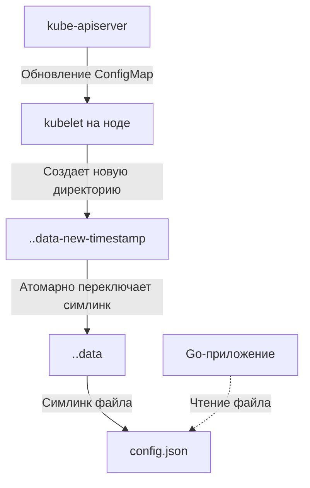

## Отделяя код от конфигурации: Жизнь вне бинарника

Третий принцип методологии The Twelve-Factor App гласит: **«Сохраняйте конфигурацию в среде выполнения»**. 

В статье [[1. Контейнеризация и Docker]] мы собрали минималистичный статический бинарник Go и упаковали его в образ `scratch`. Этот образ — иммутабелен (неизменяем). Если для переключения уровня логирования с `INFO` на `DEBUG` или изменения таймаута подключения к БД вам нужно пересобирать Docker-образ и прогонять CI/CD пайплайн — ваша архитектура сломана.

Образ должен быть один для всех сред (Dev, Staging, Prod). Различаться должна только конфигурация, которая "впрыскивается" в контейнер при запуске. 

В Kubernetes за это отвечают две тесно связанные абстракции: **ConfigMap** (для несекретных данных) и **Secret** (для конфиденциальных). В этой статье мы разберем, как правильно доставлять конфиги в Go-приложение, как устроено "горячее" обновление файлов под капотом, и почему стандартные Secrets — это иллюзия безопасности.

---

## ConfigMap: Словарь для вашего приложения

**ConfigMap** — это объект Kubernetes, который хранит неконфиденциальные данные в виде пар «ключ-значение» (key-value). 

Есть два способа передать данные из ConfigMap в ваш Под:
1. **Переменные окружения (Environment Variables).**
2. **Смонтированные тома (Volume Mounts).**

### 1. Переменные окружения (ENV)

Это самый простой и распространенный подход в мире Go. 

```yaml
apiVersion: v1
kind: ConfigMap
metadata:
  name: myapp-config
data:
  DB_HOST: "postgres-svc"
  TIMEOUT: "5s"
---
apiVersion: apps/v1
kind: Deployment
# ...
    spec:
      containers:
      - name: go-app
        image: myapp:v1
        envFrom:
        - configMapRef:
            name: myapp-config # Загрузит все ключи как ENV переменные
```

В Go-коде мы читаем это через стандартную библиотеку (или пакеты вроде `envconfig`, `viper`):

```go
timeoutStr := os.Getenv("TIMEOUT")
timeout, err := time.ParseDuration(timeoutStr)
```

> [!warning] Ловушка / Gotcha
> Переменные окружения **не обновляются динамически**. Если вы измените ConfigMap через `kubectl edit cm myapp-config`, новые значения появятся в базе `etcd`, но процесс вашего Go-приложения их не увидит. Процесс Linux считывает `ENV` только один раз при старте. Чтобы применить изменения, вам придется перезапустить Под (например, удалив его или использовав сторонние утилиты вроде `Reloader`).

### 2. Смонтированные тома (Volumes) и Горячая перезагрузка

Если ваш конфиг — это большой JSON/YAML файл, удобнее смонтировать его как файл на диск контейнера.

```yaml
        volumeMounts:
        - name: config-volume
          mountPath: /etc/config
      volumes:
      - name: config-volume
        configMap:
          name: myapp-config-file # Внутри лежит ключ config.json
```

А вот здесь начинается магия. В отличие от переменных окружения, **смонтированные файлы обновляются динамически** "на горячую", без перезапуска пода. 

#### Mechanical Sympathy: Атомарные симлинки kubelet

Когда вы меняете ConfigMap, `kubelet` (демон на воркер-ноде, см. [[2. Kubernetes. Основы]]) замечает изменения и должен обновить файл внутри контейнера. 
Если бы `kubelet` просто открыл файл `/etc/config/config.json` на запись (truncate & write), ваше Go-приложение могло бы попытаться прочитать его ровно в этот момент и получить битый JSON.

Чтобы избежать "грязного чтения", `kubelet` использует атомарные операции с символическими ссылками (symlinks) Linux:



1. Создается новая скрытая директория с новым конфигом.
2. Симлинк `..data` атомарно переключается на новую директорию (системный вызов `rename`).
3. ОС гарантирует, что старые открытые дескрипторы продолжат читать старый файл, а новые попытки `os.Open` откроют новый.

#### Чтение "на горячую" в Go

Чтобы Go-приложение отреагировало на изменение файла, мы используем `inotify` (подписку на события файловой системы ядра Linux) через пакеты вроде `fsnotify` или встроенный функционал `viper.WatchConfig()`.

Но будьте осторожны! Доступ к конфигурации из десятков конкурирующих горутин должен быть потокобезопасным. Если одна горутина-воркер обновляет конфиг, а HTTP-хендлер его читает, вы словите `data race` и панику.

**Идиоматичный Senior-паттерн с использованием `atomic.Pointer`:**

```go
package config

import (
	"encoding/json"
	"os"
	"sync/atomic"
	"log/slog"
	
	"[github.com/fsnotify/fsnotify](https://github.com/fsnotify/fsnotify)"
)

type AppConfig struct {
	TimeoutMs int `json:"timeout_ms"`
}

// GlobalConfig хранит атомарный указатель на текущую конфигурацию
var GlobalConfig atomic.Pointer[AppConfig]

func InitAndWatch(filepath string) {
	loadConfig(filepath)

	watcher, _ := fsnotify.NewWatcher()
	watcher.Add(filepath)

	go func() {
		for {
			select {
			case event, ok := <-watcher.Events:
				if !ok { return }
				// kubelet использует симлинки, поэтому ловим Remove или Chmod
				if event.Has(fsnotify.Remove) || event.Has(fsnotify.Chmod) {
					loadConfig(filepath)
					// Переподписываемся на новый симлинк
					watcher.Add(filepath) 
				}
			case err := <-watcher.Errors:
				slog.Error("Config watcher error", "err", err)
			}
		}
	}()
}

func loadConfig(filepath string) {
	data, err := os.ReadFile(filepath)
	if err == nil {
		var cfg AppConfig
		json.Unmarshal(data, &cfg)
		// Атомарная подмена указателя. Zero lock contention!
		GlobalConfig.Store(&cfg)
		slog.Info("Configuration reloaded")
	}
}

// Использование в хендлере:
// cfg := config.GlobalConfig.Load()
// time.Sleep(time.Duration(cfg.TimeoutMs) * time.Millisecond)
```

---

## Secret: Иллюзия безопасности

**Secret** — это сущность, аналогичная ConfigMap, но предназначенная для хранения паролей, API-ключей и TLS-сертификатов. Способы доставки в Под абсолютно те же: переменные окружения и тома (смонтированные тома Secrets монтируются в оперативную память — `tmpfs`, чтобы ключи не писались на диск ноды).

> [!warning] Ловушка / Gotcha: Base64 — это не шифрование
> Самый частый провал на собеседованиях. Разработчик говорит: "Secrets безопасны, потому что они зашифрованы". 
> **Это ложь.** В манифесте Secret данные просто закодированы в **Base64**. Base64 — это формат передачи, который декодируется любой утилитой за миллисекунду.
> Более того, по умолчанию `etcd` (база данных кластера) хранит эти Secrets в **открытом виде** (Plain text). Если злоумышленник получит доступ к дампу `etcd`, он получит все пароли вашей компании.

### Как сделать правильно (Production Grade)?

1. **Шифрование at rest (в покое):** Администратор кластера обязан настроить `EncryptionConfiguration` в `kube-apiserver`, чтобы `etcd` шифровал Secrets перед записью на диск, используя ключи из AWS KMS, Google Cloud KMS или локальные ключи.
2. **RBAC:** Строго ограничивайте доступ к чтению Secrets. Ваш CI/CD пайплайн не должен иметь прав на чтение Secrets из production-окружения.
3. **Внешние хранилища:** В серьезных распределенных системах Secrets вообще не хранят в Kubernetes напрямую. Подробнее этот архитектурный паттерн мы разбираем в статье [[10. Secrets management]] (раздел "Микросервисы"), где говорим о HashiCorp Vault, External Secrets Operator и инъекции секретов в рантайме.

---

## Архитектурные ловушки кластера

### Лимит размера в etcd
ConfigMap и Secret ограничены размером **1 Мегабайт**. Почему? Потому что `etcd` — это консенсусное хранилище (Raft), оптимизированное для мелких метаданных. Если вы попытаетесь засунуть в ConfigMap дамп базы данных или гигантский GeoIP-справочник, вы "положите" API-сервер. 
*Решение:* Большие статические файлы должны лежать в S3 или быть "запечены" (baked) в сам Docker-образ как read-only ресурсы.

### Недостающие ConfigMaps блокируют запуск
Если ваш Deployment ссылается на ConfigMap в `envFrom` или `volumes`, а этого ConfigMap не существует, `kubelet` откажется запускать Под (статус `ContainerCreating`). Это хорошая защита (Fail Fast), но в больших системах это может стать проблемой при миграциях. Существует флаг `optional: true`, который позволяет Поду стартовать, игнорируя отсутствующий ресурс, но ваш Go-код должен уметь работать с дефолтными значениями, если `os.Getenv` возвращает пустую строку.

## Итог

1. **12-Factor App:** Конфигурация всегда живет снаружи бинарника и инжектируется рантаймом (Kubernetes). Docker-образ должен быть универсальным.
2. **ENV vs Volumes:** Переменные окружения проще, но требуют рестарта пода для обновления. Тома обновляются "на горячую".
3. **Атомарность:** Используйте `atomic.Pointer` в Go для безопасной замены конфигурации в памяти, избегая блокировок (Mutex) на каждый запрос.
4. **Base64 != Защита:** Стандартные Secrets не защищают от утечки дампа `etcd`. Требуйте включения Encryption at Rest или используйте внешние хранилища вроде Vault.

Мы научились конфигурировать одно приложение. Но что если наступила «Черная пятница», и нагрузка выросла в 10 раз? Один Под, даже с правильным конфигом, не справится с трафиком. Нам нужно научить кластер размножать наше приложение автоматически, реагируя на метрики железа. В следующей статье мы разберем: [[5. Horizontal scaling]].