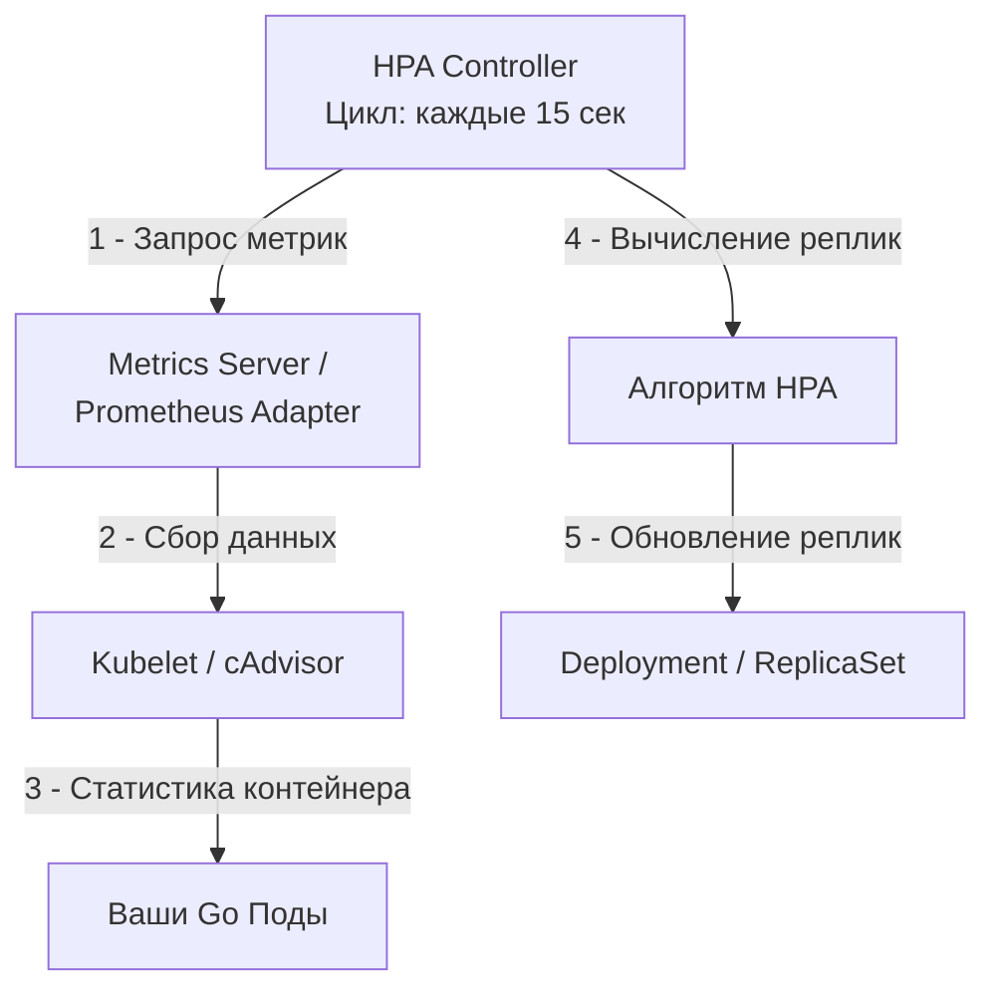

## Масштабирование без боли: Как Kubernetes клонирует ваш код

Когда ваш микросервис на Go становится популярным, один Под (см. [[3. Pod, Deployment, Service]]) неизбежно упрется в потолок ресурсов. Можно пойти путем **Vertical Scaling (VPA)** — увеличить лимиты CPU и RAM, но у этого пути есть физический предел (размер самой мощной ноды в кластере) и экономическая неэффективность.

В распределенных системах стандартом является **Horizontal Scaling (Горизонтальное масштабирование)** — запуск множества идентичных копий приложения. В Kubernetes за автоматизацию этого процесса отвечает **Horizontal Pod Autoscaler (HPA)**.

Для Go-разработчика горизонтальное масштабирование — это не просто «добавить ещё подов». Это сложная игра с конкурентностью, пулами соединений и холодным стартом рантайма. В этой статье мы разберем математику HPA, механику работы Metrics Server и то, как знание внутреннего устройства Go помогает избежать «болтанки» при масштабировании.

---

## Механика HPA: Бесконечный цикл примирения

HPA — это контроллер в составе `kube-controller-manager` (см. [[2. Kubernetes. Основы]]), который работает как классический цикл обратной связи.



### Математическая формула масштабирования

HPA использует простую, но эффективную формулу для расчета целевого количества реплик:

$$desiredReplicas = \lceil currentReplicas \times \frac{currentMetricValue}{desiredMetricValue} \rceil$$

**Пример:**
* У вас 2 реплики.
* Средняя загрузка CPU сейчас — 90%.
* Целевая загрузка (Target) — 50%.
* Расчет: $\lceil 2 \times (90 / 50) \rceil = \lceil 2 \times 1.8 \rceil = 4$.
* Результат: Kubernetes создаст еще 2 пода.

> [!info] Под капотом
> HPA учитывает только те поды, которые находятся в состоянии `Ready`. Если под только запускается или завершается, его метрики исключаются из расчета, чтобы не вносить шум в среднее значение.

---

## Mechanical Sympathy: CPU Throttling vs Scaling

Многие разработчики совершают ошибку, настраивая HPA на слишком высокий порог (например, 90% CPU). 

В Go рантайм крайне чувствителен к процессорному времени из-за работы планировщика (G-M-P) и Garbage Collector. Если нагрузка на ядро достигает лимита, ядро Linux начинает **Throttling** (удушение) процесса в рамках cgroups (см. [[1. Контейнеризация и Docker]]).

Когда Go-приложение попадает под троттлинг:
1. Останавливаются Stop-the-World паузы GC (они длятся дольше).
2. Планировщик не может вовремя переключать горутины.
3. Растет Latency, запросы скапливаются в очереди.

**Правило:** Настраивайте HPA на порог **50-70% CPU**. Это создаст необходимый «запас» (headroom), чтобы сервис мог переварить всплеск нагрузки, пока Kubernetes скачивает образы и запускает новые поды. 

---

## Проблема «Болтанки» (Thrashing) и стабилизация

Если нагрузка импульсна, HPA может начать паниковать: создавать поды каждые 15 секунд и тут же их удалять. Это убивает производительность базы данных из-за постоянных переподключений.

Для этого в HPA введены параметры стабилизации (**Cool-down periods**):
* **scaleUp:** Обычно происходит мгновенно (нам нужно спасать систему).
* **scaleDown:** По умолчанию имеет задержку (например, 5 минут). Kubernetes ждет, пока нагрузка станет стабильно низкой, прежде чем убивать «лишние» поды.

```yaml
behavior:
  scaleDown:
    stabilizationWindowSeconds: 300 # Ждать 5 минут перед удалением
    policies:
    - type: Percent
      value: 100
      periodSeconds: 15
```

---

## Архитектурные вызовы масштабирования в Go

### 1. Взрыв соединений (Database Connection Storm)
Каждый новый под открывает свой пул соединений к БД (см. [[12. Базы данных]]). Если каждый под в `sql.DB` держит `MaxOpenConns = 100`, то при масштабировании с 10 до 100 подов ваша база получит 10 000 соединений.
**Решение:** Используйте PG Bouncer или аналогичные прокси, а также формулу: `MaxConnections / MaxExpectedPods`.

### 2. Холодный старт и прогрев
Go-приложения стартуют быстро, но их кэши в памяти пусты. При резком масштабировании новые поды могут «проседать» по производительности первые несколько секунд.
**Решение:** Используйте `Readiness Probes` (см. [[6. Health checks]]), чтобы под не получал трафик до тех пор, пока не прогреет необходимые ресурсы.

### 3. Custom Metrics: Масштабирование по бизнесу
CPU и RAM — плохие метрики для многих систем. Например, сервис обработки очередей (Kafka/RabbitMQ) может иметь CPU 5%, но при этом в очереди скопилось миллион сообщений.
**Решение:** Используйте **Prometheus Adapter**, чтобы HPA мог масштабироваться по количеству сообщений в очереди или количеству активных горутин.

> [!tip] Собеседование
> **Вопрос:** Почему не стоит масштабироваться по потреблению оперативной памяти (RAM) в Go?
> **Ответ:** Go — язык с Garbage Collector. Рантайм Go не сразу возвращает память ОС после освобождения объектов (см. `GODEBUG=madvdontneed=1`). Более того, память в Go растет ступенчато. Если настроить HPA на 70% RAM, он может создать новые поды просто потому, что GC ещё не успел отработать, хотя реальной нагрузки нет. CPU или количество запросов (RPS) — гораздо более надежные метрики.

---

## Итог

1. **HPA — это математика:** Понимайте формулу, чтобы предсказать количество реплик.
2. **CPU Headroom:** Оставляйте запас ресурсов для Go-рантайма (цель 60%), чтобы избежать троттлинга.
3. **Стабилизация:** Настраивайте окна `scaleDown`, чтобы избежать ненужных рестартов.
4. **Внешние ресурсы:** Помните, что масштабирование бэкенда создает нагрузку на общие ресурсы (DB, Redis, Network bandwidth).

Мы научились масштабировать наши поды. Но как обновить код на всех этих репликах так, чтобы пользователь не заметил ни одной ошибки? Как заменить 100 старых подов на 100 новых, не потеряв ни одного запроса? В следующей статье мы разберем: [[6. Rolling updates]].